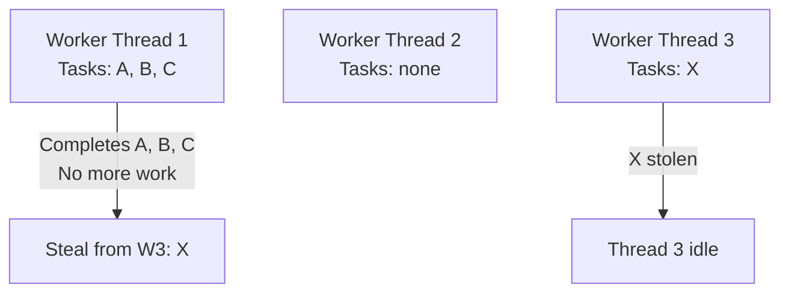

# Java Concurrency

## 1. Thread vs Process

| Aspect | Process | Thread |
|--------|---------|--------|
| **Definition** | A running program with its own memory/resources | Lightweight execution unit within a process |
| **Memory** | Isolated memory space | Shares memory (heap) with other threads in the same process |
| **Creation** | Heavyweight, OS-level | Lightweight, managed by JVM |
| **Communication** | IPC (pipes, sockets, etc.) | Direct memory access (shared data) |
| **Failure isolation** | Crashing one process does not crash others | One thread crashing can kill the entire process |

```java
// Process example (running a new JVM process)
ProcessBuilder pb = new ProcessBuilder("notepad.exe");
Process p = pb.start();
```

---

## 2. Runnable vs Thread

### 2.1. Runnable

- An **interface** with a single method: `void run()`
- Used to **define the task** (what to execute)
- Preferred in most cases

### 2.2. Thread

- A **class** that implements `Runnable`
- Has both `run()` (defines task) and `start()` (starts execution)
- Couples task definition with thread management

> **Tip:** Use **Runnable** (or `ExecutorService`) over extending `Thread`. Runnable allows a class to implement other interfaces and separates task definition from thread management.

```java
// Using Runnable
Runnable task = () -> {
    System.out.println("Running in: " + Thread.currentThread().getName());
};
Thread t = new Thread(task);
t.start();

// Using Thread subclass (less flexible)
class MyThread extends Thread {
    @Override
    public void run() {
        System.out.println("MyThread running");
    }
}
new MyThread().start();
```

---

## 3. Thread Lifecycle

```
NEW → RUNNABLE → RUNNING → BLOCKED/WAITING/TIMED_WAITING → TERMINATED
```

| State | Description |
|-------|-------------|
| **NEW** | Created but not started |
| **RUNNABLE** | Ready to run or running (JVM decides) |
| **RUNNING** | Executing on CPU |
| **BLOCKED** | Waiting for a monitor lock (e.g., `synchronized`) |
| **WAITING** | Waiting indefinitely (`wait()`, `join()`, `park()`) |
| **TIMED_WAITING** | Waiting with a timeout (`sleep`, `wait(timeout)`, `join(timeout)`) |
| **TERMINATED** | Completed execution |

---

## 4. synchronized vs volatile

| Aspect | `synchronized` | `volatile` |
|--------|---------------|------------|
| **Purpose** | Mutual exclusion + visibility | Visibility only |
| **Atomicity** | Guarantees both visibility and atomicity | Only visibility guarantee |
| **Performance** | Higher overhead (acquires/releases lock) | Lower overhead (direct memory access) |
| **Applies to** | Methods and blocks | Variables only |
| **Use case** | Complex operations, multiple steps | Simple flags, boolean flags |

### 4.1. synchronized

```java
// Synchronized method
public synchronized void increment() {
    count++;
}

// Synchronized block
public void increment() {
    synchronized (this) {
        count++;
    }
}
```

### 4.2. volatile

```java
private volatile boolean running = true;

public void stop() {
    running = false;  // Visible to all threads immediately
}
```

> **Note:** `volatile` alone does NOT make `count++` thread-safe. Use `synchronized` or `AtomicInteger` for compound operations.

---

## 5. wait(), notify(), notifyAll()

These methods are used for **thread communication** and **must** be called inside a `synchronized` block.

| Method | Description |
|--------|-------------|
| `wait()` | Current thread pauses and releases the lock, waiting for `notify()` |
| `notify()` | Wakes **one** waiting thread (JVM chooses) |
| `notifyAll()` | Wakes **all** waiting threads |

```java
synchronized (lock) {
    while (conditionIsFalse) {
        lock.wait();  // Release lock and wait
    }
    // Do work
    lock.notifyAll();  // Notify waiting threads
}
```

---

## 6. Thread Pools & Executor Framework

Instead of creating threads manually, use an **ExecutorService** to manage a pool of threads.

### 6.1. Key Interfaces/Classes

| Type | Description |
|------|-------------|
| `Executor` | Basic interface, executes `Runnable` |
| `ExecutorService` | Extends `Executor`, supports `Callable`, `Future`, shutdown |
| `ThreadPoolExecutor` | Common implementation with configurable pool size |
| `Executors` | Factory class to create common executor types |

### 6.2. Common Factory Methods

| Method | Pool Type |
|--------|-----------|
| `Executors.newFixedThreadPool(n)` | Fixed-size pool |
| `Executors.newCachedThreadPool()` | Dynamic pool (grows/shrinks) |
| `Executors.newSingleThreadExecutor()` | Single thread |
| `Executors.newWorkStealingPool()` | Work-stealing (Java 8+) |

```java
ExecutorService executor = Executors.newFixedThreadPool(4);

for (int i = 0; i < 10; i++) {
    final int taskId = i;
    executor.submit(() -> {
        System.out.println("Task " + taskId + " in " + Thread.currentThread().getName());
    });
}

executor.shutdown();  // No new tasks accepted
executor.awaitTermination(60, TimeUnit.SECONDS);  // Wait for completion
```

---

## 7. Callable vs Future

| Aspect | `Callable<T>` | `Runnable` |
|--------|--------------|-----------|
| **Method** | `T call()` | `void run()` |
| **Return value** | Returns `T` | No return value |
| **Checked exceptions** | Can throw checked exceptions | Cannot throw checked exceptions |
| **Used with** | `Future<T>`, `ExecutorService.submit()` | `Thread`, `ExecutorService.submit()` |

```java
Callable<Integer> task = () -> {
    Thread.sleep(1000);
    return 42;
};

Future<Integer> future = executor.submit(task);
Integer result = future.get();       // Blocks until result is available
Integer result = future.get(5, TimeUnit.SECONDS);  // With timeout
boolean done = future.isDone();
boolean cancelled = future.cancel(true);
```

---

## 8. Concurrent Collections

Java provides thread-safe collections in `java.util.concurrent`.

| Collection | Description | Use Case |
|------------|-------------|----------|
| `ConcurrentHashMap` | High-performance thread-safe map | Concurrent read/write |
| `CopyOnWriteArrayList` | Optimized for read-heavy, write-light | Listener lists, caches |
| `BlockingQueue<T>` | Queue with blocking put/take | Producer-consumer problems |
| `ConcurrentLinkedQueue` | Non-blocking unbounded queue | High-throughput scenarios |
| `Collections.synchronizedMap()` | Synchronized wrapper (legacy) | Simple thread safety |

```java
// Producer-Consumer with BlockingQueue
BlockingQueue<Integer> queue = new ArrayBlockingQueue<>(100);

Producer p = new Producer(queue);
Consumer c = new Consumer(queue);

new Thread(p).start();
new Thread(c).start();

class Producer implements Runnable {
    private final BlockingQueue<Integer> queue;
    Producer(BlockingQueue<Integer> q) { this.queue = q; }

    public void run() {
        try {
            queue.put(42);  // Blocks if queue is full
        } catch (InterruptedException e) {
            Thread.currentThread().interrupt();
        }
    }
}

class Consumer implements Runnable {
    private final BlockingQueue<Integer> queue;
    Consumer(BlockingQueue<Integer> q) { this.queue = q; }

    public void run() {
        try {
            Integer value = queue.take();  // Blocks if queue is empty
            System.out.println("Consumed: " + value);
        } catch (InterruptedException e) {
            Thread.currentThread().interrupt();
        }
    }
}
```

---

## 9. Atomic Variables

Atomic classes (`AtomicInteger`, `AtomicLong`, `AtomicBoolean`, `AtomicReference<T>`) use **CAS (Compare-And-Swap)** — a hardware-level atomic instruction that is lock-free and faster than `synchronized`.

```java
AtomicInteger counter = new AtomicInteger(0);

counter.incrementAndGet();   // ++i
counter.getAndAdd(5);        // return old value, then add 5
counter.compareAndSet(10, 20); // CAS: if current == 10, set to 20
```

| Method | Description |
|--------|-------------|
| `incrementAndGet()` | Atomically increments and returns new value |
| `getAndSet(val)` | Atomically sets and returns old value |
| `compareAndSet(expected, updated)` | CAS: succeeds only if current == expected |

---

## 10. Synchronizers

High-level concurrency utilities that manage thread coordination.

| Synchronizer | Description | Key Method |
|-------------|-------------|------------|
| `CountDownLatch` | Threads wait until countdown reaches zero (one-shot) | `countDown()`, `await()` |
| `CyclicBarrier` | Threads wait for each other at a barrier point (reusable) | `await()` |
| `Semaphore` | Controls access to a shared resource (permits) | `acquire()`, `release()` |
| `Exchanger<V>` | Two threads exchange data | `exchange()` |

### 10.1. CountDownLatch

```java
CountDownLatch latch = new CountDownLatch(3);

for (int i = 0; i < 3; i++) {
    new Thread(() -> {
        System.out.println("Task completed");
        latch.countDown();
    }).start();
}

latch.await();  // Wait for all 3 tasks
System.out.println("All tasks done!");
```

### 10.2. CyclicBarrier

```java
CyclicBarrier barrier = new CyclicBarrier(3, () ->
    System.out.println("All parties arrived, starting!"));

for (int i = 0; i < 3; i++) {
    final int id = i;
    new Thread(() -> {
        System.out.println("Party " + id + " working...");
        barrier.await();  // Wait for all parties
        System.out.println("Party " + id + " continuing...");
    }).start();
}
```

---

## 11. Fork/Join Framework

`ForkJoinPool` is designed for **divide-and-conquer** tasks — large tasks are split into subtasks (fork), results are combined (join). Optimized for modern multi-core CPUs.

```java
class SumTask extends RecursiveTask<Long> {
    private final long[] array;
    private final int start, end;
    private static final int THRESHOLD = 10_000;

    SumTask(long[] array, int start, int end) {
        this.array = array;
        this.start = start;
        this.end = end;
    }

    @Override
    protected Long compute() {
        if (end - start <= THRESHOLD) {
            long sum = 0;
            for (int i = start; i < end; i++) sum += array[i];
            return sum;
        }
        int mid = (start + end) / 2;
        SumTask left = new SumTask(array, start, mid);
        SumTask right = new SumTask(array, mid, end);
        left.fork();
        return right.compute() + left.join();
    }
}

// Usage
ForkJoinPool pool = new ForkJoinPool();
long result = pool.invoke(new SumTask(array, 0, array.length));
```

---

## 12. Deadlock & Livelock

### 12.1. Deadlock

Two or more threads wait indefinitely because each holds a lock the other needs.

```java
// Classic deadlock
Object lockA = new Object();
Object lockB = new Object();

Thread t1 = new Thread(() -> {
    synchronized (lockA) {
        synchronized (lockB) {  // Never reached
            System.out.println("Thread 1");
        }
    }
});

Thread t2 = new Thread(() -> {
    synchronized (lockB) {
        synchronized (lockA) {  // Never reached
            System.out.println("Thread 2");
        }
    }
});
```

#### Prevention Strategies

| Strategy | Description |
|----------|-------------|
| **Lock ordering** | Always acquire locks in the same order across all threads |
| **tryLock with timeout** | Use `ReentrantLock.tryLock(long timeout, TimeUnit unit)` |
| **Avoid nested locks** | Don't hold a lock while calling external code |
| **Single lock** | Use a single lock instead of multiple |

### 12.2. Livelock

Threads keep changing state but make no forward progress — often because they constantly yield to each other.

> **Example:** Two people trying to pass each other in a hallway, each stepping aside the same way repeatedly.

### 12.3. Livelock — Deep Dive

Unlike deadlock (threads are blocked), in a livelock threads are **actively running** but accomplishing nothing.

```java
// Classic livelock: two threads keep retrying a failed operation
public class LivelockExample {
    private static final AtomicBoolean transferInProgress = new AtomicBoolean(false);

    public static void transfer(Account from, Account to, double amount) {
        while (true) {
            if (transferInProgress.compareAndSet(false, true)) {
                try {
                    if (from.withdraw(amount)) {
                        to.deposit(amount);
                        System.out.println("Transfer successful");
                        return;
                    }
                } finally {
                    transferInProgress.set(false);
                }
            }
            // YIELDING and retrying — this causes livelock if both threads
            // always retry at the same moment
            Thread.yield();
        }
    }
}

// Real-world livelock example: database transaction retry
public class TransactionLivelock {
    public void processWithRetry() {
        int attempts = 0;
        while (attempts < 100) {
            try {
                executeTransaction();
                return;
            } catch (DeadlockException e) {
                attempts++;
                // Problem: two transactions retry at the same time
                // causing the same deadlock again and again
                Thread.yield(); // This makes it worse — both yield simultaneously
            }
        }
        throw new RuntimeException("Transaction failed after max retries");
    }

    // Fix: add random backoff
    public void processWithBackoff() {
        int attempts = 0;
        while (attempts < 100) {
            try {
                executeTransaction();
                return;
            } catch (DeadlockException e) {
                attempts++;
                // Exponential backoff with jitter prevents synchronization
                long delay = (1L << attempts) + ThreadLocalRandom.current().nextLong(100);
                try {
                    Thread.sleep(delay);
                } catch (InterruptedException ie) {
                    Thread.currentThread().interrupt();
                    return;
                }
            }
        }
    }
}
```

#### How to Avoid Livelock

| Strategy | Description |
|----------|-------------|
| **Random backoff** | Add random delay between retries — prevents both threads retrying simultaneously |
| **Retry limit** | Give up after N attempts and fail gracefully |
| **Lock-free structures** | Use `ConcurrentHashMap.compute()` instead of manual locking |
| **Structured approach** | Define consistent lock ordering across all code paths |
| **Exponential backoff** | Increase delay with each retry (with jitter) |

---

## 14. CompletableFuture — Asynchronous Programming

`CompletableFuture` extends `Future` with rich composition, transformation, and error handling capabilities for asynchronous programming.

### 14.1. Comparison: Future vs CompletableFuture

| Aspect | `Future<T>` | `CompletableFuture<T>` |
|--------|------------|----------------------|
| **Completion** | Only manual (`FutureTask`) | Multiple methods to complete |
| **Chaining** | Not supported | Supported via `thenApply`, `thenCompose` |
| **Exception handling** | Not supported | Via `exceptionally`, `handle` |
| **Combining futures** | Not supported | `thenCombine`, `allOf`, `anyOf` |
| **Multiple results** | Single result only | Stream of results possible |
| **Callback style** | Blocking `get()` only | Non-blocking callbacks |

### 14.2. Creating CompletableFutures

```java
// From a value
CompletableFuture<String> cf1 = CompletableFuture.completedFuture("Hello");

// From a supplier (async)
CompletableFuture<String> cf2 = CompletableFuture.supplyAsync(() -> {
    // Runs in ForkJoinPool.commonPool() by default
    return fetchDataFromDB();
});

// With a specific executor
ExecutorService executor = Executors.newFixedThreadPool(4);
CompletableFuture<String> cf3 = CompletableFuture.supplyAsync(() -> {
    return computeHeavy();
}, executor);

// Completed exceptionally
CompletableFuture<String> cf4 = CompletableFuture.failedFuture(
    new RuntimeException("Error!")
);
```

### 14.3. Transformation Methods

```java
CompletableFuture<Integer> cf = CompletableFuture.supplyAsync(() -> "100");

// thenApply — transform the result (synchronous transformation)
CompletableFuture<Integer> parsed = cf.thenApply(Integer::parseInt);

// thenApplyAsync — transform in a separate thread
CompletableFuture<Integer> parsedAsync = cf.thenApplyAsync(Integer::parseInt);

// thenAccept — consume the result (void)
cf.thenAccept(result -> System.out.println("Result: " + result));

// thenRun — run something after (doesn't receive the result)
cf.thenRun(() -> System.out.println("Computation done"));
```

### 14.4. Chaining and Composition

```java
// thenCompose — for dependent async operations (flatMap for futures)
// Use when the next step itself returns a CompletableFuture
CompletableFuture<User> getUser(String id) { ... }
CompletableFuture<Order> getOrder(String orderId) { ... }

CompletableFuture<Order> cf = getUser(userId)
    .thenCompose(user -> getOrder(user.getLastOrderId()));

// thenCombine — for independent async operations
CompletableFuture<String> name = CompletableFuture.supplyAsync(() -> getName());
CompletableFuture<Integer> age = CompletableFuture.supplyAsync(() -> getAge());

CompletableFuture<String> result = name.thenCombine(age, (n, a) -> n + " is " + a + " years old");
```

### 14.5. Error Handling

```java
CompletableFuture<String> cf = CompletableFuture
    .supplyAsync(() -> fetchData())
    .thenApply(data -> process(data))
    .exceptionally(ex -> {
        // Handle any exception from previous stages
        System.err.println("Error: " + ex.getMessage());
        return "DEFAULT_VALUE"; // Provide fallback
    })
    .handle((result, ex) -> {
        // Handle both success and failure
        if (ex != null) {
            return "Error: " + ex.getMessage();
        }
        return result;
    });

// recover — specific recovery for known exception types
cf.recover(ex -> {
    if (ex instanceof TimeoutException) {
        return "TIMEOUT";
    }
    throw new RuntimeException(ex);
});
```

### 14.6. Combining Multiple Futures

```java
// allOf — wait for ALL futures to complete
CompletableFuture<String> f1 = fetchUser();
CompletableFuture<String> f2 = fetchProfile();
CompletableFuture<String> f3 = fetchSettings();

CompletableFuture<Void> allDone = CompletableFuture.allOf(f1, f2, f3);
allDone.join(); // Block until all complete

// Note: allOf doesn't return results — use:
String u = f1.join();
String p = f2.join();
String s = f3.join();

// anyOf — wait for the FIRST future to complete
CompletableFuture<Object> first = CompletableFuture.anyOf(f1, f2, f3);
Object winner = first.join(); // The first to complete

// thenAcceptBoth — do something when both complete
f1.thenAcceptBoth(f2, (r1, r2) -> {
    System.out.println("Both done: " + r1 + ", " + r2);
});

// runAfterEither — run when either completes
f1.runAfterEither(f2, () -> System.out.println("First one done!"));
```

### 14.7. Complete Example

```java
public CompletableFuture<UserProfile> getUserProfile(String userId) {
    return CompletableFuture
        .supplyAsync(() -> userService.findById(userId))      // Async: fetch user
        .thenCompose(user -> {                                  // Async: dependent
            CompletableFuture<List<Order>> orders =
                CompletableFuture.supplyAsync(() -> orderService.findByUser(user.getId()));
            CompletableFuture<List<Review>> reviews =
                CompletableFuture.supplyAsync(() -> reviewService.findByUser(user.getId()));

            return orders.thenCombine(reviews, (o, r) ->         // Combine results
                new UserProfile(user, o, r));
        })
        .exceptionally(ex -> {
            logger.error("Failed to load profile", ex);
            return UserProfile.empty(userId);                    // Fallback
        });
}
```

---

## 15. Semaphore — Resource Pooling

`Semaphore` controls access to a shared resource using a counter. Threads must **acquire** a permit before accessing and **release** it after.

### 15.1. Key Concepts

| Method | Description |
|--------|-------------|
| `acquire()` | Acquire a permit (blocks if none available) |
| `acquire(n)` | Acquire n permits |
| `tryAcquire()` | Try to acquire without blocking (returns boolean) |
| `tryAcquire(timeout)` | Try to acquire with timeout |
| `release()` | Release a permit back |
| `release(n)` | Release n permits |
| `availablePermits()` | Get current permit count |

### 15.2. Bounded Resource Pool

```java
import java.util.concurrent.Semaphore;

public class ConnectionPool {
    private final Connection[] connections;
    private final Semaphore semaphore;
    private final boolean[] used;

    public ConnectionPool(int poolSize) {
        this.connections = new Connection[poolSize];
        this.semaphore = new Semaphore(poolSize, true); // fair=true
        this.used = new boolean[poolSize];

        for (int i = 0; i < poolSize; i++) {
            connections[i] = new Connection("Connection-" + i);
        }
    }

    public Connection acquire() throws InterruptedException {
        semaphore.acquire(); // Blocks if no permits available
        return getAvailableConnection();
    }

    public void release(Connection conn) {
        returnConnection(conn);
        semaphore.release();
    }

    private synchronized Connection getAvailableConnection() {
        for (int i = 0; i < connections.length; i++) {
            if (!used[i]) {
                used[i] = true;
                return connections[i];
            }
        }
        throw new RuntimeException("No available connection");
    }

    private synchronized void returnConnection(Connection conn) {
        for (int i = 0; i < connections.length; i++) {
            if (connections[i] == conn) {
                used[i] = false;
                return;
            }
        }
    }
}

// Usage
ConnectionPool pool = new ConnectionPool(5);
Connection conn = pool.acquire();
try {
    // Use the connection
    conn.execute("SELECT * FROM users");
} finally {
    pool.release(conn);
}
```

### 15.3. Fair vs Unfair Semaphore

```java
// Unfair (default) — better throughput, but may cause thread starvation
Semaphore unfair = new Semaphore(3);

// Fair — FIFO guarantee, no starvation
// Threads are served in the order they requested
Semaphore fair = new Semaphore(3, true);

// tryAcquire example — non-blocking with fairness consideration
Semaphore semaphore = new Semaphore(2, true);

if (semaphore.tryAcquire(1, 5, TimeUnit.SECONDS)) {
    try {
        // Access resource
    } finally {
        semaphore.release();
    }
} else {
    System.out.println("Could not acquire permit within timeout");
}
```

### 15.4. Use Cases

| Use Case | Example |
|----------|---------|
| **Rate limiting** | Limit API calls to N per second |
| **Resource pooling** | Database connection pool, thread pool |
| **Throttling** | Limit concurrent requests to a service |
| **Coordination** | Traffic light pattern |

```java
// Rate limiter using Semaphore
public class RateLimiter {
    private final Semaphore permits;
    private final int maxCalls;
    private final long timeWindowMs;
    private long windowStart;

    public RateLimiter(int maxCalls, long timeWindowMs) {
        this.maxCalls = maxCalls;
        this.timeWindowMs = timeWindowMs;
        this.permits = new Semaphore(maxCalls);
        this.windowStart = System.currentTimeMillis();
    }

    public void acquire() throws InterruptedException {
        refreshWindow();
        permits.acquire();
    }

    private void refreshWindow() {
        long now = System.currentTimeMillis();
        if (now - windowStart >= timeWindowMs) {
            permits.release(maxCalls - permits.availablePermits());
            windowStart = now;
        }
    }
}
```

---

## 16. CountDownLatch vs CyclicBarrier vs Phaser

These three synchronizers are often confused but serve different purposes.

### 16.1. Comparison Table

| Aspect | `CountDownLatch` | `CyclicBarrier` | `Phaser` |
|--------|-----------------|----------------|---------|
| **Reusability** | One-time use (cannot reset) | Reusable (auto-resets) | Reusable, dynamic parties |
| **Blocking mechanism** | Threads wait until count reaches 0 | Threads wait for each other | Threads wait at phase changes |
| **Who counts down?** | External threads only | Any party thread | Any party thread |
| **Action on reset** | Creates new latch | All parties released together | All parties advance to next phase |
| **Java version** | Java 5+ | Java 5+ | Java 7+ |

### 16.2. CountDownLatch — One-Time Signal

Use when one or more threads must **wait for a set of other threads** to complete.

```java
// Scenario: Main thread waits for all services to initialize
class ServiceHealthCheck {
    public static void main(String[] args) throws InterruptedException {
        CountDownLatch latch = new CountDownLatch(3);

        ExecutorService executor = Executors.newFixedThreadPool(3);
        executor.submit(() -> { initializeDB(); latch.countDown(); });
        executor.submit(() -> { initializeCache(); latch.countDown(); });
        executor.submit(() -> { initializeQueue(); latch.countDown(); });

        latch.await(); // Block until all 3 services are up
        System.out.println("All services ready! Starting application...");

        executor.shutdown();
    }
}

// Cannot be reused — creates new latch for second use
// CountDownLatch latch2 = new CountDownLatch(3); // New instance
```

### 16.3. CyclicBarrier — Threads Waiting for Each Other

Use when a set of threads need to **synchronize at a common barrier point** before proceeding together.

```java
// Scenario: Parallel sorting — divide array, sort parts, then merge
class ParallelMergeSort {
    public void sort(int[] array, int numThreads) throws InterruptedException {
        int chunkSize = array.length / numThreads;
        CyclicBarrier barrier = new CyclicBarrier(numThreads, () -> {
            System.out.println("All threads finished their chunk, starting merge...");
        });

        Thread[] threads = new Thread[numThreads];
        for (int i = 0; i < numThreads; i++) {
            final int start = i * chunkSize;
            final int end = (i == numThreads - 1) ? array.length : start + chunkSize;
            threads[i] = new Thread(() -> {
                Arrays.sort(array, start, end);
                try {
                    barrier.await(); // Wait for all threads to finish sorting
                } catch (BrokenBarrierException e) {
                    Thread.currentThread().interrupt();
                }
            });
            threads[i].start();
        }

        for (Thread t : threads) t.join();
        // All chunks sorted — now merge
        mergeSort(array, 0, array.length);
    }
}

// CyclicBarrier IS reusable — same barrier can be reused
// After all threads pass, the barrier automatically resets
```

### 16.4. Phaser — Flexible Phase Synchronization

`Phaser` is the most flexible — supports dynamic number of parties and multiple phases. It combines concepts of `CountDownLatch` and `CyclicBarrier` with phase-based synchronization.

```java
import java.util.concurrent.Phaser;

// Scenario: Multi-phase processing
class PhaserExample {
    public static void main(String[] args) throws InterruptedException {
        Phaser phaser = new Phaser(3); // 3 parties (threads)

        for (int i = 0; i < 3; i++) {
            final int workerId = i;
            new Thread(() -> {
                // Phase 1: Load data
                System.out.println("Worker " + workerId + " loading data...");
                phaser.arriveAndAwaitAdvance(); // Wait for all workers

                // Phase 2: Process data (all workers proceed together)
                System.out.println("Worker " + workerId + " processing...");
                phaser.arriveAndAwaitAdvance(); // Wait for all workers

                // Phase 3: Write results
                System.out.println("Worker " + workerId + " writing results...");
                phaser.arriveAndAwaitAdvance();

                System.out.println("Worker " + workerId + " done!");
                phaser.arriveAndDeregister(); // Deregister from phaser
            }).start();
        }

        phaser.awaitAdvance(0); // Wait for all phases to complete
        System.out.println("All phases complete!");
    }
}

// Dynamic parties: register/unregister during execution
Phaser phaser = new Phaser();
// Register
phaser.register(); // Party count = 1
phaser.bulkRegister(5); // Party count = 6

// Deregister (when a task completes early)
phaser.arriveAndDeregister();

// Phases can be monitored
int currentPhase = phaser.getPhase(); // 0, 1, 2, ...
```

### 16.5. When to Use Which

| Scenario | Synchronizer |
|----------|-------------|
| **Wait for N tasks to complete, then proceed** | `CountDownLatch` |
| **Wait for N threads to reach a barrier point, then all proceed together** | `CyclicBarrier` |
| **Multiple phases, need dynamic party count, or some parties may drop out** | `Phaser` |

---

## 17. Fork/Join Framework — Deep Dive

### 17.1. Work-Stealing Algorithm

The Fork/Join framework uses **work-stealing** to balance load efficiently across threads:



- Each worker thread has its own **deque** (double-ended queue)
- When a worker finishes its tasks, it **steals** tasks from another worker
- This keeps all threads busy with minimal contention

### 17.2. Common Pool

Java 8+ provides a **shared `ForkJoinPool`** accessible via `ForkJoinPool.commonPool()`:

```java
// Use common pool automatically with parallel streams
ForkJoinPool common = ForkJoinPool.commonPool();
System.out.println("Common pool parallelism: " + common.getParallelism());
System.out.println("Common pool size: " + common.getPoolSize());

// Submit tasks to common pool
ForkJoinTask<Integer> task = ForkJoinPool.commonPool().submit(() -> 42);
Integer result = task.join();

// Parallel stream uses common pool
List<String> results = list.parallelStream()
    .map(String::toUpperCase)
    .collect(Collectors.toList());
```

### 17.3. RecursiveAction vs RecursiveTask

```java
// RecursiveAction — no return value
class ArrayPrintAction extends RecursiveAction {
    private final String[] array;
    private final int start, end;
    private static final int THRESHOLD = 10;

    ArrayPrintAction(String[] array, int start, int end) {
        this.array = array;
        this.start = start;
        this.end = end;
    }

    @Override
    protected void compute() {
        if (end - start <= THRESHOLD) {
            for (int i = start; i < end; i++) {
                System.out.println(array[i]);
            }
        } else {
            int mid = (start + end) / 2;
            invokeAll(
                new ArrayPrintAction(array, start, mid),
                new ArrayPrintAction(array, mid, end)
            );
        }
    }
}

// RecursiveTask — returns a value
class MaxTask extends RecursiveTask<Integer> {
    private final int[] array;
    private final int start, end;
    private static final int THRESHOLD = 1000;

    MaxTask(int[] array, int start, int end) {
        this.array = array;
        this.start = start;
        this.end = end;
    }

    @Override
    protected Integer compute() {
        if (end - start <= THRESHOLD) {
            return Arrays.stream(array, start, end).max().orElse(Integer.MIN_VALUE);
        }
        int mid = (start + end) / 2;
        MaxTask left = new MaxTask(array, start, mid);
        MaxTask right = new MaxTask(array, mid, end);
        left.fork();               // Submit left to pool (async)
        int rightResult = right.compute(); // Compute right (potentially in current thread)
        return Math.max(rightResult, left.join()); // Wait for left result
    }
}
```

### 17.4. ForkJoinPool Best Practices

| Practice | Why |
|----------|-----|
| **Use `invokeAll(a, b)`** instead of `a.fork(); b.fork(); a.join(); b.join();` | `invokeAll` handles fork/compute/join efficiently |
| **Submit big tasks first** | Larger tasks = less overhead = better work stealing |
| **Don't use for I/O-bound tasks** | Designed for CPU-bound parallelism |
| **Avoid blocking inside compute()** | Blocks the worker thread, defeating work stealing |
| **Use `getParallelism()` to size pool** | Set pool size based on CPU cores and workload |

---

## 18. Best Practices

- **Use Thread Pools** instead of creating threads manually (`ExecutorService`)
- **Design immutable objects** when possible (`final` fields, no setters)
- **Minimize shared mutable state** — prefer thread-local data or concurrent collections
- **Handle exceptions in each thread** — uncaught exceptions kill threads silently
- **Always close resources** with `try-with-resources`
- **Prefer higher-level concurrency utilities** (ExecutorService, ConcurrentHashMap, BlockingQueue) over `synchronized`/`wait`/`notify`
- **Use atomic variables** for simple counters/flags instead of `synchronized`
