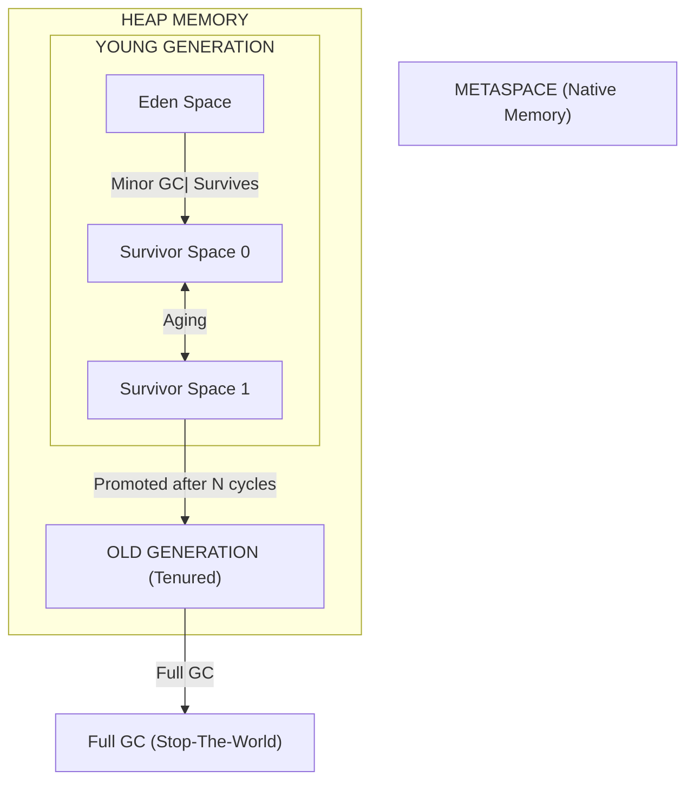

# Java JVM & Garbage Collection

## 1. Memory Regions

The JVM divides memory into several regions, each with a specific purpose.

### 1.1. Heap vs Stack

| Aspect | Heap | Stack |
|--------|------|-------|
| **Storage** | Object instances, arrays | Local variables, method parameters, call stack |
| **Sharing** | Shared across all threads | Per-thread (each thread has its own stack) |
| **Management** | Managed by Garbage Collector | LIFO, managed automatically |
| **Size** | Large, configurable | Small, fixed per thread |
| **Lifetime** | Objects live until GC collects them | Variables live until method returns |
| **Errors** | `OutOfMemoryError` (heap full) | `StackOverflowError` (stack overflow) |

```java
public void example() {
    int x = 10;              // Stack: primitive local variable
    String s = "hello";      // Stack: reference variable, Heap: String object
    Object obj = new Object(); // Stack: reference, Heap: Object instance

    // When method returns, x and references are popped from stack
    // Object becomes eligible for GC (if no other reference)
}
```

### 1.2. Metaspace (Java 8+)

| Aspect | PermGen (Java 7 and earlier) | Metaspace (Java 8+) |
|--------|----------------------------|---------------------|
| **Storage** | Class metadata, interned strings | Class metadata, static fields |
| **Location** | Part of heap (fixed size) | Native memory (outside heap) |
| **Size limit** | Fixed (`-XX:MaxPermSize`) | Grows dynamically by default |
| **OOM error** | `OutOfMemoryError: PermGen space` | `OutOfMemoryError: Metaspace` |

### 1.3. Other Memory Regions

| Region | Description |
|--------|-------------|
| **Program Counter (PC) Register** | Thread-specific; holds address of current JVM instruction |
| **Native Method Stack** | Stack for native (JNI) methods |
| **Method Area** | Class metadata, runtime constant pool, static variables (inside Metaspace) |

---

## 2. JVM Memory Structure (Heap Detailed)

The heap is divided into generations for efficient garbage collection.



### 2.1. Young Generation

| Space | Description |
|-------|-------------|
| **Eden** | Newly created objects are allocated here |
| **Survivor Space 0 (S0)** | Objects that survive minor GC (not yet old enough) |
| **Survivor Space 1 (S1)** | Objects that survive minor GC (alternates with S0) |

> **Note:** Objects that survive enough minor GCs (after reaching **tenuring threshold**) are promoted to the **Old Generation**.

### 2.2. Old Generation

Holds long-lived objects. When this fills up, a **Major GC** (or Full GC) is triggered, which is more expensive.

---

## 3. Garbage Collection Process

### 3.1. Minor GC (Young Generation GC)

- Triggered when **Eden space is full**
- Copies live objects from Eden to S0 (or S1)
- Objects that have survived multiple cycles are promoted to Old Generation
- Fast because Young Generation is typically small

### 3.2. Major GC / Full GC

- Triggers on **Old Generation** (Major) or **entire heap** (Full)
- More expensive, often causes **stop-the-world** pauses
- Algorithms vary by collector

### 3.3. GC Root (What Makes an Object Reachable)

Objects are reachable (not eligible for GC) if they are referenced by:

| GC Root Type | Description |
|-------------|-------------|
| **Local variables** | Variables in the current method |
| **Active threads** | Live thread objects |
| **Static variables** | Class-level static fields |
| **JNI references** | Native code references |

---

## 4. Garbage Collectors

| Collector | JVM Flag | Description |
|-----------|----------|-------------|
| **Serial GC** | `-XX:+UseSerialGC` | Single-threaded, stop-the-world. For small heaps, single-CPU |
| **Parallel GC (Throughput)** | `-XX:+UseParallelGC` (default in Java 8) | Multi-threaded, high throughput. For batch processing |
| **CMS (Concurrent Mark Sweep)** | `-XX:+UseConcMarkSweepGC` | Low latency, concurrent. **Deprecated in Java 9** |
| **G1 GC** | `-XX:+UseG1GC` (default in Java 9+) | Balanced throughput/latency. For modern web/microservices |
| **ZGC** | `-XX:+UseZGC` (Java 11+) | Ultra-low latency, scalable (100s of GB heaps) |
| **Shenandoah** | `-XX:+UseShenandoahGC` (Java 12+) | Ultra-low latency, similar to ZGC |
| **Epsilon** | `-XX:+UseEpsilonGC` | No-op GC, for very short-lived programs |

### 4.1. Comparison Table

| Collector | Stop-the-World | Concurrency | Latency | Throughput | Heap Size |
|-----------|--------------|-------------|---------|-----------|-----------|
| Serial | Yes (long) | No | High latency | Moderate | Small |
| Parallel | Yes | No | Moderate | **Highest** | Large |
| G1 | Short pauses | Partial | Balanced | Good | Large |
| ZGC | **Minimal** | Yes | **Ultra-low** | High | **Very large** |
| Shenandoah | **Minimal** | Yes | Ultra-low | High | Large |

### 4.2. G1 GC (Default Since Java 9)

G1 (Garbage First) divides the heap into **regions** (typically 1MB each) and prioritizes regions with the most garbage.

```bash
# Recommended settings for modern applications
java -XX:+UseG1GC -XX:MaxGCPauseMillis=200 -XX:G1HeapRegionSize=4m -jar app.jar
```

### 4.3. ZGC (Java 11+)

ZGC is designed for **ultra-low latency** applications with very large heaps (terabytes). It achieves pause times under **1 millisecond** regardless of heap size.

```bash
java -XX:+UseZGC -XX:MaxGCPauseMillis=1 -Xmx16g -jar app.jar
```

---

## 5. JVM Command-Line Flags

### 5.1. Heap Size

| Flag | Description | Example |
|------|-------------|---------|
| `-Xms<size>` | Initial heap size | `-Xms512m` |
| `-Xmx<size>` | Maximum heap size | `-Xmx2g` |
| `-Xss<size>` | Thread stack size per thread | `-Xss1m` |

### 5.2. Garbage Collector Selection

| Flag | Description |
|------|-------------|
| `-XX:+UseSerialGC` | Use Serial GC |
| `-XX:+UseParallelGC` | Use Parallel GC |
| `-XX:+UseG1GC` | Use G1 GC |
| `-XX:+UseZGC` | Use ZGC |
| `-XX:+UseShenandoahGC` | Use Shenandoah GC |

### 5.3. Common G1 GC Flags

| Flag | Description | Default |
|------|-------------|---------|
| `-XX:MaxGCPauseMillis=<n>` | Target max GC pause time | 200ms |
| `-XX:G1HeapRegionSize=<n>` | Region size | Auto-calculated |
| `-XX:InitiatingHeapOccupancyPercent` | Threshold to trigger GC | 45% |
| `-XX:G1ReservePercent` | Reserve memory for promotion | 10% |

### 5.4. Other Useful Flags

| Flag | Description |
|------|-------------|
| `-XX:+PrintGCDetails` | Print detailed GC logs |
| `-XX:+PrintGCDateStamps` | Add timestamps to GC logs |
| `-Xlog:gc*:file=gc.log` | Java 9+ unified GC logging |
| `-XX:+HeapDumpOnOutOfMemoryError` | Dump heap on OOM |
| `-XX:HeapDumpPath=<path>` | Path for heap dump |
| `-XX:+DisableExplicitGC` | Ignore `System.gc()` calls |

---

## 6. Memory Issues

### 6.1. OutOfMemoryError

| Type | Cause | Solution |
|------|-------|---------|
| **Java heap space** | Heap full, too many objects | Increase `-Xmx`, fix memory leaks |
| **Metaspace** | Too many classes loaded | Increase Metaspace size, check classloader leaks |
| **GC overhead limit** | Too much time in GC with little progress | Increase heap, fix memory leaks |
| **Unable to create native thread** | Too many threads | Reduce thread count, reduce stack size |
| **Direct Buffer Memory** | NIO direct buffers | Increase direct memory limit |

```java
// Common causes of heap OOM
public class MemoryLeakExample {
    private static List<Object> cache = new ArrayList<>();

    public void addToCache(Object obj) {
        cache.add(obj);  // Keeps growing — classic memory leak
    }

    // Fix: use WeakHashMap or add eviction
    private static Map<Object, Object> weakCache = new WeakHashMap<>();
}
```

### 6.2. StackOverflowError

Caused by **infinite recursion** or a **stack depth exceeding limits**.

```java
public void infiniteRecursion() {
    infiniteRecursion();  // StackOverflowError
}

// Fix: always have a base case
public int factorial(int n) {
    if (n <= 1) return 1;  // Base case
    return n * factorial(n - 1);
}
```

### 6.3. Memory Leak

Objects that are **no longer needed** but are still **strongly referenced**, preventing GC from collecting them.

**Common causes:**
- **Static collections** (singleton caches) that never clear entries
- **Listener/observer patterns** that never unregister
- **ThreadLocal** without removing when thread pool is reused
- **Unclosed resources** (streams, connections)
- **Internal class references** (non-static inner classes hold implicit reference to outer class)

**Detecting memory leaks:**
- Use **heap dumps** (`jmap`, VisualVM, MAT)
- Profile with **Java Flight Recorder** (JFR)
- Monitor GC logs for steady heap growth

---

## 7. JIT Compiler

The **Just-In-Time (JIT) Compiler** compiles frequently-used bytecode into **native machine code** at runtime for better performance.

| Concept | Description |
|---------|-------------|
| **Interpretation** | JVM initially interprets bytecode directly (slow) |
| **JIT Compilation** | Hot methods (frequently called) are compiled to native code |
| **Tiered Compilation** | Client compiler (C1) for quick startup, Server compiler (C2/Opt) for peak performance |
| **Inlining** | JIT replaces method calls with the actual method body (eliminates call overhead) |
| **Deoptimization** | JIT reverts compiled code if assumptions are violated |

---

## 8. Class Loading

### 8.1. Class Loaders (Parent Delegation Model)

| Class Loader | Loads | Scope |
|-------------|-------|-------|
| **Bootstrap ClassLoader** | Core Java classes (`java.lang`, etc.) | JVM's core |
| **Extension ClassLoader** | Classes in `jre/lib/ext` | Extension libraries |
| **Application ClassLoader** | Classes from classpath | Application code |

### 8.2. Class Loading Process

1. **Loading** — Find and load binary representation of class
2. **Linking** — Verify, prepare, resolve
3. **Initialization** — Execute static initializers, assign static fields

---

## 9. Performance Tuning Checklist

> **Tip:** Start with default settings (G1 GC). Tune only when you have actual performance data.

- Use `-Xms` and `-Xmx` to set equal values (avoid heap resizing)
- Set `-XX:MaxGCPauseMillis` target for G1
- Enable GC logs for analysis: `-Xlog:gc*:file=gc.log:time:filecount=5,filesize=10M`
- Monitor with JFR (Java Flight Recorder)
- Profile before tuning — use VisualVM, YourKit, or async-profiler
- Consider ZGC for applications requiring consistent low latency
