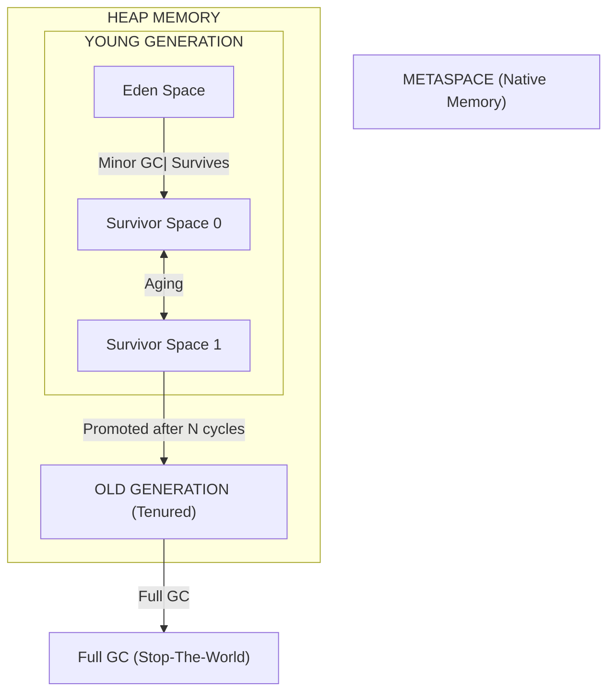
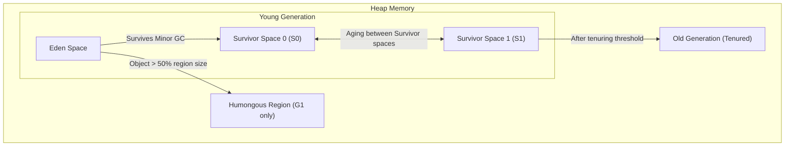
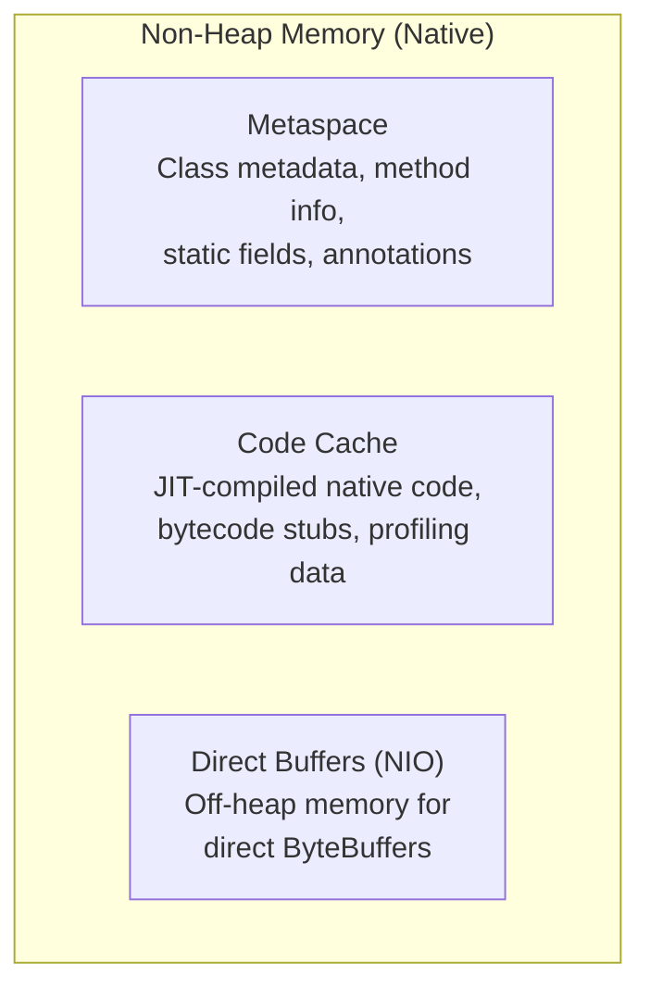
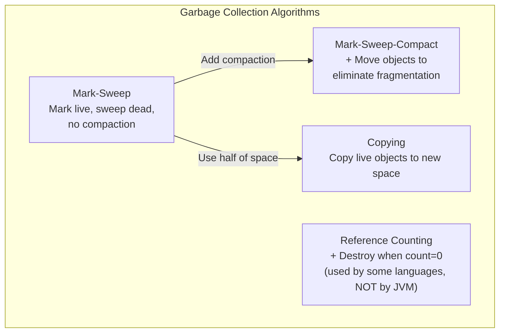
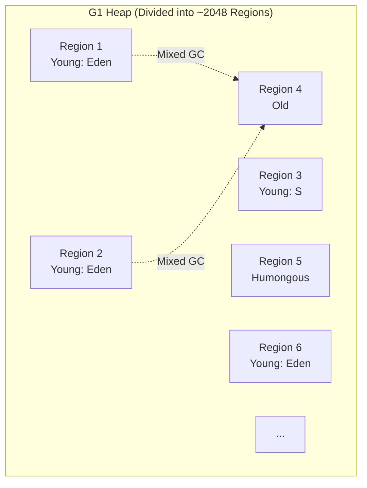
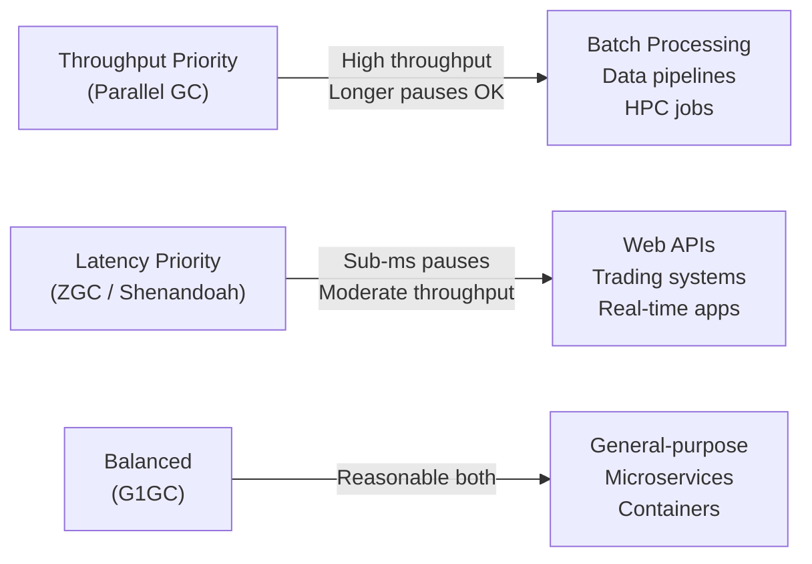

# Java JVM & Garbage Collection

## 1. Memory Regions

The JVM divides memory into several regions, each with a specific purpose.

### 1.1. Heap vs Stack

| Aspect | Heap | Stack |
|--------|------|-------|
| **Storage** | Object instances, arrays | Local variables, method parameters, call stack |
| **Sharing** | Shared across all threads | Per-thread (each thread has its own stack) |
| **Management** | Managed by Garbage Collector | LIFO, managed automatically |
| **Size** | Large, configurable | Small, fixed per thread |
| **Lifetime** | Objects live until GC collects them | Variables live until method returns |
| **Errors** | `OutOfMemoryError` (heap full) | `StackOverflowError` (stack overflow) |

```java
public void example() {
    int x = 10;              // Stack: primitive local variable
    String s = "hello";      // Stack: reference variable, Heap: String object
    Object obj = new Object(); // Stack: reference, Heap: Object instance

    // When method returns, x and references are popped from stack
    // Object becomes eligible for GC (if no other reference)
}
```

### 1.2. Metaspace (Java 8+)

| Aspect | PermGen (Java 7 and earlier) | Metaspace (Java 8+) |
|--------|----------------------------|---------------------|
| **Storage** | Class metadata, interned strings | Class metadata, static fields |
| **Location** | Part of heap (fixed size) | Native memory (outside heap) |
| **Size limit** | Fixed (`-XX:MaxPermSize`) | Grows dynamically by default |
| **OOM error** | `OutOfMemoryError: PermGen space` | `OutOfMemoryError: Metaspace` |

### 1.3. Other Memory Regions

| Region | Description |
|--------|-------------|
| **Program Counter (PC) Register** | Thread-specific; holds address of current JVM instruction |
| **Native Method Stack** | Stack for native (JNI) methods |
| **Method Area** | Class metadata, runtime constant pool, static variables (inside Metaspace) |

---

## 2. JVM Memory Structure (Heap Detailed)

The heap is divided into generations for efficient garbage collection.



### 2.1. Young Generation

| Space | Description |
|-------|-------------|
| **Eden** | Newly created objects are allocated here |
| **Survivor Space 0 (S0)** | Objects that survive minor GC (not yet old enough) |
| **Survivor Space 1 (S1)** | Objects that survive minor GC (alternates with S0) |

> **Note:** Objects that survive enough minor GCs (after reaching **tenuring threshold**) are promoted to the **Old Generation**.

### 2.2. Old Generation

Holds long-lived objects. When this fills up, a **Major GC** (or Full GC) is triggered, which is more expensive.

---

## 3. Garbage Collection Process

### 3.1. Minor GC (Young Generation GC)

- Triggered when **Eden space is full**
- Copies live objects from Eden to S0 (or S1)
- Objects that have survived multiple cycles are promoted to Old Generation
- Fast because Young Generation is typically small

### 3.2. Major GC / Full GC

- Triggers on **Old Generation** (Major) or **entire heap** (Full)
- More expensive, often causes **stop-the-world** pauses
- Algorithms vary by collector

### 3.3. GC Root (What Makes an Object Reachable)

Objects are reachable (not eligible for GC) if they are referenced by:

| GC Root Type | Description |
|-------------|-------------|
| **Local variables** | Variables in the current method |
| **Active threads** | Live thread objects |
| **Static variables** | Class-level static fields |
| **JNI references** | Native code references |

---

## 4. Garbage Collectors

| Collector | JVM Flag | Description |
|-----------|----------|-------------|
| **Serial GC** | `-XX:+UseSerialGC` | Single-threaded, stop-the-world. For small heaps, single-CPU |
| **Parallel GC (Throughput)** | `-XX:+UseParallelGC` (default in Java 8) | Multi-threaded, high throughput. For batch processing |
| **CMS (Concurrent Mark Sweep)** | `-XX:+UseConcMarkSweepGC` | Low latency, concurrent. **Deprecated in Java 9** |
| **G1 GC** | `-XX:+UseG1GC` (default in Java 9+) | Balanced throughput/latency. For modern web/microservices |
| **ZGC** | `-XX:+UseZGC` (Java 11+) | Ultra-low latency, scalable (100s of GB heaps) |
| **Shenandoah** | `-XX:+UseShenandoahGC` (Java 12+) | Ultra-low latency, similar to ZGC |
| **Epsilon** | `-XX:+UseEpsilonGC` | No-op GC, for very short-lived programs |

### 4.1. Comparison Table

| Collector | Stop-the-World | Concurrency | Latency | Throughput | Heap Size |
|-----------|--------------|-------------|---------|-----------|-----------|
| Serial | Yes (long) | No | High latency | Moderate | Small |
| Parallel | Yes | No | Moderate | **Highest** | Large |
| G1 | Short pauses | Partial | Balanced | Good | Large |
| ZGC | **Minimal** | Yes | **Ultra-low** | High | **Very large** |
| Shenandoah | **Minimal** | Yes | Ultra-low | High | Large |

### 4.2. G1 GC (Default Since Java 9)

G1 (Garbage First) divides the heap into **regions** (typically 1MB each) and prioritizes regions with the most garbage.

```bash
# Recommended settings for modern applications
java -XX:+UseG1GC -XX:MaxGCPauseMillis=200 -XX:G1HeapRegionSize=4m -jar app.jar
```

### 4.3. ZGC (Java 11+)

ZGC is designed for **ultra-low latency** applications with very large heaps (terabytes). It achieves pause times under **1 millisecond** regardless of heap size.

```bash
java -XX:+UseZGC -XX:MaxGCPauseMillis=1 -Xmx16g -jar app.jar
```

---

## 5. JVM Command-Line Flags

### 5.1. Heap Size

| Flag | Description | Example |
|------|-------------|---------|
| `-Xms<size>` | Initial heap size | `-Xms512m` |
| `-Xmx<size>` | Maximum heap size | `-Xmx2g` |
| `-Xss<size>` | Thread stack size per thread | `-Xss1m` |

### 5.2. Garbage Collector Selection

| Flag | Description |
|------|-------------|
| `-XX:+UseSerialGC` | Use Serial GC |
| `-XX:+UseParallelGC` | Use Parallel GC |
| `-XX:+UseG1GC` | Use G1 GC |
| `-XX:+UseZGC` | Use ZGC |
| `-XX:+UseShenandoahGC` | Use Shenandoah GC |

### 5.3. Common G1 GC Flags

| Flag | Description | Default |
|------|-------------|---------|
| `-XX:MaxGCPauseMillis=<n>` | Target max GC pause time | 200ms |
| `-XX:G1HeapRegionSize=<n>` | Region size | Auto-calculated |
| `-XX:InitiatingHeapOccupancyPercent` | Threshold to trigger GC | 45% |
| `-XX:G1ReservePercent` | Reserve memory for promotion | 10% |

### 5.4. Other Useful Flags

| Flag | Description |
|------|-------------|
| `-XX:+PrintGCDetails` | Print detailed GC logs |
| `-XX:+PrintGCDateStamps` | Add timestamps to GC logs |
| `-Xlog:gc*:file=gc.log` | Java 9+ unified GC logging |
| `-XX:+HeapDumpOnOutOfMemoryError` | Dump heap on OOM |
| `-XX:HeapDumpPath=<path>` | Path for heap dump |
| `-XX:+DisableExplicitGC` | Ignore `System.gc()` calls |

---

## 6. Memory Issues

### 6.1. OutOfMemoryError

| Type | Cause | Solution |
|------|-------|---------|
| **Java heap space** | Heap full, too many objects | Increase `-Xmx`, fix memory leaks |
| **Metaspace** | Too many classes loaded | Increase Metaspace size, check classloader leaks |
| **GC overhead limit** | Too much time in GC with little progress | Increase heap, fix memory leaks |
| **Unable to create native thread** | Too many threads | Reduce thread count, reduce stack size |
| **Direct Buffer Memory** | NIO direct buffers | Increase direct memory limit |

```java
// Common causes of heap OOM
public class MemoryLeakExample {
    private static List<Object> cache = new ArrayList<>();

    public void addToCache(Object obj) {
        cache.add(obj);  // Keeps growing — classic memory leak
    }

    // Fix: use WeakHashMap or add eviction
    private static Map<Object, Object> weakCache = new WeakHashMap<>();
}
```

### 6.2. StackOverflowError

Caused by **infinite recursion** or a **stack depth exceeding limits**.

```java
public void infiniteRecursion() {
    infiniteRecursion();  // StackOverflowError
}

// Fix: always have a base case
public int factorial(int n) {
    if (n <= 1) return 1;  // Base case
    return n * factorial(n - 1);
}
```

### 6.3. Memory Leak

Objects that are **no longer needed** but are still **strongly referenced**, preventing GC from collecting them.

**Common causes:**
- **Static collections** (singleton caches) that never clear entries
- **Listener/observer patterns** that never unregister
- **ThreadLocal** without removing when thread pool is reused
- **Unclosed resources** (streams, connections)
- **Internal class references** (non-static inner classes hold implicit reference to outer class)

**Detecting memory leaks:**
- Use **heap dumps** (`jmap`, VisualVM, MAT)
- Profile with **Java Flight Recorder** (JFR)
- Monitor GC logs for steady heap growth

---

## 7. JIT Compiler

The **Just-In-Time (JIT) Compiler** compiles frequently-used bytecode into **native machine code** at runtime for better performance.

| Concept | Description |
|---------|-------------|
| **Interpretation** | JVM initially interprets bytecode directly (slow) |
| **JIT Compilation** | Hot methods (frequently called) are compiled to native code |
| **Tiered Compilation** | Client compiler (C1) for quick startup, Server compiler (C2/Opt) for peak performance |
| **Inlining** | JIT replaces method calls with the actual method body (eliminates call overhead) |
| **Deoptimization** | JIT reverts compiled code if assumptions are violated |

---

## 8. Class Loading

### 8.1. Class Loaders (Parent Delegation Model)

| Class Loader | Loads | Scope |
|-------------|-------|-------|
| **Bootstrap ClassLoader** | Core Java classes (`java.lang`, etc.) | JVM's core |
| **Extension ClassLoader** | Classes in `jre/lib/ext` | Extension libraries |
| **Application ClassLoader** | Classes from classpath | Application code |

### 8.2. Class Loading Process

1. **Loading** — Find and load binary representation of class
2. **Linking** — Verify, prepare, resolve
3. **Initialization** — Execute static initializers, assign static fields

---

## 9. JVM Memory Structure — Heap and Non-Heap

### 9.1. Heap Memory Regions

The heap is divided into generations to optimize GC performance based on object lifespan patterns.



| Region | Purpose | Size Ratio (Default G1) |
|--------|---------|----------------------|
| **Eden** | New object allocation | ~80% of Young Gen |
| **Survivor S0/S1** | Objects surviving Minor GC | ~10% each of Young Gen |
| **Old Generation** | Long-lived objects | ~60% of total heap |
| **Humongous** (G1 only) | Objects > 50% of region size | Special regions |

### 9.2. Non-Heap Memory Regions

Non-heap memory is managed outside the JVM heap in native memory.



| Region | Purpose | Growth Behavior |
|--------|---------|----------------|
| **Metaspace** | Class metadata, runtime constants, method info, static fields | Grows dynamically by default (limited by native memory) |
| **Code Cache** | JIT-compiled machine code, inline stubs | Fixed by default, can be tuned with `-XX:ReservedCodeCacheSize` |
| **Direct Buffers** | NIO `ByteBuffer.allocateDirect()` memory | Not part of Java heap, counts toward direct memory limit |

### 9.3. Stack Memory (Per Thread)

Each thread has its own private stack:

```java
// Each thread gets its own stack
public class StackDemo {
    public static void main(String[] args) {
        // 3 threads = 3 stacks
        for (int i = 0; i < 3; i++) {
            final int id = i;
            new Thread(() -> {
                recursiveMethod(0); // Each thread has separate stack
            }, "Thread-" + id).start();
        }
    }

    public static void recursiveMethod(int depth) {
        // Each recursion adds a stack frame
        // Stack grows until StackOverflowError or base case
        byte[] data = new byte[1024]; // Part of this thread's stack
        recursiveMethod(depth + 1);
    }
}
```

### 9.4. JVM Flags for Memory Regions

```bash
# Heap Size
java -Xms2g -Xmx2g                    # Initial and max heap (equal prevents resizing)

# Stack Size per Thread
java -Xss1m                           # 1MB stack per thread (default ~1MB)

# Metaspace
java -XX:MetaspaceSize=256m           # Initial metaspace size
java -XX:MaxMetaspaceSize=512m        # Max metaspace (prevents native OOM)

# Young/Old Generation Ratio
java -XX:NewRatio=2                   # Old Gen = 2x Young Gen (i.e., Old = 2/3 heap)
java -XX:NewRatio=1                   # Equal Young and Old (for short-lived apps)

# Survivor Spaces
java -XX:SurvivorRatio=8              # Eden : Survivor = 8 : 1 : 1 (default)
java -XX:SurvivorRatio=4              # Eden : Survivor = 4 : 1 : 1 (faster aging)
```

---

## 10. GC Algorithms Deep Dive

### 10.1. Algorithm Overview



### 10.2. Serial GC (`-XX:+UseSerialGC`)

- **Single-threaded** — both minor and full GC run on one thread
- Uses **Mark-Sweep-Compact** algorithm
- **Stop-the-world** pauses for all GC types
- **Use case:** Single-CPU machines, small heaps (< 100MB), containerized environments with CPU limits

```bash
java -XX:+UseSerialGC -Xms256m -Xmx256m -jar app.jar
```

### 10.3. Parallel GC (`-XX:+UseParallelGC`) — Default Java 8

- **Multi-threaded** — uses all available CPU cores
- **Throughput-focused** — maximizes throughput (operations per second)
- **Stop-the-world** pauses but shorter than Serial due to parallelism
- **Use case:** Batch processing, ETL jobs, CPU-bound batch analytics

```bash
java -XX:+UseParallelGC \
     -XX:MaxGCPauseMillis=500 \      # Target pause time (soft goal)
     -XX:GCTimeRatio=19 \            # 1/(1+19) = 5% time in GC = 95% throughput
     -Xms4g -Xmx4g -jar batch-app.jar
```

### 10.4. CMS GC (`-XX:+UseConcMarkSweepGC`) — Deprecated Java 9, Removed Java 14

- **Concurrent Mark Sweep** — most phases run concurrently with the application
- Aims for **low latency** with short pause times
- Does **not** compact — can lead to fragmentation
- **Use case:** Legacy applications. **Deprecated** — use G1GC instead.

```bash
# Deprecated — only for legacy Java 8 systems
java -XX:+UseConcMarkSweepGC -Xms2g -Xmx2g -jar legacy-app.jar
```

### 10.5. G1GC (`-XX:+UseG1GC`) — Default Since Java 9

**Garbage-First** collector divides the heap into equal-sized **regions** (~1MB each by default). It prioritizes regions with the most garbage (garbage-first).



#### Collection Types

| Type | Trigger | What Happens | Pause Type |
|------|---------|-------------|------------|
| **Young Collection** | Eden full | Copy live objects from Eden to Survivor regions | Short STW |
| **Mixed Collection** | Old Gen occupancy exceeds threshold | Collects Young + selected Old regions with most garbage | Short STW |
| **Humongous Allocation** | Object > 50% of region size | Dedicated humongous regions | — |

#### Tuning G1GC

```bash
java -XX:+UseG1GC \
     -XX:MaxGCPauseMillis=200 \      # Target max pause time (soft goal, default 200ms)
     -XX:G1HeapRegionSize=4m \        # Region size: 1, 2, 4, 8, 16, 32 MB (auto-calculated)
     -XX:InitiatingHeapOccupancyPercent=45 \ # Start concurrent cycle when heap is 45% full
     -XX:G1ReservePercent=10 \        # Reserve 10% for promotion
     -XX:ConcGCThreads=4 \           # Threads for concurrent phases
     -Xms4g -Xmx4g -jar web-app.jar
```

#### G1GC Tuning Guidelines

| Symptom | Tuning Adjustment |
|---------|-----------------|
| **Long pause times** | Decrease `-XX:MaxGCPauseMillis` |
| **Too many mixed collections** | Increase `-XX:InitiatingHeapOccupancyPercent` |
| **Humongous allocation issues** | Increase `-XX:G1HeapRegionSize` |
| **Fragmentation** | Increase heap size or adjust survivor ratio |
| **Young Gen too large/small** | Adjust `-XX:NewRatio` or `-XX:SurvivorRatio` |

### 10.6. ZGC (`-XX:+UseZGC`) — Java 11+, Scalable Low-Latency

ZGC is designed for **ultra-low latency** applications with very large heaps (up to multi-terabytes). It achieves pause times under **1 millisecond** regardless of heap size.

#### How ZGC Works: Colored Pointers

ZGC uses **colored pointers** — extra bits in object references that encode GC state:

```
64-bit reference on ZGC:
┌─────────┬──────────────────────────┬──────────┐
│ Reserved│        Object Address    │  Mark    │
│  (bits) │      (42 bits usable)    │  (bits)  │
└─────────┴──────────────────────────┴──────────┘
                Normal pointer          Colored bits

Mark bits: Finalizable, Remapped, Marked0, Marked1
```

The colored pointers allow ZGC to track object states **without stopping the application** — threads can access objects during GC operations.

```bash
# Enable ZGC
java -XX:+UseZGC \
     -XX:MaxGCPauseMillis=1 \        # Target < 1ms pause
     -Xmx16g -Xms16g \
     -jar low-latency-app.jar

# For very large heaps
java -XX:+UseZGC -Xmx512g -jar tb-scale-app.jar
```

| ZGC Phase | Description | Pauses? |
|-----------|-------------|---------|
| **Pause Mark Start** | Root marking | **Yes** (sub-ms) |
| **Concurrent Mark** | Trace object graph | No |
| **Pause Mark End** | Mark completion | **Yes** (sub-ms) |
| **Concurrent Relocate** | Move objects, update references | No |
| **Pause Relocate Start** | Root relocate | **Yes** (sub-ms) |

#### ZGC Key Properties

- **No compaction pauses** — objects are moved concurrently
- **Scalable** — pause times stay low regardless of heap size
- **Throughput** — slightly lower than G1 (more CPU spent on GC)
- **Works with compressed class pointers** (Java 15+)
- **NUMA-aware** — optimized for NUMA systems

### 10.7. Shenandoah (`-XX:+UseShenandoahGC`) — Java 12+

Similar to ZGC in goals (low-latency) but uses a **different algorithm**:

- Uses a **brooks pointer** (extra word per object) instead of colored pointers
- Performs **concurrent compaction** — moves objects while the application runs
- Not as scalable as ZGC for multi-TB heaps
- Good choice for **medium-to-large heaps** where G1 is too slow but ZGC is unavailable

```bash
java -XX:+UseShenandoahGC \
     -XX:MaxGCPauseMillis=10 \
     -Xmx8g -Xms8g \
     -jar app.jar
```

---

## 11. Choosing the Right Garbage Collector

### 11.1. Decision Matrix

| Application Type | GC Recommendation | Reasoning |
|-----------------|-------------------|-----------|
| **Batch / ETL / Background Jobs** | Parallel GC | Maximize throughput, pause time acceptable |
| **Web Application / API Server** | G1GC (default) | Balanced throughput and latency |
| **Low-latency Trading / Gaming** | ZGC | Sub-millisecond pauses required |
| **Medium-scale, latency-sensitive** | Shenandoah | Good ZGC alternative if ZGC unavailable |
| **Embedded / Small memory** | Serial GC | Single-threaded, minimal overhead |
| **Short-lived CLI tools** | Epsilon GC | No GC overhead, no memory reclaim |

### 11.2. Throughput vs Latency Tradeoff



### 11.3. Heap Size Guidelines

| Heap Size | GC Choice | Notes |
|-----------|-----------|-------|
| < 256MB | Serial | Minimal overhead |
| 256MB - 4GB | G1GC | Default for most applications |
| 4GB - 64GB | G1GC or ZGC | G1 if latency target is ~200ms; ZGC if <10ms |
| 64GB - TB | ZGC | G1 pauses become unacceptable at this scale |
| TB+ | ZGC | Only ZGC maintains low latency at this scale |

> **Warning:** Never use `-XX:+UseSerialGC` in production unless you have a specific reason. Parallel GC or G1GC will always outperform it on multi-core systems.

---

## 12. Advanced JVM Tuning

### 12.1. Production-Ready JVM Flags

```bash
# Memory settings
java -Xms4g -Xmx4g \                  # Equal min/max heap
   -Xss1m \                           # Stack size per thread
   -XX:MetaspaceSize=256m \
   -XX:MaxMetaspaceSize=512m \

# GC selection and tuning
   -XX:+UseG1GC \
   -XX:MaxGCPauseMillis=200 \
   -XX:+PrintGCDetails \
   -XX:+PrintGCDateStamps \

# Logging (Java 9+ unified logging)
   -Xlog:gc*:file=gc.log:time:filecount=5,filesize=10M,level=tags \

# OOM handling
   -XX:+HeapDumpOnOutOfMemoryError \
   -XX:HeapDumpPath=/var/log/ \

# Disable explicit GC (useful for testing)
   -XX:+DisableExplicitGC \

# Java 17+ security and performance
   -XX:+AlwaysPreTouch \               # Pre-touch memory pages (reduces first-run latency)
   -XX:+UseStringDeduplication \      # Deduplicate equal strings (requires G1)
   -jar application.jar
```

### 12.2. Monitoring Tools

| Tool | Command | Purpose |
|------|---------|---------|
| **jstat** | `jstat -gcutil <pid> 1000` | Real-time GC statistics every 1s |
| **jinfo** | `jinfo -flags <pid>` | View current JVM flags |
| **jmap** | `jmap -heap <pid>` | Heap summary |
| **jcmd** | `jcmd <pid> VM.flags` | All JVM flags |
| **VisualVM** | GUI tool | Profiling, heap dumps, thread analysis |
| **Java Flight Recorder** | `-XX:StartFlightRecording` | Continuous profiling |

---

## 13. Performance Tuning Checklist
