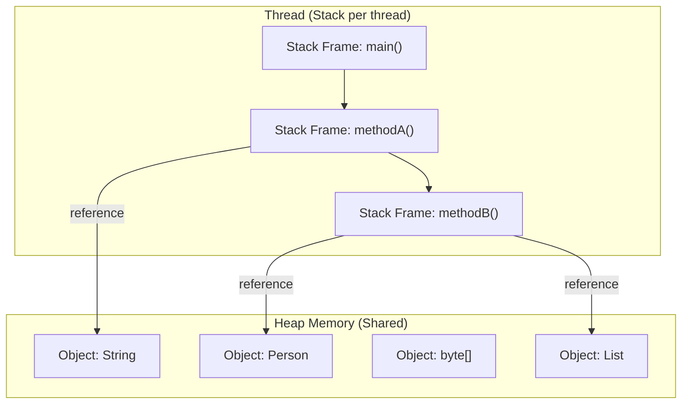
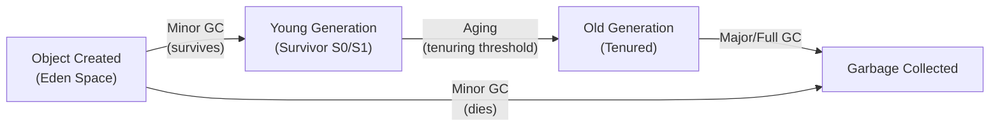

# Java Memory Management

## 1. Stack vs Heap

Understanding the difference between Stack and Heap memory is fundamental to understanding how Java manages memory.

### 1.1. Comparison Table

| Aspect | Stack | Heap |
|--------|-------|------|
| **Purpose** | Method execution, local variables | Object allocation |
| **Data stored** | Primitives, object references | Object instances, arrays |
| **Access** | LIFO (Last In First Out) | Random access |
| **Size** | Fixed, small (typically 1MB per thread) | Large, dynamic |
| **Lifetime** | Method-scoped (automatic) | Until GC collects it |
| **Sharing** | Per-thread (private) | Shared across all threads |
| **Management** | Automatic (push/pop) | Garbage Collected |
| **Speed** | Faster (direct push/pop) | Slower (allocation + GC overhead) |
| **Overflow** | `StackOverflowError` | `OutOfMemoryError` |

### 1.2. Visual Representation



### 1.3. Memory Allocation Example

```java
public class MemoryAllocation {
    // Static field → stored in Metaspace
    private static String STATIC_NAME = "Static Data";

    // Instance field → stored on Heap
    private String instanceName;

    public void process() {
        // Primitive: stored directly on the Stack
        int x = 10;

        // Reference variable: reference on Stack, object on Heap
        String str = new String("Hello");

        // Local variable (reference): on Stack, points to Heap object
        Person p = new Person("Alice", 25);

        // Array: reference on Stack, actual array on Heap
        int[] numbers = {1, 2, 3, 4, 5};

        // Nested call
        nestedMethod(p, numbers);
        // When process() returns: x, str, p, numbers are all popped from stack
        // Objects on Heap become eligible for GC (if no other references)
    }

    private void nestedMethod(Person p, int[] numbers) {
        // p and numbers are parameters on the Stack
        // They reference the same Heap objects
        int sum = 0;
        for (int n : numbers) {
            sum += n;
        }
        // When nestedMethod returns, its stack frame is popped
    }
}
```

---

## 2. Object Allocation and GC Roots

### 2.1. How Objects Are Allocated

When you create an object with `new`, the JVM:
1. Checks if sufficient space exists in the Eden space of the Young Generation
2. Allocates memory (using a bump-the-pointer technique for speed)
3. Initializes the object (zeroes out memory)
4. Calls the constructor

### 2.2. GC Roots (What Keeps Objects Alive)

An object is **reachable** if it can be accessed from a GC Root. Only reachable objects survive GC.

| GC Root Type | Description | Example |
|-------------|-------------|---------|
| **Stack Reference** | Local variables in currently executing methods | Method parameters, local variables |
| **Static Fields** | Class-level variables marked `static` | `private static Cache cache` |
| **JNI References** | References from native code (JNI) | Objects passed to native methods |
| **Thread Object** | Active thread objects | A `Thread` that has not terminated |
| **Class Object** | Class objects for classes that are loaded | The `Class` object of a loaded class |
| **Monitor Objects** | Objects used for synchronization | Objects held in `synchronized` blocks |

### 2.3. Object Lifecyle Flow



---

## 3. Reference Types in Java

Java provides four reference types, ordered from strongest to weakest. Understanding them is key to building caches and flexible memory management.

### 3.1. Comparison Table

| Reference Type | Garbage Collection | Use Case |
|---------------|-------------------|----------|
| **Strong Reference** | Never GC'd unless unreachable | Normal object references |
| **Soft Reference** | GC'd when memory is low | Memory-sensitive caches |
| **Weak Reference** | GC'd in next GC cycle | Canonicalized mappings, listeners |
| **Phantom Reference** | Never GC'd automatically (enqueue after finalize) | Post-mortem cleanup |

### 3.2. Strong Reference

The default reference type. The object is never collected while reachable.

```java
Object obj = new Object(); // Strong reference
obj = null;                 // Object becomes eligible for GC
```

### 3.3. Soft Reference

The object is collected when the JVM is low on memory but not otherwise. Ideal for implementing memory-sensitive caches.

```java
import java.lang.ref.SoftReference;

public class SoftCache<K, V> {
    private final Map<K, SoftReference<V>> cache = new HashMap<>();

    public V get(K key) {
        SoftReference<V> ref = cache.get(key);
        return ref != null ? ref.get() : null;
    }

    public void put(K key, V value) {
        cache.put(key, new SoftReference<>(value));
    }
}
```

> **Tip:** `SoftReference` is perfect for implementing a memory-aware cache. When memory pressure increases, the GC will clear these references, preventing `OutOfMemoryError`.

### 3.4. Weak Reference

The object is collected during the next GC cycle regardless of memory conditions. Used for `WeakHashMap` and preventing memory leaks.

```java
import java.lang.ref.WeakReference;

WeakReference<String> weakRef = new WeakReference<>("Hello");
System.out.println(weakRef.get()); // "Hello"

// After GC runs, weakRef.get() returns null
System.gc();
System.out.println(weakRef.get()); // null
```

**Common use: `ThreadLocal` with thread pools**

```java
// ThreadLocal without proper cleanup causes memory leak
class BadExample {
    ThreadLocal<Connection> threadLocal = new ThreadLocal<>();

    public void process() {
        threadLocal.set(getConnection());
        // If thread is returned to pool without remove():
        // The Connection object leaks because ThreadLocal holds
        // a weak reference to itself but the Entry still holds the value
    }
}

// Fix: always remove
threadLocal.remove(); // Critical when thread is reused in a pool
```

### 3.5. Phantom Reference

The weakest reference. Used for post-mortem cleanup — knowing when an object has been finalized and is about to be collected.

```java
import java.lang.ref.PhantomReference;
import java.lang.ref.ReferenceQueue;

ReferenceQueue<Object> queue = new ReferenceQueue<>();
PhantomReference<Object> phantomRef = new PhantomReference<>(obj, queue);

// phantomRef.get() ALWAYS returns null
// Use the queue to detect when the object is collected
Object polled = queue.remove(); // Blocks until reference is enqueued
// Perform cleanup tasks here
```

> **Note:** Unlike `WeakReference`, you cannot get the object back from a `PhantomReference`. Its only purpose is to signal that the object has been finalized and is ready for collection.

---

## 4. Memory Leaks in Java

Unlike languages like C/C++, Java has automatic garbage collection. However, memory leaks can still occur when objects are retained unintentionally.

### 4.1. Common Causes of Memory Leaks

| Cause | Description | Example |
|-------|-------------|---------|
| **Static collections** | Collections that grow indefinitely | `static Map<K,V> cache` without eviction |
| **ThreadLocal without remove** | Retained when thread pool is reused | Connection objects in thread pools |
| **Unclosed resources** | Streams, connections, file handles | `BufferedReader` never closed |
| **Listener/Observer without unregister** | Event listeners that never detach | Observer pattern without cleanup |
| **Internal class references** | Non-static inner class holds outer reference | Anonymous inner Runnable |
| **Incorrect equals/hashCode** | Objects in HashMap/HashSet never found | Custom class with changing keys |

### 4.2. ThreadLocal Memory Leak

This is one of the most common and dangerous leaks in Java enterprise applications:

```java
// Problem: ThreadLocal in a thread pool environment
public class UserContextFilter {
    private static final ThreadLocal<User> currentUser = new ThreadLocal<>();

    public void doFilter(...) {
        try {
            currentUser.set(authenticate(request));
            chain.doFilter(request, response);
        } finally {
            // CRITICAL: Must remove, otherwise User object leaks
            // when thread is returned to pool
            currentUser.remove();
        }
    }
}

// Leak scenario:
// 1. Thread T1 from pool sets User object in ThreadLocal
// 2. Request completes but remove() is not called
// 3. Thread T1 is returned to pool
// 4. Thread T1 will be reused for a different user (or sit idle holding User)
// 5. The old User object and all objects it references are leaked

// Additional danger: if User holds a database Connection
// The Connection is leaked back to the pool, causing pool exhaustion
```

### 4.3. Static Collection Leak

```java
// Classic leak: unbounded cache
public class ImageLoader {
    private static final Map<String, BufferedImage> cache = new HashMap<>();

    public static BufferedImage loadImage(String path) {
        return cache.computeIfAbsent(path, p -> {
            try {
                return ImageIO.read(new File(p));
            } catch (IOException e) {
                return null;
            }
        });
    }
    // cache grows forever → eventually OOM
}

// Solution 1: WeakHashMap (GC reclaims entries when keys are weakly reachable)
private static final Map<String, SoftReference<BufferedImage>> cache =
    new WeakHashMap<>();

// Solution 2: Size-bounded cache with eviction
private static final Cache<String, BufferedImage> cache =
    CacheBuilder.newBuilder()
        .maximumSize(1000)
        .expireAfterAccess(30, TimeUnit.MINUTES)
        .build();

// Solution 3: Caffeine (high-performance cache)
private static final Cache<String, BufferedImage> cache = Caffeine.newBuilder()
    .maximumSize(10_000)
    .expireAfterWrite(10, TimeUnit.MINUTES)
    .build();
```

### 4.4. Unclosed Resources

```java
// Leak: Stream never closed
public List<String> readLines(String path) throws IOException {
    BufferedReader reader = new BufferedReader(new FileReader(path));
    List<String> lines = new ArrayList<>();
    String line;
    while ((line = reader.readLine()) != null) {
        lines.add(line);
    }
    // reader never closed — file handle leaks
    // Especially problematic if this method is called frequently
}

// Fix: try-with-resources (Java 7+)
public List<String> readLines(String path) throws IOException {
    try (BufferedReader reader = new BufferedReader(new FileReader(path))) {
        return reader.lines().toList();
    }
    // Automatically closed, even on exception
}
```

### 4.5. Detecting Memory Leaks

| Tool | Description |
|------|-------------|
| **VisualVM** | Built-in profiler, heap dump analysis |
| **Eclipse MAT** | Heap dump analyzer, leak suspects report |
| **YourKit** | Commercial profiler with leak detection |
| **async-profiler** | Low-overhead CPU/memory profiler |
| **Java Flight Recorder (JFR)** | Built-in JDK monitoring, continuous profiling |
| **jmap + jhat** | Heap dump and analysis |
| **GC logs** | Monitor heap growth over time |

```bash
# Generate heap dump on OOM
java -XX:+HeapDumpOnOutOfMemoryError -XX:HeapDumpPath=/var/log/ app.jar

# Analyze with jmap
jmap -histo:live <pid>        # Live object histogram
jmap -dump:format=b,file=heap.bin <pid>  # Full heap dump

# Enable GC logging (Java 9+)
java -Xlog:gc*:file=gc.log:time:filecount=5,filesize=10M -jar app.jar
```

---

## 5. Escape Analysis and Stack Allocation

JIT compiler performs **Escape Analysis** at runtime to determine if an object's lifetime is confined to a single thread. If so, it may allocate the object on the stack instead of the heap.

### 5.1. How It Works

```java
public void process() {
    // Without escape analysis: Point allocated on Heap
    // With escape analysis: Point may be allocated on Stack
    Point p = new Point(x, y);

    // If p only used within this method and doesn't escape,
    // the JIT can allocate it on the stack
    double distance = Math.sqrt(p.x * p.x + p.y * p.y);
    // When process() returns, p is automatically freed (no GC needed)
}
```

### 5.2. Escape States

| State | Description | Allocation |
|-------|-------------|------------|
| **NoEscape** | Object stays within the method | Stack (scalar replaced) |
| **ArgEscape** | Passed as argument but doesn't escape beyond | Heap (but optimized) |
| **GlobalEscape** | Escapes to another thread or stored globally | Heap |

### 5.3. Benefits

- **Zero allocation cost** — no heap allocation overhead
- **No GC pressure** — no object to collect
- **Better cache locality** — stack memory is more cache-friendly
- **Faster deallocation** — automatic via stack pop

> **Note:** Stack allocation is an optimization, not guaranteed. Enable with `-XX:+DoEscapeAnalysis` (enabled by default in Java 8+). Use `-XX:+PrintEscapeAnalysis` to see JIT decisions.

---

## 6. Metaspace vs Heap

### 6.1. Key Differences

| Aspect | Metaspace | Heap |
|--------|-----------|------|
| **Location** | Native memory (off-heap) | JVM-managed heap |
| **Purpose** | Class metadata, method info | Object instances |
| **Sizing** | Grows dynamically by default | Fixed via `-Xms`/`-Xmx` |
| **GC** | Not garbage collected (mostly) | Fully garbage collected |
| **OOM error** | `OutOfMemoryError: Metaspace` | `OutOfMemoryError: Java heap space` |
| **Tuning flags** | `-XX:MetaspaceSize`, `-XX:MaxMetaspaceSize` | `-Xms`, `-Xmx` |
| **Memory source** | Native OS memory | JVM-controlled heap from RAM |

### 6.2. What's Stored in Metaspace

```
Metaspace
  ├── Class Metadata (class name, modifiers, field info, method info)
  ├── Runtime Constant Pool (string constants, symbolic references)
  ├── Method Data (bytecode, JIT-compiled code)
  ├── Static Fields (static variables — but actual objects still on Heap)
  ├── Annotations
  └── Code Cache (JIT-compiled native code)
```

### 6.3. Common Metaspace Issues

```java
// Classloader leak — typically in app servers
// Each classloader holds references to all loaded classes
// If old classloaders are not garbage collected:
while (true) {
    URLClassLoader loader = new URLClassLoader(urls);
    Class<?> c = loader.loadClass("com.app.DynamicClass");
    // classes created but classloader reference kept → metaspace grows
}
// In production: often caused by frameworks (Spring, Hibernate)
// creating proxy classes dynamically

// Fix: ensure classloaders are properly dereferenced
// Use -XX:MetaspaceSize and -XX:MaxMetaspaceSize to cap it
// Monitor with: -XX:+PrintMetaspaceInParallel
```

### 6.4. Static Fields — Where Do They Live?

```java
class Example {
    static int counter = 0;           // Metadata in Metaspace
    static String name = "Test";       // Reference in Metaspace, String object on Heap
    static final int MAX = 100;        // Compile-time constant → in Metaspace
    static final String CONST = "Hi";  // Interned string → in Metaspace
    static final Integer WRAPPED = 5; // Object reference in Metaspace, Integer object on Heap
}
```

---

## 7. Best Practices

| Practice | Reason |
|----------|--------|
| Use `WeakHashMap` for caches where entries should be GC'd | Prevents memory leaks in caches |
| Always call `ThreadLocal.remove()` in thread pool environments | Prevents ThreadLocal leaks |
| Use `try-with-resources` for all closable resources | Prevents stream/connection leaks |
| Avoid storing large objects in `ThreadLocal` | Can cause unexpected memory growth |
| Prefer immutable objects | Easier reasoning, less synchronization needed |
| Use `SoftReference` for memory-sensitive caches | Auto-evicts when memory is low |
| Set equal `-Xms` and `-Xmx` | Eliminates heap resizing overhead |
| Monitor Metaspace with `-XX:MetaspaceSize` | Prevent metaspace-driven GC |
| Use `jstat -gc` to monitor heap and GC activity | Real-time memory usage visibility |

## 8. Common interview questions

### 8.1. What is the difference between stack and heap memory?

The stack mainly stores call frames and local variables for each thread, while the heap stores shared objects and arrays managed by the garbage collector.

### 8.2. Can Java applications still have memory leaks?

Yes. A leak in Java usually means objects are still strongly referenced even though the application no longer needs them.

### 8.3. Why is `ThreadLocal` risky in thread pools?

Because pooled threads live a long time. If `ThreadLocal` values are not cleared, stale data and unintended memory retention can survive across requests.
