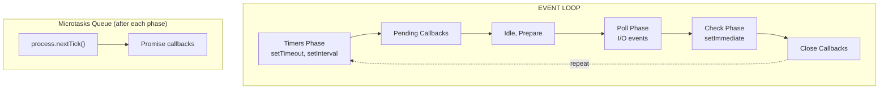

# Node.js Backend

## 18. Event Loop

### 18.1. Overview

Node.js is built on an **event-driven, non-blocking I/O model** that makes it lightweight and efficient. Despite running on a **single thread**, Node.js can handle thousands of concurrent connections through its event loop.

### 18.2. Why Single-Threaded?

| Model | Pros | Cons |
|---|---|---|
| **Single-threaded (Node.js)** | No context switching overhead, simple memory model for CPU cores | Cannot utilize multiple cores for CPU-intensive tasks |
| **Multi-threaded (Java, Go)** | Full multi-core utilization | Complexity, race conditions, memory overhead |

> **Key insight:** The single thread handles **I/O operations asynchronously**, not CPU-intensive computation. For CPU-bound work, use **Worker Threads**.

### 18.3. The Event Loop Phases

The event loop processes callbacks in a specific order across multiple phases:



| Phase | Handles | Key APIs |
|---|---|---|
| **Timers** | `setTimeout()`, `setInterval()` callbacks | Earliest execution |
| **Pending Callbacks** | I/O callbacks deferred from previous loop | System errors |
| **Idle, Prepare** | Internal use by Node.js | — |
| **Poll** | Retrieve new I/O events, execute callbacks for I/O | `fs.readFile()`, `http.get()` |
| **Check** | `setImmediate()` callbacks | Runs after Poll |
| **Close Callbacks** | `socket.on('close', ...)` | Resource cleanup |

### 18.4. Phase Details

#### 18.4.1. Timers Phase

```javascript
// Timers phase executes after the specified delay
setTimeout(() => console.log('timeout'), 100);  // Executes in timers phase
setImmediate(() => console.log('immediate'));  // Executes in check phase

// Output order depends on I/O context:
// If inside I/O cycle: setImmediate often runs first
// If after I/O cycle: setTimeout runs first
```

#### 18.4.2. Poll Phase

- If the poll queue is **not empty**: Node executes callbacks synchronously until queue is empty or system limit
- If the poll queue is **empty**: Event loop either waits for a timer or moves to Check phase

```javascript
// These execute in poll phase
fs.readFile('data.txt', (err, data) => {
  console.log('File read complete');
});

http.get(url, (res) => {
  console.log('HTTP response received');
});
```

#### 18.4.3. Check Phase

```javascript
// setImmediate always runs in the check phase
// This is faster than setTimeout(fn, 0) which goes to timers phase
setImmediate(() => {
  console.log('Immediate callback');
});
```

### 18.5. Microtasks vs. Macrotasks

Microtasks have **higher priority** than macrotasks. After each phase, the entire microtask queue is drained before the next phase.

| Priority | Type | Examples |
|---|---|---|
| **Highest** | `process.nextTick()` | — |
| **High** | Microtasks | Promise callbacks (`.then`, `.catch`) |
| **Normal** | Macrotasks | `setTimeout`, `setInterval`, `setImmediate`, I/O callbacks |

```javascript
console.log('start');

setTimeout(() => console.log('setTimeout'), 0);      // Macrotask
setImmediate(() => console.log('setImmediate'));       // Macrotask (check phase)
Promise.resolve().then(() => console.log('Promise'));   // Microtask
process.nextTick(() => console.log('nextTick'));       // Microtask (highest priority)

console.log('end');

// Output order:
// 1. start
// 2. end
// 3. nextTick       (microtask - process.nextTick)
// 4. Promise        (microtask - promise)
// 5. setTimeout     (macrotask - timers phase)
// 6. setImmediate   (macrotask - check phase)
```

### 18.6. Common Pitfalls

#### 18.6.1. Blocking the Event Loop

```javascript
// BAD: CPU-intensive task blocks the event loop
function heavyCalculation(n) {
  let result = 0;
  for (let i = 0; i < n; i++) {
    result += Math.sqrt(i);
  }
  return result;
}

// This will block ALL concurrent requests
app.get('/calculate', (req, res) => {
  const result = heavyCalculation(10_000_000_000); // Blocks for seconds
  res.json({ result });
});

// GOOD: Use Worker Threads for CPU-bound work
const { Worker } = require('worker_threads');

function runWorker(workerData) {
  return new Promise((resolve, reject) => {
    const worker = new Worker('./worker.js', { workerData });
    worker.on('message', resolve);
    worker.on('error', reject);
    worker.on('exit', (code) => {
      if (code !== 0) reject(new Error(`Worker stopped with code ${code}`));
    });
  });
}

app.get('/calculate', async (req, res) => {
  const result = await runWorker({ value: 10_000_000_000 });
  res.json({ result });
});
```

#### 18.6.2. Memory Leaks

```javascript
// BAD: Event listeners accumulate
const users = {};

function handleUserRequest(userId) {
  const socket = createSocket();
  socket.on('data', () => { /* handle */ });
  users[userId] = socket;
  // Sockets never removed from `users` object!
}

// GOOD: Clean up properly
const users = new Map();

function handleUserRequest(userId) {
  const socket = createSocket();

  socket.on('data', () => { /* handle */ });
  socket.on('close', () => {
    users.delete(userId);  // Clean up on close
  });

  users.set(userId, socket);
}

// Also: clear unused timers
const timer = setInterval(() => { /* ... */ }, 1000);
app.on('shutdown', () => clearInterval(timer));
```

#### 18.6.3. Callback Pyramid (Callback Hell)

```javascript
// BAD: Nested callbacks
fs.readFile('a.txt', (err, dataA) => {
  fs.readFile('b.txt', (err, dataB) => {
    fs.readFile('c.txt', (err, dataC) => {
      console.log(dataA, dataB, dataC);
    });
  });
});

// GOOD: Use async/await
async function readAllFiles() {
  const [dataA, dataB, dataC] = await Promise.all([
    fs.promises.readFile('a.txt'),
    fs.promises.readFile('b.txt'),
    fs.promises.readFile('c.txt'),
  ]);
  console.log(dataA, dataB, dataC);
}
```

### 18.7. Node.js Cluster Module

Since Node.js is single-threaded, use the **cluster module** to utilize all CPU cores:

```javascript
const cluster = require('cluster');
const os = require('os');

const numCPUs = os.cpus().length;

if (cluster.isMaster) {
  console.log(`Master ${process.pid} is running`);
  console.log(`Forking for ${numCPUs} CPUs`);

  for (let i = 0; i < numCPUs; i++) {
    cluster.fork();
  }

  cluster.on('exit', (worker, code, signal) => {
    console.log(`Worker ${worker.process.pid} died`);
    cluster.fork();  // Auto-restart
  });
} else {
  // Workers share the same server port
  const app = express();
  app.listen(3000, () => {
    console.log(`Worker ${process.pid} started`);
  });
}
```

> **Tip:** The event loop is what makes Node.js powerful. Understanding which phase a callback runs in, how microtasks interact with macrotasks, and when to use Worker Threads are critical skills for any Node.js backend developer.
