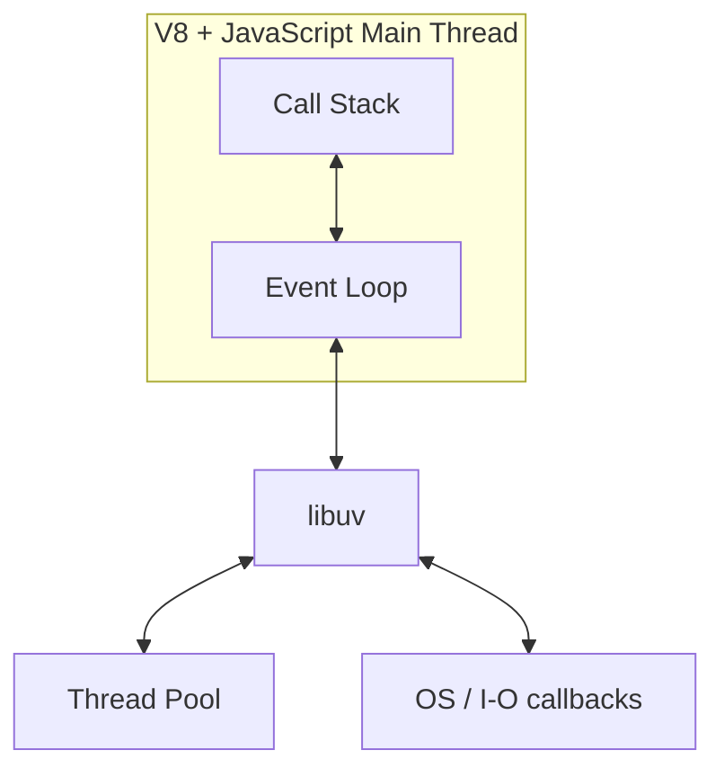
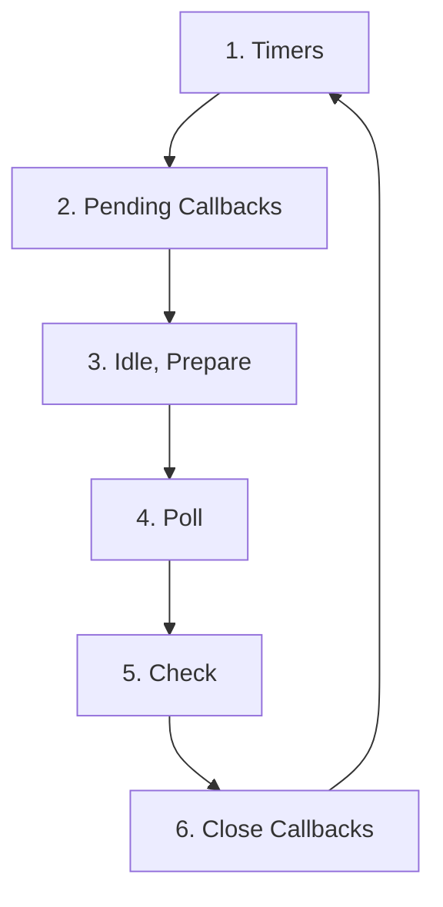

# Node.js Backend

## 1. Overview

### 1.1. What is Node.js?

Node.js is a server-side JavaScript runtime built on the V8 engine. Its core strength is not raw CPU performance, but efficient handling of many concurrent I/O operations through a non-blocking, event-driven model.

### 1.2. Single-threaded Event Loop

Node.js executes JavaScript on a single main thread. That does not mean it can only do one thing overall. It means JavaScript callbacks run on one thread, while I/O work is coordinated through the event loop, OS facilities, and `libuv`.

The practical consequence is simple: one CPU-heavy callback can delay every other request handled by that process.

That is why Node.js performance conversations are usually about protecting the main thread from unnecessary work.

When developers say "Node is slow", they often really mean "the event loop was blocked".

That distinction matters because the fix is usually architectural, not just micro-optimization.



### 1.3. Non-blocking I/O

```javascript
const fs = require('fs');

// Blocking
const text = fs.readFileSync('./data.txt', 'utf8');
console.log(text);

// Non-blocking
fs.readFile('./data.txt', 'utf8', (err, value) => {
  if (err) throw err;
  console.log(value);
});

console.log('This line runs before the callback');
```

In backend systems, non-blocking I/O matters because requests often spend much more time waiting for:

- databases
- caches
- message brokers
- network calls
- file storage

That is why Node.js is strongest in I/O-heavy services rather than CPU-heavy request paths.

Examples of strong fits:

- API gateways
- BFF layers
- websocket servers
- proxy services
- streaming integrations

Those are all systems where waiting dominates actual CPU computation.

Node is strongest when it can spend most of its time coordinating rather than calculating.

---

## 2. Event Loop Phases



### 2.1. Phase 1: Timers

This phase runs callbacks scheduled by `setTimeout()` and `setInterval()` once their delay has expired.

```javascript
setTimeout(() => {
  console.log('timeout callback');
}, 100);
```

Important nuance: `setTimeout(fn, 0)` does not mean "run immediately". It means "run when the timers phase can pick it up on a later loop iteration".

Timer execution is therefore approximate, not guaranteed to happen exactly at the requested millisecond boundary.

Under load, a "1 ms timer" may run much later if the loop is busy.

That is normal behavior, not a timer bug.

Timers express intent, not guaranteed exact scheduling.

When interviewers ask about timers, they are often testing whether you understand "minimum delay" rather than "exact execution time".

### 2.2. Phase 2: Pending Callbacks

This phase handles some deferred system-level I/O callbacks from the previous loop iteration. Most application developers do not interact with it directly, but it is part of why callback ordering can surprise people.

It is one of those phases you rarely target explicitly, but you still feel its consequences when timing behavior looks unintuitive.

Knowing that helps prevent overconfident assumptions about callback order.

Many flaky tests come from those assumptions rather than from broken application logic.

That is why timing-sensitive tests should usually assert eventual behavior rather than brittle callback ordering unless ordering is the thing being tested explicitly.

Otherwise the test suite ends up validating the scheduler more than the application.

### 2.3. Phase 3: Idle, Prepare

This phase is mostly internal to Node.js and `libuv`. You normally do not write user-space callbacks specifically for it.

For interview purposes, it is enough to know it exists and is not where normal application callbacks live.

You do not need to memorize internal details to reason well about application behavior.

You do need to know which phases are user-visible and which are mostly runtime internals.

### 2.4. Phase 4: Poll

The poll phase is where Node waits for I/O and runs many I/O-related callbacks.

```javascript
const fs = require('fs');

fs.readFile('./data.txt', 'utf8', (err, data) => {
  console.log('file read finished');
});
```

Poll phase behavior depends on whether there are pending callbacks, whether timers are ready, and whether `setImmediate()` callbacks are waiting in the check phase.

In everyday backend code, this is the phase you feel through socket events, file completion callbacks, and driver-level I/O work.

Because of that, understanding poll behavior helps explain why I/O-heavy applications can remain responsive even with many open connections.

The runtime is mostly coordinating waiting and completion, not executing many JavaScript threads in parallel.

That is the key mental shift when coming from multi-threaded server platforms.

It also explains why a well-behaved Node process can support many open connections with modest hardware, as long as each callback stays cheap.

### 2.5. Phase 5: Check

This phase runs callbacks queued by `setImmediate()`.

```javascript
setImmediate(() => {
  console.log('check phase callback');
});
```

`setImmediate()` is especially useful when you want to defer work until after I/O callbacks in the current loop.

It is often the better choice when the intent is "after current I/O, but without waiting for another timer cycle".

That is why `setImmediate()` shows up in some libraries that want to yield without introducing timer semantics.

It is often a scheduling choice rather than a performance trick.

Used well, it can improve responsiveness. Used blindly, it just adds complexity.

In practice, `setImmediate()` is more about fairness and yielding than about speed.

It is often chosen to break up large units of work so other callbacks get a chance to run.

### 2.6. Phase 6: Close Callbacks

This phase runs close-related callbacks, such as socket shutdown handlers.

```javascript
socket.on('close', () => {
  console.log('socket closed');
});
```

---

## 3. `setImmediate()` vs `setTimeout()`

### 3.1. Difference

| API | Queue/Phase | Typical use |
|---|---|---|
| `setTimeout(fn, 0)` | Timers phase | Defer execution to a later loop iteration |
| `setImmediate(fn)` | Check phase | Run after current poll phase work |

### 3.2. Execution order

```javascript
const fs = require('fs');

fs.readFile(__filename, () => {
  setTimeout(() => console.log('timeout'), 0);
  setImmediate(() => console.log('immediate'));
});
```

Inside an I/O callback, `setImmediate()` usually runs before `setTimeout(..., 0)` because the loop moves from poll to check before the next timers cycle.

Outside I/O, ordering may not be deterministic enough to rely on casually.

That is why code should rarely depend on this distinction unless the scheduling choice is deliberate and documented.

---

## 4. `process.nextTick()`

### 4.1. `nextTick` queue

`process.nextTick()` is not a normal event loop phase. It has a special queue that runs after the current operation but before the loop continues.

```javascript
console.log('start');

process.nextTick(() => console.log('nextTick'));

console.log('end');
```

Output:

```text
start
end
nextTick
```

### 4.2. `nextTick` vs `setImmediate`

`process.nextTick()` has higher priority than `setImmediate()`.

```javascript
setImmediate(() => console.log('immediate'));
process.nextTick(() => console.log('nextTick'));
Promise.resolve().then(() => console.log('promise'));
```

Typical order:

```text
nextTick
promise
immediate
```

### 4.3. Danger of recursive `nextTick`

Recursive `process.nextTick()` usage can starve the event loop.

```javascript
function loop() {
  process.nextTick(loop);
}

loop();
```

This prevents Node from reaching I/O phases, which can make the process appear alive but unresponsive.

The broader lesson is event loop starvation: if microtasks or `nextTick` callbacks keep refilling themselves, real I/O progress can stall.

This kind of starvation bug is subtle because the process is still "running", but the useful work you care about is not advancing.

That can make these bugs harder to notice than a hard crash.

The service keeps running, but the useful throughput collapses.

From an operational perspective, starvation bugs are nasty because health checks may still pass while real request latency becomes terrible.

That mismatch between "process alive" and "service usable" is why runtime metrics matter so much in Node.js.

---

## 5. Microtasks vs Macrotasks

### 5.1. Difference

Microtasks are drained before the loop continues to the next phase. Macrotasks belong to the regular event loop phases.

This explains many surprising ordering results in interview questions and production bug reports.

It also explains why developers sometimes think Promises are "faster" than timers when the real difference is queue priority.

Order and latency are related, but they are not the same thing.

Knowing which queue wins does not automatically tell you whether the system is healthy.

It only tells you which work gets to be unhealthy first.

### 5.2. Priority order

Practical priority is roughly:

1. current synchronous code
2. `process.nextTick()`
3. promise microtasks
4. timers / I/O / check callbacks

It is a simplified model, but it is accurate enough for most backend reasoning.

If you can explain this order clearly, you already understand more about Node scheduling than many everyday users of the runtime.

That understanding is especially useful in debugging tests with timing-sensitive behavior.

It also helps when reading library code that mixes Promises, timers, and callback APIs.

### 5.3. Promise microtasks

```javascript
console.log('A');

Promise.resolve().then(() => console.log('B'));
setTimeout(() => console.log('C'), 0);

console.log('D');
```

Output:

```text
A
D
B
C
```

---

## 6. `libuv`

### 6.1. What is `libuv`?

`libuv` is the C library underneath Node.js that provides the event loop, async I/O abstraction, timers, and thread pool behavior across platforms.

Without understanding `libuv`, people often assume Node magically makes everything asynchronous. It does not. It uses concrete runtime machinery to coordinate:

- sockets
- filesystem work
- timers
- DNS
- background thread pool jobs

### 6.2. Thread pool

Some operations use `libuv`'s thread pool rather than pure OS event notification. Examples include:

- some filesystem operations
- `crypto.pbkdf2`
- `zlib`
- parts of DNS resolution

```javascript
const crypto = require('crypto');

crypto.pbkdf2('secret', 'salt', 100000, 64, 'sha512', () => {
  console.log('hash complete');
});
```

Thread pool size can become a bottleneck under load if many expensive background tasks accumulate.

This is one reason a Node.js service can behave poorly even when the request handlers themselves look fully asynchronous.

The runtime is still doing real work somewhere, and that "somewhere" can become saturated.

Async style does not eliminate resource limits. It just changes where those limits appear.

The system can still bottleneck on thread pool work, downstream saturation, memory, or CPU spikes.

This is why tuning `UV_THREADPOOL_SIZE` can help some workloads, but only when thread-pool saturation is the actual bottleneck.

Blind tuning without measurement just moves complexity around.

If the real problem is synchronous JavaScript on the main thread, a larger thread pool does nothing.

---

## 7. Common pitfalls

### 7.1. Blocking the Event Loop

```javascript
app.get('/report', (req, res) => {
  const startedAt = Date.now();
  while (Date.now() - startedAt < 5000) {}
  res.json({ ok: true });
});
```

This blocks all requests handled by that process during the loop. CPU-heavy work should move to:

- worker threads
- background jobs
- dedicated services

Common accidental blockers include huge JSON operations, expensive regex processing, and large in-memory transforms.

Other frequent offenders include compression, encryption, image manipulation, and report generation directly inside request handlers.

Those tasks are often better handled by worker threads or separate async processing systems.

Request handlers should prefer orchestration over computation.

If a route must do significant CPU work, worker threads or off-process jobs are usually a better design than hoping the event loop can absorb it.

### 7.2. Memory leaks

Frequent Node.js leak sources:

- listeners never removed
- large Maps used as caches without eviction
- intervals never cleared
- long-lived closures keeping request data alive

These leaks are especially painful in long-lived backend processes because they show up gradually through rising memory usage and worse GC pauses.

That gradual degradation is why memory leaks are often mistaken for random instability at first.

Long-running services can degrade slowly enough that the connection to a leak is not obvious without metrics.

That is why memory dashboards and heap tooling matter even for "just API" services.

Leaks in caches and listeners are especially common because they often look like harmless convenience code at first.

The earlier a service gets memory visibility in dashboards, the easier these issues are to catch before they become incidents.

### 7.3. Callback hell

Deeply nested callback pyramids make error handling and reasoning difficult. Prefer:

- `async` / `await`
- `Promise.all`
- isolated service functions

### 7.4. Not handling errors

Unhandled promise rejections and silent callback errors can destabilize production services. Centralize error handling and ensure asynchronous failures are surfaced.

Process-level fatal paths should also be treated deliberately so the service can log, flush telemetry, and exit predictably when needed.

Blindly swallowing fatal errors is usually worse than crashing cleanly, because the process may stay alive in a corrupted state.

A predictable crash with good telemetry is often healthier than undefined runtime state.

Reliability often depends more on failure behavior than on avoiding every possible failure.

Good Node services make failure paths as intentional as success paths.

### 7.5. Missing error handler for `EventEmitter`

```javascript
const EventEmitter = require('events');
const emitter = new EventEmitter();

emitter.on('error', (err) => {
  console.error('Emitter error', err);
});
```

For many emitters, an `'error'` event without a listener can crash the process.

This is an important runtime behavior difference from plain function-based async APIs.

If you work with streams, sockets, or custom emitters, this rule should become automatic.

Error channels that are easy to forget are exactly the ones teams need to standardize.

---

## 8. Event Loop in practice

### 8.1. Event Loop with Express

Each HTTP request handler still runs on the same main JavaScript thread. So "async Express" does not mean CPU work is parallel. It means requests can yield while waiting on I/O.

```javascript
app.get('/users', async (req, res) => {
  const users = await db.query('select * from users');
  res.json(users.rows);
});
```

That works well because the request mostly waits on the database.

If the same route starts doing synchronous report generation or CPU-heavy parsing, the concurrency advantage quickly disappears.

That is why Node.js architecture often pairs HTTP handling with queues, workers, or separate compute services.

The event loop works best when it orchestrates rather than computes.

Node is often at its best as a coordination layer.

That is one reason it remains popular for API composition, realtime gateways, and edge-style backend services.

Those workloads reward high connection concurrency and relatively small per-request CPU cost.

### 8.2. Event Loop with Streams

Streams help Node process large payloads incrementally instead of loading everything into memory at once.

```javascript
const fs = require('fs');

fs.createReadStream('./large-file.log')
  .on('data', (chunk) => {
    console.log('received chunk', chunk.length);
  });
```

Streams are one of the strongest examples of Node-style I/O efficiency.

They also provide backpressure, which is critical when moving large payloads without exhausting memory.

Backpressure is one of the most important "Node-native" ideas because it lets producers and consumers coordinate pace naturally.

Ignoring backpressure often turns a streaming design back into a memory problem.

Backpressure-aware code is one of the clearest signs that a Node service is engineered for production rather than demos.

Streams are not just a performance trick. They are a flow-control strategy.

### 8.3. Scheduling patterns

Useful scheduling patterns in real systems:

- break long work into chunks
- offload CPU-heavy jobs
- limit concurrency for downstream systems
- prefer backpressure-aware pipelines over giant in-memory buffers

A strong production design usually combines async I/O with explicit concurrency control.

Unlimited concurrency is not a sign of scalability. It is often just a fast path to overwhelming downstream systems.

Well-behaved systems usually combine asynchronous code with bounded concurrency.

Fast code that melts the database is not scalable code.

Libraries like `p-limit`, queue-based workers, and pool-based clients exist because unconstrained async fan-out is one of the easiest ways to build an unstable Node service.

Async code without concurrency control is often just a more elegant way to overload something.

---

## 9. Performance considerations

### 9.1. Event Loop latency

Event loop latency measures how delayed the loop becomes before it can process more work. High latency usually indicates:

- blocking synchronous code
- heavy JSON serialization
- expensive regex or parsing
- too much CPU per request

Event loop latency is one of the most useful Node-specific health indicators because throughput alone can hide severe latency spikes.

A service can still serve many requests per second while delivering terrible tail latency because the loop is intermittently blocked.

That is why tail latency and loop health need to be watched together.

One tells you how the runtime is behaving, the other tells you how users experience it.

If event loop lag is low but latency is high, the bottleneck is often downstream.

If event loop lag is high, the bottleneck is often in-process work.

That simple split is often enough to guide the first round of production triage.

It gives teams a useful first hypothesis before they dive into deeper profiling.

That alone saves time in real incidents.

### 9.2. Best practices

- Avoid synchronous APIs in request paths.
- Keep handlers small.
- Use caching carefully.
- Stream large responses when possible.
- Measure event loop lag in production.
- Profile before guessing at bottlenecks.
- Be deliberate about downstream concurrency limits.
- Keep CPU-heavy serialization and transformation out of hot paths.

Performance work in Node is often less about "making JavaScript faster" and more about doing less work on the main thread.

It is usually a work-placement problem before it is a syntax problem.

That is why architectural fixes usually beat clever code-golf optimizations.

### 9.3. Graceful shutdown

Node services should stop accepting new work, finish in-flight requests, close connections, and flush observability pipelines before exiting.

```javascript
process.on('SIGTERM', async () => {
  await server.close();
  process.exit(0);
});
```

Real shutdown logic often also closes database clients, stops queue consumers, and marks the instance unready before the process exits.

Graceful shutdown is not just politeness. It prevents dropped work, half-processed requests, and noisy restarts under orchestrators.

In containerized environments, bad shutdown behavior quickly becomes a reliability issue.

It is common to discover shutdown bugs only during deploys or incidents, which is already too late.

The safest teams test shutdown behavior intentionally instead of assuming the process lifecycle will be kind to them.

---

## 10. Node.js versions and event loop changes

### 10.1. Key versions

Different Node.js versions have changed details around:

- timer behavior
- promise handling
- unhandled rejection defaults
- monitoring APIs

For production systems, always verify behavior against the actual major version you run.

### 10.2. Checking event loop health

Modern Node.js offers runtime-level tools such as:

- `perf_hooks`
- `eventLoopUtilization`
- heap snapshots
- CPU profiles

Many teams pair those tools with dashboards for event loop lag, heap usage, GC activity, and request latency.

That combination gives a much better picture than looking at CPU percentage alone.

CPU can look normal while the actual request experience is still poor.

That is why one-dimensional monitoring almost always misses important runtime problems.

These are more useful than guessing based on throughput alone.

Production Node monitoring is strongest when it combines:

- request latency
- event loop lag
- heap and GC metrics
- thread pool saturation signals
- downstream dependency timing

---

## 11. Summary - Event Loop Flow

The core mental model is:

1. JavaScript runs on one main thread.
2. Async APIs register work with Node.js and the OS/runtime.
3. Completed work returns as callbacks, promises, or stream events.
4. The event loop processes that work in a defined order.
5. Microtasks can run before the loop advances.
6. Blocking CPU work delays everything else.

If you understand that model, most Node.js backend behavior becomes much easier to reason about under load.

And once you can reason about it under load, you can usually explain most real Node.js production incidents much faster.

That is why event loop understanding is one of the most transferable Node.js backend skills.

It improves debugging, architecture, performance tuning, and interview clarity at the same time.

## 12. Common interview questions

### 12.1. Is Node.js really single-threaded?

JavaScript execution is single-threaded from the application's point of view, but Node.js still uses libuv, the OS, and worker threads or thread pools behind the scenes.

### 12.2. What is the difference between `process.nextTick()` and `setImmediate()`?

`process.nextTick()` runs before the event loop continues to the next phase. `setImmediate()` runs in the check phase, after the poll phase.

### 12.3. Why does CPU-bound work hurt Node.js so much?

Because long CPU tasks block the main JavaScript thread, which delays timers, I/O callbacks, request handling, and promise resolution.
