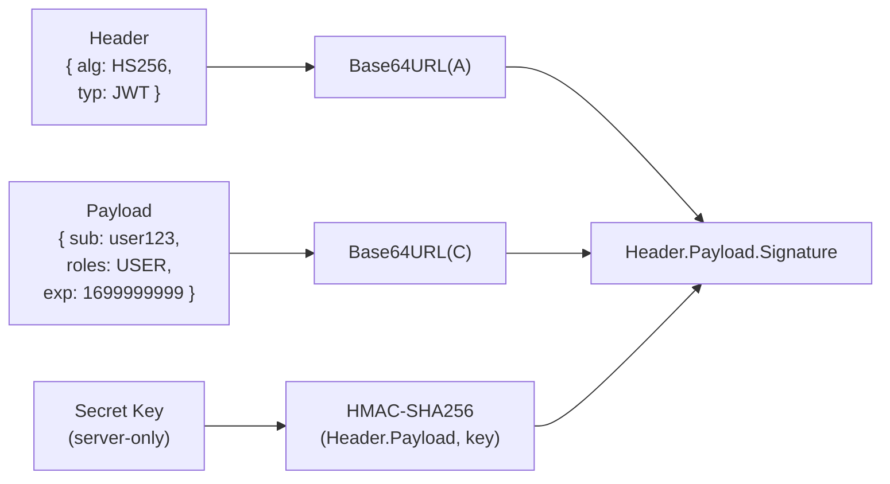
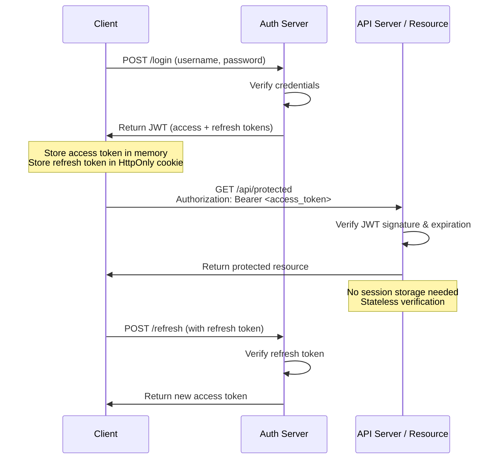
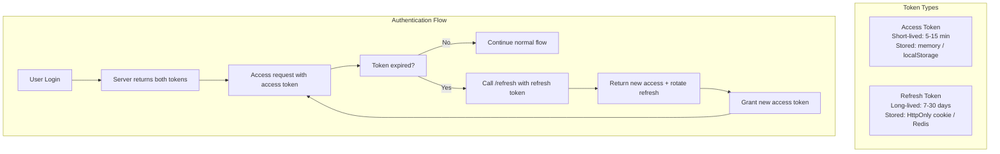
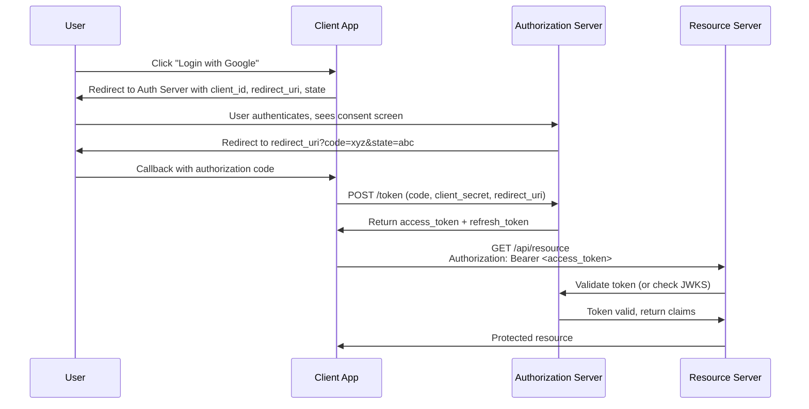
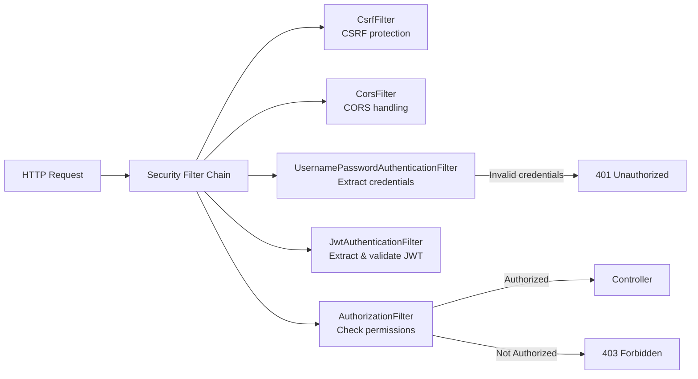
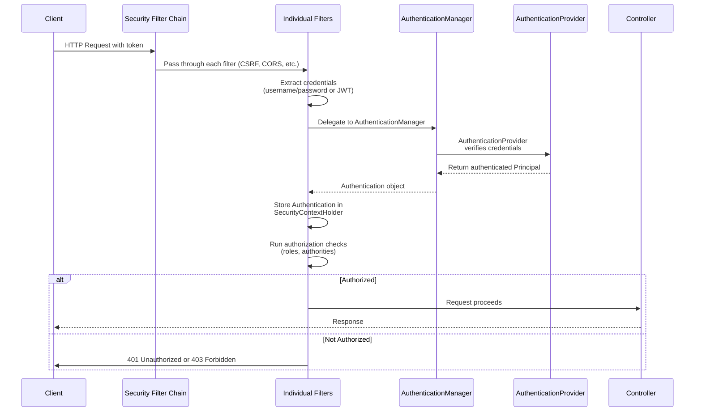
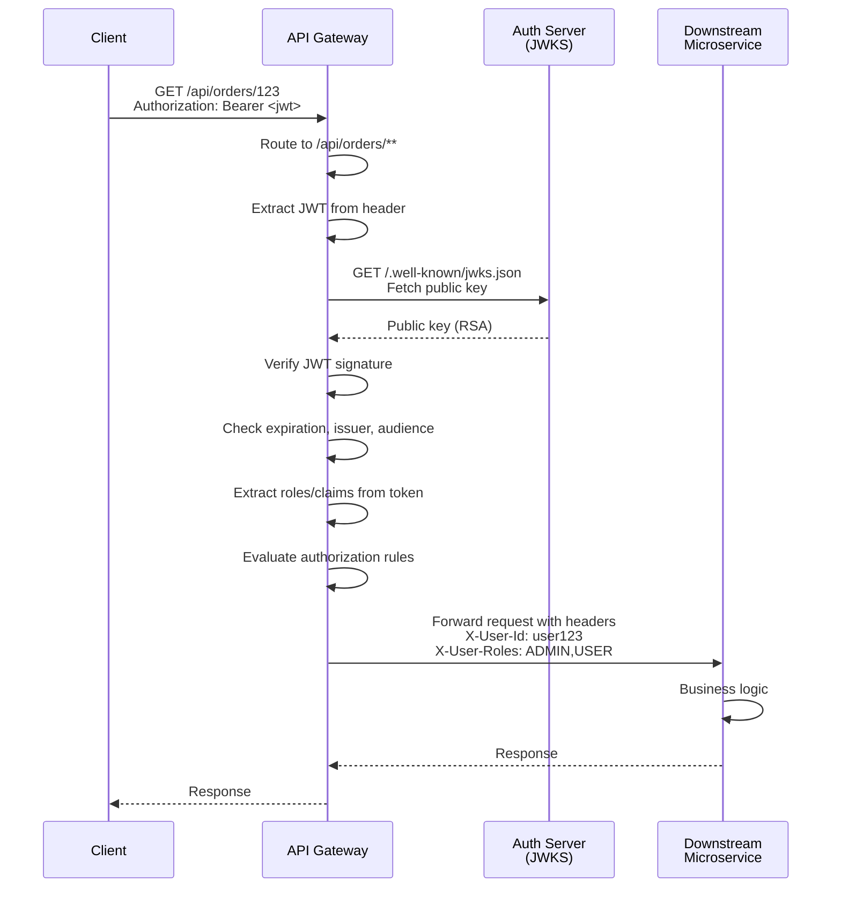

# Spring Security 6

## 1. Authentication vs Authorization

These two concepts are often confused but serve fundamentally different purposes.

| Concept | Question | Answer |
|---------|---------|--------|
| **Authentication** | Who are you? | Identity verification (login) |
| **Authorization** | What can you do? | Permission control (access control) |

A common analogy: authentication is showing your ID at the door (proving who you are), while authorization is the ticket that tells you which areas you can access. You must be authenticated before you can be authorized.

---

## 2. Configuration (Spring Security 6)

**Key change from Security 5:** Spring Security 6 removed `WebSecurityConfigurerAdapter`. Instead, you define one or more `SecurityFilterChain` beans.

```java
@Configuration
@EnableWebSecurity
@EnableMethodSecurity
public class SecurityConfig {

    @Bean
    public SecurityFilterChain securityFilterChain(HttpSecurity http) throws Exception {
        http
            .csrf(csrf -> csrf.disable())  // Disable for stateless JWT APIs
            .cors(Customizer.withDefaults())
            .authorizeHttpRequests(auth -> auth
                .requestMatchers("/api/public/**").permitAll()
                .requestMatchers("/api/admin/**").hasRole("ADMIN")
                .anyRequest().authenticated()
            )
            .sessionManagement(session -> session
                .sessionCreationPolicy(STATELESS)
            )
            .httpBasic(Customizer.withDefaults())
            .addFilterBefore(jwtFilter, UsernamePasswordAuthenticationFilter.class);

        return http.build();
    }
}
```

### 2.1. Multiple Security Filter Chains

Spring Security supports multiple `SecurityFilterChain` beans with different `RequestMatcher` patterns. The first matching chain handles the request. This is useful for separating public and API paths:

```java
@Bean
@Order(1)
public SecurityFilterChain actuatorSecurityFilterChain(HttpSecurity http) throws Exception {
    http
        .securityMatcher("/actuator/**")
        .authorizeHttpRequests(auth -> auth.anyRequest().hasRole("ADMIN"))
        .httpBasic(Customizer.withDefaults());
    return http.build();
}

@Bean
@Order(2)
public SecurityFilterChain apiSecurityFilterChain(HttpSecurity http) throws Exception {
    http
        .securityMatcher("/api/**")
        .csrf(csrf -> csrf.disable())
        .authorizeHttpRequests(auth -> auth.anyRequest().authenticated())
        .addFilterBefore(jwtFilter, AuthorizationFilter.class);
    return http.build();
}
```

---

## 3. UserDetails & UserDetailsService

`UserDetails` is Spring Security's core interface for representing user information. It is the contract between your user data model and Spring Security's authentication system.

```java
// Entity implements UserDetails
@Entity
@Table(name = "users")
public class User implements UserDetails {
    @Id private Long id;
    private String username;
    private String password;
    private String role; // ROLE_USER, ROLE_ADMIN

    @Override
    public Collection<? extends GrantedAuthority> getAuthorities() {
        return List.of(new SimpleGrantedAuthority(role));
    }

    @Override public boolean isAccountNonExpired() { return true; }
    @Override public boolean isAccountNonLocked() { return true; }
    @Override public boolean isCredentialsNonExpired() { return true; }
    @Override public boolean isEnabled() { return true; }
}

// Service implements UserDetailsService
@Service
public class CustomUserDetailsService implements UserDetailsService {
    @Autowired private UserRepository userRepository;

    @Override
    public UserDetails loadUserByUsername(String username) throws UsernameNotFoundException {
        return userRepository.findByUsername(username)
            .orElseThrow(() -> new UsernameNotFoundException("User not found"));
    }
}
```

**Important:** The methods like `isAccountNonExpired`, `isAccountNonLocked`, etc., return `true` in most cases. They exist to support account management features like locking an account after too many failed login attempts.

---

## 4. Password Encoding

**Never store plain text passwords.** If your database is compromised, plain text passwords give attackers immediate access to all user accounts (and most users reuse passwords across sites).

### 4.1. BCrypt (Recommended)

BCrypt is the default encoder in Spring Security. It uses the Blowfish cipher with a cost factor, making it intentionally slow (adaptive cost). As hardware gets faster, you can increase the cost factor without breaking existing hashes.

```java
@Bean
public PasswordEncoder passwordEncoder() {
    return new BCryptPasswordEncoder();
}

// Usage in registration
public void register(User user) {
    user.setPassword(passwordEncoder.encode(user.getPassword()));
    userRepository.save(user);
}

// Usage in login (compare raw input with stored hash)
public boolean checkPassword(String rawPassword, String encodedPassword) {
    return passwordEncoder.matches(rawPassword, encodedPassword);
}
```

### 4.2. Other Encoders

| Encoder | Use Case |
|---------|----------|
| **BCryptPasswordEncoder** | General purpose — **recommended** |
| **Argon2PasswordEncoder** | Best security, but slower setup (Java 9+) |
| **SCryptPasswordEncoder** | Alternative to BCrypt |
| **NoOpPasswordEncoder** | Testing only — never use in production |
| **DelegatingPasswordEncoder** | Supports multiple encoder types (for migration) |

```java
// DelegatingPasswordEncoder example for migrating between encoders
@Bean
public PasswordEncoder passwordEncoder() {
    Map<String, PasswordEncoder> encoders = Map.of(
        "bcrypt", new BCryptPasswordEncoder(),
        "noop", NoOpPasswordEncoder.getInstance()
    );
    return new DelegatingPasswordEncoder("bcrypt", encoders);
}
// Stored format: {bcrypt}xxxxx or {noop}plaintext
```

---

## 5. JWT (JSON Web Token)

JWT is a compact, self-contained token format for securely transmitting information between parties as a JSON object. It has become the de facto standard for stateless authentication in modern REST APIs.

### 5.1. Structure

A JWT consists of three parts separated by dots (`.`):

```
Header.Payload.Signature
```

Each part is Base64URL-encoded.



### 5.2. Header

The header contains metadata about the token:

```json
{
  "alg": "HS256",
  "typ": "JWT"
}
```

| Field | Description |
|-------|-------------|
| **alg** | The algorithm used for signing. `HS256` (HMAC with SHA-256) uses a shared secret key. `RS256` (RSA with SHA-256) uses a public/private key pair. |
| **typ** | Token type — always `JWT` by convention. |

**HS256 vs RS256:**
- **HS256** (symmetric): Same secret key is used for signing and verification. Faster, simpler. The secret must be protected because anyone with it can forge tokens. Suitable for a single service.
- **RS256** (asymmetric): Private key signs, public key verifies. The public key can be safely shared (e.g., in a JWKS endpoint). Suitable for microservices and cross-service authentication.

### 5.3. Payload

The payload contains the **claims** — statements about the user and the token:

```json
{
  "sub": "user123",
  "iat": 1699900000,
  "exp": 1699903600,
  "iss": "https://api.example.com",
  "aud": "https://app.example.com",
  "roles": ["USER", "ADMIN"]
}
```

| Claim | Name | Description |
|-------|------|-------------|
| `sub` | Subject | Usually the user ID or username. The primary identifier. |
| `iss` | Issuer | Who issued the token (your server URL). Used to validate token origin. |
| `aud` | Audience | Who the token is intended for. Used when multiple services share tokens. |
| `iat` | Issued At | Unix timestamp when the token was created. |
| `exp` | Expiration | Unix timestamp when the token expires. **Critical for security.** |
| `nbf` | Not Before | Token is not valid before this time. |
| `jti` | JWT ID | Unique identifier for this token. Useful for revocation/blacklisting. |

**Critical security note:** The payload is **Base64URL-encoded, NOT encrypted**. Anyone can decode it to read the contents. You should **never store sensitive information** (passwords, credit card numbers, personal data) in the JWT payload. If you need to hide data, encrypt it separately (e.g., using JWE — JSON Web Encryption).

### 5.4. Signature

The signature is computed as:

```
HMAC-SHA256(Base64URL(header) + "." + Base64URL(payload), secret_key)
```

This proves:
1. The token was created by someone who possesses the secret key.
2. The payload was not tampered with during transmission.

**Anyone can decode the header and payload (they are just Base64URL-encoded, not encrypted).** But without the secret key (or private key for RS256), no one can forge a valid signature.

### 5.5. JWT Flow with Stateless Authentication



In a stateless JWT architecture:
- **The server does NOT store sessions.** Every request is self-authenticating.
- The server only needs to verify the signature and check expiration.
- This scales horizontally easily — any server can verify any token without a shared session store.

### 5.6. Disadvantages of JWT

Understanding JWT's drawbacks is just as important as knowing its benefits:

1. **No immediate revocation.** Once issued, a JWT is valid until it expires. You cannot "logout" a token server-side (unless you use a blacklist — but that defeats the stateless purpose).
2. **Token size.** JWTs are larger than session IDs. Every request includes the token in the header, adding overhead.
3. **Payload is readable.** Sensitive data in the payload is visible to anyone who decodes it.
4. **Clock skew.** If server clocks are not synchronized, token expiration checks can behave unexpectedly.
5. **Token management complexity.** With refresh tokens, token rotation, and blacklists, the client and server logic becomes more complex than simple sessions.

**When NOT to use JWT:**
- When you need immediate logout functionality (e.g., banking apps).
- When token size is a concern (very high-frequency API calls).
- When simple session management is sufficient.

### 5.7. Access Token + Refresh Token System

Using only one token with a long expiration is dangerous — if leaked, an attacker has long-term access. Using only a short-lived token is inconvenient — users must re-login frequently. The solution is **dual-token architecture**.



**Access Token:**
- Short lifetime (5-15 minutes)
- Stored in JavaScript memory (preferred) or localStorage
- Contains user identity and roles
- Used for every API call
- If leaked, limited exploitation window due to short lifetime

**Refresh Token:**
- Long lifetime (7-30 days, depending on security requirements)
- Used only to obtain new access tokens
- Must be stored securely:
  - **HttpOnly cookie:** Protected from XSS, sent automatically
  - **Redis:** Server-side storage, enables immediate revocation
- Should be **rotated** on each use (new refresh token issued with new access token)

```java
// Refresh token service
@Service
public class RefreshTokenService {

    @Autowired private RefreshTokenRepository refreshTokenRepository;

    public RefreshToken createRefreshToken(User user, String deviceId) {
        // One refresh token per device (multi-device support)
        refreshTokenRepository.deleteByUserAndDeviceId(user, deviceId);

        RefreshToken token = RefreshToken.builder()
            .user(user)
            .deviceId(deviceId)  // Track which device
            .token(UUID.randomUUID().toString())  // Opaque token, not JWT
            .expiryDate(Instant.now().plus(Duration.ofDays(30)))
            .build();
        return refreshTokenRepository.save(token);
    }

    public UserDetails verifyRefreshToken(String token) {
        RefreshToken refreshToken = refreshTokenRepository
            .findByToken(token)
            .orElseThrow(() -> new RuntimeException("Invalid refresh token"));

        if (refreshToken.getExpiryDate().isBefore(Instant.now())) {
            refreshTokenRepository.delete(refreshToken);
            throw new RuntimeException("Refresh token expired");
        }
        return refreshToken.getUser();
    }

    public void revokeAllUserTokens(User user) {
        // For logout-all-devices feature
        refreshTokenRepository.deleteAllByUser(user);
    }
}
```

**Token Blacklisting with Redis:**
For immediate revocation (e.g., force logout, security breach), use a Redis-based blacklist:

```java
@Service
public class JwtBlacklistService {

    @Autowired private StringRedisTemplate redisTemplate;
    private static final String BLACKLIST_PREFIX = "jwt:blacklist:";

    public void blacklistToken(String token, Instant expiry) {
        long ttlSeconds = Duration.between(Instant.now(), expiry).getSeconds();
        if (ttlSeconds > 0) {
            redisTemplate.opsForValue().set(
                BLACKLIST_PREFIX + token,
                "1",
                Duration.ofSeconds(ttlSeconds)
            );
        }
    }

    public boolean isBlacklisted(String token) {
        return Boolean.TRUE.equals(
            redisTemplate.hasKey(BLACKLIST_PREFIX + token));
    }
}
```

### 5.8. JWT Implementation

```java
// JwtService.java — Token generation and validation
@Service
public class JwtService {

    @Value("${jwt.secret}")
    private String secret;

    @Value("${jwt.expiration-ms:900000}")  // 15 minutes default
    private long expirationMs;

    public String generateToken(UserDetails user) {
        Map<String, Object> claims = new HashMap<>();
        claims.put("roles", user.getAuthorities().stream()
            .map(GrantedAuthority::getAuthority)
            .collect(Collectors.toList()));
        claims.put("type", "access");

        return Jwts.builder()
            .claims(claims)
            .subject(user.getUsername())
            .issuedAt(new Date())
            .expiration(new Date(System.currentTimeMillis() + expirationMs))
            .signWith(Keys.hmacShaKeyFor(secret.getBytes(StandardCharsets.UTF_8)), Jwts.SIG.HS256)
            .compact();
    }

    public String extractUsername(String token) {
        return extractAllClaims(token).getSubject();
    }

    public List<String> extractRoles(String token) {
        return extractAllClaims(token).get("roles", List.class);
    }

    public boolean isTokenValid(String token, UserDetails user) {
        final String username = extractUsername(token);
        return (username.equals(user.getUsername())) && !isTokenExpired(token);
    }

    private boolean isTokenExpired(String token) {
        return extractAllClaims(token).getExpiration().before(new Date());
    }

    private Claims extractAllClaims(String token) {
        return Jwts.parser()
            .verifyWith(Keys.hmacShaKeyFor(secret.getBytes(StandardCharsets.UTF_8)))
            .build()
            .parseSignedClaims(token)
            .getPayload();
    }
}
```

```java
// JwtAuthenticationFilter.java — Extract token from request and set SecurityContext
@Component
public class JwtAuthenticationFilter extends OncePerRequestFilter {

    @Autowired private JwtService jwtService;
    @Autowired private UserDetailsService userDetailsService;
    @Autowired private JwtBlacklistService blacklistService;

    @Override
    protected void doFilterInternal(HttpServletRequest request,
            HttpServletResponse response, FilterChain chain) throws Exception {

        String authHeader = request.getHeader("Authorization");

        if (authHeader == null || !authHeader.startsWith("Bearer ")) {
            chain.doFilter(request, response);
            return;
        }

        String token = authHeader.substring(7);

        // Check blacklist for immediate revocation
        if (blacklistService.isBlacklisted(token)) {
            chain.doFilter(request, response);
            return;
        }

        String username = jwtService.extractUsername(token);

        if (username != null &&
            SecurityContextHolder.getContext().getAuthentication() == null) {

            UserDetails user = userDetailsService.loadUserByUsername(username);

            if (jwtService.isTokenValid(token, user)) {
                UsernamePasswordAuthenticationToken authToken =
                    new UsernamePasswordAuthenticationToken(
                        user, null, user.getAuthorities());
                authToken.setDetails(
                    new WebAuthenticationDetailsSource().buildDetails(request));
                SecurityContextHolder.getContext().setAuthentication(authToken);
            }
        }

        chain.doFilter(request, response);
    }
}
```

### 5.9. Best Practices Summary

| Practice | Recommendation |
|----------|----------------|
| Token lifetime | Access: 5-15 min, Refresh: 7-30 days |
| Storage | Access: memory (best) or localStorage, Refresh: HttpOnly cookie |
| Algorithm | HS256 minimum, RS256 for microservices |
| Secret key | At least 256 bits, store in environment variable |
| HTTPS | Always — tokens in clear text headers are dangerous |
| Payload data | Never store sensitive data — it is not encrypted |
| Revocation | Use Redis blacklist or short-lived tokens |
| Refresh rotation | Rotate refresh token on each use |
| Per-device tokens | Separate refresh token per device for granular control |

---

## 6. OAuth2

OAuth 2.0 is an **authorization framework** that enables applications to obtain limited access to user accounts on an HTTP service. It is not an authentication protocol by itself, but rather a delegation protocol.

### 6.1. Roles

| Role | Description |
|------|-------------|
| **Resource Owner** | The end user. The person who owns the data and can grant access. |
| **Client** | The application requesting access to the user's data. |
| **Authorization Server** | The server that authenticates the user and issues tokens. |
| **Resource Server** | The server that hosts the protected resources and validates tokens. |

### 6.2. Grant Types

| Grant Type | Use Case | Description |
|------------|----------|-------------|
| **Authorization Code** | Web apps, SPAs, mobile apps | Most secure — uses a temporary code exchange, keeps tokens off the URL |
| **Client Credentials** | Machine-to-machine (M2M) | No user involved — one service authenticates as itself |
| **Refresh Token** | Token renewal | Exchanges a refresh token for new access + refresh tokens |
| **PKCE** | Public clients (mobile, SPA) | Extension to Authorization Code — prevents authorization code interception |
| **Device Code** | CLI tools, smart TVs | User visits URL on another device to authorize |
| **Password (deprecated)** | Legacy apps only | User provides credentials directly to the client — avoid if possible |

### 6.3. Authorization Code Flow (Detailed)



### 6.4. OAuth2 + JWT Integration

OAuth2 defines **who gets access to what**, while JWT is the **token format** used to carry that information. They work together:

1. Authorization Server authenticates the user and issues a JWT access token.
2. The JWT contains claims about the user (subject, roles, scope).
3. Resource Servers validate the JWT signature and check claims.
4. No session storage needed — the token is self-contained.

```java
// OAuth2 Resource Server with JWT
// application.yml
spring:
  security:
    oauth2:
      resourceserver:
        jwt:
          issuer-uri: https://your-auth-server.com

// Config
@Bean
public SecurityFilterChain securityFilterChain(HttpSecurity http) throws Exception {
    http
        .authorizeHttpRequests(auth -> auth
            .requestMatchers("/api/public/**").permitAll()
            .requestMatchers("/api/admin/**").hasRole("ADMIN")
            .anyRequest().authenticated()
        )
        .oauth2ResourceServer(oauth2 -> oauth2
            .jwt(Customizer.withDefaults())  // Spring auto-validates JWT against issuer-uri
        );
    return http.build();
}
```

### 6.5. OAuth2 vs JWT — What's the Difference?

| Aspect | JWT | OAuth2 |
|--------|-----|--------|
| **What is it?** | Token format (specification) | Authorization framework (protocol) |
| **Purpose** | Securely encode claims in a token | Delegate access without sharing credentials |
| **Relationship** | JWT is often the token format used within OAuth2 | OAuth2 can use JWT or opaque tokens |
| **Scope** | One token's structure | Entire authentication/authorization flow |

In short: **OAuth2 is the "how" (the protocol), JWT is the "what" (the token format).**

---

## 7. Security Filter Chain

The Security Filter Chain is the heart of Spring Security. Every HTTP request passes through a chain of servlet filters before reaching your controller. Spring Security implements this as a chain of `Filter` instances registered with the `SecurityFilterChain`.

### 7.1. How It Works



### 7.2. Step-by-Step Request Flow



### 7.3. Key Filters

| Filter | Purpose |
|--------|---------|
| `SecurityContextPersistenceFilter` | Loads SecurityContext from session (or creates empty) |
| `LogoutFilter` | Handles `/logout` POST requests |
| `UsernamePasswordAuthenticationFilter` | Processes form login (username + password) |
| `JwtAuthenticationFilter` | Extracts and validates JWT from Authorization header |
| `AuthorizationFilter` | Enforces endpoint-level authorization rules |
| `ExceptionTranslationFilter` | Catches Spring Security exceptions and converts to HTTP responses |
| `CsrfFilter` | Validates CSRF tokens on state-changing requests |
| `CorsFilter` | Handles CORS preflight requests |

### 7.4. Customizing the Filter Order

```java
@Bean
public SecurityFilterChain securityFilterChain(HttpSecurity http) throws Exception {
    http
        .addFilterBefore(correlationIdFilter, HeaderWriterFilter.class)
        .addFilterAfter(rateLimitFilter, AuthorizationFilter.class)
        .addFilterAt(captchaFilter, AuthorizationFilter.class)  // Replaces existing
        .csrf(csrf -> csrf.disable())
        .cors(Customizer.withDefaults())
        .authorizeHttpRequests(auth -> auth.anyRequest().authenticated())
        .sessionManagement(session -> session
            .sessionCreationPolicy(STATELESS)
        )
        .httpBasic(Customizer.withDefaults());
    return http.build();
}
```

---

## 8. Exception Handling

Spring Security works at the filter level, which means it intercepts requests **before** they reach your `@ControllerAdvice` exception handlers. You need to configure Spring Security's own exception handlers to return consistent error responses.

### 8.1. AuthenticationEntryPoint (401)

Triggered when a request lacks valid authentication credentials. For example, a missing or invalid JWT token.

```java
@Component
public class JwtAuthenticationEntryPoint implements AuthenticationEntryPoint {

    @Override
    public void commence(HttpServletRequest request,
                         HttpServletResponse response,
                         AuthenticationException authException) throws IOException {

        response.setContentType("application/json");
        response.setStatus(HttpServletResponse.SC_UNAUTHORIZED);
        response.getWriter().write(
            "{\"error\":\"Unauthorized\",\"message\":\"" +
            authException.getMessage() + "\"}"
        );
    }
}
```

### 8.2. AccessDeniedHandler (403)

Triggered when an authenticated user lacks the required role/authority to access a resource.

```java
@Component
public class CustomAccessDeniedHandler implements AccessDeniedHandler {

    @Override
    public void handle(HttpServletRequest request,
                        HttpServletResponse response,
                        AccessDeniedException accessDeniedException) throws IOException {

        response.setContentType("application/json");
        response.setStatus(HttpServletResponse.SC_FORBIDDEN);
        response.getWriter().write(
            "{\"error\":\"Forbidden\",\"message\":\"" +
            accessDeniedException.getMessage() + "\"}"
        );
    }
}
```

### 8.3. Wiring Exception Handlers to Security Config

```java
@Bean
public SecurityFilterChain securityFilterChain(HttpSecurity http) throws Exception {
    http
        .exceptionHandling(ex -> ex
            .authenticationEntryPoint(jwtAuthenticationEntryPoint)
            .accessDeniedHandler(customAccessDeniedHandler)
        )
        // ... rest of config
        ;
    return http.build();
}
```

### 8.4. Consistent Error Response Format

Use a global exception handler on top of Spring Security's handlers for application-level exceptions:

```java
@RestControllerAdvice
public class GlobalExceptionHandler {

    @ExceptionHandler(ResourceNotFoundException.class)
    public ResponseEntity<ErrorResponse> handleNotFound(ResourceNotFoundException ex) {
        return ResponseEntity.status(404)
            .body(new ErrorResponse("NOT_FOUND", ex.getMessage()));
    }

    @ExceptionHandler(BusinessException.class)
    public ResponseEntity<ErrorResponse> handleBusiness(BusinessException ex) {
        return ResponseEntity.badRequest()
            .body(new ErrorResponse("BAD_REQUEST", ex.getMessage()));
    }

    record ErrorResponse(String code, String message) {}
}
```

---

## 9. API Gateway + Spring Cloud Security

In a microservices architecture, the API Gateway is the single entry point for all client requests. It handles authentication and authorization so downstream services don't need to.

### 9.1. Request Flow Through Gateway



### 9.2. Gateway Security Configuration

```java
// API Gateway application.yml
spring:
  cloud:
    gateway:
      routes:
        - id: order-service
          uri: http://order-service:8080
          predicates:
            - Path=/api/orders/**
          filters:
            - name: RequestSize
              args:
                maxSize: 10MB

// Security config
@Configuration
@EnableWebFluxSecurity
public class GatewaySecurityConfig {

    @Bean
    public SecurityWebFilterChain securityWebFilterChain(
            ServerHttpSecurity http,
            ReactiveJwtDecoder jwtDecoder) {

        return http
            .csrf(csrf -> csrf.disable())
            .authorizeExchange(ex -> ex
                .pathMatchers("/actuator/**").hasRole("ADMIN")
                .pathMatchers("/api/public/**").permitAll()
                .pathMatchers("/api/orders/**").hasAnyRole("USER", "ADMIN")
                .pathMatchers("/api/admin/**").hasRole("ADMIN")
                .anyExchange().authenticated()
            )
            .oauth2ResourceServer(oauth2 -> oauth2
                .jwt(jwt -> jwt.decoder(jwtDecoder))
            )
            .build();
    }
}
```

### 9.3. Token Validation Strategies

| Strategy | Description | Use Case |
|----------|-------------|----------|
| **JWT local validation** | Gateway has the public key (JWKS), validates token locally | Low latency, no external call |
| **Opaque token introspection** | Gateway calls Auth Server's introspection endpoint | Centralized token management, immediate revocation |
| **Pass-through** | Gateway validates token format, downstream services validate | Distributed validation |

```java
// Local JWT validation with JWKS
@Bean
public ReactiveJwtDecoder jwtDecoder() {
    return JwtDecoders.fromIssuerLocation("https://auth.example.com");

    // Or manually configure for a specific public key
    // return NimbusReactiveJwtDecoder
    //     .withJwkSetUri("https://auth.example.com/.well-known/jwks.json")
    //     .build();
}
```

### 9.4. Passing User Info to Downstream Services

After the gateway validates the token, it should forward user identity information to downstream services via headers:

```java
@Component
public class HeadersForwardingFilter extends AbstractGatewayFilterFactory<HeadersForwardingFilter.Config> {

    @Override
    public GatewayFilter apply(Config config) {
        return (exchange, chain) -> {
            Jwt token = exchange.getAttribute("jwt");
            if (token != null) {
                ServerHttpRequest mutated = exchange.getRequest().mutate()
                    .header("X-User-Id", token.getSubject())
                    .header("X-User-Roles", String.join(",",
                        token.getClaimAsStringList("roles")))
                    .header("X-Request-Id", UUID.randomUUID().toString())
                    .build();
                return chain.filter(exchange.mutate().request(mutated).build());
            }
            return chain.filter(exchange);
        };
    }
}
```

---

## 10. CSRF Protection

Cross-Site Request Forgery (CSRF) is an attack where a malicious website tricks a user's browser into making an unwanted request to your site.

| Application Type | CSRF Protection |
|-----------------|-----------------|
| Session-based (browser) | **Must Enable** |
| Stateless REST API (JWT) | **Disable** |
| Refresh token in HttpOnly cookie | Enable for token endpoint |
| SPAs with SameSite cookies | Consider disabling if using SameSite=Lax |

**Why disable for JWT APIs?** In a stateless JWT setup, the browser automatically sends cookies for SameSite=Lax requests. If your refresh token is in a cookie, CSRF is still a risk. Use one of:
- CSRF tokens on the refresh endpoint
- `SameSite=None` with CSRF token
- Check the `Origin`/`Referer` header

```java
// Disable for stateless JWT APIs
http.csrf(csrf -> csrf.disable());

// Enable for session-based
http.csrf(csrf -> csrf
    .csrfTokenRepository(CookieCsrfTokenRepository.withHttpOnlyFalse())
);

// Enable for cookie-based refresh tokens (only on /refresh endpoint)
http.csrf(csrf -> csrf
    .ignoringRequestMatchers("/api/auth/refresh")
    .csrfTokenRepository(CookieCsrfTokenRepository.withHttpOnlyFalse())
);
```

---

## 11. Method-level Security

Method-level security lets you secure individual methods beyond just URL patterns. Spring Security AOP intercepts method calls and evaluates authorization expressions.

```java
@EnableMethodSecurity  // Required in SecurityConfig

@Service
public class AdminService {

    // Requires ADMIN role
    @PreAuthorize("hasRole('ADMIN')")
    public void deleteUser(Long id) { }

    // Requires specific authority
    @PreAuthorize("hasAuthority('SCOPE_read')")
    public User getUser(Long id) { }

    // Complex expression: own data OR admin
    @PreAuthorize("#userId == authentication.principal.id or hasRole('ADMIN')")
    public void updateProfile(Long userId, Profile profile) { }

    // Custom SpEL expression
    @PreAuthorize("@securityService.canAccessDocument(#documentId, authentication)")
    public Document getDocument(Long documentId) { }

    // @Secured — older annotation (no SpEL support)
    @Secured({"ROLE_ADMIN", "ROLE_USER"})
    public void doSomething() { }

    // JSR-250 annotation
    @RolesAllowed({"ADMIN", "USER"})
    public void doSomethingElse() { }

    // Deny all access
    @PreAuthorize("denyAll()")
    public void neverCallThis() { }
}
```

**`hasRole` vs `hasAuthority`:**
- `hasRole('ADMIN')` automatically prefixes with `ROLE_` (checks for `ROLE_ADMIN`)
- `hasAuthority('ROLE_ADMIN')` checks the exact authority string

---

## 12. CORS Configuration

CORS (Cross-Origin Resource Sharing) is a browser security mechanism that restricts pages from making requests to a different origin. Without proper CORS configuration, your frontend on `http://localhost:3000` cannot call your API on `http://localhost:8080`.

```java
@Configuration
public class CorsConfig implements WebMvcConfigurer {

    @Override
    public void addCorsMappings(CorsRegistry registry) {
        registry.addMapping("/api/**")
            .allowedOrigins(
                "http://localhost:3000",
                "https://app.example.com"
            )
            .allowedMethods("GET", "POST", "PUT", "DELETE", "PATCH", "OPTIONS")
            .allowedHeaders("*")
            .exposedHeaders("Authorization")  // Allow client to read this header
            .allowCredentials(true)
            .maxAge(3600);  // Preflight cache time
    }
}
```

For Spring Security, you must also enable CORS in the security config:

```java
http.cors(Customizer.withDefaults())  // Enables CORS filter
```

---

## 13. Security Headers

Spring Security adds security-related HTTP headers by default:

| Header | Default Value | Purpose |
|--------|--------------|---------|
| **X-Content-Type-Options** | `nosniff` | Prevent MIME type sniffing |
| **X-Frame-Options** | `DENY` | Prevent clickjacking (iframe embedding) |
| **X-XSS-Protection** | `1; mode=block` | Legacy XSS filter (mostly deprecated) |
| **Cache-Control** | `no-cache, no-store` | Prevent sensitive data caching |
| **Strict-Transport-Security** | Disabled by default | Force HTTPS |

```java
http.securityHeaders(headers -> headers
    .frameOptions(frame -> frame.deny())           // Prevent clickjacking
    .contentTypeOptions(Customizer.withDefaults()) // X-Content-Type-Options: nosniff
    .xssProtection(Customizer.withDefaults())      // X-XSS-Protection: 1; mode=block
    .cacheControl(Customizer.withDefaults())        // no-cache, no-store
    .httpStrictTransportSecurity(hsts -> hsts      // HSTS
        .includeSubDomains(true)
        .maxAgeInSeconds(31536000))                 // 1 year
);
```

---

## 14. Common Interview Questions

**Q: What is the difference between authentication and authorization?**
Authentication answers "who are you?" by verifying identity (username/password, biometric, token). Authorization answers "what can you do?" by checking permissions (role-based rules, ownership checks). Authentication must happen before authorization.

**Q: Why should passwords be encoded and not encrypted?**
Encoding is one-way (you cannot reverse it to get the original password), while encryption is two-way (can be decrypted). For passwords, we only need to verify that a entered password matches a stored hash. If encoding were reversible, an attacker who gets the key could recover all passwords.

**Q: What happens when a JWT token expires mid-request?**
The server returns a 401 Unauthorized response. The client should then use its refresh token to obtain a new access token. If the refresh token is also expired, the user must re-authenticate.

**Q: Can a JWT token be revoked?**
By default, JWTs cannot be revoked because the server does not store session state. Solutions: use short expiration times, use a token blacklist (Redis), use opaque tokens with server-side validation (OAuth2 introspection), or use token families with revocation lists.

**Q: What is the difference between HS256 and RS256 for JWT signing?**
HS256 uses a symmetric key (same key for signing and verification). It is faster but the secret must be kept confidential. RS256 uses asymmetric keys (private key signs, public key verifies). The public key can be shared freely. RS256 is preferred for microservices and when multiple parties need to verify tokens.

**Q: How does Spring Security's filter chain work?**
Every request passes through a chain of servlet filters. Spring Security registers a `SecurityFilterChain` that intercepts requests before they reach the controller. Each filter has a specific responsibility: CSRF validation, CORS handling, credential extraction, authentication, and authorization. If any filter rejects the request, it returns an error response. If all filters pass, the request reaches the controller.

**Q: What is the difference between `@PreAuthorize` and `@Secured`?**
`@Secured` is an older annotation that only supports simple role names (no SpEL expressions). `@PreAuthorize` supports full SpEL expressions, enabling complex conditions like `#userId == authentication.principal.id`, method calls (`@securityService.canAccess(...)`), or combining multiple conditions with `and`, `or`, `not`.

**Q: Why disable CSRF for REST APIs?**
CSRF protects against cross-site requests that cookies are automatically sent with. Stateless REST APIs using JWT typically store tokens in the `Authorization: Bearer` header, which is not sent automatically by browsers. Therefore, CSRF attacks are not applicable. However, if you use cookies for token storage, CSRF protection is still needed.

**Q: How do you handle logout with JWT?**
Since JWTs are stateless, you cannot invalidate them directly. Options: (1) Client-side logout — delete the token from client storage. (2) Token blacklisting — add the token to a Redis blacklist until it expires. (3) Short token lifetime — minimize the window of misuse. (4) Refresh token invalidation — revoke the refresh token, preventing token renewal.

**Q: What is the SecurityContext and how does it work?**
The `SecurityContext` holds the currently authenticated user's details (principal, credentials, authorities). By default, it is stored in a `ThreadLocal`, making it accessible anywhere in the request thread. After successful authentication, the `SecurityContextHolder` populates this context, and your services can access it via `SecurityContextHolder.getContext().getAuthentication()`.
