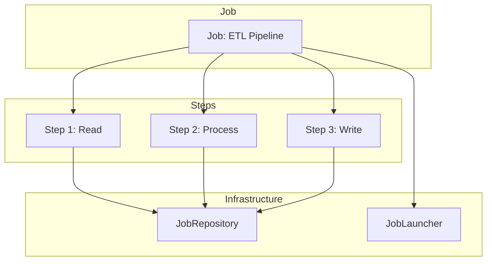
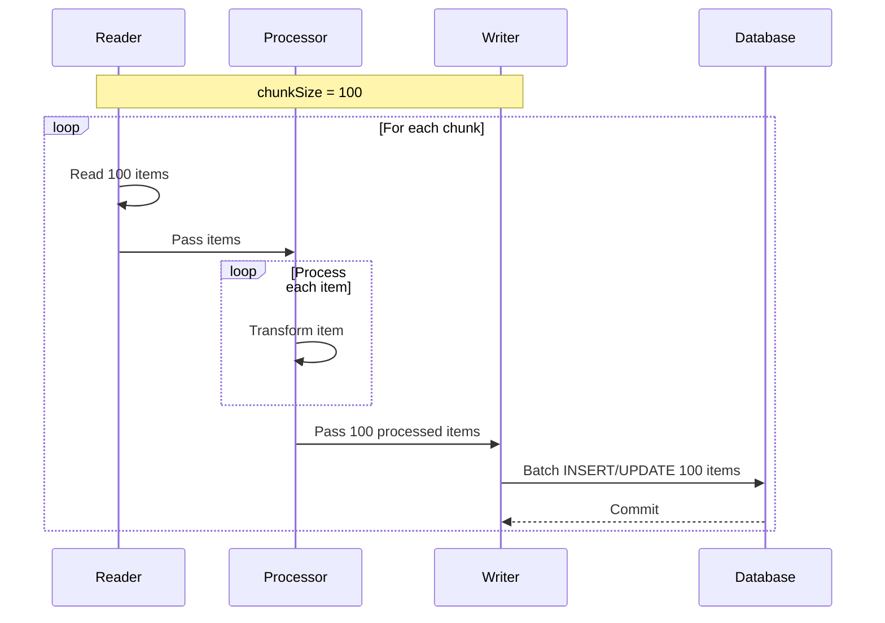
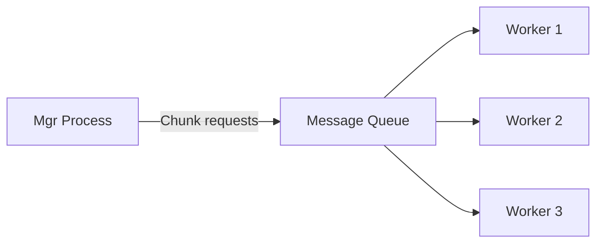

# Spring Batch

## 1. Overview

Spring Batch is a lightweight, comprehensive batch processing framework designed for the development of robust batch applications. It handles high-volume data processing with features like transaction management, job monitoring, skip/retry logic, and partitioning for parallel processing.

### 1.1. When to Use Spring Batch

| Use Case | Example |
|----------|---------|
| **Periodic bulk processing** | End-of-day transactions, nightly reports |
| **Large data import/export** | Migrate data between systems, CSV/Excel processing |
| **Scheduled processing** | Invoice generation, email campaigns |
| **Parallel processing** | Process large datasets across threads |
| **Step-based workflows** | Multi-stage ETL pipelines |

### 1.2. Key Components



---

## 2. Core Concepts

### 2.1. Job

A `Job` is the batch process composed of one or more `Step`s. Spring Batch provides `SimpleJob` and `FlowJob` for different workflow patterns.

```java
@Configuration
@EnableBatchProcessing
public class BatchConfig {

    @Autowired
    private JobBuilderFactory jobBuilderFactory;

    @Autowired
    private StepBuilderFactory stepBuilderFactory;

    @Bean
    public Job importUserJob(Step importUsersStep) {
        return jobBuilderFactory.get("importUserJob")
            .incrementer(new RunIdIncrementer())
            .start(importUsersStep)
            .next(processUsersStep())
            .build();
    }

    @Bean
    public Job importOrderJob() {
        return jobBuilderFactory.get("importOrderJob")
            .incrementer(new RunIdIncrementer())
            .start(importOrdersStep())
                .on("FAILED").end()
                .from(importOrdersStep())
                .on("*").to(sendNotificationStep())
            .end()
            .build();
    }
}
```

### 2.2. Step

A `Step` is a domain object that encapsulates an independent, sequential phase of a batch job. Each step contains instructions for `ItemReader`, `ItemProcessor`, and `ItemWriter`.

```java
@Bean
public Step importUsersStep(
        ItemReader<User> userReader,
        ItemProcessor<User, User> userProcessor,
        ItemWriter<User> userWriter) {

    return stepBuilderFactory.get("importUsersStep")
        .<User, User>chunk(100)  // Commit every 100 items
        .reader(userReader)
        .processor(userProcessor)
        .writer(userWriter)
        .faultTolerant()
            .skipLimit(10)
            .skip(Exception.class)
            .retryLimit(3)
            .retry(SocketTimeoutException.class)
        .build();
}
```

### 2.3. JobRepository and JobLauncher

| Component | Role |
|-----------|------|
| **JobRepository** | Stores job execution state (metadata, status, parameters) in DB |
| **JobLauncher** | Launches jobs with parameters, returns JobExecution |
| **JobExplorer** | Read-only access to job executions |
| **JobOperator** | Operational control (start, stop, restart) |

```java
// Launch a job
@Autowired
private JobLauncher jobLauncher;

public void runImportJob() throws Exception {
    JobParameters params = new JobParametersBuilder()
        .addString("inputFile", "data/users.csv")
        .addLong("timestamp", System.currentTimeMillis())
        .toJobParameters();

    JobExecution execution = jobLauncher.run(importUserJob(), params);
    System.out.println("Exit status: " + execution.getStatus());
}

// JobRepository configuration (with JPA)
@Configuration
public class DataSourceConfig {
    @Bean
    public JobRepository jobRepository(DataSource dataSource, PlatformTransactionManager txManager) {
        JobRepositoryFactoryBean factory = new JobRepositoryFactoryBean();
        factory.setDataSource(dataSource);
        factory.setTransactionManager(txManager);
        factory.setDatabaseType("POSTGRESQL");
        return factory.getObject();
    }
}
```

---

## 3. ItemReader, ItemProcessor, ItemWriter

### 3.1. ItemReader

Reads input data from various sources.

```java
// FlatFileItemReader — CSV files
@Bean
public FlatFileItemReader<User> userReader() {
    return new FlatFileItemReaderBuilder<User>()
        .name("userReader")
        .resource(new ClassPathResource("users.csv"))
        .delimited()
        .names("id", "name", "email", "age")
        .linesToSkip(1)  // Skip header
        .fieldSetMapper(new BeanWrapperFieldSetMapper<>() {{
            setTargetType(User.class);
        }})
        .build();
}

// JdbcPagingItemReader — Database with pagination
@Bean
public JdbcPagingItemReader<Order> orderReader(DataSource dataSource) {
    Map<String, Order> parameters = new HashMap<>();
    parameters.put("status", "PENDING");

    return new JdbcPagingItemReaderBuilder<Order>()
        .name("orderReader")
        .dataSource(dataSource)
        .queryProvider(orderQueryProvider())
        .parameterValues(parameters)
        .pageSize(100)
        .rowMapper(orderRowMapper())
        .build();
}

// JpaPagingItemReader — JPA with pagination
@Bean
public JpaPagingItemReader<Customer> customerReader() {
    return new JpaPagingItemReaderBuilder<Customer>()
        .name("customerReader")
        .entityManagerFactory(entityManagerFactory)
        .queryString("SELECT c FROM Customer c WHERE c.active = true")
        .pageSize(50)
        .build();
}

// KafkaItemReader
@Bean
public KafkaItemReader<String, Transaction> transactionReader() {
    return new KafkaItemReaderBuilder<String, Transaction>()
        .name("transactionReader")
        .consumerProperties(consumerProps())
        .topic("transactions")
        .partitionOffset(new HashMap<>())
        .minBeforeInvalid(1L)
        .maxLag(100L)
        .build();
}
```

### 3.2. ItemProcessor

Transforms input data before writing.

```java
// Simple processor
@Bean
public ItemProcessor<User, User> userProcessor() {
    return item -> {
        // Transform data
        User transformed = new User();
        transformed.setId(item.getId());
        transformed.setName(item.getName().toUpperCase());
        transformed.setEmail(item.getEmail().toLowerCase());
        transformed.setProcessedAt(LocalDateTime.now());

        // Filter out (return null to skip)
        if (item.getAge() < 18) {
            return null;  // Skip this item
        }

        return transformed;
    };
}

// Composite processor (chain multiple processors)
@Bean
public ItemProcessor<User, User> compositeProcessor() {
    List<ItemProcessor<User, User>> processors = Arrays.asList(
        new UserValidationProcessor(),
        new UserEnrichmentProcessor()
    );

    return new CompositeItemProcessorBuilder<User, User>()
        .delegates(processors)
        .build();
}
```

### 3.3. ItemWriter

Writes processed data to destination.

```java
// FlatFileItemWriter — CSV files
@Bean
public FlatFileItemWriter<User> userWriter() {
    return new FlatFileItemReaderBuilder<User>()
        .name("userWriter")
        .resource(new FileSystemResource("output/users_processed.csv"))
        .delimited()
        .names("id", "name", "email", "processedAt")
        .headerCallback(writer -> writer.write("ID,NAME,EMAIL,PROCESSED_AT"))
        .build();
}

// JdbcBatchItemWriter — Database
@Bean
public JdbcBatchItemWriter<User> userWriter(DataSource dataSource) {
    return new JdbcBatchItemWriterBuilder<User>()
        .dataSource(dataSource)
        .sql("INSERT INTO processed_users (id, name, email, processed_at) VALUES (?, ?, ?, ?)")
        .itemPreparedStatementSetter((item, ps) -> {
            ps.setLong(1, item.getId());
            ps.setString(2, item.getName());
            ps.setString(3, item.getEmail());
            ps.setObject(4, item.getProcessedAt());
        })
        .build();
}

// JpaItemWriter — JPA
@Bean
public JpaItemWriter<User> userWriter(EntityManagerFactory emf) {
    JpaItemWriter<User> writer = new JpaItemWriter<>();
    writer.setEntityManagerFactory(emf);
    return writer;
}

// CompositeItemWriter — Write to multiple destinations
@Bean
public CompositeItemWriter<User> compositeWriter() {
    return new CompositeItemWriterBuilder<User>()
        .delegates(
            jpaItemWriter(null),
            flatFileItemWriter(),
            kafkaItemWriter()
        )
        .build();
}
```

---

## 4. Chunk-Oriented Processing

Spring Batch processes data in **chunks** — read N items, process them, then write them as a single transaction.



```java
// Chunk size determines transaction boundary
@Bean
public Step step1() {
    return stepBuilderFactory.get("step1")
        .<Input, Output>chunk(100)   // Read 100, process 100, write 100 per transaction
        .reader(reader())
        .processor(processor())
        .writer(writer())
        .build();
}

// For large data, smaller chunks = more frequent commits = less memory
// For small data, larger chunks = fewer commits = better performance
```

---

## 5. Skip and Retry Logic

### 5.1. Retry

Automatically retries failed operations due to transient errors.

```java
@Bean
public Step stepWithRetry() {
    return stepBuilderFactory.get("stepWithRetry")
        .<User, User>chunk(100)
        .reader(userReader())
        .processor(userProcessor())
        .writer(userWriter())
        .faultTolerant()
        .retry(SocketTimeoutException.class)        // Retry on this exception
        .retryLimit(3)                               // Max 3 retries
        .retryPolicy(new SimpleRetryPolicy(3,        // Or use SimpleRetryPolicy
            Map.of(
                SocketTimeoutException.class, 2,
                DataAccessException.class, 3
            )))
        .build();
}
```

### 5.2. Skip

Skips problematic records that cannot be processed after retry exhaustion.

```java
@Bean
public Step stepWithSkip() {
    return stepBuilderFactory.get("stepWithSkip")
        .<User, User>chunk(100)
        .reader(userReader())
        .processor(userProcessor())
        .writer(userWriter())
        .faultTolerant()
        .skipLimit(50)                           // Max 50 skipped records
        .skip(ValidationException.class)         // Skip validation errors
        .skip(DataIntegrityViolationException.class)  // Skip duplicate key
        .noSkip(IllegalArgumentException.class)  // Never skip this
        .build();
}
```

### 5.3. Combining Retry and Skip

```java
@Bean
public Step robustStep() {
    return stepBuilderFactory.get("robustStep")
        .<User, User>chunk(100)
        .reader(userReader())
        .processor(userProcessor())
        .writer(userWriter())
        .faultTolerant()
        // Retry transient errors up to 3 times
        .retryLimit(3)
        .retry(SocketTimeoutException.class)
        .retry(TransientDataAccessException.class)
        // After retries exhausted, skip (but don't skip too many)
        .skipLimit(100)
        .skip(Exception.class)
        .noSkip(CriticalException.class)
        .build();
}
```

---

## 6. Job Flow Control

### 6.1. Sequential Steps

```java
@Bean
public Job myJob() {
    return jobBuilderFactory.get("myJob")
        .start(step1())
        .next(step2())
        .next(step3())
        .build();
}
```

### 6.2. Conditional Flow

```java
@Bean
public Job conditionalJob() {
    return jobBuilderFactory.get("conditionalJob")
        .start(validateInputStep())
            .on("FAILED").end()                              // Stop if validation fails
            .from(validateInputStep())
            .on("COMPLETED").to(processDataStep())           // If OK, proceed
            .from(processDataStep())
            .on("COMPLETED").to(generateReportStep())        // On success, generate report
            .from(processDataStep())
            .on("FAILED").to(notifyErrorStep())              // On failure, notify
            .from(generateReportStep())
            .on("*").to(sendNotificationStep())              // Always send notification
        .end()
        .build();
}
```

### 6.3. Split Flows (Parallel Execution)

```java
@Bean
public Job parallelJob() {
    Flow flow1 = new FlowBuilder<Flow>("flow1").start(stepA()).build();
    Flow flow2 = new FlowBuilder<Flow>("flow2").start(stepB()).build();

    return jobBuilderFactory.get("parallelJob")
        .start(flow1)
        .split(new SimpleAsyncTaskExecutor())  // Execute flows in parallel
        .add(flow2)
        .next(stepC())
        .build();
}
```

---

## 7. Scheduling

### 7.1. @Scheduled

```java
@SpringBootApplication
@EnableScheduling
public class BatchApplication {

    public static void main(String[] args) {
        SpringApplication.run(BatchApplication.class, args);
    }
}

@Component
public class ScheduledJobLauncher {

    @Autowired
    private JobLauncher jobLauncher;

    @Autowired
    private Job importUserJob;

    // Cron expression: second minute hour day month weekday
    @Scheduled(cron = "0 0 2 * * ?")  // Run at 2 AM daily
    public void runNightlyJob() throws Exception {
        JobParameters params = new JobParametersBuilder()
            .addLong("timestamp", System.currentTimeMillis())
            .toJobParameters();
        jobLauncher.run(importUserJob, params);
    }

    @Scheduled(fixedDelay = 60000)  // Run every 60 seconds
    public void runPeriodicJob() throws Exception {
        // ...
    }
}
```

### 7.2. Scheduler Integration

```bash
# Linux crontab
0 2 * * * /usr/bin/java -jar /app/batch-app.jar --spring.batch.job.names=importUserJob

# Or use Quartz Scheduler for enterprise scheduling
```

---

## 8. Partitioning and Parallel Processing

### 8.1. Partitioning

Divide data into partitions processed by separate threads.

```java
@Bean
public Job partitionedJob() {
    return jobBuilderFactory.get("partitionedJob")
        .start(stepManager())
        .build();
}

@Bean
public Step stepManager() {
    return stepBuilderFactory.get("stepManager")
        .partitioner("workerStep", userPartitioner())
        .gridSize(10)                           // 10 partitions
        .taskExecutor(new SimpleAsyncTaskExecutor())
        .build();
}

@Bean
public Partitioner userPartitioner() {
    return (gridSize, executionContext) -> {
        Map<String, ExecutionContext> partitions = new HashMap<>();
        List<String> regions = Arrays.asList("NORTH", "SOUTH", "EAST", "WEST", "CENTRAL");

        for (int i = 0; i < gridSize; i++) {
            ExecutionContext context = new ExecutionContext();
            context.putString("region", regions.get(i % regions.size()));
            context.putInt("partition", i);
            partitions.put("partition" + i, context);
        }
        return partitions;
    };
}

@Bean
public Step workerStep() {
    return stepBuilderFactory.get("workerStep")
        .<User, User>chunk(100)
        .reader(userReader(null))
        .processor(userProcessor())
        .writer(userWriter())
        .build();
}

@StepScope
@Bean
public JdbcPagingItemReader<User> userReader(
        @Value("#{stepExecutionContext['region']}") String region) {
    // Reader uses partition data to scope its query
}
```

### 8.2. Remote Chunking

For truly parallel processing across multiple JVMs using a message queue:



```java
// Manager step sends chunks via messaging
@Bean
public Step managerStep() {
    return stepBuilderFactory.get("managerStep")
        .chunk(100)
        .reader(itemReader())
        .writer(itemWriter())
        .build();
}

// Worker processes chunks from queue
@Bean
public Step workerStep() {
    return stepBuilderFactory.get("workerStep")
        .chunk(100)
        .reader(null)  // Receives from queue
        .processor(itemProcessor())
        .writer(itemWriter())
        .build();
}
```

---

## 9. Testing Spring Batch Jobs

### 9.1. Unit Testing with JobLauncherTestUtils

```java
@SpringBatchTest
@SpringBootTest
class SpringBatchApplicationTests {

    @Autowired
    private JobLauncherTestUtils jobLauncherTestUtils;

    @Autowired
    private JobRepository jobRepository;

    @Autowired
    private UserRepository userRepository;

    @BeforeEach
    void setUp() {
        userRepository.deleteAll();
    }

    @Test
    void testImportUserJob() throws Exception {
        // Given: prepare test data
        createTestCsv("test-users.csv", "id,name,email,age\n1,John,john@test.com,25");

        JobParameters params = new JobParametersBuilder()
            .addString("inputFile", "test-users.csv")
            .addLong("timestamp", System.currentTimeMillis())
            .toJobParameters();

        // When
        JobExecution execution = jobLauncherTestUtils.launchJob(params);

        // Then
        assertEquals(ExitStatus.COMPLETED, execution.getExitStatus());
        assertEquals(1, userRepository.count());
    }

    @Test
    void testJobWithStepTesting() throws Exception {
        // Test individual steps
        JobExecution execution = jobLauncherTestUtils.launchStep("importUsersStep");
        assertEquals(ExitStatus.COMPLETED, execution.getExitStatus());
    }
}
```

### 9.2. StepScope Testing

```java
@Test
void testReaderWithStepScope() throws Exception {
    // Use StepRunner to test step-scoped components
    StepExecution execution = new StepExecution("testStep",
        jobRepository.createJobExecution("testJob", new JobParameters()).createStepExecution("testStep"));

    JobRepositoryTestUtils utils = new JobRepositoryTestUtils(jobRepository, null);

    // Test reader
    FlatFileItemReader<String> reader = new FlatFileItemReaderBuilder<String>()
        .name("testReader")
        .resource(new ClassPathResource("test-data.csv"))
        .lineMapper(new DefaultLineMapper<>())
        .build();

    // Initialize with step execution context
    reader.afterPropertiesSet();

    // Read items
    String item;
    while ((item = reader.read()) != null) {
        // Verify
    }
}
```

---

## 10. Common Interview Questions

**Q: What is the difference between chunk-oriented processing and tasklet-based processing?**
Chunk-oriented: Read-Process-Write pattern for large data sets. Tasklet: Single-action task for one operation (e.g., shell script, stored procedure).

**Q: How does Spring Batch handle transactions?**
Each chunk commit is wrapped in a transaction. If any item in a chunk fails (after retry/skip), the entire chunk is rolled back.

**Q: What is the purpose of JobRepository?**
It persists job execution metadata (job parameters, step execution data, status, exit code) to a database, enabling job restart, monitoring, and recovery.

**Q: When would you use partitioning vs. remote chunking?**
Partitioning: Single JVM, multiple threads — good for CPU-bound processing. Remote chunking: Multiple JVMs via message queue — good for I/O-bound processing with massive scale.

**Q: How do you prevent duplicate processing on job restart?**
Use `JobParametersIncrementer` (like `RunIdIncrementer`) to ensure each job run has unique parameters. Spring Batch uses job name + parameters as a unique key.
