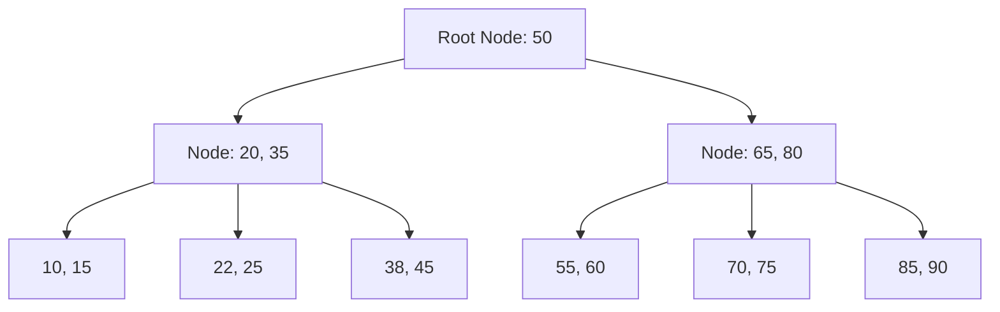

# Database Indexing & Query Optimization

## 1. What is an Index? (The Library Catalog)

Imagine entering a library with 1 million books.
- **No Index:** You have to check every book one by one to find "Java Programming." It takes days!
- **With Index:** You go to the catalog, look up "J," and see "Java Programming - Shelf 5, Row 2." You go straight there. It takes 10 seconds!

**Technical Core:** An Index is a data structure (usually a **B-Tree**) separate from the main table, storing column values and pointers to the actual data rows on the disk.

---

## 2. B-Tree Index - The Heart of Databases

Most databases use **B-Tree** as the default index structure.

**Why B-Tree?**
- **Low Depth:** A B-Tree needs only 3-4 levels to store millions of records. 
- **Range Scans:** Leaf nodes are linked, making it extremely fast to find values between two ranges (e.g., `20` to `50`).

---

## 3. Critical Index Types

### 3.1. Composite Index (Multi-column)
`CREATE INDEX idx_name_age ON users(name, age);`

> [!IMPORTANT] **Leftmost Prefix Rule:**
> An index on `(name, age)` supports queries on `name` or `name + age`. It **does not** support queries on `age` alone! Think of a phonebook sorted by Last Name then First Name; you can't find someone quickly if you only know their First Name.

### 3.2. Covering Index
A top-tier optimization technique. If your index contains all columns requested by the `SELECT` statement, the DB retrieves data directly from the index **without touching the main table (Heap)**.

---

## 4. Query Optimization - Common Pitfalls

### 4.1. Avoid Functions on Indexed Columns
Using a function on an indexed column forces the DB to **ignore the index** and scan the whole table.
- **❌ Wrong:** `WHERE YEAR(created_at) = 2024`
- **✅ Right:** `WHERE created_at >= '2024-01-01' AND created_at < '2025-01-01'`

### 4.2. The "N+1 Query" Problem
Happens when you fetch 100 orders, then for each order, you call another SQL query to get customer info. Total = 1 + 100 = 101 queries!
👉 **Solution:** Use `JOIN` or `In-clause` to fetch everything in 1 or 2 queries.

### 4.3. Low Selectivity
Don't index columns with very few unique values (e.g., Gender: Male/Female). The DB will often find it faster to just scan the whole table than to use the index.

---

## 5. EXPLAIN & EXPLAIN ANALYZE

Don't guess; use `EXPLAIN` to see the **Execution Plan**.

| Parameter | Meaning | Evaluation |
|:---|:---|:---|
| **Seq Scan** | Scanning the entire table. | ❌ Very slow for large data |
| **Index Scan** | Using an index. | ✅ Fast |
| **Index Only Scan** | Reading only from the index. | 🚀 Fastest |

---

## 6. Optimization Checklist

- [ ] Indexed columns in `WHERE`, `JOIN`, and `ORDER BY`?
- [ ] No `SELECT *`?
- [ ] No functions wrapping indexed columns in `WHERE`?
- [ ] Using Keyset Pagination (`ID > N`) instead of `OFFSET` for large datasets?
- [ ] Are there too many indexes (over 5-7) slowing down Writes?