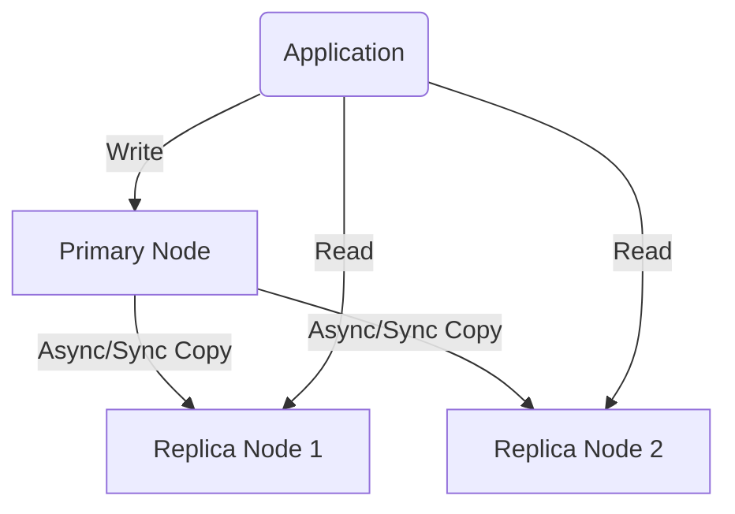

# Database Replication & High Availability (HA)

## 1. What is Replication?

**Replication** is the automatic copying of data from a primary node (**Source**) to one or more secondary nodes (**Replica/Standby**).

### Why do we need it?
- **Scale Read:** Offload read traffic to secondary nodes.
- **High Availability (HA):** If the primary fails, a secondary is ready to take over.
- **Disaster Recovery:** Protect data if an entire Data Center goes down.

---

## 2. Common Replication Models

### 2.1. Primary - Replica (Most Common)
One node handles Writes, while others handle Reads.

- **Pros:** Simple, great for scaling reads.
- **Cons:** Primary is still a Write bottleneck. Introduces **Replication Lag**.

---

## 3. Sync vs. Async vs. Semi-Sync

| Mechanism | How it works | Pros | Cons |
|:---:|:---|:---|:---|
| **Asynchronous** | Primary confirms write to Client immediately, then pushes to Replica later. | **Fastest Writes.** | **Risk of data loss** if Primary fails before pushing to Replica. |
| **Synchronous** | Primary waits for **all** Replicas to confirm before informing the Client. | **100% Data Safety.** | **Very Slow.** Entire system hangs if one Replica has network issues. |
| **Semi-Sync** | Primary waits for **at least one** Replica to confirm. | Balance of speed and safety. | Still slower than Async. |

---

## 4. Replication Lag - The Developer's Nightmare

**Replication Lag** is the delay between writing to the Primary and that change appearing on the Replica.

### Consequence: Loss of "Read-after-write consistency"
**Example:**
1. User posts a Comment (Written to Primary).
2. Page reloads and fetches comments (Read from Replica).
3. Due to Lag, the comment isn't there yet -> User thinks it's a bug.

**Solutions:**
- Route critical reads (e.g., Checkout, Profile update) to the **Primary**.
- Monitor lag and set alerts (e.g., alert if lag > 5 seconds).

---

## 5. Failover & Split-brain

- **Failover:** Promoting a Replica to Primary when the old Primary fails.
- **Split-brain:** A dangerous scenario where two nodes both think they are the Primary and both accept Writes.
  - **Result:** Massive data corruption.
  - **Solution:** Use Quorum-based voting or tools like **Patroni** (Postgres) or **Orchestrator** (MySQL).

---

## 6. Replication vs. Backup

- **Replication:** Real-time copying. If you `DELETE *` on Primary, it's gone on Replica instantly.
- **Backup:** A snapshot of data at a point in time (e.g., 2 AM last night). Used to recover from accidental deletions.
- **Pro-tip:** You need both. One does not replace the other.

---

## 7. Interview Pro-Tip

> **Q: How do you ensure a user always sees their own updates immediately?**
>
> **A:** For updates made by the specific user, route their read requests to the **Primary** for a short duration (e.g., 20 seconds), or use session-based consistency mechanisms. This avoids the "Lag" issue for the user who just made the change.
