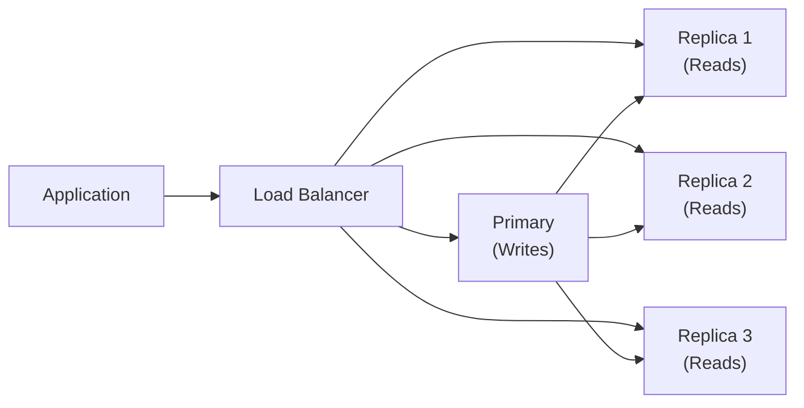

# Database -> Replication & High Availability

## Replication Types

### Master-Slave (Primary-Replica)

One node (primary/master) accepts writes. One or more replica (slave) nodes replicate data from the primary. Read queries can be distributed to replicas.

```
Write ──► Primary (RW)
                │
                ├──► Replica 1 (RO)
                ├──► Replica 2 (RO)
                └──► Replica N (RO)
```

**MySQL Configuration:**
```ini
# Primary (my.cnf)
server-id = 1
log_bin = /var/log/mysql/mysql-bin
binlog_format = ROW

# Replica (my.cnf)
server-id = 2
relay_log = /var/log/mysql/mysql-relay-bin
log_slave_updates = 1
read_only = 1
```

```sql
-- On Primary: create replication user
CREATE USER 'repl'@'%' IDENTIFIED WITH mysql_native_password BY 'password';
GRANT REPLICATION SLAVE ON *.* TO 'repl'@'%';

-- On Replica: start replication
CHANGE MASTER TO
    MASTER_HOST = 'primary-host',
    MASTER_USER = 'repl',
    MASTER_PASSWORD = 'password',
    MASTER_LOG_FILE = 'mysql-bin.000001',
    MASTER_LOG_POS = 157;

START SLAVE;
SHOW SLAVE STATUS\G
```

### Master-Master (Multi-Primary)

Two or more nodes accept writes. Each node is both a primary and a replica of others. Writes can go to any node.

```
        ◄───────────────────►
        │                   │
        ▼                   ▼
  ┌─────────┐         ┌─────────┐
  │ Node A  │◄───────►│ Node B  │
  │  (RW)   │         │  (RW)   │
  └─────────┘         └─────────┘
```

| Aspect | Master-Slave | Master-Master |
|--------|-------------|---------------|
| **Write nodes** | 1 (primary only) | Multiple (all nodes) |
| **Conflict risk** | None (writes go to one place) | High (concurrent writes to same rows) |
| **Failover** | Simple (promote a replica) | Complex (need conflict resolution) |
| **Use case** | Read scaling, DR | Active-active for multiple sites |

### Slave Replication (Replica Only)

Read replicas serve read-only queries, reducing load on the primary. This is the most common replication setup.

```sql
-- Application routing strategy
public DataSource selectDataSource() {
    // 80% reads go to replica pool
    if (Math.random() < 0.8) {
        return replicaDataSource;
    }
    // 20% + all writes go to primary
    return primaryDataSource;
}
```

---

## Synchronous vs Asynchronous Replication

### Asynchronous Replication

The primary writes locally, sends the event to replicas, and confirms the write to the client without waiting for replicas to confirm.

- **Pros**: Primary write is fast, does not wait for replica network latency.
- **Cons**: Data loss possible if primary fails before replicas receive the update (replication lag).

Most databases use asynchronous replication by default.

### Synchronous Replication

The primary waits until all (or a quorum of) replicas confirm the write before confirming to the client.

- **Pros**: Zero data loss guarantee.
- **Cons**: Write latency equals network round-trip to the slowest replica.

```sql
-- PostgreSQL: synchronous replication config
synchronous_commit = on  # wait for all
synchronous_commit = remote_apply  # wait until applied
synchronous_standby_names = 'replica1,replica2'
```

```ini
# MySQL: semi-synchronous replication
plugin-load = "rpl_semi_sync_master=semisync_master.so;rpl_semi_sync_slave=semisync_slave.so"
rpl-semi-sync-master-wait-for-slave-count = 1
```

### Semi-Synchronous Replication

A middle ground: the primary waits for at least one replica to acknowledge receipt (but not necessarily apply) before confirming to the client.

---

## Replication Lag

Replication lag is the time delay between a write on the primary and its reflection on a replica.

### Causes

- Network latency between primary and replica.
- Replica is under heavy read load (cannot keep up with replication).
- Large transactions on the primary.
- Replica hardware slower than primary (I/O, CPU, disk throughput).

### Impact

```sql
-- User posts a comment
INSERT INTO comments (user_id, content) VALUES (1, 'Hello');

-- Immediately reads back (on replica)
SELECT * FROM comments WHERE user_id = 1;
-- Comment might not be visible yet (replication lag)
```

### Measuring Lag

```sql
-- MySQL
SHOW SLAVE STATUS\G
-- Key columns:
--   Seconds_Behind_Master: lag in seconds
--   Slave_IO_Running: YES if IO thread running
--   Slave_SQL_Running: YES if SQL thread running

-- PostgreSQL
SELECT * FROM pg_stat_replication;
--   client_addr: replica IP
--   sent_lsn: last WAL sent
--   write_lsn: last WAL written on replica
--   flush_lsn: last WAL flushed to disk on replica
--   replay_lsn: last WAL applied on replica
--   lag: time behind primary
```

### Mitigating Lag

- Route reads to the primary when freshness is required.
- Monitor lag and alert when it exceeds threshold.
- Use connection poolers (PgBouncer) with replication-aware routing.
- Optimize replica hardware to match primary.

---

## Failover

Failover is the process of automatically or manually promoting a replica to primary when the primary fails.

### Automatic vs Manual Failover

| Type | Description | Pros | Cons |
|------|-------------|------|------|
| **Manual** | Admin manually promotes replica | Full control | Slow, human error risk |
| **Automatic** | Cluster manager detects failure and promotes | Fast, no human delay | Misleading failover possible |

### Failover Process

```
1. Detection: Primary failure detected (heartbeat timeout)
2. Verification: Confirm primary is truly down (not just network blip)
3. Promotion: Select best replica (most up-to-date) and promote
4. Routing: Update connection strings / VIP / DNS
5. Reconfig: Point remaining replicas to new primary
```

### VIP (Virtual IP) Migration

```bash
# Keepalived configuration for VIP failover
vrrp_instance VI_1 {
    state BACKUP           # both nodes start as BACKUP
    interface eth0
    virtual_router_id 51
    priority 100           # primary has 100, replica has 90
    advert_int 1
    virtual_ipaddress {
        192.168.1.100/24   # Virtual IP
    }
    notify_master "/usr/local/bin/promote.sh"
}
```

### DNS Switching

```
Before failover:
  db.example.com -> 192.168.1.10 (Primary)

After failover:
  db.example.com -> 192.168.1.11 (New Primary)
  # TTL should be low (60 seconds) for fast switchover
```

### Switchover vs Failover

- **Failover**: Unplanned, automatic or manual (primary crashes).
- **Switchover**: Planned, manual (primary goes down for maintenance).

---

## HA Solutions

### Pacemaker + Corosync

An open-source cluster resource manager for Linux. Manages VIP, filesystem, and database failover.

```bash
# Install
yum install pacemaker pcs corosync

# Configure cluster
pcs cluster setup --name mycluster node1 node2
pcs cluster start --all

# Create VIP resource
pcs resource create db_vip ocf:heartbeat:IPaddr2 \
    ip=192.168.1.100 cidr_netmask=24 \
    op monitor interval=30s

# Create database resource (PostgreSQL example)
pcs resource create pgsql ocf:heartbeat:pgsqlms \
    pgdata=/var/lib/pgsql/data \
    op monitor interval=30s

# Colocation: VIP and DB on same node
pcs constraint colocation add db_vip pgsql INFINITY

# Ordering: DB first, then VIP
pcs constraint order pgsql then db_vip
```

### PgBouncer

Connection pooler for PostgreSQL that sits between the application and the database. Reduces connection overhead and can route queries to replicas.

```ini
[databases]
mydb = host=primary port=5432 dbname=mydb
mydb_readonly = host=replica port=5432 dbname=mydb

[pgbouncer]
listen_addr = 0.0.0.0
listen_port = 6432
auth_type = md5
auth_file = userlist.txt
pool_mode = transaction
max_client_conn = 1000
default_pool_size = 20
server_idle_timeout = 600
```

```java
// Application connects to PgBouncer instead of DB directly
// PgBouncer handles connection pooling and routing
String url = "jdbc:postgresql://pgbouncer:6432/mydb";
```

### Keepalived

Used for VIP failover at the network level:

```bash
# keepalived.conf
vrrp_instance VI_1 {
    state BACKUP
    interface ens33
    virtual_router_id 51
    priority 100
    advert_int 1
    authentication {
        auth_type PASS
        auth_pass 1111
    }
    virtual_ipaddress {
        192.168.1.100
    }
    notify_master /opt/scripts/become_master.sh
    notify_backup /opt/scripts/become_backup.sh
}
```

### Orchestrator (MySQL)

MySQL replication management and failover tool:

```bash
# Discover topology
orchestrator -c discover -i myhost:3306

# Show topology
orchestrator -c topology -i myhost:3306

# Manual failover
orchestrator -c graceful-master-takeover -i myhost:3306 -d mydb
```

---

## Read Replicas for Scaling

Read replicas allow you to scale read-heavy workloads by distributing reads across multiple replicas.



```java
// Read-write splitting with Spring
@Bean
public DataSource routingDataSource(
        DataSource primary,
        DataSource replica1,
        DataSource replica2) {

    Map<Object, Object> dataSources = new HashMap<>();
    dataSources.put("primary", primary);
    dataSources.put("replica1", replica1);
    dataSources.put("replica2", replica2);

    RoutingDataSource rds = new RoutingDataSource();
    rds.setDefaultTargetDataSource(primary);
    rds.setTargetDataSources(dataSources);
    return rds;
}

// In service layer
@Transactional(readOnly = true)  // routes to replica
public List<User> getUsers() { ... }

@Transactional(readOnly = false)  // routes to primary
public void updateUser(Long id, String name) { ... }
```

---

## Consensus Protocols: Raft & Paxos

### Raft

Raft is a consensus algorithm designed to be understandable. It elects a leader who manages log replication.

```
Raft Leader Election:

Term 1:  Node A (votes: A)      Node B (votes: A)      Node C (votes: A)
        ┌─────────┐              ┌─────────┐              ┌─────────┐
        │  Node   │              │  Node   │              │  Node   │
        │    A    │              │    B    │              │    C    │
        │  LEADER │              │FOLLOWER │              │FOLLOWER │
        └─────────┘              └─────────┘              └─────────┘

        A receives votes from B and C → becomes Leader
```

Raft guarantees: **Leader election**, **Log replication** (majority writes), and **Safety** (only one leader per term).

### Paxos

Paxos is the theoretical foundation of distributed consensus. Two phases:

1. **Prepare**: Leader (proposer) asks majority to prepare.
2. **Accept**: Leader proposes value, majority must accept.

Both Raft and Paxos require a **majority (quorum)** of nodes to agree. With 3 nodes, you can tolerate 1 failure. With 5 nodes, you can tolerate 2 failures.

### Split-Brain Problem

Split-brain occurs when a network partition divides the cluster into two or more parts, each believing the other is dead. Both sides may try to become primary.

```
Network Partition:

  Side A                      Side B
┌─────────┐                ┌─────────┐
│ Node A  │ ── X ─ X ─ X ─ │ Node B  │
│(thinks B│                │(thinks A│
│ is down)│                │ is down)│
└─────────┘                └─────────┘

Result: Both A and B may try to accept writes
→ Data inconsistency (split-brain)
```

### Preventing Split-Brain

- **Quorum**: Require majority for writes (Raft/Paxos). If a node cannot reach majority, it stops accepting writes.
- **Fencing**: When a new leader is elected, it issues a fencing token that old leader must present to accept writes.
- **Witness/Sidecar**: An odd number of nodes ensures quorum is always achievable.
- **Redundant networking**: Multiple network paths between nodes.

---

## Common Interview Questions

> **What is replication lag and how do you handle it?**
>
> Replication lag is the delay between a write on the primary and its appearance on a replica. For applications that need read-after-write consistency, route reads to the primary. For reporting/analytics that can tolerate slightly stale data, replicas are fine. Monitor lag with `SHOW SLAVE STATUS` (MySQL) or `pg_stat_replication` (PostgreSQL) and alert when it exceeds threshold.

> **What is the difference between synchronous and asynchronous replication?**
>
> Asynchronous: primary writes locally and confirms immediately, replicating to replicas in the background. Writes are fast but data may be lost if primary fails. Synchronous: primary waits for replica confirmation before confirming to the client. Zero data loss but higher write latency. Semi-synchronous is a compromise: waits for at least one replica to receive, but not necessarily apply, the write.

> **What is split-brain and how do you prevent it?**
>
> Split-brain occurs when network partition divides the cluster so both sides think the other is dead and both try to accept writes, causing data inconsistency. Prevention: quorum-based writes (majority must agree), fencing tokens (new leader invalidates old leader), and witness nodes for odd-node-count clusters.

> **How do you design HA for a PostgreSQL database?**
>
> Use streaming replication to create hot standbys. Use PgBouncer as a connection pooler. Deploy with Pacemaker+Corosync for automatic failover of the VIP and database promotion. Set `synchronous_commit = on` if zero data loss is required. Use replication slots to ensure WAL is not discarded before replicas receive it. Test failover regularly.
