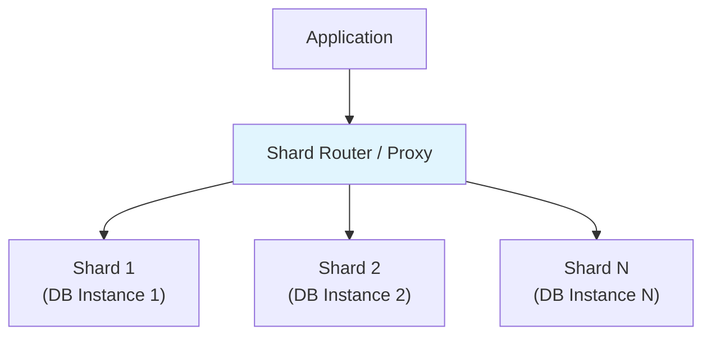

# Database -> Sharding & Partitioning

## Horizontal vs Vertical Partitioning (Sharding)

### Vertical Partitioning

Splitting a database by **columns** (fields) into different tables or even different databases. Tables that are accessed together stay together; infrequently accessed columns are moved to separate tables.

```
Before:
┌─────────────────────────────────┐
│          users                  │
│  id | name | bio | avatar_url   │
└─────────────────────────────────┘

After:
┌──────────────┐   ┌──────────────────┐
│ users_core   │   │ users_extended  │
│ id | name    │   │ id | bio | avatar│
└──────────────┘   └──────────────────┘
```

Example: Moving `avatar_url` and `bio` (large, rarely accessed columns) to a separate table because they cause table bloat.

### Horizontal Partitioning (Sharding)

Splitting a table by **rows** into multiple partitions or shards, each on a different physical location. Each shard contains a subset of the rows with a subset of the columns.

```
Before:
┌─────────────────────────────────────┐
│             orders                   │
│ id | user_id | total | created_at   │
│ 1  | 100      | 250   | 2024-01-01  │
│ 2  | 101      | 180   | 2024-01-02  │
│ 3  | 100      | 320   | 2024-01-03  │
│ 4  | 102      | 90    | 2024-01-04  │
└─────────────────────────────────────┘

After (by user_id range):
┌─────────────────┐   ┌─────────────────┐
│  shard_0 (0-50)  │   │  shard_1 (51+)  │
│  orders 1,3      │   │  orders 2,4     │
└─────────────────┘   └─────────────────┘
```

| Aspect | Vertical Partitioning | Horizontal Partitioning (Sharding) |
|--------|----------------------|-----------------------------------|
| **Split axis** | Columns | Rows |
| **Purpose** | Performance, storage | Performance, scale, data volume |
| **Complexity** | Low | High |
| **Query impact** | May need JOINs across partitions | Queries must include shard key |

---

## Database Partitioning (Internal)

Partitioning is a **database-level** feature that divides a single table into multiple physical segments (partitions), while the table still appears as one logical entity to applications.

### Range Partitioning

Rows are distributed based on a range of values of the partition key.

```sql
CREATE TABLE orders (
    id BIGSERIAL,
    user_id BIGINT,
    total DECIMAL(10,2),
    created_at DATE
) PARTITION BY RANGE (created_at);

-- Create partitions for specific ranges
CREATE TABLE orders_2024_Q1 PARTITION OF orders
    FOR VALUES FROM ('2024-01-01') TO ('2024-04-01');

CREATE TABLE orders_2024_Q2 PARTITION OF orders
    FOR VALUES FROM ('2024-04-01') TO ('2024-07-01');

CREATE TABLE orders_2024_Q3 PARTITION OF orders
    FOR VALUES FROM ('2024-07-01') TO ('2024-10-01');

CREATE TABLE orders_2024_Q4 PARTITION OF orders
    FOR VALUES FROM ('2024-10-01') TO ('2025-01-01');

-- Catch-all partition for future data
CREATE TABLE orders_future PARTITION OF orders
    FOR VALUES FROM ('2025-01-01') TO (MAXVALUE);
```

Best for: Time-series data, data with natural ranges (dates, numeric IDs).

### List Partitioning

Rows are distributed based on a discrete set of values.

```sql
CREATE TABLE users (
    id BIGSERIAL,
    username VARCHAR(100),
    country VARCHAR(50)
) PARTITION BY LIST (country);

CREATE TABLE users_asia PARTITION OF users
    FOR VALUES IN ('Vietnam', 'Thailand', 'Japan', 'Korea');

CREATE TABLE users_europe PARTITION OF users
    FOR VALUES IN ('Germany', 'France', 'UK', 'Spain');

CREATE TABLE users_other PARTITION OF users
    FOR VALUES IN (DEFAULT);
```

Best for: Data naturally grouped by discrete categories (country, region, category).

### Hash Partitioning

Rows are distributed based on a hash function applied to the partition key.

```sql
CREATE TABLE transactions (
    id BIGSERIAL,
    user_id BIGINT,
    amount DECIMAL(10,2),
    created_at TIMESTAMP
) PARTITION BY HASH (user_id);

-- Create 4 hash partitions
CREATE TABLE transactions_p0 PARTITION OF transactions
    FOR VALUES WITH (MODULUS 4, REMAINDER 0);
CREATE TABLE transactions_p1 PARTITION OF transactions
    FOR VALUES WITH (MODULUS 4, REMAINDER 1);
CREATE TABLE transactions_p2 PARTITION OF transactions
    FOR VALUES WITH (MODULUS 4, REMAINDER 2);
CREATE TABLE transactions_p3 PARTITION OF transactions
    FOR VALUES WITH (MODULUS 4, REMAINDER 3);
```

Best for: Even distribution when no natural range exists. Used for uniform data distribution.

### Composite Partitioning

Combining two partitioning methods. For example, RANGE on date + HASH on user_id.

```sql
CREATE TABLE events (
    id BIGSERIAL,
    user_id BIGINT,
    event_type VARCHAR(50),
    created_at TIMESTAMP
) PARTITION BY RANGE (created_at) SUBPARTITION BY HASH (user_id) SUBPARTITIONS 4;

CREATE TABLE events_2024 PARTITION OF events
    FOR VALUES FROM ('2024-01-01') TO ('2025-01-01');
```

---

## Partitioning Benefits

### 1. Query Performance (Partition Pruning)

The query optimizer skips irrelevant partitions entirely.

```sql
-- Without partition pruning: scan all partitions
SELECT * FROM orders WHERE created_at BETWEEN '2024-03-01' AND '2024-03-31';

-- With range partitioning by date: only Q1 partition is scanned
-- PostgreSQL automatically prunes other partitions
```

```sql
-- EXPLAIN output shows partition pruning:
EXPLAIN SELECT * FROM orders WHERE created_at = '2024-03-15';

-- Output includes:
--   -> Parallel Seq Scan on orders_2024_Q1 ...
-- (other partitions are not touched)
```

### 2. Data Archival and Purging

Easily archive old data by detaching partitions:

```sql
-- Detach old partition
ALTER TABLE orders DETACH PARTITION orders_2023_Q1;

-- Move to archive table
ALTER TABLE orders_2023_Q1 SET SCHEMA archive;

-- Or drop completely (fast!)
DROP TABLE orders_2023_Q1;
```

Compare to deleting rows: `DELETE FROM orders WHERE created_at < '2023-04-01'` would be slow and generate massive WAL logs. Dropping a partition is nearly instantaneous.

### 3. Maintenance Operations

```sql
-- Rebuild index on a single partition (faster, less locking)
REINDEX TABLE PARTITION orders_2024_Q1;

-- VACUUM a specific partition
VACUUM orders_2024_Q1;

-- ANALYZE partition statistics
ANALYZE orders_2024_Q1;
```

### 4. Bulk Load Efficiency

Loading data into a specific partition is faster and does not affect other partitions.

---

## Sharding Architecture

Sharding distributes data across **multiple database instances** (shards). Unlike partitioning (same DB, different files), sharding has data on different servers.

### Application-Level Sharding

The application routes queries to the correct shard based on a shard key.

```java
public class ShardRouter {

    private final Map<Integer, DataSource> shards;

    public DataSource getShardForUserId(Long userId) {
        int shardIndex = (int) (userId % shards.size());
        return shards.get(shardIndex);
    }

    public List<Order> getUserOrders(Long userId) {
        DataSource shard = getShardForUserId(userId);
        try (Connection conn = shard.getConnection()) {
            // Query this specific shard
            return jdbcTemplate.query(conn,
                "SELECT * FROM orders WHERE user_id = ?", userId);
        }
    }
}
```

### Shard Key Selection

The shard key determines data distribution. A poor key causes hotspots.

Good shard key: `user_id` (high cardinality, distributes evenly)
Bad shard key: `status` (only a few values, causes uneven distribution)

### Architecture Types



| Architecture | Description | Examples |
|-------------|-------------|----------|
| **Application-level** | App decides which shard | Custom routing logic |
| **Proxy-based** | Middleware routes queries | Vitess, Apache ShardingSphere |
| **Shared-nothing** | Each shard is independent server | Most sharding solutions |
| **Shared-disk** | All shards access same disk | Oracle RAC |
| **Shared-storage** | All shards share same storage | Some cloud DBs |

---

## Sharding Strategies

### Hash-Based Sharding

```java
// Shard = hash(key) % number_of_shards
int shardIndex = Math.abs(userId.hashCode()) % 4;
```

- **Pros**: Even distribution, simple to implement.
- **Cons**: Adding/removing shards requires resharding all data.

### Range-Based Sharding

```sql
-- Based on user_id ranges
Shard 1: user_id 1 - 1,000,000
Shard 2: user_id 1,000,001 - 2,000,000
Shard 3: user_id 2,000,001 - 3,000,000
```

- **Pros**: Easy to query ranges, natural ordering.
- **Cons**: Hotspots if newer IDs are accessed more frequently.

### Directory-Based Sharding

A lookup table maps shard keys to shard locations.

```sql
CREATE TABLE shard_map (
    shard_key VARCHAR(100) PRIMARY KEY,
    shard_id INT
);

-- Lookup
SELECT shard_id FROM shard_map WHERE shard_key = 'user:1001';
```

- **Pros**: Flexible, can rebalance without moving data.
- **Cons**: Extra lookup query, directory can become a bottleneck.

---

## Sharding Challenges

### Cross-Shard Queries

Queries spanning multiple shards are expensive because they require merging results.

```sql
-- Problem: Get orders from multiple shards
-- If orders are sharded by user_id, a query like this needs all shards:
SELECT * FROM orders WHERE created_at > '2024-01-01'
-- (No user_id filter, so ALL shards must be queried)
```

Solutions:
- **Denormalization**: Store a copy of related data on each relevant shard.
- **Scatter-gather**: Query all shards and merge results (expensive).
- **ESR pattern**: Execute queries on a single shard when possible.

### Cross-Shard Joins

```java
// Bad: Join requires multiple shards
SELECT o.*, u.name FROM orders o
JOIN users u ON o.user_id = u.id
WHERE u.country = 'Vietnam'

// Better: Application-level join
// 1. Query shard(s) for users in Vietnam -> get user IDs
// 2. Route to specific shard for those user IDs -> get orders
```

### Cross-Shard Transactions (2PC)

Distributed transactions across shards are extremely complex:

```java
@Transactional
public void transfer(Long fromUserId, Long toUserId, BigDecimal amount) {
    // Must debit from one shard and credit on another
    // Without distributed transaction: partial failure is possible
    debitAccount(fromUserId, amount);   // Shard A
    creditAccount(toUserId, amount);     // Shard B
    // If creditAccount fails, money is lost
}
```

Solutions: **Two-Phase Commit (2PC)**, Saga pattern, or avoid cross-shard transactions entirely.

### Rebalancing

When a shard becomes too large or unevenly distributed, you need to move data.

1. Create new shard layout.
2. Backfill data to new shards.
3. Update routing.
4. Decommission old shards.

This is operationally complex and typically requires downtime or a dual-write period.

---

## Examples: MongoDB Sharding, Vitess, CockroachDB

### MongoDB Sharding

MongoDB provides built-in sharding with automatic data distribution.

```javascript
// Enable sharding on a database
sh.enableSharding("mydb")

// Shard a collection by user_id (hashed)
sh.shardCollection("mydb.orders", { "user_id": "hashed" })

// Shard by range (e.g., region)
sh.shardCollection("mydb.users", { "country": 1, "user_id": 1 })
```

```javascript
// Shard status
sh.status()

// Balancer moves chunks between shards automatically
// to keep data evenly distributed
```

Key concepts: **Chunks** (data segments, default 64MB), **Shard keys**, **Balancer** (auto-rebalances), **Config servers** (metadata).

### Vitess (YouTube's MySQL Sharding Solution)

Vitess sits in front of MySQL and provides horizontal sharding:

```yaml
# vtgate configuration
vtgate:
  cells:
    - cell1
  tablet_types_to_wait:
    - PRIMARY
    - REPLICA

# Keyspace (sharded database)
keyspace:
  name: commerce
  type: sharded
  shard_count: 4
```

```sql
-- Vitess routes queries based on shard key
-- Application queries against vtgate (SQL proxy)
-- Vitess handles routing, filtering, and merging
SELECT * FROM orders WHERE user_id = 1001;
-- Routed to specific shard based on user_id
```

Features: Connection pooling, query routing, automated resharding, read replicas, and OLAP workloads via Vitess vtgate.

### CockroachDB

CockroachDB is a distributed SQL database that handles sharding automatically:

```sql
-- CockroachDB automatically shards and replicates data
-- No manual sharding configuration needed

-- Zone configurations for data placement
ALTER DATABASE mydb CONFIGURE ZONE USING
  num_replicas = 5,
  gc.ttlseconds = 3600;

-- Check data distribution
SHOW RANGES FROM TABLE orders;
```

Key features: **Automatic sharding** (data split into ranges of 64MB), **Raft consensus** for replication, **Distributed transactions** (no manual sharding), and **Multi-region deployment**.

---

## Common Interview Questions

> **What is the difference between partitioning and sharding?**
>
> Partitioning splits a table within a single database instance into multiple physical files/partitions, all still managed by one database engine. Sharding splits data across multiple independent database servers (shards). Partitioning is a database-level feature; sharding is an architecture-level strategy.

> **How do you choose a shard key?**
>
> Choose a key with high cardinality (many distinct values), that distributes reads and writes evenly (avoids hotspots), and is commonly used in query filters. If most queries filter by `user_id`, use that. Avoid low-cardinality keys (like status or country alone) because they create uneven distribution.

> **What are the biggest challenges with sharding?**
>
> Cross-shard queries and joins are the primary challenge -- they require scattering to all shards and merging results. Distributed transactions across shards are complex and slow. Rebalancing data when adding/removing shards is operationally expensive. Also: application code complexity increases significantly.

> **When should you shard vs. partition vs. optimize?**
>
> Optimize indexes and queries first. Partitioning is a good first step when a single table grows too large for efficient maintenance (e.g., archiving old partitions). Sharding is needed when a single database server cannot handle the write throughput or data volume, even with partitioning. Sharding adds significant complexity -- it should be a last resort.
