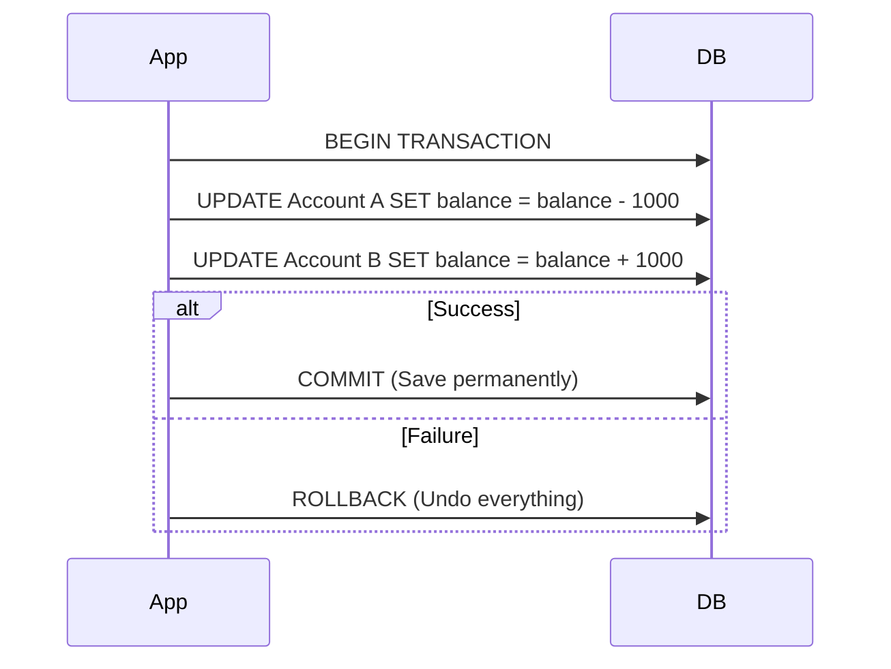

# Database Transactions & Isolation Levels

## 1. What is a Transaction? (The "All or Nothing" Rule)

A **Transaction** is a group of SQL statements that must be executed as a single unit. It follows the principle of **"All or Nothing"**.

**Real-world Example: Bank Transfer**
When you send $1,000 to a friend, the system must do two things:
1. Deduct $1,000 from your account.
2. Add $1,000 to your friend's account.

If step 1 succeeds but step 2 fails (due to a crash or power outage), you would lose your money. A Transaction ensures that if step 2 fails, step 1 is **Rolled back** as if it never happened.

---

## 2. ACID - The 4 Golden Standards of Database

For a Database to be considered "reliable," it must adhere to ACID:

| Letter | Meaning | Simple Explanation |
|:---:|:---|:---|
| **A** | **Atomicity** | All or nothing. No partial completion. |
| **C** | **Consistency** | Data must be valid according to rules (e.g., balance cannot be negative). |
| **I** | **Isolation** | Simultaneous transactions shouldn't mess with each other. |
| **D** | **Durability** | Once committed, data is permanent even if the server crashes. |

---

## 3. Isolation Levels

This is the **most important** part for interviews. It answers: **"When multiple users touch the same data, what do they see?"**

### 3.1. The "Horror" Phenomena
Without proper isolation, you encounter:
1. **Dirty Read:** Reading data that another user is currently editing but has **not yet committed**. If they Rollback, you're left with "trash" data.
2. **Non-Repeatable Read:** Reading the same row twice in one transaction gives two different results (because someone else modified and committed it in between).
3. **Phantom Read:** You count 10 users. Someone else inserts a new user. You count again and get 11.

### 3.2. Comparison of 4 Isolation Levels (SQL Standard)

| Level | Dirty Read | Non-repeatable | Phantom Read | Performance |
|:---|:---:|:---:|:---:|:---:|
| **Read Uncommitted** | ❌ Yes | ❌ Yes | ❌ Yes | Blazing Fast |
| **Read Committed** | ✅ No | ❌ Yes | ❌ Yes | Fast (Default for Postgres, Oracle) |
| **Repeatable Read** | ✅ No | ✅ No | ❌ Yes | Medium (Default for MySQL) |
| **Serializable** | ✅ No | ✅ No | ✅ No | Very Slow |

---

## 4. MVCC (Multi-Version Concurrency Control) - The Secret to Speed
How can modern databases handle thousands of transactions without "freezing"? 

Through **MVCC**. Instead of locking data every time someone reads, the DB creates different **versions** of the same row.
- **Readers** read a "Snapshot" of the data at a specific point in time.
- **Writers** create a new version.
👉 **Result:** Readers never have to wait for Writers, and vice versa.

---

## 5. Locking Mechanisms (When MVCC is not enough)

### 5.1. Pessimistic Locking
**Motto:** "Lock it immediately because I don't trust anyone."
You lock the row as soon as you read it. Others must wait in line until you finish.
*   **Use case:** High contention (e.g., booking the last seat on a flight).
*   **SQL:** `SELECT * FROM products WHERE id = 1 FOR UPDATE;`

### 5.2. Optimistic Locking
**Motto:** "I trust others; I'll just check for conflicts at the end."
You don't lock anything during the read. Instead, you use a `version` column.
1. Read data with `version = 1`.
2. When saving: `UPDATE ... SET version = 2 WHERE id = 1 AND version = 1`.
3. If someone else updated it first, the version is already 2, and your update fails.
*   **Use case:** Low contention (more Reads than Writes).

---

## 6. Interview "Closer" Questions

> **Q: Why not use Serializable for everything?**
>
> **A:** Because it forces transactions to run one by one. On a high-traffic site, the server would crash instantly due to the bottleneck. We must **Trade-off** between safety and performance.

> **Q: MySQL vs. PostgreSQL default isolation?**
>
> **A:** MySQL defaults to **Repeatable Read**, while PostgreSQL defaults to **Read Committed**. Understanding this helps in choosing the right DB for specific project requirements.
