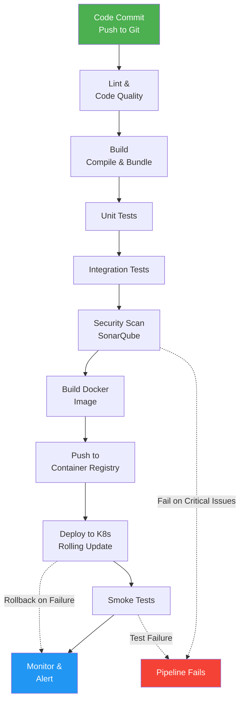

# DevOps — CI/CD

## 1. CI/CD Overview

**CI/CD** stands for **Continuous Integration** and **Continuous Delivery/Deployment**. It is a methodology that automates the process of integrating code changes, testing, and deploying software.

---

## 2. CI — Continuous Integration

**Continuous Integration** automatically builds and tests code on every commit, detecting integration issues early.

### 2.1. Core Principles

- **Commit frequently** — developers merge code changes multiple times per day
- **Automated builds** — every commit triggers an automated build
- **Automated tests** — unit, integration, and E2E tests run automatically
- **Fast feedback** — developers know immediately if their build fails

### 2.2. Benefits

| Benefit | Description |
|---------|-------------|
| Early bug detection | Catch issues before they reach production |
| Reduced integration risk | Frequent small merges are easier than big merges |
| Faster development | Automated pipeline speeds up the release cycle |
| Higher code quality | Enforced testing standards on every commit |

### 2.3. Popular CI Tools

| Tool | Description |
|------|-------------|
| **GitHub Actions** | Native CI/CD built into GitHub |
| **GitLab CI** | Integrated CI/CD in GitLab |
| **Jenkins** | Open-source, highly customizable |
| **CircleCI** | Cloud-based, fast execution |
| **Travis CI** | GitHub-integrated CI service |
| **Azure Pipelines** | Part of Azure DevOps |

---

## 3. CD — Continuous Delivery vs Deployment

### 3.1. Continuous Delivery

> Code is **always ready to deploy** to production after passing all tests. A **manual approval** step triggers the production deployment.

### 3.2. Continuous Deployment

> Code changes are **automatically deployed** to production after passing all stages of the pipeline. No manual intervention needed.

| | Continuous Delivery | Continuous Deployment |
|--|---------------------|-----------------------|
| **Approval step** | Manual | None (fully automated) |
| **Risk** | Lower (human gate) | Higher (full automation) |
| **Frequency** | Per release | Per commit |

---

## 4. Typical CI/CD Pipeline

### 4.1. Pipeline Stages

```
Commit → Build → Test → Security Scan → Staging Deploy → Production Deploy
  1        2       3         4              5               6
```

| Stage | Description |
|-------|-------------|
| **1. Commit** | Developer pushes code to version control |
| **2. Build** | Compile code, bundle assets, create artifacts |
| **3. Test** | Run unit tests, integration tests, linting |
| **4. Security Scan** | Check dependencies for vulnerabilities |
| **5. Staging Deploy** | Deploy to staging environment for QA |
| **6. Production Deploy** | Deploy to production (auto or manual) |

### 4.2. Complete CI/CD Pipeline Diagram



### 4.3. GitHub Actions Example

```yaml
name: CI Pipeline

on:
  push:
    branches: [main]
  pull_request:
    branches: [main]

jobs:
  build-and-test:
    runs-on: ubuntu-latest

    steps:
      - uses: actions/checkout@v4

      - name: Setup Node.js
        uses: actions/setup-node@v4
        with:
          node-version: '20'
          cache: 'npm'

      - name: Install dependencies
        run: npm ci

      - name: Run linter
        run: npm run lint

      - name: Run unit tests
        run: npm test

      - name: Build
        run: npm run build

      - name: Upload artifacts
        uses: actions/upload-artifact@v4
        with:
          name: dist
          path: dist/

### 4.4. GitHub Actions — Advanced Workflow (Matrix, Cache, Docker, Helm/K8s)

This complete workflow demonstrates a production-grade CI/CD pipeline with matrix testing, dependency caching, Docker builds, and Kubernetes deployments via Helm.

```yaml
# .github/workflows/ci-cd.yml
name: CI/CD Pipeline

on:
  push:
    branches: [main]
  pull_request:
    branches: [main]

env:
  REGISTRY: ghcr.io
  IMAGE_NAME: ${{ github.repository }}
  HELM_VERSION: 3.14.0

jobs:
  # ── Stage 1: Build & Test with Matrix Strategy ──────────────────────
  build-and-test:
    runs-on: ubuntu-latest
    timeout-minutes: 30

    # Test across multiple Node.js versions and OSes
    strategy:
      matrix:
        os: [ubuntu-latest]
        node-version: [18.x, 20.x, 22.x]
      fail-fast: false

    steps:
      - name: Checkout code
        uses: actions/checkout@v4

      - name: Setup Node.js ${{ matrix.node-version }}
        uses: actions/setup-node@v4
        with:
          node-version: ${{ matrix.node-version }}
          cache: 'npm'

      # Cache node_modules for faster builds
      - name: Cache node_modules
        uses: actions/cache@v4
        id: cache-npm
        with:
          path: node_modules
          key: ${{ runner.os }}-node-${{ matrix.node-version }}-${{ hashFiles('package-lock.json') }}
          restore-keys: |
            ${{ runner.os }}-node-${{ matrix.node-version }}-

      - name: Install dependencies
        if: steps.cache-npm.outputs.cache-hit != 'true'
        run: npm ci

      - name: Lint
        run: npm run lint
        continue-on-error: false

      - name: Type check
        run: npm run type-check

      - name: Run unit tests
        run: npm test -- --coverage --ci
        env:
          CI: true

      - name: Run integration tests
        run: npm run test:integration
        env:
          CI: true

      - name: Build
        run: npm run build
        env:
          NODE_ENV: production

      - name: Upload build artifacts
        uses: actions/upload-artifact@v4
        with:
          name: dist-${{ matrix.node-version }}
          path: dist/
          retention-days: 7

      - name: Upload coverage
        if: always()
        uses: codecov/codecov-action@v4
        with:
          token: ${{ secrets.CODECOV_TOKEN }}
          files: ./coverage/lcov.info
          fail_ci_if_error: false

  # ── Stage 2: Security Scan ───────────────────────────────────────────
  security-scan:
    runs-on: ubuntu-latest
    needs: build-and-test
    timeout-minutes: 15

    steps:
      - uses: actions/checkout@v4

      - name: Run Trivy vulnerability scanner
        uses: aquasecurity/trivy-action@master
        with:
          scan-type: 'fs'
          scan-ref: '.'
          format: 'sarif'
          output: 'trivy-results.sarif'

      - name: Upload Trivy results to GitHub Security
        uses: github/codeql-action/upload-sarif@v3
        with:
          sarif_file: 'trivy-results.sarif'

      - name: Check Docker images for vulnerabilities
        uses: aquasecurity/trivy-action@master
        with:
          image-ref: 'docker.io/library/nginx:alpine'
          format: 'table'
          exit-code: '1'
          severity: 'CRITICAL,HIGH'

  # ── Stage 3: Build & Push Docker Image ──────────────────────────────
  docker:
    runs-on: ubuntu-latest
    needs: [build-and-test, security-scan]
    timeout-minutes: 20
    permissions:
      contents: read
      packages: write

    steps:
      - name: Checkout code
        uses: actions/checkout@v4

      - name: Download build artifacts
        uses: actions/download-artifact@v4
        with:
          path: dist/

      - name: Set up Docker Buildx
        uses: docker/setup-buildx-action@v3

      - name: Log in to Container Registry
        uses: docker/login-action@v3
        with:
          registry: ${{ env.REGISTRY }}
          username: ${{ github.actor }}
          password: ${{ secrets.GITHUB_TOKEN }}

      # Extract metadata for tags
      - name: Extract metadata
        id: meta
        uses: docker/metadata-action@v5
        with:
          images: ${{ env.REGISTRY }}/${{ env.IMAGE_NAME }}
          tags: |
            type=sha,prefix=,suffix=,format=short
            type=ref,event=branch
            type=semver,pattern={{version}}
            type=semver,pattern={{major}}.{{minor}}
            type=raw,value=latest,enable=${{ github.ref == 'refs/heads/main' }}

      # Build and push with layer caching (GitHub Actions cache)
      - name: Build and push Docker image
        uses: docker/build-push-action@v5
        with:
          context: .
          push: ${{ github.event_name != 'pull_request' }}
          tags: ${{ steps.meta.outputs.tags }}
          labels: ${{ steps.meta.outputs.labels }}
          cache-from: type=gha
          cache-to: type=gha,mode=max
          outputs: type=image,name=${{ env.REGISTRY }}/${{ env.IMAGE_NAME }},push-by-digest=true
          add-hosts: |
            host.docker.internal:host-gateway

  # ── Stage 4: Deploy to Kubernetes with Helm ──────────────────────────
  deploy-staging:
    runs-on: ubuntu-latest
    needs: docker
    environment: staging
    timeout-minutes: 30

    steps:
      - name: Checkout code
        uses: actions/checkout@v4

      - name: Set up Helm
        uses: azure/setup-helm@v4
        with:
          version: ${{ env.HELM_VERSION }}

      - name: Configure kubectl
        uses: azure/k8s-set-context@v3
        with:
          kubeconfig: ${{ secrets.KUBE_CONFIG_STAGING }}

      - name: Add Helm repo
        run: helm repo add bitnami https://charts.bitnami.com/bitnami && helm repo update

      - name: Render Helm template
        run: |
          helm template ./charts/myapp \
            --namespace staging \
            --set image.repository=${{ env.REGISTRY }}/${{ env.IMAGE_NAME }} \
            --set image.tag=${{ github.sha }} \
            --set replicaCount=2 \
            > rendered.yaml

      - name: Deploy to Staging via Helm
        run: |
          helm upgrade --install myapp ./charts/myapp \
            --namespace staging \
            --create-namespace \
            --wait \
            --timeout 5m \
            --atomic \
            --set image.repository=${{ env.REGISTRY }}/${{ env.IMAGE_NAME }} \
            --set image.tag=${{ github.sha }} \
            --set replicaCount=2 \
            --set strategy.type=RollingUpdate \
            --set strategy.rollingUpdate.maxUnavailable=0 \
            --set strategy.rollingUpdate.maxSurge=1

      - name: Run smoke tests against staging
        run: |
          sleep 10
          curl -sf https://staging.myapp.com/health || exit 1
          curl -sf https://staging.myapp.com/api/v1/actuator/health || exit 1

  deploy-production:
    runs-on: ubuntu-latest
    needs: deploy-staging
    environment: production
    timeout-minutes: 45

    steps:
      - name: Checkout code
        uses: actions/checkout@v4

      - name: Set up Helm
        uses: azure/setup-helm@v4
        with:
          version: ${{ env.HELM_VERSION }}

      - name: Configure kubectl
        uses: azure/k8s-set-context@v3
        with:
          kubeconfig: ${{ secrets.KUBE_CONFIG_PRODUCTION }}

      - name: Deploy to Production (Canary strategy)
        run: |
          # Phase 1: Deploy canary (1 replica = 10% traffic if prod has 10 replicas)
          helm upgrade --install myapp ./charts/myapp \
            --namespace production \
            --create-namespace \
            --wait \
            --timeout 10m \
            --atomic \
            --set image.repository=${{ env.REGISTRY }}/${{ env.IMAGE_NAME }} \
            --set image.tag=${{ github.sha }} \
            --set replicaCount=1 \
            --set canary.enabled=true \
            --set canary.weight=10

      - name: Wait and monitor canary metrics
        run: |
          echo "Waiting 60s for canary to stabilize..."
          sleep 60
          echo "Checking error rates on canary..."
          # In production, integrate with Prometheus/Grafana APIs here

      - name: Full production rollout (Rolling)
        run: |
          helm upgrade --install myapp ./charts/myapp \
            --namespace production \
            --wait \
            --timeout 15m \
            --atomic \
            --set image.repository=${{ env.REGISTRY }}/${{ env.IMAGE_NAME }} \
            --set image.tag=${{ github.sha }} \
            --set replicaCount=10 \
            --set canary.enabled=false \
            --set strategy.type=RollingUpdate \
            --set strategy.rollingUpdate.maxUnavailable=1 \
            --set strategy.rollingUpdate.maxSurge=2

      - name: Notify on Slack
        if: always()
        uses: slackapi/slack-github-action@v1.26.0
        with:
          payload: |
            {
              "text": "*Deployment ${{ job.status }}*\nApp: ${{ github.event.repository.name }}\nCommit: `${{ github.sha }}`\nRef: `${{ github.ref }}`\nAuthor: ${{ github.actor }}"
            }
        env:
          SLACK_WEBHOOK_URL: ${{ secrets.SLACK_WEBHOOK_URL }}
          SLACK_WEBHOOK_TYPE: INCOMING_WEBHOOK
```

Key features in this pipeline:
- **Matrix strategy** tests on multiple Node.js versions in parallel
- **Cache** stores `node_modules` between runs to speed up builds
- **Docker Buildx** with GitHub Actions cache for efficient layer caching
- **Helm** manages K8s deployments with `RollingUpdate` and canary strategies
- **Atomic** helm upgrades auto-rollback on failure
- **Environment protection** requires manual approval for production deployments

### 4.5. GitLab CI Example

```yaml
stages:
  - build
  - test
  - deploy

variables:
  NODE_VERSION: "20"

before_script:
  - npm ci

build:
  stage: build
  script:
    - npm run build
  artifacts:
    paths:
      - dist/

test:
  stage: test
  script:
    - npm test
    - npm run lint

deploy_production:
  stage: deploy
  script:
    - echo "Deploying to production..."
  only:
    - main
```

---

## 5. Environment Management

### 5.1. Environments

| Environment | Purpose |
|-------------|---------|
| **Development** | Local development and feature testing |
| **Staging** | Pre-production testing mirror of production |
| **Production** | Live environment serving end users |
| **QA** | Dedicated environment for QA testing |

### 5.2. Branching Strategy

| Strategy | Description |
|----------|-------------|
| **Trunk-based** | All developers commit to a single branch (`main`) frequently |
| **GitFlow** | Use `develop`, `feature/*`, `release/*`, `hotfix/*` branches |
| **GitHub Flow** | Simple model: `main` + feature branches, deploy from `main` |

---

## 6. Deployment Strategies

### 6.1. Rolling Deployment

Gradually replace instances of the previous version with the new version.

### 6.2. Blue-Green Deployment

Maintain two identical environments. Switch traffic from blue (old) to green (new) instantly.

### 6.3. Canary Deployment

Deploy to a small subset of users first, then gradually increase.

### 6.4. Deployment Strategies in Pipeline Context

In CI/CD pipelines, the deployment strategy determines how new versions reach production:

- **Rolling** — Pipeline incrementally replaces pods. Suitable for Kubernetes with `RollingUpdate` strategy. Each step waits for the new pod to be ready before terminating the old one. Pipeline can auto-detect failure via `kubectl rollout status`.

- **Blue-Green** — Pipeline deploys the "green" environment in parallel, then flips the load balancer. Instant traffic switch enables instant rollback by reverting the load balancer. Pipeline waits for smoke tests on green before cutting over.

- **Canary** — Pipeline routes a small percentage (e.g., 5-10%) of traffic to the new version. Automated metrics (error rate, latency) are monitored. Pipeline auto-promotes or auto-rolls back based on thresholds.

```yaml
# Pipeline pseudo-code showing deployment strategy selection
deploy:
  stage: deploy
  script:
    - |
      if [ "$DEPLOY_STRATEGY" == "canary" ]; then
        kubectl apply -f k8s/canary-deployment.yaml
        ./scripts/wait-for-metrics.sh --threshold-error-rate=1%
        kubectl patch hpa myapp -p '{"spec":{"replicas":10}}'
      elif [ "$DEPLOY_STRATEGY" == "blue-green" ]; then
        kubectl apply -f k8s/green-deployment.yaml
        ./scripts/smoke-tests.sh https://green.myapp.com
        kubectl patch service myapp -p '{"spec":{"selector":{"version":"green"}}}'
      else
        kubectl apply -f k8s/deployment.yaml
        kubectl rollout status deployment/myapp
      fi
```

### 6.5. Feature Flags

Toggle features on/off without redeploying. Enables gradual rollouts and quick rollbacks.

---

## 7. Interview Questions

**Q: What is the difference between CI and CD?**

> **CI** (Continuous Integration) automates building and testing code on every commit. **CD** (Continuous Delivery/Deployment) automates releasing the code to environments. Delivery requires manual approval; Deployment is fully automated.

**Q: How do you handle secrets in CI/CD?**

> Use secret management tools (AWS Secrets Manager, HashiCorp Vault), or inject secrets via CI/CD environment variables that are encrypted at rest. Never hardcode secrets in pipeline configuration files.

**Q: What is a pipeline artifact?**

> An **artifact** is a file or collection of files produced during a pipeline stage (e.g., a compiled binary, a Docker image). Artifacts can be passed between stages or stored for later retrieval.
