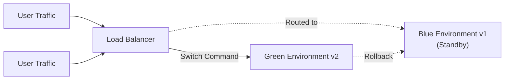
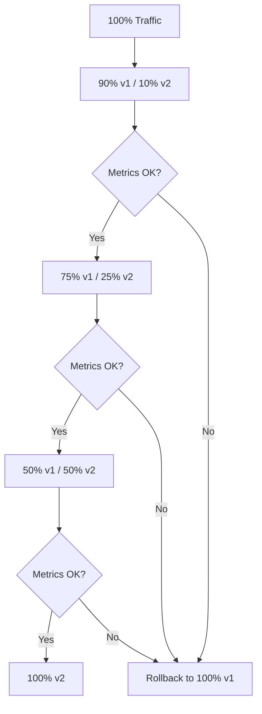
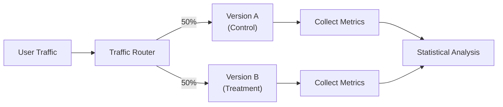

# DevOps - Deployment Strategies

## 1. Overview

Deployment strategies define how software is released to production environments. Choosing the right strategy depends on your tolerance for downtime, risk, infrastructure complexity, and business requirements.

| Strategy | Downtime | Complexity | Rollback Speed | Risk |
|----------|----------|------------|----------------|------|
| **Recreate** | Required | Low | Slow | High |
| **Rolling Update** | None | Low | Fast | Medium |
| **Blue-Green** | None | Medium | Instant | Low |
| **Canary** | None | High | Gradual | Very Low |
| **Feature Flags** | None | Medium | Instant | Very Low |

---

## 2. Recreate (Lift-and-Shift)

The **Recreate** strategy terminates all existing instances and deploys new ones simultaneously.

```bash
# Example: Terminate old version, deploy new version
kubectl delete deployment myapp
kubectl apply -f deployment-v2.yaml
```

### Pros
- Simple to implement and understand
- No infrastructure overhead (only one version running at a time)
- Clean state — fresh deployment every time

### Cons
- **Downtime required** during the transition
- Not suitable for production systems requiring high availability
- Risk of data loss if database schema changes

### When to Use
- Development/staging environments
- Non-critical services with acceptable downtime windows
- When infrastructure costs must be minimized

---

## 3. Rolling Update

Kubernetes' **default deployment strategy**. Old pods are replaced gradually, one by one (or in configurable batches), ensuring continuous availability.

### 3.1. Key Parameters

```yaml
apiVersion: apps/v1
kind: Deployment
metadata:
  name: myapp
spec:
  replicas: 5
  strategy:
    type: RollingUpdate
    rollingUpdate:
      maxSurge: 1        # Additional pods above desired count
      maxUnavailable: 0 # Pods that can be unavailable during update
  template:
    spec:
      containers:
        - name: myapp
          image: myapp:v2
```

| Parameter | Value | Behavior |
|-----------|-------|----------|
| `maxSurge=1, maxUnavailable=0` | Conservative | 1 extra pod at a time, no downtime |
| `maxSurge=2, maxUnavailable=0` | Faster | 2 extra pods simultaneously |
| `maxSurge=0, maxUnavailable=1` | Aggressive | Replace 1 pod at a time |
| `maxSurge=25%, maxUnavailable=25%` | Percentage-based | % of total replicas |

### 3.2. Rollback

```bash
# Check rollout status
kubectl rollout status deployment/myapp

# Rollback to previous version
kubectl rollout undo deployment/myapp

# Rollback to specific revision
kubectl rollout history deployment/myapp
kubectl rollout undo deployment/myapp --to-revision=2
```

### Pros
- Zero downtime (with proper configuration)
- No additional infrastructure required
- Built-in Kubernetes support
- Gradual risk exposure

### Cons
- Slow for large clusters (updating pod by pod)
- Two versions run simultaneously during transition
- Database migrations require careful schema versioning
- Cannot serve old and new API versions simultaneously

---

## 4. Blue-Green Deployment

Two **identical environments** run in parallel. Traffic is switched instantly from the blue (current production) to the green (new version) via a load balancer.



### 4.1. Implementation with Kubernetes

```yaml
# Blue Deployment (current)
apiVersion: apps/v1
kind: Deployment
metadata:
  name: myapp-blue
spec:
  replicas: 5
  selector:
    matchLabels:
      app: myapp
      version: blue
  template:
    metadata:
      labels:
        app: myapp
        version: blue
    spec:
      containers:
        - name: myapp
          image: myapp:v1

---
# Green Deployment (new)
apiVersion: apps/v1
kind: Deployment
metadata:
  name: myapp-green
spec:
  replicas: 5
  selector:
    matchLabels:
      app: myapp
      version: green
  template:
    metadata:
      labels:
        app: myapp
        version: green
    spec:
      containers:
        - name: myapp
          image: myapp:v2

---
# Service switches between blue and green
apiVersion: v1
kind: Service
metadata:
  name: myapp-service
spec:
  selector:
    app: myapp
    version: blue    # Change to "green" to switch traffic
  ports:
    - port: 80
      targetPort: 8080
```

### 4.2. Switching Traffic

```bash
# Switch from blue to green
kubectl patch service myapp-service -p '{"spec":{"selector":{"version":"green"}}}'

# Instant rollback
kubectl patch service myapp-service -p '{"spec":{"selector":{"version":"blue"}}}'
```

### Pros
- **Instant switch** — zero downtime
- **Instant rollback** — switch back to blue in seconds
- Easy to test green environment fully before production traffic
- Risk-free testing with production-like environment

### Cons
- **Doubles infrastructure cost** (two environments always running)
- Database schema changes require careful migration strategy
- Network/routing complexity
- Large data synchronization challenges

---

## 5. Canary Deployment

Gradually shift a **small percentage of traffic** to the new version, monitor metrics, and progressively increase traffic if everything looks healthy.



### 5.1. Kubernetes Canary with Multiple Deployments

```yaml
# Stable version (receives majority of traffic)
apiVersion: apps/v1
kind: Deployment
metadata:
  name: myapp-stable
spec:
  replicas: 10
  selector:
    matchLabels:
      app: myapp
      track: stable
  template:
    metadata:
      labels:
        app: myapp
        track: stable
    spec:
      containers:
        - name: myapp
          image: myapp:v1

---
# Canary version (receives small portion)
apiVersion: apps/v1
kind: Deployment
metadata:
  name: myapp-canary
spec:
  replicas: 2    # 2 out of 12 total = ~16% traffic
  selector:
    matchLabels:
      app: myapp
      track: canary
  template:
    metadata:
      labels:
        app: myapp
        track: canary
    spec:
      containers:
        - name: myapp
          image: myapp:v2
```

### 5.2. Istio Traffic Management for Canary

```yaml
apiVersion: networking.istio.io/v1alpha3
kind: VirtualService
metadata:
  name: myapp
spec:
  hosts:
    - myapp
  http:
    - route:
        - destination:
            host: myapp
            subset: v1
          weight: 90
        - destination:
            host: myapp
            subset: v2
          weight: 10   # Start with 10%

---
apiVersion: networking.istio.io/v1alpha3
kind: DestinationRule
metadata:
  name: myapp
spec:
  host: myapp
  subsets:
    - name: v1
      labels:
        version: v1
    - name: v2
      labels:
        version: v2
```

```bash
# Gradually increase canary traffic
kubectl patch virtualservice myapp --type merge -p '
{
  "spec": {
    "http": [{
      "route": [
        {"destination": {"host": "myapp", "subset": "v1"}, "weight": 75},
        {"destination": {"host": "myapp", "subset": "v2"}, "weight": 25}
      ]
    }]
  }
}'
```

### 5.3. Metrics-Based Promotion

Monitor these key metrics during canary evaluation:

```bash
# Prometheus queries for canary evaluation
# Error rate comparison
rate(http_requests_total{version="canary",status=~"5.."}[5m])
  > rate(http_requests_total{version="stable",status=~"5.."}[5m]) * 1.5

# Latency comparison
histogram_quantile(0.99, rate(http_request_duration_seconds_bucket{version="canary"}[5m]))
  > histogram_quantile(0.99, rate(http_request_duration_seconds_bucket{version="stable"}[5m])) * 1.2
```

### Pros
- **Real-world testing** with production traffic
- **Granular risk control** — only small % affected initially
- **Metrics-driven decisions** — data-based promotion/rollback
- Easy rollback without switching entire infrastructure

### Cons
- Complex routing and monitoring setup
- Requires sophisticated observability stack
- Session/state management challenges during split
- Still runs two versions in production simultaneously

---

## 6. Feature Flags

**Feature flags** (toggles) decouple deployment from release. Code is deployed to production, but new features are hidden behind a boolean flag that can be turned on/off without redeployment.

```typescript
// Feature flag implementation
const featureFlags = {
  newCheckoutFlow: false,
  darkModeUI: true,
  aiRecommendations: false,
};

// Usage in code
if (featureFlags.newCheckoutFlow) {
  return renderNewCheckoutFlow();
} else {
  return renderLegacyCheckout();
}
```

### 6.1. Gradual Rollout with Feature Flags

```typescript
// Percentage-based rollout
const userId = getUserId();
const percentage = 10; // 10% of users

const isEnabled = (hashString(userId + 'newCheckoutFlow') % 100) < percentage;
```

### 6.2. Popular Feature Flag Tools

| Tool | Provider | Notes |
|------|----------|-------|
| **LaunchDarkly** | SaaS | Enterprise-grade, comprehensive |
| **Unleash** | Open-source | Self-hosted option |
| **Flagsmith** | Open-source | API-first design |
| **Split.io** | SaaS | Data-driven decisions |

### Pros
- **Instant on/off** — no redeployment needed
- **Targeted rollouts** — enable for specific users, regions, or percentages
- **Kill switch** — instantly disable a broken feature
- **A/B testing** integration built-in
- Reduces merge conflicts in version control

### Cons
- Code complexity increases (flag spaghetti)
- Requires discipline to clean up old flags
- Security considerations (flags can expose features prematurely)
- Technical debt if not managed properly

---

## 7. A/B Testing

**A/B testing** splits traffic between versions to compare performance, user behavior, or conversion rates. Unlike canary (which is about risk reduction), A/B testing is about **optimization**.



### 7.1. A/B Testing Implementation

```yaml
# Service for Version A
apiVersion: v1
kind: Service
metadata:
  name: myapp-a
spec:
  selector:
    app: myapp
    version: a
  ports:
    - port: 80
      targetPort: 8080

---
# Service for Version B
apiVersion: v1
kind: Service
metadata:
  name: myapp-b
spec:
  selector:
    app: myapp
    version: b
  ports:
    - port: 80
      targetPort: 8080
```

```nginx
# Nginx load balancing with A/B split
upstream myapp {
    server myapp-a:8080 weight=50;
    server myapp-b:8080 weight=50;
}
```

### Key Metrics to Track

| Metric Type | Examples | Purpose |
|-------------|----------|---------|
| **Business** | Conversion rate, Revenue, Sign-ups | Direct business impact |
| **Behavioral** | Click-through, Time on page, Bounce rate | User engagement |
| **Technical** | Latency, Error rate, Load time | Performance |
| **Health** | Crash rate, API errors | Stability |

### A/B Testing vs Canary

| Aspect | A/B Testing | Canary Deployment |
|--------|------------|--------------------|
| **Goal** | Compare variants, find best | Reduce risk of new release |
| **Duration** | Days to weeks | Hours to days |
| **Traffic split** | Pre-defined, equal | Gradually increasing |
| **Decision** | Which version wins | Is new version safe? |
| **Metrics** | Statistical significance | Error rates, latency |

---

## 8. Kubernetes Deployment Strategies Configuration

### 8.1. Recreate Strategy

```yaml
spec:
  strategy:
    type: Recreate
```

### 8.2. Rolling Update (Default)

```yaml
spec:
  strategy:
    type: RollingUpdate
    rollingUpdate:
      maxSurge: 1
      maxUnavailable: 0
```

### 8.3. Custom Canary with HPA

```yaml
# Canary starts with 0 replicas, gradually scaled
apiVersion: apps/v1
kind: Deployment
metadata:
  name: myapp-canary
spec:
  replicas: 0  # Start at 0, manually scale up
  strategy:
    type: RollingUpdate
    rollingUpdate:
      maxSurge: 1
      maxUnavailable: 0
```

```bash
# Progressive traffic shift
kubectl scale deployment myapp-canary --replicas=1  # 5%
kubectl scale deployment myapp-canary --replicas=3  # 15%
kubectl scale deployment myapp-canary --replicas=5  # 25%
kubectl scale deployment myapp-canary --replicas=10  # 50%
# ... monitor metrics between each step
```

---

## 9. Rollback Strategies

### 9.1. Rolling Update Rollback

```bash
# Instant rollback to previous version
kubectl rollout undo deployment/myapp

# Rollback to specific revision
kubectl rollout undo deployment/myapp --to-revision=3

# Monitor rollback progress
kubectl rollout status deployment/myapp
```

### 9.2. Blue-Green Rollback

```bash
# Instant — just switch the selector back
kubectl patch service myapp-service -p '{"spec":{"selector":{"version":"blue"}}}'
```

### 9.3. Canary Rollback

```bash
# Remove canary by scaling to zero
kubectl scale deployment myapp-canary --replicas=0

# Or reduce traffic percentage
kubectl patch virtualservice myapp -p '{
  "spec":{"http":[{"route":[
    {"destination":{"host":"myapp","subset":"v1"},"weight":100},
    {"destination":{"host":"myapp","subset":"v2"},"weight":0}
  ]}]}
}'
```

### 9.4. Feature Flag Rollback

```typescript
// Simply disable the flag — no redeployment needed
featureFlags.newCheckoutFlow = false;  // Instantly routes to legacy flow
```

---

## 10. Interview Questions

**Q: What is the difference between blue-green and canary deployment?**

> **Blue-Green** maintains two complete environments and switches 100% of traffic at once. It provides instant rollback but doubles infrastructure costs. **Canary** gradually shifts a percentage of traffic (e.g., 5% -> 25% -> 100%), allowing real-world testing with minimal risk while using existing infrastructure.

**Q: When would you use the Recreate strategy?**

> Recreate is appropriate when you cannot run two versions simultaneously due to database schema incompatibilities, or when your application is stateless and downtime is acceptable. It is also useful for development/staging environments where simplicity is preferred over availability.

**Q: How do you handle database migrations with zero-downtime deployments?**

> Implement backward-compatible database migrations: (1) Add new columns/tables alongside old ones first, (2) Deploy new application code that works with both old and new schema, (3) Run migration to complete the schema change, (4) Deploy code that uses only the new schema. This is known as the **expand-contract pattern** or **parallel change**.

**Q: What are the trade-offs between maxSurge and maxUnavailable?**

> `maxSurge=1, maxUnavailable=0` is conservative — it ensures zero downtime but takes longer to complete. `maxSurge=0, maxUnavailable=1` is aggressive — it completes faster but briefly reduces total capacity. `maxSurge=2, maxUnavailable=0` balances speed and availability. Choose based on your cluster capacity and tolerance for temporary resource overhead.
