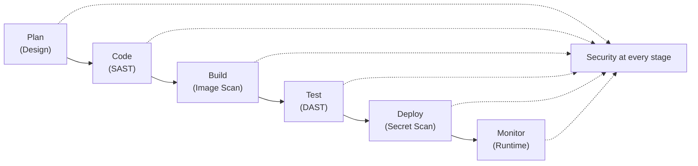
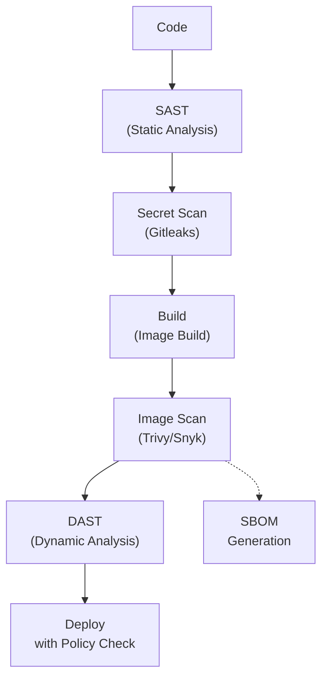

# DevOps - DevOps Security

## 1. Overview: Shift-Left Security

**DevOps Security** integrates security practices throughout the entire software development lifecycle (SDLC), not just at the end. This "shift-left" approach means security is considered from the design phase through development, CI/CD, and production.



---

## 2. Secret Management

Secrets include API keys, passwords, tokens, certificates, and any sensitive data that should not be hardcoded.

### 2.1. Kubernetes Secrets

Kubernetes Secrets store sensitive data as base64-encoded strings. They are NOT encrypted by default (only encoded). For production, enable encryption at rest.

```yaml
# Basic Kubernetes Secret (base64 encoded)
apiVersion: v1
kind: Secret
metadata:
  name: app-secrets
type: Opaque
data:
  DB_PASSWORD: c3VwZXItc2VjcmV0  # echo -n 'super-secret' | base64
  API_KEY: YXBpLWtleS1oZXJl

---
# Better: use stringData (auto-encoded at creation)
apiVersion: v1
kind: Secret
metadata:
  name: app-secrets
type: Opaque
stringData:
  DB_PASSWORD: super-secret
  API_KEY: api-key-here
```

### 2.2. Enable Encryption at Rest for Kubernetes Secrets

```yaml
# encryption-config.yaml
apiVersion: apiserver.config.k8s.io/v1
kind: EncryptionConfiguration
resources:
  - resources:
      - secrets
    providers:
      - aescbc:
          keys:
            - name: key1
              secret: <base64-encoded-32-byte-key>
      - identity: {}  # Fallback for existing unencrypted secrets
```

```bash
# Add to kube-apiserver flags
--encryption-provider-config=/path/to/encryption-config.yaml

# Re-encrypt existing secrets
kubectl get secrets --all-namespaces -o json | \
  kubectl replace -f -
```

### 2.3. HashiCorp Vault

**Vault** is a tool for securely accessing secrets. It provides encryption, dynamic secrets, secret revocation, and audit logging.

```bash
# Start Vault in dev mode
vault server -dev

# Enable secrets engine
vault secrets enable -path=myapp kv-v2

# Write a secret
vault kv put myapp/prod DB_PASSWORD="db-secret-password"
vault kv put myapp/prod API_KEY="api-key-value"

# Read a secret
vault kv get myapp/prod

# Create policy
vault policy write myapp-policy - <<'EOF'
path "myapp/data/prod" {
  capabilities = ["read"]
}
EOF
```

```bash
# Kubernetes auth method
vault auth enable kubernetes

# Configure Kubernetes auth
vault write auth/kubernetes/config \
    kubernetes_host="https://$KUBERNETES_PORT_443_TCP_ADDR:443" \
    token_reviewer_jwt="$(cat /var/run/secrets/kubernetes.io/serviceaccount/token)" \
    kubernetes_ca_cert=@/var/run/secrets/kubernetes.io/serviceaccount/ca.crt
```

### 2.4. AWS Secrets Manager

```bash
# Store a secret
aws secretsmanager create-secret \
    --name myapp/prod/db-password \
    --secret-string '{"username":"admin","password":"secret123"}'

# Retrieve secret
aws secretsmanager get-secret-value \
    --secret-id myapp/prod/db-password

# Rotation with Lambda
aws secretsmanager put-secret-value \
    --secret-id myapp/prod/db-password \
    --secret-string '{"username":"admin","password":"new-secret"}'
```

```yaml
# Kubernetes pod using AWS Secrets Manager via IRSA
apiVersion: v1
kind: Pod
metadata:
  name: myapp
spec:
  serviceAccountName: myapp-sa
  containers:
    - name: app
      image: myapp:latest
      env:
        - name: DB_PASSWORD
          valueFrom:
            secretKeyRef:
              name: aws-secrets
              key: db-password
---
# IRSA (IAM Role for Service Accounts)
apiVersion: v1
kind: ServiceAccount
metadata:
  name: myapp-sa
  annotations:
    eks.amazonaws.com/role-arn: arn:aws:iam::123456789:role/myapp-role
```

### 2.5. Secret Scanning Tools

| Tool | What It Scans | Stage |
|------|--------------|-------|
| **Gitleaks** | Git repositories for secrets | Pre-commit, CI/CD |
| **TruffleHog** | Git history for committed secrets | CI/CD |
| **GitGuardian** | Real-time scanning of all commits | CI/CD, PR |
| **Detect-Secrets** | Pre-commit, Python-based | Pre-commit |
| **Spectral** | CI/CD pipelines and code | CI/CD |

```bash
# Gitleaks
gitleaks protect -v --source=. --config=gitleaks.toml

# TruffleHog
trufflehog filesystem .

# Git pre-commit hook
# .pre-commit-config.yaml
repos:
  - repo: https://github.com/gitleaks/gitleaks
    rev: v8.18.0
    hooks:
      - id: gitleaks
```

---

## 3. RBAC in Kubernetes

**Role-Based Access Control (RBAC)** restricts who can access Kubernetes resources and what they can do with them.

### 3.1. Core RBAC Concepts

| Object | Scope | Description |
|--------|-------|-------------|
| **Role** | Namespace | Grants permissions within a specific namespace |
| **ClusterRole** | Cluster-wide | Grants permissions across all namespaces or to cluster-scoped resources |
| **RoleBinding** | Namespace | Binds a Role/ClusterRole to users within a namespace |
| **ClusterRoleBinding** | Cluster-wide | Binds a ClusterRole to users across the entire cluster |

### 3.2. Role and RoleBinding

```yaml
# Define permissions in a Role
apiVersion: rbac.authorization.k8s.io/v1
kind: Role
metadata:
  namespace: production
  name: app-developer
rules:
  - apiGroups: [""]
    resources: ["pods", "services", "configmaps"]
    verbs: ["get", "list", "watch"]
  - apiGroups: ["apps"]
    resources: ["deployments"]
    verbs: ["get", "list", "watch", "update"]
  - apiGroups: [""]
    resources: ["pods/log"]
    verbs: ["get"]
  - apiGroups: [""]
    resources: ["pods/exec"]
    verbs: ["create"]
  - apiGroups: [""]
    resources: ["secrets"]
    verbs: ["get"]   # Read-only access to secrets

---
# Bind the Role to a user
apiVersion: rbac.authorization.k8s.io/v1
kind: RoleBinding
metadata:
  name: app-developer-binding
  namespace: production
subjects:
  - kind: User
    name: developer@example.com
    apiGroup: rbac.authorization.k8s.io
  - kind: Group
    name: developers
    apiGroup: rbac.authorization.k8s.io
roleRef:
  kind: Role
  name: app-developer
  apiGroup: rbac.authorization.k8s.io
```

### 3.3. ClusterRole and ClusterRoleBinding

```yaml
# ClusterRole for monitoring tools (needs cluster-wide read access)
apiVersion: rbac.authorization.k8s.io/v1
kind: ClusterRole
metadata:
  name: monitoring-reader
rules:
  - apiGroups: [""]
    resources: ["nodes", "pods", "services", "namespaces", "events"]
    verbs: ["get", "list", "watch"]
  - apiGroups: ["metrics.k8s.io"]
    resources: ["pods", "nodes"]
    verbs: ["get", "list"]

---
apiVersion: rbac.authorization.k8s.io/v1
kind: ClusterRoleBinding
metadata:
  name: prometheus-monitoring
subjects:
  - kind: ServiceAccount
    name: prometheus
    namespace: monitoring
roleRef:
  kind: ClusterRole
  name: monitoring-reader
  apiGroup: rbac.authorization.k8s.io
```

### 3.4. Best Practices

```bash
# Principle of least privilege: grant only what is needed
# Use ServiceAccounts for applications, not user accounts
# Audit RBAC with kubectl
kubectl auth can-i list pods --as=developer@example.com -n production
kubectl auth can-i get secrets --as=developer@example.com -n production

# Check what permissions a user has
kubectl auth whoami
```

---

## 4. Kubernetes Network Policies

**NetworkPolicy** restricts network traffic to/from pods. By default, all pods can communicate with all other pods ( Kubernetes permissive networking).

### 4.1. Default Deny All

```yaml
# Deny all ingress traffic in a namespace
apiVersion: networking.k8s.io/v1
kind: NetworkPolicy
metadata:
  name: default-deny-ingress
  namespace: production
spec:
  podSelector: {}
  policyTypes:
    - Ingress

---
# Deny all egress traffic
apiVersion: networking.k8s.io/v1
kind: NetworkPolicy
metadata:
  name: default-deny-egress
  namespace: production
spec:
  podSelector: {}
  policyTypes:
    - Egress
```

### 4.2. Allow Specific Traffic

```yaml
# Allow traffic to frontend from ingress only
apiVersion: networking.k8s.io/v1
kind: NetworkPolicy
metadata:
  name: frontend-policy
  namespace: production
spec:
  podSelector:
    matchLabels:
      app: frontend
  policyTypes:
    - Ingress
  ingress:
    - from:
        - namespaceSelector:
            matchLabels:
              name: ingress-nginx
      ports:
        - protocol: TCP
          port: 8080

---
# Allow backend to access database only
apiVersion: networking.k8s.io/v1
kind: NetworkPolicy
metadata:
  name: database-policy
  namespace: production
spec:
  podSelector:
    matchLabels:
      app: database
  policyTypes:
    - Ingress
  ingress:
    - from:
        - podSelector:
            matchLabels:
              app: backend
      ports:
        - protocol: TCP
          port: 5432

---
# Allow DNS egress
apiVersion: networking.k8s.io/v1
kind: NetworkPolicy
metadata:
  name: allow-dns
  namespace: production
spec:
  podSelector: {}
  policyTypes:
    - Egress
  egress:
    - to:
        - namespaceSelector:
            matchLabels:
              kubernetes.io/metadata.name: kube-system
      ports:
        - protocol: UDP
          port: 53
        - protocol: TCP
          port: 53
```

> **Important:** NetworkPolicy requires a CNI plugin that supports it (Calico, Cilium, Weave). Default Kubernetes does NOT enforce network policies.

---

## 5. Container Image Scanning

Image scanning detects vulnerabilities in container images before deployment.

### 5.1. Trivy

```bash
# Scan a Docker image
trivy image myapp:latest

# Scan with severity filter
trivy image --severity HIGH,CRITICAL myapp:latest

# Scan a Dockerfile for misconfigurations
trivy config ./dockerfile .

# Scan in CI/CD (fail on HIGH/CRITICAL)
trivy image \
    --exit-code 1 \
    --severity HIGH,CRITICAL \
    --ignore-unfixed \
    myapp:$BUILD_NUMBER
```

### 5.2. Clair

```bash
# Run Clair with PostgreSQL
docker run -p 5432:5432 -d --name clair-db arminc/clair-db:2021-05-27
docker run -p 6060:6060 --link clair-db:postgres \
    -d --name clair arminc/clair-local-scan-service:latest

# Analyze an image
curl -X POST http://localhost:6060/clair/v1/layers \
    -H "Content-Type: application/json" \
    -d '{"Layer":{"LayerName":"sha256:abc123","Layer":{"Format":"Docker","Layer":{"Name":"sha256:abc123"}}}'
```

### 5.3. Snyk Container

```bash
# Authenticate
snyk auth

# Test container image
snyk container test myapp:latest

# Test and monitor for new vulnerabilities
snyk container monitor myapp:latest
```

### Comparison of Image Scanners

| Tool | Type | Database | CI/CD Integration | SAST |
|------|------|----------|-------------------|------|
| **Trivy** | Open-source | VulnDB, Security advisories | Native | Yes (IaC scanning) |
| **Clair** | Open-source | Security advisories | API-based | No |
| **Snyk** | SaaS | Proprietary | Native | Yes |
| **Anchore** | Open-source/SaaS | Security advisories | Native | Yes |
| ** Grype** | Open-source | SBOM-based | Native | Yes (IaC) |

---

## 6. Security Scanning in CI/CD Pipeline

A comprehensive CI/CD security pipeline should include multiple scanning stages.



### 6.1. Complete Security Pipeline Example

```groovy
// Jenkinsfile with security stages
pipeline {
    agent any

    stages {
        stage('SAST - Static Analysis') {
            steps {
                echo 'Running SAST with SonarQube...'
                withCredentials([string(credentialsId: 'sonarqube-token', variable: 'SONAR_TOKEN')]) {
                    sh '''
                        sonar-scanner \
                            -Dsonar.projectKey=myapp \
                            -Dsonar.host.url=http://sonarqube:9000 \
                            -Dsonar.token=$SONAR_TOKEN
                    '''
                }
            }
        }

        stage('Secret Scanning') {
            steps {
                echo 'Scanning for secrets...'
                sh 'gitleaks protect -v --source=. --config=gitleaks.toml || true'
            }
        }

        stage('Dependency Check') {
            steps {
                echo 'Checking for vulnerable dependencies...'
                sh 'npm audit --audit-level=high || true'
                sh 'trivy fs --severity HIGH,CRITICAL .'
            }
        }

        stage('Build & Scan Image') {
            steps {
                echo 'Building and scanning container image...'
                sh '''
                    docker build -t myapp:$BUILD_NUMBER .
                    trivy image \
                        --exit-code 1 \
                        --severity HIGH,CRITICAL \
                        --ignore-unfixed \
                        myapp:$BUILD_NUMBER
                '''
            }
        }

        stage('Push to Registry') {
            steps {
                echo 'Pushing to registry...'
                sh '''
                    docker push registry.example.com/myapp:$BUILD_NUMBER
                    docker push registry.example.com/myapp:latest
                '''
            }
        }

        stage('OPA Policy Check') {
            steps {
                echo 'Checking against OPA policies...'
                sh 'conftest verify --policy ./policies myapp:$BUILD_NUMBER'
            }
        }
    }
}
```

---

## 7. Container Security Best Practices

### 7.1. Dockerfile Security

```dockerfile
# Use specific version, not 'latest'
FROM node:20.11.0-alpine3.19

# Create non-root user
RUN addgroup -S appgroup && adduser -S appuser -G appgroup
USER appuser

# Don't cache apt packages
RUN apt-get update && apt-get install -y --no-install-recommends \
    ca-certificates \
    && rm -rf /var/lib/apt/lists/*

# Copy only necessary files
COPY --chown=appuser:appgroup package*.json ./
RUN npm ci --only=production

# Use multi-stage build to reduce attack surface
FROM builder AS build
RUN npm ci && npm run build

FROM node:20-alpine AS runtime
COPY --from=build /app/dist ./dist
COPY --from=build /app/node_modules ./node_modules
USER nobody

# No secrets in image
# Use environment variables or mounted secrets at runtime
CMD ["node", "dist/index.js"]
```

### 7.2. Container Security Checklist

| Practice | Description |
|----------|-------------|
| **Run as non-root** | Containers should not run as UID 0 |
| **Read-only root filesystem** | Set `readOnly: true` in security context |
| **Drop all capabilities** | Add `capDrop: ALL` and only add what's needed |
| **Use specific image tags** | Never use `latest` in production |
| **Scan images regularly** | Scheduled rescans for new vulnerabilities |
| **Minimal base images** | Use `alpine` or `distroless` images |
| **No embedded secrets** | Use secrets management at runtime |
| **Limit resources** | Set CPU/memory limits to prevent DoS |
| **Use labels for metadata** | `LABEL maintainer`, `LABEL version` |

```yaml
# Secure Pod spec
apiVersion: v1
kind: Pod
spec:
  securityContext:
    runAsNonRoot: true
    runAsUser: 1000
    fsGroup: 2000
  containers:
    - name: app
      image: myapp:prod
      securityContext:
        readOnlyRootFilesystem: true
        allowPrivilegeEscalation: false
        capabilities:
          drop:
            - ALL
          add:
            - NET_BIND_SERVICE
      resources:
        limits:
          cpu: "500m"
          memory: "256Mi"
```

---

## 8. OPA (Open Policy Agent)

**OPA** is an open-source policy engine that enforces policies in a unified way across cloud-native stacks.

### 8.1. Basic Rego Policy

```rego
# policy.rego
package main

# Deny images from untrusted registries
deny[msg] {
    input.kind == "Deployment"
    not startswith(input.spec.template.spec.containers[0].image, "registry.example.com/")
    msg := "Image must be from trusted registry (registry.example.com)"
}

# Deny running as root
deny[msg] {
    input.kind == "Deployment"
    input.spec.template.spec.securityContext.runAsRoot == true
    msg := "Container must not run as root"
}

# Deny privileged containers
deny[msg] {
    input.kind == "Deployment"
    input.spec.template.spec.containers[_].securityContext.privileged == true
    msg := "Container must not be privileged"
}

# Allow only specific capabilities
deny[msg] {
    input.kind == "Deployment"
    container := input.spec.template.spec.containers[_]
    not allowed_capability(container)
    msg := sprintf("Container %s has disallowed capabilities", [container.name])
}

allowed_capability(container) {
    count(container.securityContext.capabilities.add) == 0
}
```

### 8.2. OPA Gatekeeper in Kubernetes

```yaml
# Install OPA Gatekeeper
apiVersion: constraints.template.gatekeeper.sh/v1beta1
kind: K8sRequiredLabels
metadata:
  name: require-app-label
spec:
  match:
    kinds:
      - apiGroups: [""]
        kinds: ["Namespace"]
  parameters:
    labels:
      - key: "environment"
      - key: "team"
---
# Constraint template
apiVersion: templates.gatekeeper.sh/v1beta1
kind: ConstraintTemplate
metadata:
  name: k8srequiredlabels
spec:
  crd:
    spec:
      names:
        kind: K8sRequiredLabels
      validation:
        openAPIV3Schema:
          properties:
            labels:
              type: array
              items:
                type: object
                properties:
                  key:
                    type: string
  targets:
    - target: admission.k8s.gatekeeper.sh
      rego: |
        package k8srequiredlabels

        violation[{"msg": msg, "details": {"missing_labels": missing}}] {
          provided := {label | input.review.object.metadata.labels[label]}
          required := {label | input.parameters.labels[_].key}
          missing := required - provided
          count(missing) > 0
          msg := sprintf("You must provide labels: %v", [missing])
        }
```

---

## 9. HTTPS/SSL/TLS Best Practices

### 9.1. TLS Configuration Best Practices

| Setting | Recommended | Reason |
|---------|-----------|--------|
| **TLS Version** | TLS 1.2+ only | TLS 1.0/1.1 deprecated |
| **Cipher Suites** | Strong ciphers only | Disable weak ciphers (RC4, 3DES) |
| **Certificate** | Let's Encrypt or paid CA | Self-signed for internal only |
| **Key Size** | RSA 2048+ or ECDSA 256+ | Match security requirements |
| **HSTS** | Enabled with preload | Enforce HTTPS |

### 9.2. Nginx TLS Configuration

```nginx
# Strong TLS configuration
server {
    listen 443 ssl http2;
    server_name myapp.example.com;

    ssl_certificate /etc/ssl/certs/myapp.crt;
    ssl_certificate_key /etc/ssl/private/myapp.key;

    # TLS 1.2 and 1.3 only
    ssl_protocols TLSv1.2 TLSv1.3;

    # Strong cipher suites
    ssl_ciphers 'ECDHE-ECDSA-AES128-GCM-SHA256:ECDHE-RSA-AES128-GCM-SHA256:ECDHE-ECDSA-AES256-GCM-SHA384:ECDHE-RSA-AES256-GCM-SHA384';
    ssl_prefer_server_ciphers on;

    # Enable HSTS
    add_header Strict-Transport-Security "max-age=63072000; includeSubDomains; preload" always;

    # OCSP Stapling
    ssl_stapling on;
    ssl_stapling_verify on;
    resolver 8.8.8.8 8.8.4.4 valid=300s;
    resolver_timeout 5s;
}
```

### 9.3. Kubernetes TLS with cert-manager

```yaml
# Issuer for Let's Encrypt
apiVersion: cert-manager.io/v1
kind: Issuer
metadata:
  name: letsencrypt-prod
spec:
  acme:
    server: https://acme-v02.api.letsencrypt.org/directory
    email: admin@example.com
    privateKeySecretRef:
      name: letsencrypt-prod
    solvers:
      - http01:
          ingress:
            class: nginx

---
# Certificate
apiVersion: cert-manager.io/v1
kind: Certificate
metadata:
  name: myapp-tls
spec:
  secretName: myapp-tls
  issuerRef:
    name: letsencrypt-prod
    kind: Issuer
  dnsNames:
    - myapp.example.com
    - www.myapp.example.com
```

---

## 10. Interview Questions

**Q: What is the difference between Kubernetes Secrets and a secrets manager like HashiCorp Vault?**

> Kubernetes Secrets are base64-encoded (not encrypted by default), scoped to the cluster, and suitable for non-critical configuration. They lack advanced features like secret rotation, dynamic secrets, and audit logging. **HashiCorp Vault** provides encryption at rest and in transit, dynamic secrets (generates credentials on-demand), automatic secret rotation, fine-grained access policies, and comprehensive audit logging. For production, use Vault or cloud secret managers (AWS Secrets Manager, Azure Key Vault) integrated with Kubernetes.

**Q: How do you implement zero-trust networking in Kubernetes?**

> Zero-trust assumes no implicit trust. Implement it by: (1) applying NetworkPolicies to isolate workloads, (2) using mTLS between services (via service mesh like Istio), (3) enforcing RBAC with least privilege, (4) authenticating every API call, (5) encrypting all traffic with TLS, (6) implementing identity-aware proxies for access control, and (7) continuously monitoring and logging all network activity.

**Q: What is the difference between SAST and DAST?**

> **SAST** (Static Application Security Testing) analyzes source code without executing it, runs early in the development cycle, and can find issues in code paths that are rarely executed. **DAST** (Dynamic Application Security Testing) tests the running application from the outside, simulating real attacks, and finds runtime issues like injection flaws and authentication problems. Both are complementary — SAST catches issues early, DAST validates runtime behavior.

**Q: How do you ensure container images are secure in production?**

> Use minimal base images (distroless/alpine), never run as root, scan images in CI/CD before deployment and continuously after, enable read-only root filesystems, drop all Linux capabilities, implement image signing with Cosign or Notary, store images in private registries with access control, generate and analyze SBOMs (Software Bill of Materials), and enforce policies with OPA/Gatekeeper at admission time.
