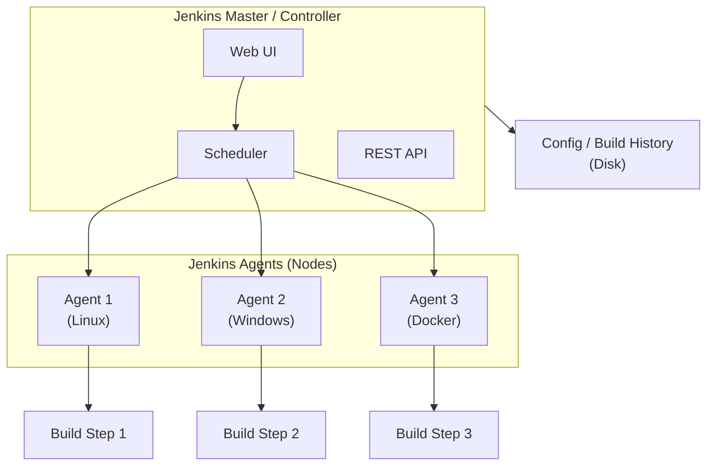

# DevOps - Jenkins

## 1. Overview

**Jenkins** is the most widely used open-source automation server, written in Java. It orchestrates CI/CD pipelines through a plugin-based architecture, enabling automated building, testing, and deployment of software.

### Key Features

- Plugin ecosystem (18,000+ plugins)
- Distributed builds via agents/nodes
- Pipeline as Code (Jenkinsfile)
- Blue Ocean modern UI
- Strong community support

---

## 2. Architecture

### 2.1. Master/Controller + Agents/Nodes



| Component | Role |
|-----------|------|
| **Master/Controller** | Schedules build jobs, serves web UI, manages configuration, stores build history |
| **Agents/Nodes** | Execute build jobs assigned by the master. Can be static or dynamic (Docker, Kubernetes) |
| **Executor** | Slot on an agent that runs one build at a time. Multiple executors = parallel builds |

### 2.2. Launching Agents

```bash
# Launch agent via JNLP (Java Web Start)
java -jar agent.jar -jnlpUrl http://jenkins:8080/computer/agent1/slave-agent.jnlp -workDir "/home/jenkins/agent"

# Launch agent via SSH
ssh jenkins@agent-node "java -jar /usr/share/jenkins/agent.jar" \
  -jnlpUrl http://jenkins:8080/computer/agent1/slave-agent.jnlp

# Agent labels for targeted builds
# Node label: "docker", "linux", "high-memory"
```

### 2.3. Kubernetes Agent (Dynamic Agents)

```yaml
# jenkins-agent.yaml (Kubernetes Pod Template)
apiVersion: v1
kind: Pod
metadata:
  name: jenkins-agent
spec:
  serviceAccountName: jenkins
  containers:
    - name: jnlp
      image: jenkins/inbound-agent:latest
      env:
        - name: JENKINS_URL
          value: "http://jenkins:8080"
      resources:
        requests:
          cpu: 500m
          memory: 512Mi
        limits:
          cpu: 1000m
          memory: 1Gi
    - name: docker
      image: docker:latest
      command:
        - cat
      tty: true
      volumeMounts:
        - name: docker-socket
          mountPath: /var/run/docker.sock
  volumes:
    - name: docker-socket
      hostPath:
        path: /var/run/docker.sock
```

---

## 3. Jenkinsfile: Declarative vs Scripted Pipeline

### 3.1. Declarative Pipeline (Recommended)

```groovy
pipeline {
    agent any   // or agent { label 'docker' } or agent kubernetes

    options {
        timestamps()
        timeout(time: 30, unit: 'MINUTES')
        buildDiscarder(logRotator(numToKeepStr: '10'))
    }

    environment {
        DOCKER_IMAGE = 'myapp'
        DOCKER_REGISTRY = 'registry.example.com'
    }

    stages {
        stage('Checkout') {
            steps {
                echo 'Cloning repository...'
                checkout scm
            }
        }

        stage('Build') {
            steps {
                echo 'Building application...'
                sh 'npm ci'
                sh 'npm run build'
            }
        }

        stage('Test') {
            steps {
                echo 'Running tests...'
                sh 'npm test -- --coverage'
            }
            post {
                always {
                    junit '**/test-results/**/*.xml'
                    publishCoverage(
                        adapters: [jacocoAdapter('coverage/coverage.xml')]
                    )
                }
            }
        }

        stage('Security Scan') {
            steps {
                echo 'Running security scan...'
                sh 'trivy image --exit-code 1 --severity HIGH myapp:$BUILD_NUMBER || true'
            }
        }

        stage('Build Docker Image') {
            steps {
                echo 'Building Docker image...'
                sh '''
                    docker build -t $DOCKER_REGISTRY/$DOCKER_IMAGE:$BUILD_NUMBER .
                    docker build -t $DOCKER_REGISTRY/$DOCKER_IMAGE:latest .
                '''
            }
        }

        stage('Deploy to Staging') {
            when {
                branch 'develop'
            }
            steps {
                echo 'Deploying to staging...'
                sh 'kubectl apply -f k8s/staging/ --namespace=staging'
            }
        }

        stage('Deploy to Production') {
            when {
                branch 'main'
            }
            steps {
                echo 'Deploying to production...'
                sh 'kubectl apply -f k8s/prod/ --namespace=production'
                sh 'kubectl rollout status deployment/myapp -n production'
            }
        }
    }

    post {
        always {
            echo 'Cleaning up...'
            cleanWs()
        }
        success {
            echo 'Pipeline succeeded!'
            slackSend(
                color: 'good',
                message: "Build #${env.BUILD_NUMBER} succeeded: ${env.BUILD_URL}"
            )
        }
        failure {
            echo 'Pipeline failed!'
            slackSend(
                color: 'danger',
                message: "Build #${env.BUILD_NUMBER} failed: ${env.BUILD_URL}"
            )
            mail to: 'team@example.com',
                 subject: "Jenkins Build #${env.BUILD_NUMBER} Failed",
                 body: "Check ${env.BUILD_URL}"
        }
    }
}
```

### 3.2. Scripted Pipeline (Advanced)

```groovy
node('docker') {
    stage('Checkout') {
        checkout scm
    }

    stage('Build') {
        def image = docker.build("myapp:${env.BUILD_NUMBER}")
    }

    stage('Test') {
        try {
            image.inside {
                sh 'npm test'
            }
        } finally {
            junit '**/test-results/**/*.xml'
        }
    }

    stage('Push') {
        docker.withRegistry('https://registry.example.com', 'docker-registry-creds') {
            image.push('latest')
            image.push(env.BUILD_NUMBER)
        }
    }
}
```

### 3.3. Key Differences

| Aspect | Declarative | Scripted |
|--------|------------|----------|
| **Syntax** | YAML-like, structured | Groovy DSL |
| **Learning curve** | Easier | Steeper |
| **Flexibility** | Limited to predefined directives | Full Groovy power |
| **Error handling** | `post` block | `try/catch/finally` |
| **Best for** | Standard CI/CD pipelines | Complex conditional logic |

---

## 4. Groovy Scripting Basics

### 4.1. Variables and Data Types

```groovy
// Variables
def name = "myapp"
def version = 1.0
def isEnabled = true
def ports = [8080, 443, 3000]
def config = [env: "prod", replicas: 3]

// String interpolation
echo "Building ${name} version ${version}"
echo "Build number: ${env.BUILD_NUMBER}"
```

### 4.2. Conditionals and Loops

```groovy
// If-else
if (env.BRANCH_NAME == 'main') {
    echo "Deploying to production"
} else if (env.BRANCH_NAME == 'develop') {
    echo "Deploying to staging"
} else {
    echo "Deploying to preview"
}

// For loop
for (def i = 0; i < 3; i++) {
    echo "Deployment attempt ${i + 1}"
}

// Each
def services = ['api', 'web', 'worker']
services.each { service ->
    sh "kubectl delete deployment ${service}"
}
```

### 4.3. Methods and Functions

```groovy
def buildImage(String service, String tag) {
    sh "docker build -t ${service}:${tag} ./services/${service}"
    return "${service}:${tag}"
}

def deployToK8s(String namespace, String image) {
    sh "kubectl set image deployment/myapp app=${image} -n ${namespace}"
    sh "kubectl rollout status deployment/myapp -n ${namespace}"
}

def rollbackK8s(String namespace) {
    sh "kubectl rollout undo deployment/myapp -n ${namespace}"
}
```

### 4.4. Reusable Shared Libraries

```groovy
// vars/deploy.groovy
def call(String environment, String imageTag) {
    pipeline {
        stages {
            stage('Deploy') {
                steps {
                    script {
                        sh "kubectl config use-context ${environment}"
                        sh "kubectl set image deployment/app app=${imageTag}"
                    }
                }
            }
        }
    }
}
```

---

## 5. Distributed Builds with Agents

### 5.1. Agent Labels and Selectors

```groovy
// Use labeled agent
pipeline {
    agent { label 'docker' }
    // Runs on any agent with label 'docker'
}

// Use multiple labels (AND logic)
agent { label 'linux && docker' }

// Use expression
agent {
    node {
        label 'docker'
        customWorkspace '/custom/workspace'
    }
}
```

### 5.2. Agent Configuration

```bash
# Manage nodes via CLI
java -jar jenkins-cli.jar -s http://jenkins:8080 list-nodes

# Add node via CLI
java -jar jenkins-cli.jar -s http://jenkins:8080 create-node agent1 \
    -description "Docker agent" \
    -remoteFS /home/jenkins \
    -numExecutors 2 \
    -labels "docker linux" \
    -mode EXCLUSIVE
```

### 5.3. Kubernetes Cloud Configuration

```groovy
// jenkins.yaml (JCasC - Jenkins Configuration as Code)
jenkins:
  clouds:
    - kubernetes:
        name: "kubernetes"
        serverUrl: "https://kubernetes.default"
        namespace: "jenkins"
        jenkinsUrl: "http://jenkins:8080"
        jenkinsTunnel: "jenkins:50000"
        containerCap: 100
        maxRequestsPerHostStr: "32"
        templates:
          - name: "jenkins-agent"
            namespace: "jenkins"
            label: "jenkins-agent"
            containers:
              - name: "jnlp"
                image: "jenkins/inbound-agent:latest"
                workingDir: "/home/jenkins"
                resourceRequestCpu: "500m"
                resourceLimitCpu: "1000m"
                resourceRequestMemory: "512Mi"
                resourceLimitMemory: "1Gi"
            yaml: |
              apiVersion: v1
              kind: Pod
              spec:
                securityContext:
                  runAsUser: 1000
                containers:
                  - name: jnlp
                    image: jenkins/inbound-agent:latest
                    tty: true
```

---

## 6. Credentials and Secret Management

### 6.1. Credential Types

| Type | Use Case |
|------|----------|
| **Username with password** | Docker registry, generic credentials |
| **SSH Username with private key** | Git SSH access |
| **Secret file** | Keystore, certificate files |
| **Secret text** | API keys, tokens, passwords |
| **Certificate** | Client-side SSL certificates |

### 6.2. Using Credentials in Pipeline

```groovy
pipeline {
    agent any
    environment {
        // Credentials ID from Jenkins UI (Manage Jenkins -> Credentials)
        DOCKER_REGISTRY_CREDS = credentials('docker-registry-creds')
    }
    stages {
        stage('Build') {
            steps {
                // Username and password available as env vars
                sh '''
                    echo $DOCKER_REGISTRY_CREDS_USR
                    echo $DOCKER_REGISTRY_CREDS_PSW
                '''

                // For secret text (token)
                sh 'curl -H "Authorization: Bearer $TOKEN" https://api.example.com'
            }
        }

        stage('Deploy with SSH Key') {
            steps {
                withCredentials([
                    sshUserPrivateKey(
                        keyFileVariable: 'SSH_KEY',
                        credentialsId: 'deploy-ssh-key',
                        usernameVariable: 'SSH_USER'
                    )
                ]) {
                    sh '''
                        export SSH_KEY
                        ssh -i $SSH_KEY $SSH_USER@server "kubectl get pods"
                    '''
                }
            }
        }
    }
}
```

### 6.3. HashiCorp Vault Integration

```groovy
// With HashiCorp Vault plugin
pipeline {
    agent any
    environment {
        VAULT_CREDS = credentials('vault-secret')
    }
    stages {
        stage('Fetch Secrets from Vault') {
            steps {
                script {
                    def secrets = vaultSecrets(
                        secretPath: 'secret/myapp/prod',
                        secretValues: [
                            [envVar: 'DB_PASSWORD', vaultKey: 'password'],
                            [envVar: 'API_KEY', vaultKey: 'api-key']
                        ]
                    )
                }
            }
        }
    }
}
```

---

## 7. CI/CD Tool Comparison

### Jenkins vs GitHub Actions vs GitLab CI vs CircleCI

| Aspect | Jenkins | GitHub Actions | GitLab CI | CircleCI |
|--------|---------|---------------|-----------|----------|
| **Hosting** | Self-hosted | SaaS + self-hosted | SaaS + self-hosted | SaaS + self-hosted |
| **Configuration** | Jenkinsfile (Groovy) | YAML workflow | YAML CI/CD config | YAML config |
| **Scalability** | Self-managed agents | GitHub-hosted + self-hosted runners | GitLab-hosted + self-managed | Cloud + self-hosted |
| **Ecosystem** | 18,000+ plugins | Marketplace actions | Auto DevOps, integrat | Orbs (reusable configs) |
| **Learning curve** | Steeper (Groovy) | Moderate (YAML) | Moderate (YAML) | Moderate (YAML) |
| **Pricing** | Free (self-hosted) | Free tier + per-minute | Free tier + per-minute | Free tier + credits |
| **Container support** | Via plugins | Native | Native | Native |
| **Secret management** | Credentials store + Vault | GitHub Secrets | GitLab CI/CD Variables | Contexts + Vault |
| **Best for** | Enterprise with complex needs | GitHub repos, open-source | GitLab repos, integrated | Fast execution, orbs |

### GitHub Actions Example (for comparison)

```yaml
# .github/workflows/ci.yml
name: CI/CD

on:
  push:
    branches: [main, develop]
  pull_request:
    branches: [main]

jobs:
  build:
    runs-on: ubuntu-latest
    steps:
      - uses: actions/checkout@v4
      - uses: actions/setup-node@v4
        with:
          node-version: '20'
          cache: 'npm'
      - run: npm ci
      - run: npm test
      - run: npm run build

  deploy:
    needs: build
    if: github.ref == 'refs/heads/main'
    runs-on: ubuntu-latest
    steps:
      - uses: actions/checkout@v4
      - uses: google-github-actions/deploy-cloudrun@v1
        with:
          service: myapp
          image: gcr.io/${{ secrets.GCP_PROJECT }}/myapp:${{ github.sha }}
```

---

## 8. Blue Ocean UI

**Blue Ocean** is Jenkins' modern, redesigned user interface that focuses on pipelines and makes CI/CD easier to understand.

### Key Features

- **Pipeline Editor**: Visual pipeline editor (Grose-based, not recommended for production)
- **Pipeline Runs**: Clear visualization of build stages and steps
- **Branches/PRs**: GitHub/Bitbucket integration with automatic pipeline creation
- **Failure Diagnosis**: Pinpoint exactly which step failed
- **Personalized Dashboard**: Focus on the pipelines you care about

```bash
# Install Blue Ocean plugin
# Manage Jenkins -> Manage Plugins -> Available -> Blue Ocean

# Access Blue Ocean UI
# http://jenkins:8080/blue
```

---

## 9. Interview Questions

**Q: What is the difference between a declarative and scripted pipeline?**

> **Declarative pipelines** use a structured, YAML-like syntax that is easier to learn and validates itself before execution. They are ideal for standard CI/CD workflows. **Scripted pipelines** use Groovy DSL and provide full programming flexibility — you can use loops, try/catch blocks, and complex conditionals. Declarative is recommended for most use cases, with scripted used for advanced custom logic.

**Q: How do you secure Jenkins?**

- Use **Role-Based Access Control (RBAC)** with Matrix Authorization Strategy plugin
- Store secrets in **credentials store** (not in Jenkinsfile)
- Use **Agent-to-Master Security** (enable "Require IP whitelist" and agent access control)
- Keep Jenkins and all plugins **up to date**
- Use **Jenkins Configuration as Code (JCasC)** to version control configuration
- Set up **audit logging** for compliance
- Use **Kubernetes secrets** or **HashiCorp Vault** for secret management
- Limit build agents' access to the master filesystem

**Q: How do you handle long-running builds and timeout management?**

> Use the `timeout` step in pipeline options, configure build executor timeouts, and break large builds into smaller parallel stages. For very long builds, use `catchError` with `build: false` to prevent cascading failures, and consider checkpoint plugins for resumable builds.

**Q: What is the difference between `agent any` and `agent none`?**

> `agent any` means the pipeline can run on any available agent. `agent none` means no agent is allocated at the pipeline level — each stage must specify its own agent. This is useful when different stages need different agent types or when you want maximum control over where each stage runs.
