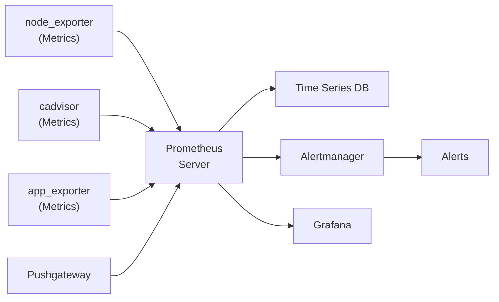
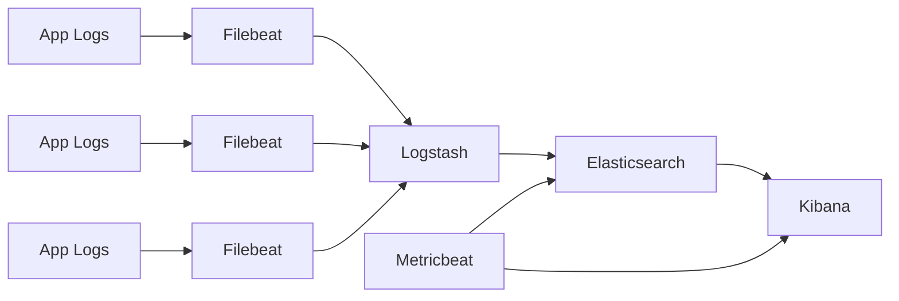
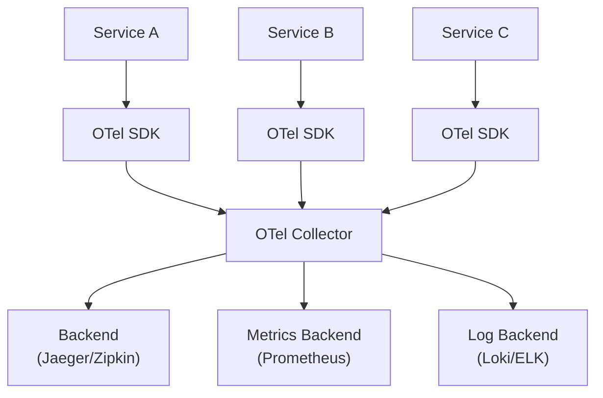

# DevOps - Monitoring & Logging

## 1. The Three Pillars of Observability

Observability in modern systems rests on three pillars:

| Pillar | What It Measures | Tools |
|--------|-----------------|-------|
| **Metrics** | Numeric data over time (CPU, request rate) | Prometheus, Grafana, CloudWatch |
| **Logs** | Discrete events with timestamps | ELK, Loki, CloudWatch Logs |
| **Traces** | Request paths across distributed services | OpenTelemetry, Jaeger, Zipkin |

### Why All Three Are Needed

- **Metrics** tell you *what* is happening (aggregate view)
- **Logs** tell you *why* it is happening (detailed context)
- **Traces** tell you *where* in the request chain it happens (causal chain)

---

## 2. Prometheus

**Prometheus** is an open-source systems monitoring and alerting toolkit. It pulls (scrapes) metrics from configured targets at regular intervals and stores them as time series data.

### 2.1. Architecture



### 2.2. Prometheus Installation & Configuration

```yaml
# prometheus.yml
global:
  scrape_interval: 15s
  evaluation_interval: 15s

alerting:
  alertmanagers:
    - static_configs:
        - targets:
          - alertmanager:9093

rule_files:
  - "alerts/*.yml"

scrape_configs:
  - job_name: "prometheus"
    static_configs:
      - targets: ["localhost:9090"]

  - job_name: "node-exporter"
    static_configs:
      - targets: ["node-exporter:9100"]

  - job_name: "myapp"
    static_configs:
      - targets: ["myapp:8080"]
```

```bash
# Install via Helm
helm install prometheus prometheus-community/prometheus

# Port-forward to access UI
kubectl port-forward svc/prometheus-server 9090:80
```

### 2.3. PromQL - Prometheus Query Language

```promql
# Request rate (requests per second)
rate(http_requests_total{service="myapp"}[5m])

# Error rate
rate(http_requests_total{service="myapp", status=~"5.."}[5m])

# 99th percentile latency
histogram_quantile(0.99, rate(http_request_duration_seconds_bucket{service="myapp"}[5m]))

# CPU usage percentage
100 - (avg by (instance) (rate(node_cpu_seconds_total{mode="idle"}[5m])) * 100)

# Memory usage
node_memory_MemAvailable_bytes / node_memory_MemTotal_bytes * 100

# Requests per second by service
sum by (service) (rate(http_requests_total[5m]))

# Pods restarting frequently
rate(kube_pod_container_status_restarts_total[5m]) > 0.1
```

### 2.4. Key Exporters

| Exporter | What It Collects | Port |
|----------|-----------------|------|
| **node_exporter** | CPU, memory, disk, network | 9100 |
| **cadvisor** | Container resource usage | 8080 |
| **blackbox_exporter** | HTTP/TCP/ICMP probes | 9115 |
| **mysqld_exporter** | MySQL/MariaDB metrics | 9104 |
| **postgres_exporter** | PostgreSQL metrics | 9187 |
| **nginx-ingress-controller** | Ingress request metrics | 10254 |
| **Pushgateway** | Batch job metrics (pushed) | 9091 |

### 2.5. Pushgateway

Prometheus normally **pulls** metrics. For short-lived batch jobs that finish before the next scrape, use **Pushgateway** to push metrics.

```bash
# Push a metric to Pushgateway
echo "my_batch_job_duration 5.32" | curl --data-binary @- http://pushgateway:9091/metrics/job/my_batch_job

# Push with labels
cat <<EOF | curl --data-binary @- http://pushgateway:9091/metrics/job/my_batch_job
# TYPE my_batch_job_duration gauge
my_batch_job_duration{env="production"} 5.32
my_batch_job_records_processed{env="production"} 1500
EOF
```

---

## 3. Grafana

**Grafana** is the open-source analytics and interactive visualization platform. It connects to data sources (Prometheus, Elasticsearch, etc.) and creates dashboards.

### 3.1. Adding Prometheus as Data Source

```yaml
# Via Grafana provisioning
apiVersion: v1
kind: ConfigMap
metadata:
  name: grafana-datasources
data:
  datasources.yaml: |
    apiVersion: 1
    datasources:
      - name: Prometheus
        type: prometheus
        access: proxy
        url: http://prometheus-server:80
        isDefault: true
        editable: false
```

### 3.2. Example Dashboard Panels

```promql
# Panel 1: Request Rate
sum by (status) (rate(http_requests_total{service=~"$service"}[5m]))

# Panel 2: Error Rate %
sum(rate(http_requests_total{service=~"$service",status=~"5.."}[5m]))
  /
sum(rate(http_requests_total{service=~"$service"}[5m])) * 100

# Panel 3: P99 Latency
histogram_quantile(0.99,
  sum by (le) (rate(http_request_duration_seconds_bucket{service=~"$service"}[5m]))
)

# Panel 4: CPU Usage
avg by (pod) (rate(container_cpu_usage_seconds_total{pod=~"$service.*"}[5m]))

# Panel 5: Memory Usage
avg by (pod) (container_memory_usage_bytes{pod=~"$service.*"})
```

### 3.3. Alerting Rules

```yaml
# alerts/high-error-rate.yml
groups:
  - name: myapp.alerts
    rules:
      - alert: HighErrorRate
        expr: |
          sum(rate(http_requests_total{service="myapp",status=~"5.."}[5m]))
          /
          sum(rate(http_requests_total{service="myapp"}[5m])) > 0.05
        for: 5m
        labels:
          severity: critical
        annotations:
          summary: "High error rate on myapp"
          description: "Error rate is {{ $value | printf \"%.2f\" }}%"

      - alert: HighLatency
        expr: |
          histogram_quantile(0.99,
            sum by (le) (rate(http_request_duration_seconds_bucket{service="myapp"}[5m]))
          ) > 2
        for: 5m
        labels:
          severity: warning
        annotations:
          summary: "High P99 latency on myapp"
          description: "P99 latency is {{ $value | printf \"%.2f\" }}s"

      - alert: PodRestartingTooMuch
        expr: |
          rate(kube_pod_container_status_restarts_total{service="myapp"}[5m]) > 0.01
        for: 5m
        labels:
          severity: warning
```

---

## 4. SLI / SLO / SLA

Understanding the difference between these three concepts is critical for setting reliability targets.

| Concept | Definition | Example |
|---------|-----------|---------|
| **SLI** (Service Level Indicator) | The metric you measure | Request latency < 200ms |
| **SLO** (Service Level Objective) | The target you set | 99.9% of requests < 200ms |
| **SLA** (Service Level Agreement) | The promise you make to customers | Contractually 99.9% uptime |

### SLI/SLO Examples

```promql
# Availability SLI (request success rate)
100 - (
  sum(rate(http_requests_total{service="myapp",status=~"5.."}[5m]))
  /
  sum(rate(http_requests_total{service="myapp"}[5m]))
) * 100

# Latency SLI (P99)
histogram_quantile(0.99,
  sum by (le) (rate(http_request_duration_seconds_bucket{service="myapp"}[5m]))
)

# Error Budget (1 - SLO)
# If SLO is 99.9%, error budget is 0.1% of requests allowed to fail
# per month: 43.8 minutes of downtime allowed
```

---

## 5. ELK Stack

The **ELK Stack** (Elasticsearch, Logstash, Kibana) is a popular log aggregation and analysis platform.



### 5.1. Elasticsearch

A distributed, RESTful search and analytics engine capable of storing and searching massive volumes of log data.

```bash
# Query logs via Elasticsearch API
curl -X GET "localhost:9200/logs-*/_search" -H 'Content-Type: application/json' -d '{
  "query": {
    "bool": {
      "must": [
        { "match": { "service": "myapp" } },
        { "range": { "@timestamp": { "gte": "now-1h" } } }
      ]
    }
  },
  "sort": [{ "@timestamp": "desc" }],
  "size": 100
}'
```

### 5.2. Logstash Pipeline

```ruby
# logstash.conf
input {
  beats {
    port => 5044
  }
}

filter {
  # Parse JSON logs
  if [message] =~ /^\{/ {
    json {
      source => "message"
      target => "parsed"
    }
  }

  # Parse nginx/access logs
  grok {
    match => { "message" => "%{IPORHOST:client_ip} - %{DATA:user} \[%{HTTPDATE:timestamp}\] \"%{WORD:method} %{URIPATHPARAM:request} HTTP/%{NUMBER:http_version}\" %{NUMBER:status:int} %{NUMBER:bytes:int}" }
  }

  # Enrich with GeoIP
  geoip {
    source => "client_ip"
    target => "geoip"
  }

  # Parse timestamps
  date {
    match => [ "timestamp", "ISO8601" ]
    target => "@timestamp"
  }
}

output {
  elasticsearch {
    hosts => ["elasticsearch:9200"]
    index => "logs-%{+YYYY.MM.dd}"
  }
}
```

### 5.3. Filebeat (Lightweight Beats Agent)

```yaml
# filebeat.yml
filebeat.inputs:
  - type: container
    paths:
      - /var/log/containers/*.log
    processors:
      - add_kubernetes_metadata:
          host: ${NODE_NAME}
          matchers:
            - logs_path:
                logs_path: "/var/log/containers/"

  - type: log
    paths:
      - /var/log/nginx/access.log
    fields:
      service: nginx

output.logstash:
  hosts: ["logstash:5044"]

processors:
  - add_host_metadata:
      when.not.contains.tags: forwarded
  - add_cloud_metadata: ~
  - add_docker_metadata: ~
```

### 5.4. Metricbeat

```yaml
# metricbeat.yml
metricbeat.modules:
  - module: system
    metricsets:
      - cpu
      - memory
      - network
      - process
    period: 10s

  - module: kubernetes
    metricsets:
      - node
      - pod
      - container
      - volume
    period: 10s
    hosts: ["localhost:10255"]

  - module: prometheus
    metricsets:
      - collector
    hosts: ["prometheus:9090"]
    period: 10s

output.elasticsearch:
  hosts: ["elasticsearch:9200"]
```

### 5.5. Kibana Discover & Visualization

Key Kibana features:
- **Discover**: Full-text search, field filtering, time-range analysis
- **Visualize**: Bar, line, pie, map, heatmap, markdown widgets
- **Dashboard**: Combine visualizations into unified views
- **Dev Tools**: Query DSL editor for Elasticsearch

```json
// Kibana Query DSL
{
  "query": {
    "bool": {
      "must": [
        { "match": { "log.level": "ERROR" } },
        { "range": { "@timestamp": { "gte": "now-1h" } } }
      ],
      "should": [
        { "term": { "service.keyword": "api-gateway" } },
        { "term": { "service.keyword": "payment-service" } }
      ],
      "minimum_should_match": 1
    }
  }
}
```

---

## 6. Loki - Log Aggregation Alternative

**Loki** is a horizontally-scalable, highly-available log aggregation system inspired by Prometheus. Unlike ELK, Loki does not index log content — it only indexes log labels.

### Loki vs ELK

| Aspect | Loki | ELK |
|--------|------|-----|
| **Indexing** | Label-based only | Full-text index |
| **Storage cost** | Much lower | Higher |
| **Query language** | LogQL | Query DSL |
| **Performance** | Faster for label queries | Better for full-text search |
| **Scalability** | Excellent | Good |
| **Best for** | Kubernetes logs, metrics correlation | Complex log analysis |

### LogQL - Loki Query Language

```logql
# Simple log query
{service="myapp", env="production"}

# Filter by level
{service="myapp"} |= "ERROR"

# Count error logs per minute
sum by (service) (
  rate({service=~".+"} |= "ERROR"[5m])
)

# Extract fields with regex
{service="myapp"} | json | status_code >= 500

# Metrics from logs
sum by (service) (
  rate({service="myapp"} | json | status_code >= 500[5m])
)
  /
sum by (service) (
  rate({service="myapp"}[5m])
) * 100

# Parse nginx logs
{service="nginx"} | pattern `<ip> - <user> [<ts>] "<method> <uri> <proto>" <status> <size>"`
```

---

## 7. RED & USE Methods

Two complementary frameworks for identifying what metrics to monitor.

### 7.1. RED Method (Request-Driven Services)

| Metric | PromQL | Description |
|--------|--------|-------------|
| **Rate** | `sum(rate(http_requests_total[5m]))` | How many requests per second |
| **Errors** | `sum(rate(http_requests_total{status=~"5.."}[5m]))` | Rate of failed requests |
| **Duration** | `histogram_quantile(0.99, rate(http_request_duration_seconds_bucket[5m]))` | Response time distribution |

### 7.2. USE Method (Resource-Driven Services)

| Metric | What It Indicates |
|--------|-------------------|
| **Utilization** | How busy is the resource? (e.g., CPU % used) |
| **Saturation** | How much backlog exists? (e.g., queue length) |
| **Errors** | Are there internal errors? (e.g., failed operations) |

```promql
# Utilization - CPU
rate(node_cpu_seconds_total{mode!="idle"}[5m])

# Saturation - Load average
node_load1 / count(node_cpu_seconds_total{mode="idle"})

# Saturation - Memory
node_memory_SReclaimable_bytes / node_memory_MemTotal_bytes

# Errors - Disk I/O errors
rate(node_disk_io_time_seconds_total{device="sda"}[5m])
```

---

## 8. Distributed Tracing with OpenTelemetry

**Distributed tracing** tracks a request as it flows through multiple services, making it possible to pinpoint performance bottlenecks and failures in microservices architectures.

### 8.1. OpenTelemetry Architecture



### 8.2. Instrumenting a Node.js Application

```javascript
// tracing.js
const { NodeSDK } = require('@opentelemetry/sdk-node');
const { OTLPTraceExporter } = require('@opentelemetry/exporter-trace-otlp-http');
const { HttpInstrumentation } = require('@opentelemetry/instrumentation-http');
const { ExpressInstrumentation } = require('@opentelemetry/instrumentation-express');
const { Resource } = require('@opentelemetry/resources');
const { SemanticResourceAttributes } = require('@opentelemetry/semantic-conventions');

const sdk = new NodeSDK({
  resource: new Resource({
    [SemanticResourceAttributes.SERVICE_NAME]: 'my-service',
    [SemanticResourceAttributes.SERVICE_VERSION]: '1.0.0',
  }),
  traceExporter: new OTLPTraceExporter({
    url: 'http://otel-collector:4318/v1/traces',
  }),
  instrumentations: [
    new HttpInstrumentation(),
    new ExpressInstrumentation(),
  ],
});

sdk.start();
```

### 8.3. Trace Context Propagation

Traces must propagate across service boundaries via HTTP headers.

```javascript
// Propagate trace context via W3C Trace Context headers
// Outgoing HTTP request automatically injects trace context
const response = await fetch('http://api-service/users', {
  headers: {
    'Content-Type': 'application/json',
    // Trace context headers are automatically injected by OTel SDK
  }
});
```

---

## 9. Interview Questions

**Q: What is the difference between Prometheus pull vs push models?**

> **Pull model** (Prometheus default): Prometheus scrapes metrics from targets at configured intervals. Benefits: easier to run behind firewalls, targets don't need to know about Prometheus, simpler architecture. **Push model** (via Pushgateway): Targets push metrics to Pushgateway, which Prometheus scrapes. Used for short-lived batch jobs that may finish before the next scrape interval.

**Q: How do you handle alerting fatigue?**

> Use multi-level alerts (warning before critical), set appropriate `for` durations (wait before firing to filter spikes), aggregate similar alerts, use alert routing with deduplication, and regularly review and tune alert thresholds. The goal is alerts that require action, not noise.

**Q: What is the difference between structured logging and plain text logging?**

> **Plain text logs** are human-readable strings that are hard to parse programmatically. **Structured logs** (usually JSON) have consistent fields (timestamp, level, service, message, metadata) that are easy to query, filter, and analyze. Structured logs are essential for log aggregation systems like ELK or Loki.

**Q: How would you monitor a microservices application?**

> Use the **RED method** for request-driven services (rate, errors, duration per endpoint) and the **USE method** for resource-driven components (CPU, memory, disk utilization and saturation). Implement distributed tracing with OpenTelemetry to trace requests across service boundaries. Correlate metrics, logs, and traces using a common trace ID/span ID. Set SLOs and create dashboards that reflect user-facing health.
