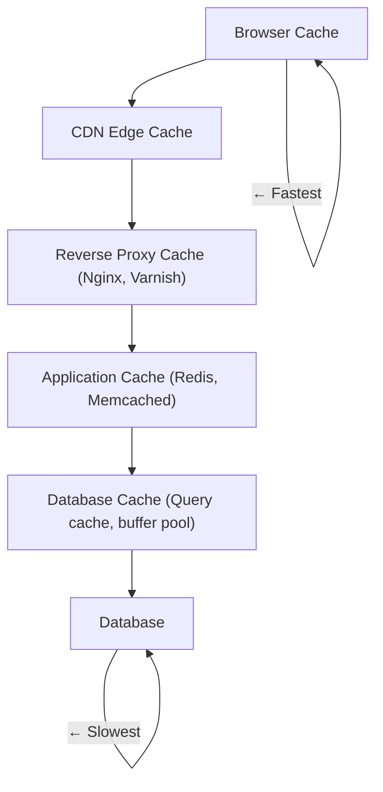

# Caching & CDN

## 

### Caching

#### Overview

Caching temporarily stores data in layers closer to the user to serve frequent requests quickly. The goal is to reduce database load, minimize latency, and improve overall system throughput.

#### Caching in the System Stack



#### Cache Strategies

| Strategy | Description | Use Case |
|---|---|---|
| **Cache-Aside (Lazy Loading)** | App checks cache first; if miss, fetch from DB and populate cache | Read-heavy workloads |
| **Read-Through** | Cache automatically loads data from DB on miss | Simplified app code |
| **Write-Through** | Write to cache and DB simultaneously | When data must not be lost |
| **Write-Behind (Write-Back)** | Write to cache; async write to DB | High write throughput |
| **Refresh-Ahead** | Proactively refresh expiring cache entries | Predictable access patterns |

```typescript
// Cache-Aside pattern example
async function getUser(userId: string): Promise<User> {
  // Step 1: Check cache
  const cached = await redis.get(`user:${userId}`);
  if (cached) {
    return JSON.parse(cached);
  }

  // Step 2: Cache miss — fetch from database
  const user = await db.users.findById(userId);
  if (!user) {
    throw new Error('User not found');
  }

  // Step 3: Populate cache with TTL
  await redis.setex(`user:${userId}`, 3600, JSON.stringify(user));

  return user;
}
```

### Cache Invalidation

> **The two hard problems in computer science:** cache invalidation, naming things, and off-by-one errors.

| Strategy | Description | Pros | Cons |
|---|---|---|---|
| **TTL (Time-to-Live)** | Auto-expire after fixed time | Simple, predictable | Stale data until expiry |
| **Event-driven** | Invalidate on write to DB | Immediate consistency | Complex, requires pub/sub |
| **Versioned keys** | Include version in cache key | Precise invalidation | More memory usage |
| **Manual** | Explicitly invalidate | Full control | Error-prone, forget to invalidate |

### Eviction Policies

| Policy | Description | Best For |
|---|---|---|
| **LRU (Least Recently Used)** | Evict least recently accessed | General purpose |
| **LFU (Least Frequently Used)** | Evict least frequently accessed | Popular items stay |
| **FIFO (First In, First Out)** | Evict oldest entry | Simple scenarios |
| **TTL-based** | Evict by expiration time | Time-sensitive data |
| **Random** | Evict randomly | Testing, extreme scale |

### CDN (Content Delivery Network)

#### Overview

A CDN is a globally distributed network of servers that caches and serves static content (HTML, CSS, JS, images, videos) from edge locations closest to the user.

#### How CDN Works

```
User Request → CDN Edge Server (closest to user)
             → Cache HIT? → Return cached content (fast)
             → Cache MISS → Fetch from Origin Server
                          → Cache at Edge Server
                          → Return to User
```

#### CDN Benefits

| Benefit | Description |
|---|---|
| **Reduced Latency** | Users download from nearest edge server |
| **Lower Origin Load** | Static content served from CDN, not origin |
| **Improved Availability** | Redundancy; origin can be temporarily down |
| **DDoS Protection** | CDN absorbs traffic spikes and attacks |
| **Better Security** | HTTPS, WAF, bot protection at edge |
| **Bandwidth Savings** | Compression, deduplication at CDN level |

#### CDN Providers

| Provider | Notable Features |
|---|---|
| **Cloudflare** | Free tier, DDoS protection, global network |
| **AWS CloudFront** | Deep AWS integration (S3, EC2, Lambda@Edge) |
| **Fastly** | Real-time cache purging, VCL customization |
| **Akamai** | Largest network, enterprise-grade |
| **Google Cloud CDN** | GCP integration, global load balancing |

#### Cache-Control Headers

```bash
# Common cache-control directives
Cache-Control: max-age=3600          # Cache for 1 hour
Cache-Control: no-cache               # Revalidate with server every time
Cache-Control: no-store               # Never cache (sensitive data)
Cache-Control: public                 # Can be cached by proxies
Cache-Control: private                # Only cached by browser
Cache-Control: immutable              # Content never changes (for versioning)
```

### Redis as a Cache

| Command | Description | Time Complexity |
|---|---|---|
| `SET key value EX ttl` | Set with TTL | O(1) |
| `GET key` | Get value | O(1) |
| `EXISTS key` | Check if key exists | O(1) |
| `DEL key` | Delete key | O(1) |
| `EXPIRE key ttl` | Set TTL on existing key | O(1) |
| `HGETALL key` | Get all fields in hash | O(N) |
| `LRANGE key 0 -1` | Get list range | O(N) |

### Caching Anti-Patterns

| Anti-pattern | Problem | Solution |
|---|---|---|
| **Caching everything** | Memory bloat, stale data | Cache only hot data |
| **No TTL** | Memory grows indefinitely | Set appropriate TTL |
| **Single point of failure** | Redis down = system down | Redis Sentinel or Cluster |
| **Cache stampede** | Many requests hit DB when cache expires | Use mutex, jitter TTL, proactive refresh |
| **Stale reads** | Read-after-write inconsistency | Write-through or read-your-writes guarantee |

> **Tip:** Cache works best with **read-heavy, infrequently changing data**. It is not a silver bullet for write-heavy workloads.
