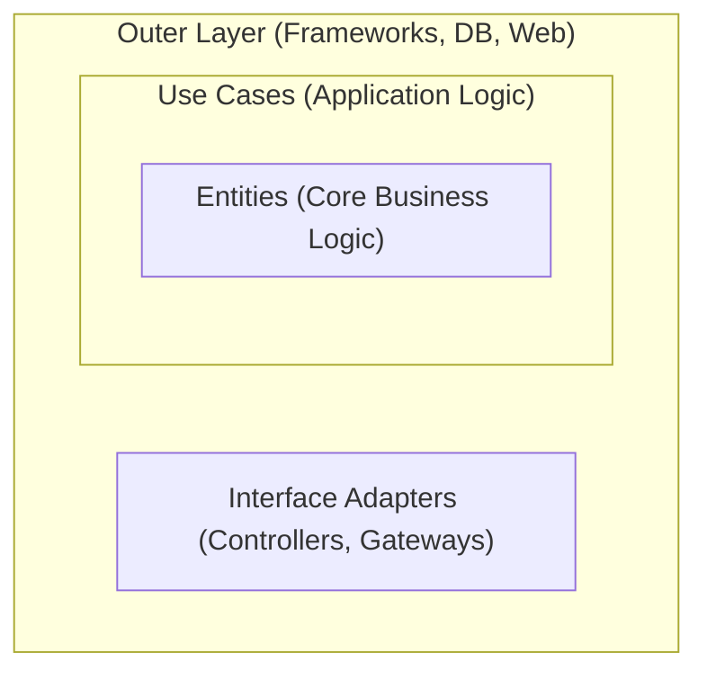

# Clean Architecture & Hexagonal Architecture

## 1. Overview

**Clean Architecture** (by Uncle Bob) and **Hexagonal Architecture** (Ports & Adapters) share the same core goal: **Protect the application's core (Business Logic) from external changes (Database, UI, Frameworks).**

**Real-world Analogy: The Phở Secret Recipe**
The recipe for the broth (Business Logic) is your core value. Whether you sell it on the sidewalk or in a five-star hotel (UI), or whether you use a gas stove or an electric one (Infrastructure), the recipe remains the same. The recipe must **not** depend on the stove!

---

## 2. Clean Architecture (The Onion Model)

This architecture organizes the application into concentric layers.

### The Dependency Rule
> **Dependencies must point inwards only!** Outer layers can know about inner layers, but inner layers **must know nothing** about outer layers.



### Layer Details & Code Examples:

#### 1. Entities (The Core)
Contains the most fundamental business rules. No dependencies on any frameworks (Spring, Hibernate, etc.).
```java
// Pure Java, no JPA/Hibernate annotations
public class Order {
    private String id;
    private List<Item> items;
    
    public double calculateTotal() {
        return items.stream().mapToDouble(Item::getPrice).sum();
    }
}
```

#### 2. Use Cases
Contains application-specific business rules. It coordinates the flow of data to and from entities.
```java
public class PlaceOrderUseCase {
    private final OrderRepository repository; // Just an Interface

    public void execute(Order order) {
        if (order.calculateTotal() > 0) {
            repository.save(order);
        }
    }
}
```

#### 3. Interface Adapters (Controllers/Presenters)
Converts data from the format most convenient for use cases to the format most convenient for external agencies like DBs or Web.

#### 4. Frameworks & Drivers
The outermost layer, containing tools like Spring Boot, MySQL, MongoDB, etc.

---

## 3. Hexagonal Architecture (Ports & Adapters)

Think of this as a **Laptop and its Ports.**

- **Port:** An Interface. The Core defines: *"I need a way to save a User."*
- **Adapter:** The implementation. A Samsung charger or a Dell charger can "plug in" as long as it fits the Port.

```java
// PORT (Inside the Core)
public interface UserRepository {
    void save(User user);
}

// ADAPTER (In the Infrastructure layer)
@Repository
public class MySQLUserRepository implements UserRepository {
    @Override
    public void save(User user) {
        // Actual JDBC/Hibernate code here
    }
}
```

---

## 4. Why such complexity? (Technical Benefits)

While it requires more files and interfaces, the benefits are crucial for senior-level roles:

1.  **Testability:** You can test business logic (Core) without starting a Database or a Web Server. Just use Mocks for the Ports.
2.  **Framework Independence:** If you need to switch from Spring Boot to Quarkus, or MySQL to MongoDB, you only rewrite the **Adapters**. The **Core** doesn't change a single line of code.
3.  **Defer Decisions:** You can focus on coding the complex business logic first before deciding on which database or UI framework to use.

---

## 5. Interview Pro-Tip

> **Q: "Do you apply Clean Architecture to every project?"**
>
> **A:** "No. It comes with a cost: boilerplate code and a complex file structure. 
> - For simple **CRUD** apps, I'd use traditional MVC to move fast (KISS principle). 
> - I only use Clean Architecture for large-scale systems with **complex business logic** that require long-term maintenance and rigorous unit testing."
