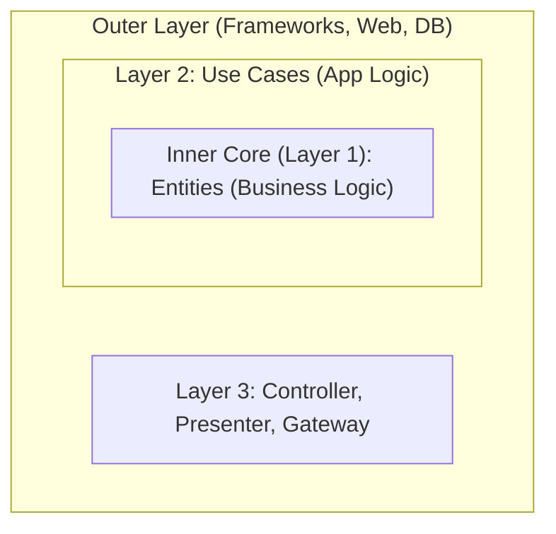

# Clean Architecture & Hexagonal Architecture

## Overview
**Clean Architecture** and **Hexagonal Architecture** (Ports & Adapters) have different names but share one goal: **Protect the core of your app (Business Logic) from the "noisy" outside world (Database, Frameworks, UI).**

**Real-world Analogy:**
You own a **Traditional Phở Shop**. Your secret recipe (Business Logic) is the most valuable thing. Whether you sell it on the sidewalk or in a fancy mall (UI), or whether you buy beef from a local market or a supermarket (Database), the recipe stays the same. The recipe must **not** depend on where you buy your beef!

---

## 1. Clean Architecture (The Onion)
Created by "Uncle Bob" (Robert C. Martin). It divides code into layers like an onion.

### The Golden Rule (Dependency Rule)
> **Dependencies must only point inwards!** The outer layer knows about the inner layer, but the inner layer **must never** know anything about the outer layer.

Meaning: Your Core (Entities) should not contain any SQL, MongoDB, or React code. It's just pure logic (e.g., `if (age < 18) throw Error`).

---

## 2. Hexagonal Architecture (Ports & Adapters)
Created by Alistair Cockburn. This uses a more practical image: **Device Ports** and **Adapters**.

**Real-world Analogy:**
Your **Laptop (Business Logic)** has a charging **Port**. It says: *"I need 20V via this round hole."* 
It doesn't care if the power comes from a wall socket (220V), a power bank, or a car battery. Converting that power to 20V is the job of the **Adapter**.

### The Breakdown:
- **Port:** An Interface (The Contract). The Core defines: *"I need a way to save a User."*
- **Adapter:** The concrete class. `MySQLUserRepo` or `MongoUserRepo` "plugs into" that Port.

---

## 3. Why go through all this trouble? (Interview Answer)

It takes more files and more interfaces, so what's the benefit?

1. **Easy Testing:** Want to test your logic? You don't need to turn on MySQL. Just plug in a "Mock Adapter" and test.
2. **Database/Framework Agnostic:** If the boss wants to switch from MySQL to MongoDB, you just write a new Adapter. The Core logic **doesn't change a single line.**
3. **Defer Decisions:** You can start coding the business logic on Day 1 without deciding which Database or UI framework to use yet.

---

## 4. Interview Tip (The "No" Answer)

> **Q: "Do you use Clean Architecture for every project?"**
>
> **A:** "No. It comes with a cost: boilerplate code and a complex file structure. 
> - For simple **CRUD** apps, I'd use traditional MVC to move fast. 
> - I only use Clean Architecture for systems with **complex business logic** that need to be maintained for years and require heavy unit testing."
