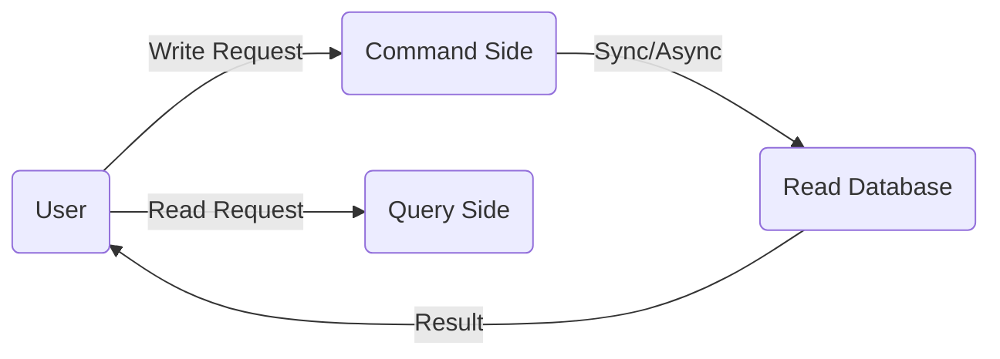

# CQRS & Event Sourcing

## 1. CQRS (Separate Read & Write)

**CQRS** solves a fundamental problem: A single database often cannot handle both high-speed Writes and high-speed Reads simultaneously as data scales.

### Why separate them?
- **Writes:** Focus on accuracy (Transactions) and data normalization.
- **Reads:** Focus on high speed and denormalized data for fast retrieval.

**✅ Real-world Example:** Banking System.
- **Write:** When you transfer money, the system must check the balance and process the transaction strictly.
- **Read:** When you view your 1-year transaction history, the system retrieves pre-aggregated data from a specialized read database (like Elasticsearch) for instant results.

---

## 2. Event Sourcing (History as Truth)

Instead of just storing the final state, we store **all events** that have occurred.

### Example: Account Balance
- **State-based (Traditional):** Stores `Balance = 1000`. If someone accidentally changes it to `800`, you don't know why.
- **Event Sourcing:** Stores:
    1. `Deposit +500` (8:00 AM)
    2. `Withdraw -200` (9:00 AM)
    3. `Deposit +700` (10:00 AM)
👉 **Current State** = 500 - 200 + 700 = 1000.

**Technical Benefits:**
1.  **Audit Trail:** 100% proof of what happened and when.
2.  **Time Travel:** Reconstruct the state at any point in the past by replaying events.
3.  **Data Recovery:** If the DB is corrupted, replay events from the beginning to restore the state.

---

## 3. Combining CQRS + Event Sourcing

The ultimate powerhouse. Event Sourcing handles the Write side, and these events are then pushed to a Read Database (Query side) to serve user requests.

---

## 4. Interview Pro-Tip (The Warning)

> **Q: "What is the biggest disadvantage of this model?"**
>
> **A:** "**Eventual Consistency**. Since Read and Write databases are separate, there is a small lag. A user might save data and see the old version for a brief second after refreshing. Also, code complexity increases 5-10x compared to standard CRUD."
