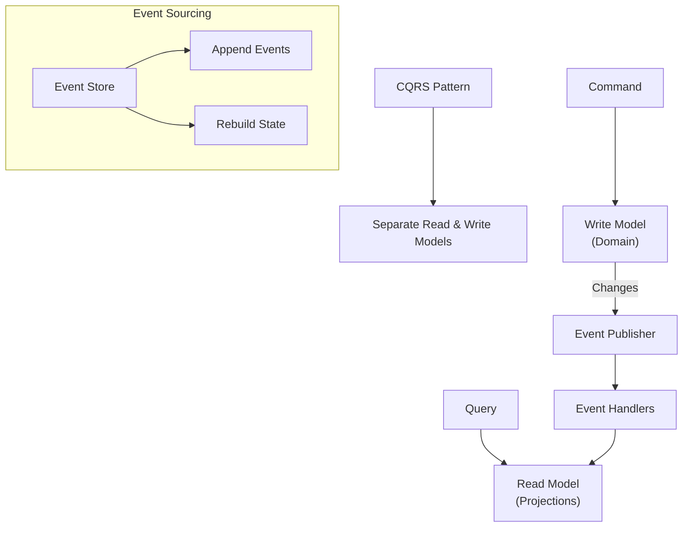
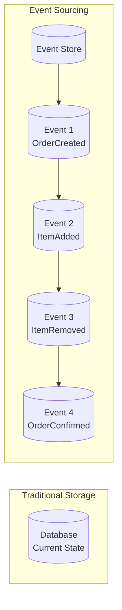
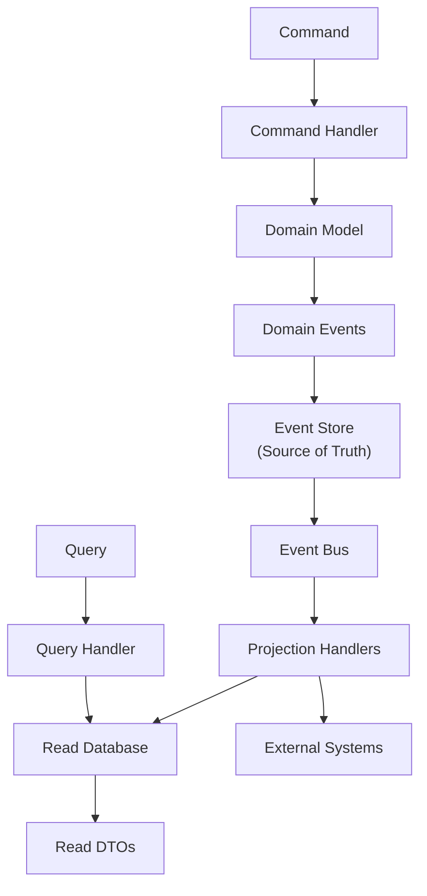

# Software Architecture

## CQRS & Event Sourcing

### 1. Overview

**CQRS** (Command Query Responsibility Segregation) and **Event Sourcing** are two complementary patterns often used together in modern distributed systems. While they can be used independently, combining them creates a powerful architecture for handling complex domains.



### 2. CQRS (Command Query Responsibility Segregation)

#### The Problem with Traditional Architecture

In a traditional CRUD architecture, the same model handles both reads and writes:

```
┌─────────────────────────────────────────────────────────────┐
│              Traditional: One Model for All                  │
│                                                              │
│   User ──Read──→ UserRepository ──→ Database (Users table)    │
│   User ──Write─→ UserRepository ──→ Database (Users table)    │
│                                                              │
│   Problem: Read model = Write model = same entity             │
│   - Complex queries require JOINs and denormalization hacks    │
│   - Read performance and write performance conflict           │
│   - Security: may expose data in read that shouldn't be       │
│     updatable                                                │
└─────────────────────────────────────────────────────────────┘
```

#### CQRS Solution

CQRS separates the read and write sides into distinct models, optimized for their respective purposes.

```
┌─────────────────────────────────────────────────────────────┐
│                    CQRS Architecture                         │
│                                                              │
│   Commands                    Queries                         │
│   (Write)                    (Read)                         │
│      ↓                           ↓                           │
│   ┌──────────┐               ┌──────────┐                    │
│   │ Command  │               │ Query    │                    │
│   │ Handler  │               │ Handler  │                    │
│   └────┬─────┘               └────┬─────┘                    │
│        ↓                           ↓                         │
│   ┌──────────┐               ┌──────────┐                    │
│   │  Write   │               │  Read    │                   │
│   │  Model   │               │  Model   │                   │
│   │ (Domain) │               │ (DTOs)   │                   │
│   └────┬─────┘               └────┬─────┘                    │
│        ↓                           ↓                         │
│   ┌──────────┐               ┌──────────┐                    │
│   │ Database │               │ Database │                    │
│   │  (Write) │               │  (Read)  │                   │
│   │  Source  │               │ Projected│                    │
│   └──────────┘               └──────────┘                    │
└─────────────────────────────────────────────────────────────┘
```

#### CQRS Benefits

| Benefit | Description |
|---------|-------------|
| **Independent Scaling** | Scale read and write sides separately based on load |
| **Optimized Models** | Read model can be denormalized for fast queries |
| **Different Data Stores** | Use SQL for writes, NoSQL/Elasticsearch for reads |
| **Security** | Separate read and write permissions |
| **Flexibility** | Change read model without affecting write model |
| **Performance** | Optimize queries without impacting domain model |

#### CQRS Implementation

```java
// ========== COMMAND SIDE (Write) ==========

// Command: Intent to change
public record CreateOrderCommand(
    CustomerId customerId,
    List<OrderItemData> items
) {}

// Command Handler: Processes command
public class CreateOrderCommandHandler
    implements CommandHandler<CreateOrderCommand, OrderId> {

    private final OrderRepository orderRepository;
    private final ProductRepository productRepository;

    @Override
    public OrderId handle(CreateOrderCommand command) {
        Order order = Order.create(command.customerId());

        for (OrderItemData item : command.items()) {
            Product product = productRepository.findById(item.productId());
            order.addItem(product, item.quantity());
        }

        orderRepository.save(order);
        return order.getId();
    }
}

// Domain Entity (Write Model)
public class Order extends AggregateRoot {
    private OrderId id;
    private CustomerId customerId;
    private OrderStatus status;
    private List<OrderItem> items;
    private Money total;

    public static Order create(CustomerId customerId) {
        Order order = new Order();
        order.id = new OrderId(UUID.randomUUID());
        order.customerId = customerId;
        order.status = OrderStatus.DRAFT;
        order.items = new ArrayList<>();
        return order;
    }

    public void addItem(Product product, int quantity) {
        items.add(new OrderItem(product.getId(), product.getPrice(), quantity));
        recalculateTotal();
    }

    private void recalculateTotal() {
        this.total = items.stream()
            .map(item -> item.getPrice().multiply(item.getQuantity()))
            .reduce(Money.ZERO, Money::add);
    }
}

// ========== QUERY SIDE (Read) ==========

// Read Model (DTO optimized for queries)
public record OrderSummaryDTO(
    String orderId,
    String customerName,
    Instant orderDate,
    Money total,
    int itemCount,
    String status
) {}

public record CustomerOrderHistoryDTO(
    String customerId,
    String customerName,
    List<OrderSummaryDTO> recentOrders,
    Money totalSpent,
    int totalOrders
) {}

// Query
public record GetOrderSummaryQuery(OrderId orderId) {}
public record GetCustomerHistoryQuery(CustomerId customerId) {}

// Query Handler
public class OrderQueryHandler {
    private final JdbcTemplate jdbcTemplate;

    public OrderSummaryDTO handle(GetOrderSummaryQuery query) {
        String sql = """
            SELECT o.id, c.name, o.created_at, o.total, o.status,
                   COUNT(oi.id) as item_count
            FROM orders o
            JOIN customers c ON o.customer_id = c.id
            LEFT JOIN order_items oi ON o.id = oi.order_id
            WHERE o.id = ?
            GROUP BY o.id, c.name, o.created_at, o.total, o.status
            """;

        return jdbcTemplate.queryForObject(sql, (rs, rowNum) ->
            new OrderSummaryDTO(
                rs.getString("id"),
                rs.getString("name"),
                rs.getTimestamp("created_at").toInstant(),
                new Money(rs.getBigDecimal("total"), Currency.USD),
                rs.getInt("item_count"),
                rs.getString("status")
            ),
            query.orderId().getValue()
        );
    }
}

// ========== APPLICATION SERVICE (Wiring) ==========
public class OrderApplicationService {
    private final CommandBus commandBus;
    private final QueryBus queryBus;

    // Controller calls command
    public OrderId createOrder(CreateOrderCommand command) {
        return commandBus.execute(command);
    }

    // Controller calls query
    public OrderSummaryDTO getOrderSummary(GetOrderSummaryQuery query) {
        return queryBus.execute(query);
    }
}
```

### 3. Event Sourcing

#### The Problem with State-Based Storage

Traditional systems store the **current state** of entities:

```
Database Row:
order_id | customer_id | status  | total | items_json
---------|-------------|---------|-------|------------
ORD-001  | CUST-123    | CONFIRMED | 150.00 | [...]
```

Problem: We lose all history. We cannot answer:
- "What did the customer add to the order before removing an item?"
- "How did the order evolve over time?"
- "What was the state at 3 PM yesterday?"

#### Event Sourcing Solution

Event Sourcing stores **events**, not state. Every change is recorded as an immutable event.



Instead of storing: `Order(status=CONFIRMED, total=150)`
We store:
```
Event: OrderCreated
Event: ItemAdded (product=laptop, qty=2, price=100)
Event: ItemRemoved (product=phone)
Event: OrderConfirmed
```

#### Event Sourcing Implementation

```java
// ========== EVENTS ==========
public sealed interface OrderEvent extends DomainEvent {
    record OrderCreated(OrderId orderId, CustomerId customerId, Instant occurredOn)
        implements OrderEvent {}
    record ItemAdded(OrderId orderId, ProductId productId, Money price,
                     int quantity, Instant occurredOn)
        implements OrderEvent {}
    record ItemRemoved(OrderId orderId, ProductId productId, Instant occurredOn)
        implements OrderEvent {}
    record OrderConfirmed(OrderId orderId, Instant occurredOn)
        implements OrderEvent {}
}

// ========== EVENT STORE ==========
public interface EventStore {
    void append(String aggregateId, DomainEvent event, int expectedVersion);
    List<DomainEvent> load(String aggregateId);
    List<DomainEvent> load(String aggregateId, Instant from, Instant to);
}

// ========== AGGREGATE WITH EVENT SOURCING ==========
public class Order extends EventSourcedAggregate {
    private OrderId id;
    private CustomerId customerId;
    private OrderStatus status;
    private List<OrderItem> items;

    // Reconstitution from events (called by framework)
    public Order(List<DomainEvent> events) {
        for (DomainEvent event : events) {
            apply((OrderEvent) event);
        }
    }

    private void apply(OrderEvent event) {
        switch (event) {
            case OrderCreated c -> {
                this.id = c.orderId();
                this.customerId = c.customerId();
                this.status = OrderStatus.DRAFT;
                this.items = new ArrayList<>();
            }
            case ItemAdded a -> {
                this.items.add(new OrderItem(a.productId(), a.price(), a.quantity()));
            }
            case ItemRemoved r -> {
                this.items.removeIf(i -> i.getProductId().equals(r.productId()));
            }
            case OrderConfirmed c -> {
                this.status = OrderStatus.CONFIRMED;
            }
        }
    }

    // Command methods raise events
    public void addItem(Product product, int quantity) {
        if (status != OrderStatus.DRAFT) {
            throw new DomainException("Cannot add items to confirmed order");
        }
        raise(new ItemAdded(id, product.getId(), product.getPrice(),
                           quantity, Instant.now()));
    }

    public void confirm() {
        if (items.isEmpty()) {
            throw new DomainException("Cannot confirm empty order");
        }
        raise(new OrderConfirmed(id, Instant.now()));
    }
}

// ========== EVENT STORE IMPLEMENTATION ==========
public class JpaEventStore implements EventStore {
    private final JdbcTemplate jdbcTemplate;

    @Override
    public void append(String aggregateId, DomainEvent event, int expectedVersion) {
        String sql = """
            INSERT INTO event_store (aggregate_id, event_type, event_data,
                                     sequence_number, occurred_on)
            VALUES (?, ?, ?, ?, ?)
            """;
        // Check optimistic locking (expectedVersion)
        jdbcTemplate.update(sql,
            aggregateId,
            event.getClass().getSimpleName(),
            serialize(event),
            expectedVersion + 1,
            Instant.now()
        );
    }

    @Override
    public List<DomainEvent> load(String aggregateId) {
        String sql = """
            SELECT event_type, event_data
            FROM event_store
            WHERE aggregate_id = ?
            ORDER BY sequence_number ASC
            """;
        return jdbcTemplate.query(sql, (rs, rowNum) ->
            deserialize(rs.getString("event_type"),
                       rs.getString("event_data")),
            aggregateId
        );
    }
}
```

#### Event Sourcing Advantages

| Advantage | Description |
|-----------|-------------|
| **Complete Audit Trail** | Every change is recorded, providing 100% audit capability |
| **Temporal Queries** | Query the state of the system at any point in time |
| **Replay Capability** | Rebuild state by replaying events, or replay to fix bugs |
| **Event-Driven Architecture** | Events can trigger side effects (notifications, analytics) |
| **Debugging** | Replay events to understand exactly what happened |
| **Time Travel** | Travel back to any moment and see the system state |

#### Challenges

| Challenge | Solution |
|-----------|----------|
| **Eventual Consistency** | Read model is updated asynchronously; use "saga" patterns |
| **Event Schema Evolution** | Use versioning, upcasting, or event transformation |
| **Querying** | Build read models (projections) from events |
| **Snapshot** | Periodically snapshot aggregate state to avoid replaying all events |
| **Large Event Log** | Implement snapshots every N events |

```java
// Snapshot pattern for performance
public class OrderSnapshot {
    private final OrderId orderId;
    private final int version;
    private final OrderStatus status;
    private final List<OrderItem> items;
    private final Money total;
    private final Instant snapshotDate;

    // Create snapshot every 100 events
    public static OrderSnapshot from(Order order) {
        return new OrderSnapshot(
            order.getId(),
            order.getVersion(),
            order.getStatus(),
            order.getItems(),
            order.getTotal(),
            Instant.now()
        );
    }

    // Rebuild from snapshot + remaining events
    public Order reconstruct(List<OrderEvent> eventsAfterSnapshot) {
        Order order = new Order(List.of(
            /* events up to snapshot version */
        ));
        for (OrderEvent event : eventsAfterSnapshot) {
            order.apply(event);
        }
        return order;
    }
}
```

### 4. CQRS + Event Sourcing Combined

When combined, CQRS and Event Sourcing create a powerful architecture:



```java
// Combined: CQRS + Event Sourcing
public class OrderCommandHandler {
    private final EventStore eventStore;

    public OrderId handle(CreateOrderCommand command) {
        // Load existing events (empty for new order)
        List<DomainEvent> events = eventStore.load(command.orderId().toString());
        Order order = new Order(events);

        // Execute command
        order.addItem(command.product(), command.quantity());

        // Persist events
        for (DomainEvent event : order.getUncommittedEvents()) {
            eventStore.append(order.getId().toString(), event,
                            order.getVersion() - 1);
        }

        // Events will be published to update read model
        return order.getId();
    }
}

// Projection handler (updates read model)
public class OrderProjectionHandler {
    @EventHandler
    public void handle(OrderConfirmedEvent event) {
        // Update read model (denormalized for fast queries)
        jdbcTemplate.update("""
            INSERT INTO order_summaries (order_id, status, total, confirmed_at)
            VALUES (?, ?, ?, ?)
            ON CONFLICT (order_id) DO UPDATE SET
                status = ?, confirmed_at = ?
            """,
            event.orderId().toString(),
            OrderStatus.CONFIRMED.name(),
            event.totalAmount(),
            event.occurredOn(),
            OrderStatus.CONFIRMED.name(),
            event.occurredOn()
        );
    }
}
```

### 5. Axon Framework (Java)

**Axon Framework** is a popular Java framework for building CQRS and Event Sourcing applications.

```java
// Axon Framework annotations
@Aggregate
public class OrderAggregate {
    @AggregateIdentifier
    private String orderId;

    @CommandHandler
    public OrderAggregate(CreateOrderCommand command) {
        // Constructor handles creation
        apply(OrderCreatedEvent.builder()
            .orderId(command.getOrderId())
            .customerId(command.getCustomerId())
            .build());
    }

    @CommandHandler
    public void handle(AddItemCommand command) {
        if (command.getQuantity() <= 0) {
            throw new IllegalArgumentException("Quantity must be positive");
        }
        apply(ItemAddedEvent.builder()
            .orderId(orderId)
            .productId(command.getProductId())
            .quantity(command.getQuantity())
            .build());
    }

    @EventSourcingHandler
    public void on(OrderCreatedEvent event) {
        this.orderId = event.getOrderId();
    }

    @EventSourcingHandler
    public void on(ItemAddedEvent event) {
        // Update aggregate state
    }
}

// Axon Server for event storage
// or use JPA Event Store adapter
```

### 6. Eventual vs Strong Consistency

| Consistency | Description | Use Case |
|-------------|-------------|----------|
| **Strong Consistency** | All reads see the latest write immediately | Financial transactions, inventory |
| **Eventual Consistency** | Reads may see stale data briefly | Social feeds, analytics, non-critical data |

```java
// Eventual consistency: Read model is updated asynchronously
// CQRS typically uses eventual consistency for the read side

// Command side: Synchronous
public OrderId createOrder(CreateOrderCommand cmd) {
    Order order = orderRepository.save(new Order(cmd));
    eventPublisher.publish(order.getEvents());
    return order.getId();  // Returns immediately
}

// Query side: May return slightly stale data
public OrderSummaryDTO getOrderSummary(OrderId id) {
    return readModelRepository.findSummaryById(id);
    // This read model was updated by projection handler
    // but may not reflect the very latest change yet
}
```

---

### 7. Interview Questions

**Q: What is CQRS and what problem does it solve?**

> **CQRS** (Command Query Responsibility Segregation) separates the models used for reading data from the models used for writing data. The problem it solves is that in traditional architectures, read and write operations share the same model, which is often a poor compromise for both. Read models need denormalized, query-friendly structures. Write models need normalized, consistency-enforcing structures. By separating them, each side can be independently optimized. CQRS also enables independent scaling, different data stores for each side, and better security isolation.

**Q: What is Event Sourcing and why would you use it?**

> **Event Sourcing** stores the history of changes as a sequence of immutable events rather than storing just the current state. Instead of updating a row, you append events to an event log. The current state is reconstructed by replaying all events. You would use it when you need a complete audit trail, temporal queries (what was the state at time T?), replay capability for debugging or fixing bugs, or when the domain is naturally event-driven. It's commonly used in financial systems, order management, and systems with complex compliance requirements.

**Q: What are the challenges of Event Sourcing?**

> The main challenges are: **Eventual consistency** — the read model is updated asynchronously, so queries may return stale data briefly. **Event schema evolution** — as requirements change, event schemas change, requiring versioning and upcasting logic to handle old event formats. **Querying complexity** — since you're storing events, not state, querying requires building projections from events, which can be complex. **Large event logs** — over time, event stores can grow large, requiring snapshot strategies to rebuild aggregates efficiently. **Cognitive overhead** — developers need to think in terms of events rather than state, which has a learning curve.

**Q: When should you combine CQRS with Event Sourcing?**

> Combine them when you have a complex domain that benefits from an audit trail (financial, order management, regulatory compliance), when you need high scalability with independent read/write scaling, when you want to enable temporal queries and time-travel debugging, or when your domain naturally fits an event-driven model. Don't combine them for simple CRUD applications or when eventual consistency is unacceptable (financial ledgers typically need strong consistency).
