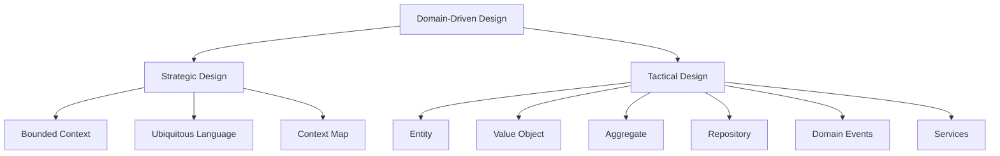
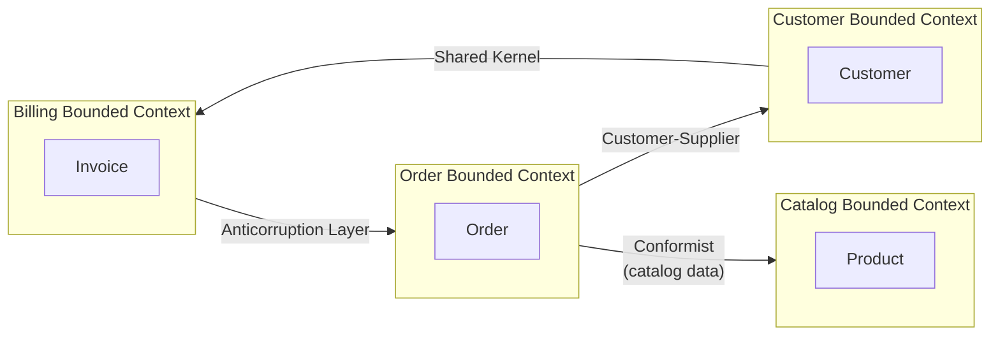
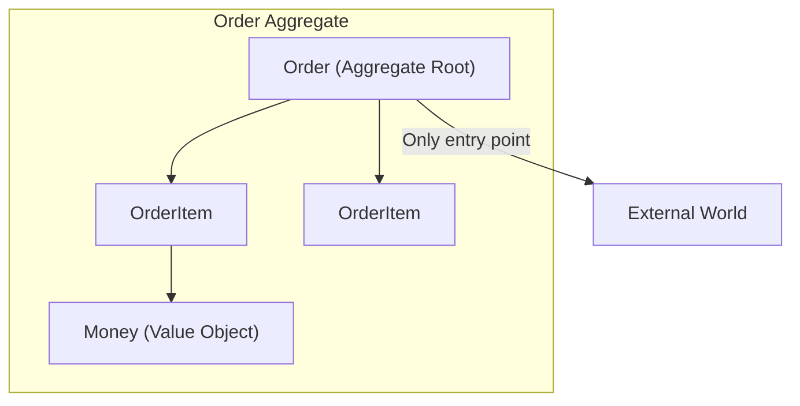

# Software Architecture

## Domain-Driven Design (DDD)

### 1. Overview

**Domain-Driven Design (DDD)** is an approach to software development that focuses on deeply understanding the **business domain** and building software that reflects that understanding. Instead of starting with technical concerns, DDD starts with business concepts, language, and rules.



DDD was popularized by Eric Evans in his book **"Domain-Driven Design: Tackling Complexity in the Heart of Software"** (2003).

### 2. Strategic Design

Strategic design is about understanding the **big picture** — how different parts of the domain relate to each other, where boundaries exist, and how teams should be organized.

#### 2.1. Bounded Context

A **Bounded Context** is a delimited boundary within which a particular domain model is valid and consistent. Inside the boundary, terms have specific meanings, and the model is complete.

```
┌─────────────────────────────────────────────────────────┐
│                    E-Commerce Domain                     │
│                                                          │
│  ┌─────────────────┐  ┌─────────────────┐               │
│  │  Catalog BC     │  │  Order BC       │               │
│  │                 │  │                 │               │
│  │  - Product      │  │  - Order        │               │
│  │  - Category     │  │  - OrderItem    │               │
│  │  - Inventory    │  │  - Shipment     │               │
│  │                 │  │                 │               │
│  │  "Product" =    │  │  "Product" =    │               │
│  │  items for sale │  │  items ordered  │               │
│  └─────────────────┘  └─────────────────┘               │
│                                                          │
│  ┌─────────────────┐  ┌─────────────────┐               │
│  │  Customer BC    │  │  Billing BC     │               │
│  │                 │  │                 │               │
│  │  - Customer     │  │  - Invoice      │               │
│  │  - Address      │  │  - Payment      │               │
│  │  - Preferences  │  │  - Tax          │               │
│  └─────────────────┘  └─────────────────┘               │
└─────────────────────────────────────────────────────────┘
```

Why boundaries matter:
- Different contexts may use the same word with **different meanings**
- A "Product" in Catalog (items for sale) differs from "Product" in an Order (what was purchased)
- Enforcing one unified model across boundaries leads to **god objects** and **anemia**

#### 2.2. Ubiquitous Language

The **Ubiquitous Language** is a shared, consistent language used by both developers and domain experts. It is used in code, conversations, documentation, and tests.

| Domain Expert Says | Code (Ubiquitous Language) |
|---|---|
| "Create an order for the customer" | `Order.create(customerId)` |
| "Add the laptop to the cart" | `Cart.addItem(product, quantity)` |
| "The order is pending payment" | `Order.status == PENDING_PAYMENT` |
| "Ship the order to the customer's address" | `Shipment.deliverTo(address)` |

> Avoid technical jargon in domain language. The language should reflect **how the business actually talks**.

#### 2.3. Context Map

A **Context Map** shows the relationships between Bounded Contexts in the system.



### 3. Bounded Context Relationships

#### 3.1. Shared Kernel

Two contexts **share a subset** of the domain model. Changes to the shared part affect both contexts. Use sparingly — requires tight coordination.

```
┌──────────────┐     Shared      ┌──────────────┐
│   Context A  │ ←─── Kernel ────→ │   Context B  │
│              │   (e.g., Date)   │              │
└──────────────┘                  └──────────────┘
```

#### 3.2. Customer-Supplier

One context (Supplier) provides services/data to another (Customer). The Customer can request changes, and the Supplier decides whether to fulfill them.

```
┌──────────────┐                   ┌──────────────┐
│   Supplier   │ ── upstream ────→ │   Customer   │
│  (Catalog)   │    provides       │   (Order)    │
└──────────────┘   data/services   └──────────────┘
```

#### 3.3. Conformist

The downstream context **adopts** the model of the upstream context without translation. Simpler but creates dependency.

#### 3.4. Anticorruption Layer (ACL)

The downstream context creates an **adapter layer** that translates between models, protecting its own domain from external changes.

```java
// Anticorruption Layer - Order Context protecting itself from Catalog Context
public class CatalogProductAdapter {
    private final CatalogClient catalogClient;

    public OrderableProduct adapt(CatalogProduct externalProduct) {
        // Translate external CatalogProduct to internal OrderableProduct
        return new OrderableProduct(
            externalProduct.getId().toString(),
            externalProduct.getDisplayName(),
            externalProduct.getPrice().getAmount(),
            externalProduct.isAvailable() && externalProduct.getStock() > 0
        );
    }
}
```

#### 3.5. Open Host Service (OHS) & Published Language (PL)

The upstream context defines a **protocol** (Open Host Service) and a **data format** (Published Language) that downstream contexts can use to integrate.

---

### 4. Tactical Design (Building Blocks)

Tactical design provides the **implementation patterns** for building models within a Bounded Context.

#### 4.1. Entity vs Value Object

| Aspect | Entity | Value Object |
|--------|--------|-------------|
| **Identity** | Has a unique identifier | No identity (identified by attributes) |
| **Mutability** | Mutable | Immutable |
| **Equality** | By ID | By all attributes |
| **Lifecycle** | Has a lifecycle (created, updated) | No lifecycle |
| **Examples** | User, Order, Product, Account | Address, Money, DateRange, Color |

```java
// Entity: Has identity, mutable
public class Order {
    private OrderId id;        // Unique identity
    private CustomerId customerId;
    private OrderStatus status;
    private List<OrderItem> items;

    public OrderId getId() { return id; }

    public void addItem(Product product, int quantity) {
        if (status != OrderStatus.DRAFT) {
            throw new IllegalStateException("Cannot add items to non-draft order");
        }
        // Business rule enforced here
        items.add(new OrderItem(product.getId(), product.getPrice(), quantity));
    }

    public void confirm() {
        if (items.isEmpty()) {
            throw new IllegalStateException("Cannot confirm empty order");
        }
        this.status = OrderStatus.CONFIRMED;
    }
}

// Value Object: Immutable, identified by attributes
public class Money {
    private final BigDecimal amount;
    private final Currency currency;

    public Money(BigDecimal amount, Currency currency) {
        this.amount = amount;
        this.currency = currency;
    }

    public Money add(Money other) {
        if (!this.currency.equals(other.currency)) {
            throw new IllegalArgumentException("Cannot add different currencies");
        }
        return new Money(this.amount.add(other.amount), this.currency);
    }

    // Value objects: equality by attributes, not identity
    @Override
    public boolean equals(Object o) {
        if (this == o) return true;
        if (o == null || getClass() != o.getClass()) return false;
        Money money = (Money) o;
        return Objects.equals(amount, money.amount) &&
               Objects.equals(currency, money.currency);
    }

    @Override
    public int hashCode() {
        return Objects.hash(amount, currency);
    }
}
```

#### 4.2. Aggregate

An **Aggregate** is a cluster of related entities and value objects with a single **Aggregate Root** that is the only object accessible from outside.



Rules:
- The **Aggregate Root** is the only object that outside code can reference
- Changes to the aggregate are coordinated through the root
- The aggregate enforces **invariants** (business rules that must always be true)
- Each aggregate has its own **Repository**

```java
// Aggregate Root: Order
public class Order extends AggregateRoot {
    private OrderId id;
    private CustomerId customerId;
    private OrderStatus status;
    private List<OrderItem> items;  // Internal entities

    // External code ONLY accesses through the root
    public void addItem(Product product, int quantity) {
        // Invariant: Cannot modify non-draft order
        if (status != OrderStatus.DRAFT) {
            throw new DomainException("Cannot modify confirmed order");
        }

        // Invariant: Quantity must be positive
        if (quantity <= 0) {
            throw new DomainException("Quantity must be positive");
        }

        // Invariant: Check product availability
        if (!product.isAvailable()) {
            throw new DomainException("Product is not available");
        }

        this.items.add(new OrderItem(product.getId(), product.getPrice(), quantity));
        // Domain events can be raised here
        registerEvent(new OrderItemAddedEvent(this.id, product.getId(), quantity));
    }

    public void removeItem(ProductId productId) {
        if (status != OrderStatus.DRAFT) {
            throw new DomainException("Cannot modify confirmed order");
        }
        this.items.removeIf(item -> item.getProductId().equals(productId));
    }
}

// OrderItem: Internal entity — external code cannot access directly
class OrderItem {
    private final ProductId productId;
    private final Money unitPrice;
    private int quantity;

    // ... constructor and methods
}

// External code: Only interacts with Order
public class OrderService {
    public void addProductToOrder(OrderId orderId, ProductId productId) {
        Order order = orderRepository.findById(orderId);
        Product product = productRepository.findById(productId);
        order.addItem(product, 1);  // Only through root
        orderRepository.save(order);
    }
}
```

#### 4.3. Repository Pattern

A **Repository** provides access to Aggregates. It abstracts the persistence layer, giving the domain a collection-like interface.

```java
// Repository interface (in domain layer)
public interface OrderRepository {
    Order findById(OrderId id);
    Order findByCustomerId(CustomerId customerId);
    List<Order> findByStatus(OrderStatus status);
    void save(Order order);  // Handles both insert and update
    void delete(OrderId id);
}

// Repository implementation (in infrastructure layer)
@Repository
public class JpaOrderRepository implements OrderRepository {
    private final SpringDataOrderRepository springDataRepo;

    @Override
    public Order findById(OrderId id) {
        return springDataRepo.findById(id.getValue())
            .map(entity -> orderMapper.toDomain(entity))
            .orElse(null);
    }

    @Override
    public void save(Order order) {
        OrderEntity entity = orderMapper.toEntity(order);
        springDataRepo.save(entity);
    }
}
```

> **Key principle**: Repository interfaces live in the **domain layer**, but implementations live in the **infrastructure layer**. The domain never depends on infrastructure.

#### 4.4. Domain Events

**Domain Events** represent something significant that happened in the domain. They are immutable records of a past occurrence.

```java
// Domain Event
public class OrderConfirmedEvent extends DomainEvent {
    private final OrderId orderId;
    private final CustomerId customerId;
    private final Money totalAmount;
    private final Instant occurredOn;

    public OrderConfirmedEvent(OrderId orderId, CustomerId customerId,
                                Money totalAmount, Instant occurredOn) {
        super(occurredOn);
        this.orderId = orderId;
        this.customerId = customerId;
        this.totalAmount = totalAmount;
    }

    // Getters
    public OrderId getOrderId() { return orderId; }
    public CustomerId getCustomerId() { return customerId; }
    public Money getTotalAmount() { return totalAmount; }
}

// Raising events from Aggregate Root
public class Order extends AggregateRoot {
    public void confirm() {
        this.status = OrderStatus.CONFIRMED;
        // Register event — will be dispatched after transaction commits
        registerEvent(new OrderConfirmedEvent(
            this.id, this.customerId, this.getTotal(), Instant.now()
        ));
    }
}

// Event handler (in application layer or other bounded context)
public class OrderEventHandler {
    @EventHandler
    public void handleOrderConfirmed(OrderConfirmedEvent event) {
        // Send confirmation email
        emailService.sendOrderConfirmation(
            event.getCustomerId(),
            event.getOrderId()
        );
        // Update analytics
        analyticsService.trackOrderConfirmed(event.getTotalAmount());
        // Notify warehouse
        warehouseService.prepareShipment(event.getOrderId());
    }
}
```

#### 4.5. Domain Services vs Application Services vs Infrastructure Services

| Service Type | Responsibility | Location | Dependencies |
|---|---|---|---|
| **Domain Service** | Business logic that doesn't belong to a single entity | Domain Layer | Domain objects only |
| **Application Service** | Orchestrates domain objects, use cases | Application Layer | Domain Services, Repositories |
| **Infrastructure Service** | External concerns (email, SMS, file storage) | Infrastructure Layer | External systems |

```java
// Domain Service: Pure business logic across entities
// Located in domain layer — no infrastructure dependencies
public class PricingService {
    public Money calculateDiscountedPrice(Money originalPrice,
                                          DiscountPolicy policy,
                                          Customer customer) {
        BigDecimal discountRate = policy.getDiscountRate(customer.getTier());
        BigDecimal discount = originalPrice.getAmount()
            .multiply(discountRate);
        return new Money(
            originalPrice.getAmount().subtract(discount),
            originalPrice.getCurrency()
        );
    }
}

// Application Service: Orchestrates the use case
// Located in application layer
public class PlaceOrderService {
    private final OrderRepository orderRepository;
    private final ProductRepository productRepository;
    private final DomainEventPublisher eventPublisher;
    private final PricingService pricingService;

    public OrderId placeOrder(CustomerId customerId,
                              List<OrderItemRequest> items) {
        Order order = Order.create(customerId);

        for (OrderItemRequest item : items) {
            Product product = productRepository.findById(item.getProductId());
            order.addItem(product, item.getQuantity());
        }

        Money total = pricingService.calculateTotal(order.getItems());
        order.setTotal(total);
        orderRepository.save(order);

        eventPublisher.publish(new OrderPlacedEvent(order.getId()));
        return order.getId();
    }
}

// Infrastructure Service: External integrations
// Located in infrastructure layer
@Service
public class EmailNotificationService implements NotificationService {
    @Override
    public void sendOrderConfirmation(OrderId orderId, CustomerEmail email) {
        // Integration with SMTP, SendGrid, etc.
        emailClient.send(email, "Order Confirmed", buildEmailBody(orderId));
    }
}
```

#### 4.6. Factory Pattern in DDD

The **Factory** pattern encapsulates complex object creation, especially for Aggregates with complex creation rules.

```java
// Factory for creating aggregates with validation
public class OrderFactory {
    private final ProductRepository productRepository;

    public OrderFactory(ProductRepository productRepository) {
        this.productRepository = productRepository;
    }

    public Order createOrder(CustomerId customerId, List<OrderItemRequest> items) {
        // Creation logic that may span multiple steps
        Order order = Order.create(customerId);

        for (OrderItemRequest item : items) {
            Product product = productRepository.findById(item.getProductId());
            if (product == null) {
                throw new ProductNotFoundException(item.getProductId());
            }
            order.addItem(product, item.getQuantity());
        }

        if (order.isEmpty()) {
            throw new EmptyOrderException();
        }

        return order;
    }
}
```

---

### 5. When to Use DDD

#### 5.1. Good fit for DDD

- **Complex business domains** with rich rules and logic (banking, insurance, healthcare, e-commerce)
- **Large teams** where shared understanding of the domain is critical
- **Long-lived systems** where domain model evolution matters
- **Strategic importance** — the domain is the core competitive advantage

#### 5.2. DDD may be overkill when

- **Simple CRUD applications** with minimal business logic
- **Data-centric systems** where the primary goal is storage and retrieval
- **Small teams** with simple domains
- **Short-lived prototypes** where speed trumps structure

### 6. DDD and Clean Architecture

DDD works well with Clean Architecture:

```
┌──────────────────────────────────────────────────────────────┐
│                    Frameworks & Drivers                       │
│               (Controllers, Gateways, UI)                     │
├──────────────────────────────────────────────────────────────┤
│                    Interface Adapters                        │
│            (Presenters, Converters, DTOs)                    │
├──────────────────────────────────────────────────────────────┤
│                    Application Layer                          │
│           (Application Services, Use Cases)                  │
│                  (Domain Services)                           │
├──────────────────────────────────────────────────────────────┤
│                      Domain Layer                            │
│   Entities | Value Objects | Aggregates | Repositories (I/F) │
│            Domain Events | Domain Services                   │
├──────────────────────────────────────────────────────────────┤
│                    Enterprise Business                        │
│                    (Optional: Modules)                       │
└──────────────────────────────────────────────────────────────┘
```

> In DDD, the **Domain Layer** is the core — it has no external dependencies. All other layers depend inward.

---

### 7. Interview Questions

**Q: What is the difference between an Entity and a Value Object?**

> An **Entity** has a distinct identity that persists over time, even if its attributes change. Two entities with the same attributes but different IDs are different entities. A **Value Object** has no identity and is defined entirely by its attributes. Two value objects with the same attributes are considered equal. Value objects are immutable, while entities are mutable. Examples: `Order` (Entity, has OrderId) vs `Address` (Value Object, equal if all address fields match).

**Q: What is an Aggregate Root and why is it important?**

> The **Aggregate Root** is the single entity within an aggregate that serves as the only entry point for external access. All changes to objects within the aggregate must go through the root. This is important because: it enforces **invariants** (business rules that must always hold) from a single location, it provides a **clear transaction boundary**, and it prevents external code from bypassing business rules by modifying internal state directly.

**Q: What is the difference between Domain Events and Application Events?**

> **Domain Events** represent something that happened in the business domain and are part of the domain model itself. They use Ubiquitous Language and are defined in the domain layer. **Application Events** (or infrastructure events) are a technical mechanism for communication, often used for framework integration, cross-cutting concerns, or async processing. Domain events should be raised by the domain, while application services or infrastructure handle their dispatch and processing.

**Q: When would you NOT use DDD?**

> DDD adds complexity and overhead. Do not use it for simple CRUD applications where the business logic is minimal, for data-centric systems focused purely on storage and retrieval, for small projects with a short lifespan, or when the team lacks experience with DDD patterns. The added value of DDD's rich modeling comes at the cost of additional design effort and architectural complexity.
