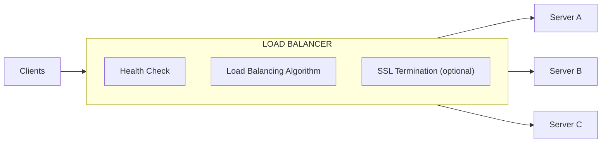

# Load Balancer

## 

### Overview

A **load balancer** distributes incoming request traffic evenly across multiple backend servers. It acts as a single entry point for clients and ensures no single server bears too much load.



### Types of Load Balancers

| Type | OSI Layer | Description |
|---|---|---|
| **Layer 4 (Transport)** | L4 | Distributes traffic by IP address and port (TCP, UDP). Faster, less aware of content. |
| **Layer 7 (Application)** | L7 | Distributes traffic by HTTP/HTTPS content (URL, cookies, headers). Smarter but more overhead. |

#### L4 vs. L7 Comparison

| Aspect | L4 Load Balancer | L7 Load Balancer |
|---|---|---|
| **Data examined** | IP, Port | URL, Headers, Cookies, Body |
| **Performance** | Faster (less processing) | Slower (deeper inspection) |
| **Routing decisions** | Simple | Complex |
| **SSL termination** | No | Yes |
| **Content-based routing** | No | Yes (e.g., `/api/*` → backend) |
| **Examples** | HAProxy (TCP mode), AWS NLB | Nginx, AWS ALB, HAProxy (HTTP mode) |

### Load Balancing Algorithms

| Algorithm | Description | Best For |
|---|---|---|
| **Round Robin** | Distribute requests evenly in sequence | Homogeneous servers |
| **Weighted Round Robin** | Distribute based on server capacity | Heterogeneous hardware |
| **Least Connections** | Route to server with fewest active connections | Long-lived connections |
| **Weighted Least Connections** | Factor in both connections and weight | Mixed capacity |
| **IP Hash** | Hash client IP to determine server | Session affinity (if needed) |
| **Least Response Time** | Route to server with lowest response time | Latency-sensitive apps |
| **Random** | Random selection | Simple, works well with caching |

### Health Checks

| Type | Description | Example |
|---|---|---|
| **Passive** | Monitor active requests for failures | Mark server down after 3 consecutive failures |
| **Active** | Periodically send probes to servers | `GET /health` every 10 seconds |
| **TCP Connect** | Check if port is open | Simple, low overhead |
| **HTTP/HTTPS** | Check specific endpoint | More informative (can check DB connectivity) |

```bash
# Example: Nginx health check configuration
upstream backend {
    least_conn;
    server 10.0.1.10:8080 max_fails=3 fail_timeout=30s;
    server 10.0.1.11:8080 max_fails=3 fail_timeout=30s;
    server 10.0.1.12:8080 backup;  # Only used when others fail
}

# Active health check (requires nginx-plus or open-source module)
health_check uri=/health interval=5s timeout=2s
             rises=2 falls=3 port=8080;
```

### Session Persistence (Sticky Sessions)

| Method | Description | Pros | Cons |
|---|---|---|---|
| **Cookie-based** | Load balancer sets a cookie to track server | Simple | Cookie manipulation risk |
| **IP Hash** | Hash client IP to same server | No cookie needed | Mobile users may change IPs |
| **Application-level** | Server issues session token | Most flexible | Extra app logic |

> **Note:** Sticky sessions are often unnecessary when the backend is **stateless**. Use JWT tokens or store sessions in Redis instead of relying on server affinity.

### Advanced Features

| Feature | Description |
|---|---|
| **SSL/TLS Termination** | Decrypt HTTPS at load balancer; forward plain HTTP to backend |
| **DDoS Protection** | Rate limiting, IP blocking, traffic scrubbing |
| **Circuit Breaker** | Temporarily stop routing to failing backend |
| **Auto-scaling Integration** | Add/remove servers based on load |
| **Request/Response Rewriting** | Modify headers, paths, or payloads |

### Load Balancer Solutions

| Product | Type | Notes |
|---|---|---|
| **AWS ELB (ALB/NLB)** | Cloud-managed | Deep AWS integration |
| **Nginx** | Software LB, L7 | Most popular, highly configurable |
| **HAProxy** | Software LB, L4/L7 | High performance, TCP expert |
| **Traefik** | Cloud-native, L7 | Docker/Kubernetes native |
| **Envoy** | Service proxy, L7 | Used as sidecar in service mesh |
| **Cloudflare** | CDN + LB | Global anycast network |

### DNS-Based Load Balancing

| Method | Description |
|---|---|
| **Round Robin DNS** | Rotate IP addresses in DNS responses |
| **GeoDNS** | Return different IPs based on user's location |
| **Anycast** | Multiple servers share same IP; routing directs to nearest |

```bash
# Example: GeoDNS configuration (Route 53)
# Users from Europe get EU server IPs
# Users from Asia get AP server IPs
# Default: US server IPs
```

### Configuration Example: Nginx

```nginx
# nginx.conf
upstream api_backend {
    # Enable sticky sessions
    ip_hash;

    # Server with weight
    server 10.0.1.10:8080 weight=3;
    server 10.0.1.11:8080 weight=2;
    server 10.0.1.12:8080;
}

server {
    listen 443 ssl http2;
    ssl_certificate /etc/ssl/server.crt;
    ssl_certificate_key /etc/ssl/server.key;

    # Rate limiting zone
    limit_req_zone $binary_remote_addr zone=api_limit:10m rate=10r/s;

    location /api/ {
        proxy_pass http://api_backend;
        proxy_http_version 1.1;
        proxy_set_header Host $host;
        proxy_set_header X-Real-IP $remote_addr;
        proxy_set_header X-Forwarded-For $proxy_add_x_forwarded_for;
        proxy_set_header X-Forwarded-Proto $scheme;

        # Retry configuration
        proxy_next_upstream error timeout http_502 http_503;

        # Rate limiting
        limit_req zone=api_limit burst=20 nodelay;
    }
}
```

> **Tip:** Place load balancers in **at least two availability zones**. A single load balancer is a single point of failure. Use health checks to automatically remove failed servers from rotation.
