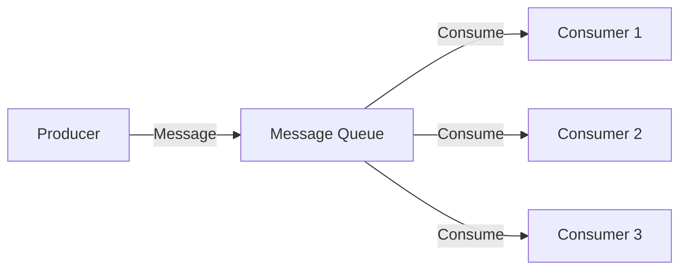
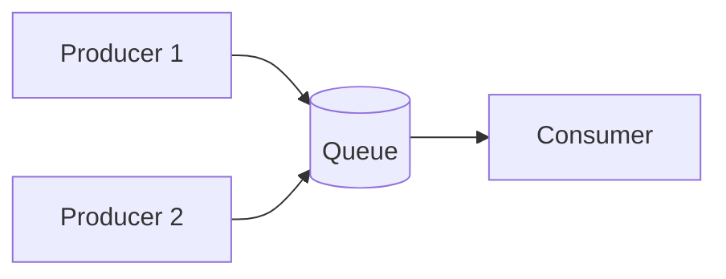
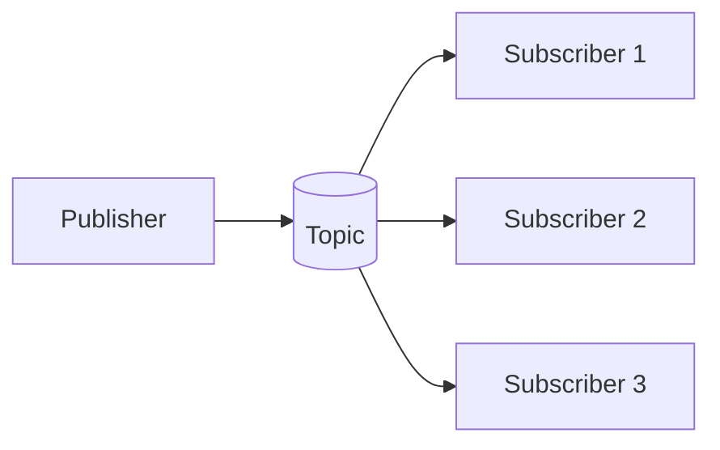
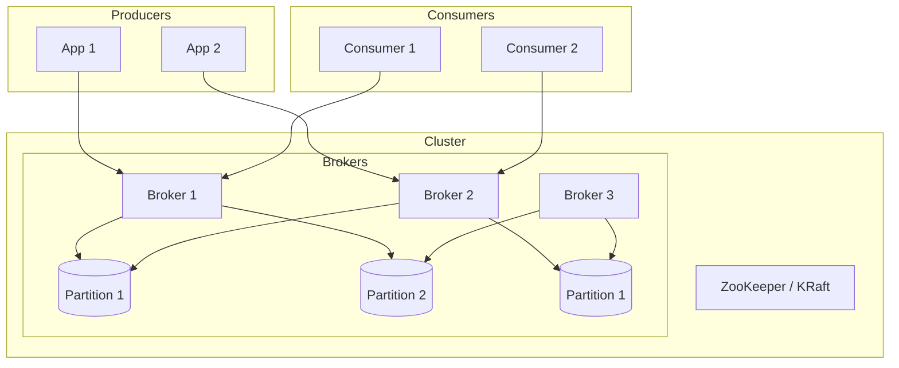
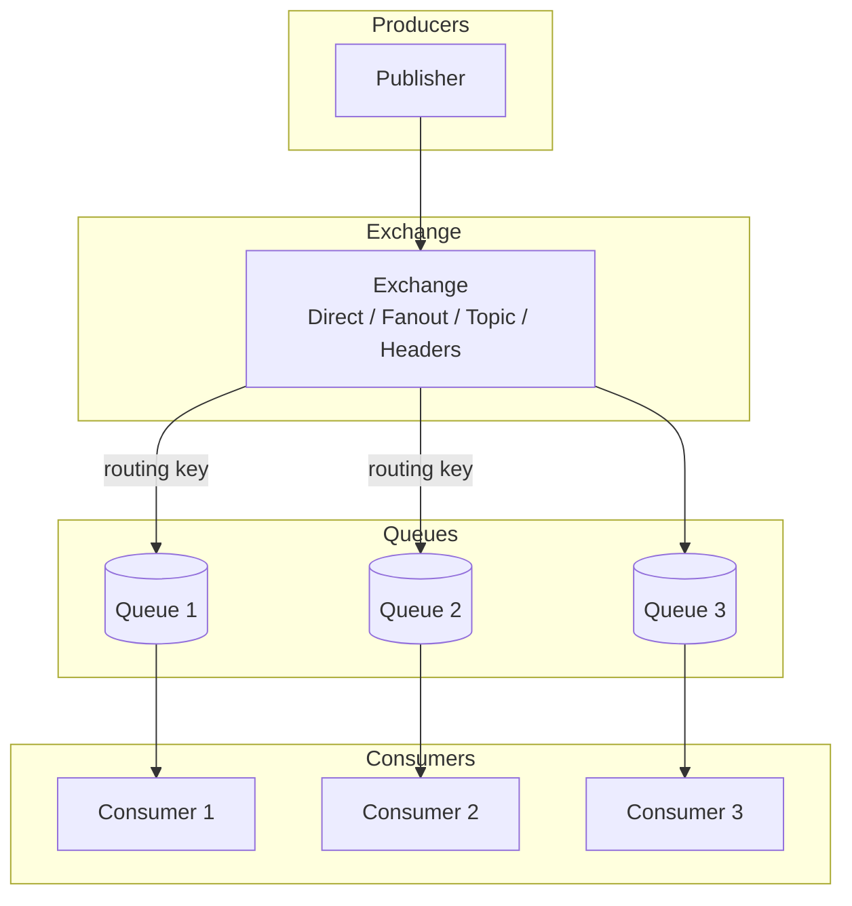
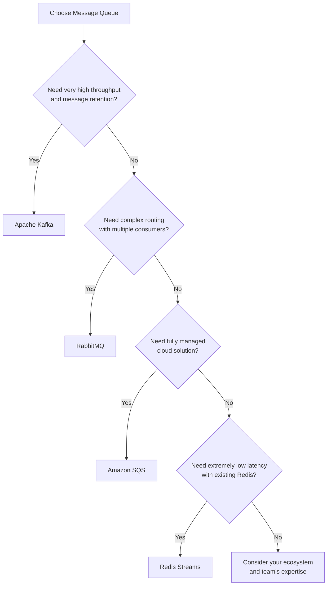

# Message Queue

## Overview

Message Queue (Hàng đợi tin nhắn) là một mô hình truyền thông bất đồng bộ, cho phép các service giao tiếp với nhau thông qua việc gửi và nhận messages mà không cần phải chờ response ngay lập tức. Message Queue nằm giữa Producer (người gửi) và Consumer (người nhận), đảm bảo messages được xử lý một cách đáng tin cậy ngay cả khi consumer tạm thời không khả dụng.



## Why Use Message Queue?

- **Decoupling**: Tách biệt producer và consumer. Producer không cần biết consumer là ai hoặc có bao nhiêu consumer.
- **Asynchronous**: Producer có thể tiếp tục xử lý mà không cần chờ consumer xử lý xong.
- **Scalability**: Dễ dàng scale consumer bằng cách thêm nhiều instances.
- **Reliability**: Messages được lưu trữ an toàn cho đến khi được xử lý thành công (persistent queue).
- **Load Leveling**: Xử lý burst traffic bằng cách queue messages và xử lý từ từ.
- **Resilience**: Nếu consumer fail, message vẫn còn trong queue và có thể retry.

## Message Patterns

### Point-to-Point

Mỗi message được consume bởi đúng một consumer. Queue xóa message sau khi consumer nhận thành công.



### Publish/Subscribe (Pub/Sub)

Một message được gửi đến topic và tất cả subscribers của topic đó đều nhận được bản sao. Mỗi subscriber có thể process message theo cách riêng.



## Core Concepts

### Message

Một message bao gồm:
- **Payload**: Dữ liệu cần truyền (JSON, XML, binary,...)
- **Headers**: Metadata (correlation ID, timestamp, message type,...)
- **Delivery mode**: Persistent (được lưu đĩa) hoặc Non-persistent (chỉ trong memory)

### Producer / Publisher

Ứng dụng gửi message đến queue hoặc topic. Không cần đợi consumer xử lý.

### Consumer / Subscriber

Ứng dụng nhận và xử lý message. Có thể là:
- **Push**: Consumer được notify khi có message mới
- **Pull**: Consumer chủ động pull messages từ queue

### Queue / Topic

- **Queue**: Point-to-point, FIFO (First-In-First-Out)
- **Topic**: Pub/Sub, một message gửi đến nhiều subscribers

## Message Acknowledgment

Khi consumer nhận message, nó cần acknowledge (ACK) để báo rằng đã xử lý thành công:

- **Auto ACK**: Message được auto-acknowledge ngay khi gửi đến consumer
- **Manual ACK**: Consumer chủ động ACK sau khi xử lý thành công
- **Negative ACK (NACK)**: Consumer reject message, message sẽ được requeue hoặc gửi đến Dead Letter Queue (DLQ)

## Dead Letter Queue (DLQ)

Messages không thể xử lý (sau nhiều lần retry thất bại) được chuyển đến DLQ để:
- Phân tích nguyên nhân thất bại
- Xử lý thủ công nếu cần
- Không block main queue

## Comparison of Message Queue Systems

| Feature | Apache Kafka | RabbitMQ | Apache ActiveMQ | Amazon SQS | Redis Streams |
|---------|-------------|----------|-----------------|------------|---------------|
| **Pattern** | Pub/Sub + Queue | Both | Both | Queue only | Both |
| **Ordering** | Per partition | Per queue | Per queue | Per queue | Per consumer group |
| **Throughput** | Very High (MB/s) | High | Medium | High | High |
| **Latency** | Low | Very Low | Medium | Low | Very Low |
| **Persistence** | Yes (configurable) | Yes (optional) | Yes | Yes (managed) | Optional |
| **Replication** | Yes (ISR) | Quorum queue | Master/Slave | Managed | Sentinel/Cluster |
| **Message Retention** | Configurable (hours/days) | Until ACK | Until ACK | Up to 14 days | Until trimmed |
| **DLQ Support** | Yes (via topic) | Yes | Yes | Yes (DLQ) | Yes (pending) |
| **Language** | Scala/Java | Erlang | Java | Managed | C |
| **Use Case** | Streaming, Event sourcing | Flexible routing | Legacy integration | Cloud-native, Serverless | Low-latency caching |

## Apache Kafka

### Architecture



### Key Concepts

- **Topic**: Logical channel for messages (like a table in DB)
- **Partition**: Physical subdivision of topic for parallelism. Each partition is ordered and immutable.
- **Offset**: Sequential ID of each message within a partition
- **Consumer Group**: Group of consumers sharing the workload. Each partition is assigned to one consumer in the group.
- **Replication Factor**: Number of copies of each partition across brokers for fault tolerance
- **ISR (In-Sync Replicas)**: Replicas that have fully caught up with the leader

### Use Cases

- Event streaming and Event Sourcing
- Real-time analytics (clickstreams, IoT sensor data)
- Log aggregation (ELK stack)
- Stream processing (Kafka Streams, Apache Flink)
- Building event-driven microservices

### Producer Code Example

```java
Properties props = new Properties();
props.put("bootstrap.servers", "localhost:9092");
props.put("key.serializer", "org.apache.kafka.common.serialization.StringSerializer");
props.put("value.serializer", "org.apache.kafka.common.serialization.StringSerializer");

Producer<String, String> producer = new KafkaProducer<>(props);

ProducerRecord<String, String> record = new ProducerRecord<>(
    "order-events",  // topic
    "order-123",      // key
    "Order created for customer X"  // value
);

producer.send(record, (metadata, exception) -> {
    if (exception == null) {
        System.out.println("Sent: " + record.key() +
            " to partition " + metadata.partition() +
            " at offset " + metadata.offset());
    } else {
        exception.printStackTrace();
    }
});

producer.close();
```

### Consumer Code Example

```java
Properties props = new Properties();
props.put("bootstrap.servers", "localhost:9092");
props.put("group.id", "order-processor");
props.put("key.deserializer", "org.apache.kafka.common.serialization.StringDeserializer");
props.put("value.deserializer", "org.apache.kafka.common.serialization.StringDeserializer");
props.put("auto.offset.reset", "earliest");

KafkaConsumer<String, String> consumer = new KafkaConsumer<>(props);
consumer.subscribe(Arrays.asList("order-events"));

while (true) {
    ConsumerRecords<String, String> records = consumer.poll(Duration.ofMillis(100));
    for (ConsumerRecord<String, String> record : records) {
        System.out.println("Received: " + record.value() +
            " from partition " + record.partition() +
            " at offset " + record.offset());
        // Process the order...
    }
}
```

## RabbitMQ

### Architecture



### Exchange Types

- **Direct**: Message được gửi đến queue dựa trên exact routing key
- **Fanout**: Message được gửi đến TẤT CẢ queues bound với exchange
- **Topic**: Routing key matching với wildcard patterns (`*.order.*`, `payment.#`)
- **Headers**: Match dựa trên message headers thay vì routing key

### Use Cases

- Task queues (background job processing)
- Complex routing (multiple consumers with different needs)
- E-commerce order processing
- Notification systems

### RabbitMQ Java Example

```java
ConnectionFactory factory = new ConnectionFactory();
factory.setHost("localhost");
Connection connection = factory.newConnection();
Channel channel = connection.createChannel();

// Declare exchange
channel.exchangeDeclare("order.events", BuiltinExchangeType.TOPIC, true);

// Declare queue
channel.queueDeclare("order.processing", true, false, false, null);

// Bind queue to exchange
channel.queueBind("order.processing", "order.events", "order.#");

// Consumer
DeliverCallback deliverCallback = (consumerTag, delivery) -> {
    String message = new String(delivery.getBody(), "UTF-8");
    System.out.println("Received: " + message);
    channel.basicAck(delivery.getEnvelope().getDeliveryTag(), false);
};

channel.basicConsume("order.processing", false, deliverCallback, consumerTag -> {});
```

## Amazon SQS

### Features

- **Fully managed** cloud service - no servers to manage
- **Two queue types**:
  - **Standard Queue**: Unlimited TPS, at-least-once delivery, best-effort ordering
  - **FIFO Queue**: Exactly-once processing, FIFO ordering, limited to 300 TPS
- **Message retention**: 1 minute to 14 days
- **Visibility timeout**: Time consumer has to process before message becomes visible again
- **Dead Letter Queue**: For failed messages
- **Long polling**: Reduce empty responses

### Use Cases

- Serverless architectures (AWS Lambda + SQS)
- Decoupling microservices
- Distributed job queues
- Buffering batch operations

## Choosing the Right Message Queue



## Best Practices

1. **Idempotent Processing**: Design consumers to handle duplicate messages gracefully
2. **Message Size**: Keep messages small (< 1MB). For large payloads, store in object storage and send reference.
3. **Ordering**: Only expect ordering within a single partition/queue. If ordering matters, use consistent routing key.
4. **Monitoring**: Monitor queue depth, consumer lag, processing time, and error rates
5. **Retry with Backoff**: Use exponential backoff for retries to avoid thundering herd
6. **DLQ**: Always configure Dead Letter Queue for failed messages
7. **Schema Registry**: Use Avro or Protobuf for message serialization in Kafka for schema evolution
8. **Security**: Enable TLS encryption in transit, use IAM/ACL for authorization

## Common Interview Questions

**Q: What's the difference between Kafka and RabbitMQ?**

A: Kafka is optimized for high-throughput streaming with message retention and per-partition ordering. RabbitMQ is more flexible with routing (multiple exchange types) and better for traditional message queuing with simpler semantics. Kafka is pull-based (consumer pulls), RabbitMQ is push-based.

**Q: How do you ensure exactly-once delivery?**

A: It's very hard to achieve true exactly-once. Strategies include:
- Idempotent producers + idempotent consumers
- Transactional outbox pattern (write to DB + message atomically)
- Use Kafka transactions for exactly-once semantics with sinks

**Q: What happens when a consumer fails mid-processing?**

A: Depends on acknowledgment mode:
- Auto ACK: Message lost if consumer crashes after receiving but before processing
- Manual ACK: Message re-queued (or goes to DLQ after max retries) if consumer doesn't ACK
- Visibility timeout (SQS): Message becomes visible again after timeout if not processed

**Q: How do you handle message ordering?**

A: Use a single partition/queue per ordering key. All messages with the same key go to the same partition. Consumer processes in order. Alternatively, use sequence numbers in messages and let consumer ensure ordering.
