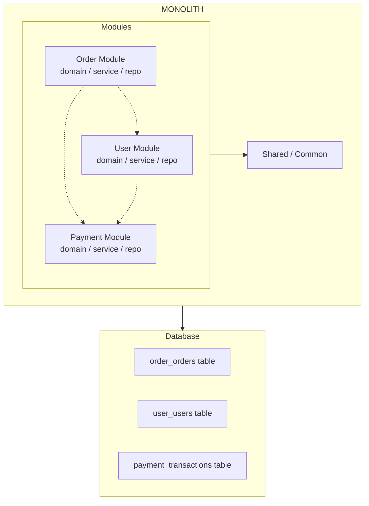

# Modular Monolith

## 1. Overview

A **Modular Monolith** is one application deployed as a single unit, but its code is split into clear modules such as `Order`, `User`, and `Payment`. Each module owns a specific responsibility and should not freely access another module's internal classes or tables.

Its main value: it stays easy to run and debug like a monolith, while keeping module boundaries clear enough to extract services later if the system truly needs it.

### Simple Definition

```text
Traditional Monolith -> One application, code often tightly coupled
Modular Monolith     -> One application, code split into bounded modules
Microservices        -> Many services deployed separately
```

**Module boundary** means other modules call through an interface or public module API. They should not directly reach into internal classes, repositories, or tables owned by another module.

---

## 2. Key Characteristics

### Like a Traditional Monolith

| Characteristic | Description |
|---|---|
| **Single artifact** | Build and deploy as one unit |
| **Shared database** | Modules usually share one database, often separated by schema or table prefix |
| **Synchronous communication** | Modules can call each other in the same process |
| **Simple deployment** | Only one artifact to deploy |
| **Simple debugging** | One process, no mandatory distributed tracing |

### Like Microservices

| Characteristic | Description |
|---|---|
| **Clear module boundaries** | Each module has its own namespace/package |
| **Low coupling** | Modules communicate through interfaces or internal APIs |
| **Independent deployability** | Some implementations can later extract/deploy a module independently |
| **Team ownership** | One team can own one or more modules |
| **Data separation** | Database is shared, but tables/schemas are grouped by module |

### Architecture Diagram



---

## 3. Detailed Comparison

| Criteria | Monolith | Modular Monolith | Microservices |
|---|---|---|---|
| **Deployment** | Whole application | Whole application, sometimes module | Each service separately |
| **Database** | One shared database | One database, schema/table split by module | Database per service |
| **Team ownership** | Shared across the whole codebase | Module ownership | Service ownership |
| **Coupling** | Usually high | **Low** if boundaries are enforced | Low |
| **Communication** | In-process | In-process through interfaces | IPC: HTTP, gRPC, message queue |
| **Complexity** | Low | **Medium** | High |
| **Testing** | Simple | Simple to moderate | Complex: integration and contract tests |
| **Debugging** | Simple | Simple | Needs distributed tracing |
| **Scalability** | Hard to scale individual parts | Hard to scale individual parts | Easy to scale individual services |
| **Time to market** | Fast initially | Medium | Slower initially |

---

## 4. Example Project Structure

### Package Structure

```text
src/main/java/com/example/app/
├── Application.java                    # Main entry point
│
├── order/                              # Module: Order
│   ├── OrderModule.java                # Optional marker interface
│   ├── domain/
│   │   ├── Order.java
│   │   ├── OrderItem.java
│   │   ├── OrderStatus.java
│   │   └── exception/
│   │       ├── OrderNotFoundException.java
│   │       └── InvalidOrderStateException.java
│   ├── repository/
│   │   ├── OrderRepository.java
│   │   └── OrderRepositoryImpl.java
│   ├── service/
│   │   ├── OrderService.java
│   │   ├── OrderValidator.java
│   │   └── OrderEventPublisher.java
│   ├── dto/
│   │   ├── CreateOrderRequest.java
│   │   └── OrderResponse.java
│   └── mapper/
│       └── OrderMapper.java
│
├── user/                               # Module: User
│   ├── domain/
│   │   ├── User.java
│   │   ├── Address.java
│   │   └── exception/
│   │       └── UserNotFoundException.java
│   ├── repository/
│   │   └── UserRepository.java
│   ├── service/
│   │   ├── UserService.java
│   │   └── UserRegistrationService.java
│   └── dto/
│
├── payment/                            # Module: Payment
│   ├── domain/
│   │   ├── Payment.java
│   │   ├── PaymentMethod.java
│   │   └── exception/
│   │       └── PaymentFailedException.java
│   ├── repository/
│   ├── service/
│   │   ├── PaymentService.java
│   │   ├── PaymentGateway.java
│   │   └── StripeGateway.java
│   └── dto/
│
└── shared/                             # Shared code
    ├── exception/
    │   ├── GlobalExceptionHandler.java
    │   └── BaseException.java
    ├── config/
    │   └── SharedConfig.java
    ├── mapper/
    │   └── BaseMapper.java
    └── util/
        └── DateUtils.java
```

### Module Principles

```java
// Good: module communication goes through an interface/internal API.
// order/service/OrderService.java
@Service
@Facade // custom annotation marking a module's public API
public class OrderService {

    private final OrderRepository orderRepository;
    private final PaymentService paymentService;
    private final UserService userService;

    public OrderService(
            OrderRepository orderRepository,
            PaymentService paymentService,
            UserService userService) {
        this.orderRepository = orderRepository;
        this.paymentService = paymentService;
        this.userService = userService;
    }

    public OrderResponse createOrder(CreateOrderRequest request) {
        User user = userService.findById(request.getUserId());
        Order order = buildOrder(user, request);
        orderRepository.save(order);
        paymentService.processPayment(order);
        return toResponse(order);
    }
}

// Bad: violates module boundary by accessing internal details.
// BAD: new OrderItemRepository().findByOrderId()
// GOOD: orderRepository.findItemsByOrderId(orderId)
```

### Database Schema by Module

```sql
-- Tables are grouped by module, often using prefixes or separate schemas.
-- order module
CREATE TABLE order_orders (...);
CREATE TABLE order_items (...);

-- user module
CREATE TABLE user_users (...);
CREATE TABLE user_addresses (...);

-- payment module
CREATE TABLE payment_transactions (...);
CREATE TABLE payment_methods (...);

-- Avoid shared catch-all tables. Each module should own its tables.
```

---

## 5. Communication Between Modules

### Synchronous Calls

```java
// Synchronous communication through interfaces.
@Service
public class OrderService {

    private final OrderRepository orderRepository;
    private final PaymentService paymentService;
    private final NotificationService notificationService;

    public void completeOrder(Long orderId) {
        Order order = orderRepository.findById(orderId);
        order.complete();

        paymentService.charge(order.getCustomer(), order.getTotal());
        notificationService.sendOrderConfirmation(order.getCustomer(), order);

        orderRepository.save(order);
    }
}
```

### Asynchronous Communication

```java
// Asynchronous communication through events.
@Service
public class OrderService {

    private final ApplicationEventPublisher eventPublisher;

    public OrderResponse createOrder(CreateOrderRequest request) {
        Order order = buildOrder(request);
        orderRepository.save(order);

        // Publish event. The order module does not need to know who handles it.
        eventPublisher.publishEvent(new OrderCreatedEvent(this, order.getId()));

        return toResponse(order);
    }
}

// In the Payment module: subscribe to the event.
@Service
@OrderHandler
public class PaymentEventHandler {

    @EventListener
    @Async
    public void handleOrderCreated(OrderCreatedEvent event) {
        Order order = orderService.findById(event.getOrderId());
        paymentService.processPayment(order);
    }
}
```

---

## 6. When to Use Modular Monolith?

### Reasons to Choose Modular Monolith

| Reason | Description |
|---|---|
| **Small/medium projects** | Simple and fast to develop and deploy |
| **Small team** | Not enough resources to operate many services |
| **Too early for microservices** | Microservices overhead is not yet justified |
| **Need clear module boundaries** | Easier to migrate to microservices later |
| **Rapid prototyping** | Useful when validating ideas quickly |
| **Legacy migration** | Good intermediate step before full service extraction |

### Signs You Should Move to Microservices

| Signal | Description |
|---|---|
| Module needs independent deployment | One module changes often and needs separate release cycles |
| Uneven scaling | One module needs heavy scaling while others do not |
| Team is too large | Many teams modifying one deployable codebase causes conflicts |
| Technology differs | One module needs a different language or framework |
| Fault isolation is required | Failure in one module must not affect others |

---

## 7. Operational Cost Comparison

| Aspect | Modular Monolith | Microservices |
|---|---|---|
| **CI/CD** | Simple: one pipeline | Complex: many pipelines and orchestration |
| **Infrastructure** | 1-2 servers | Many servers, often with service mesh |
| **Monitoring** | Simple centralized logs | Needs distributed tracing such as Zipkin or Jaeger |
| **Database** | One database | Many databases |
| **DevOps/SRE need** | Small | Higher |
| **Deployment time** | Fast | Slower because many services are involved |

---

## 8. Important Notes

> **Note:** Modular Monolith is often a good starting point. As the system grows, you can extract modules into microservices in a planned way. Clear boundaries make extraction far easier than splitting a traditional tightly coupled monolith.

### Common Mistakes

| Mistake | Consequence |
|---|---|
| Modules are not truly separated | The system is still a tightly coupled monolith |
| Shared database is used carelessly | Modules access each other's data directly |
| Module boundaries are violated | Internal classes leak across modules |
| Over-engineering too early | Abstractions become heavier than the actual problem |

### Best Practices

1. **One root package per module** - keep ownership visible in code.
2. **Communicate through interfaces** - treat module APIs like internal service contracts.
3. **Separate schemas/tables by module** - each module owns its data.
4. **Enforce boundaries** - use ArchUnit or a module system when possible.
5. **Start simple** - avoid abstractions until they remove real coupling.
6. **Review boundaries** - code review should check coupling, not only syntax.
