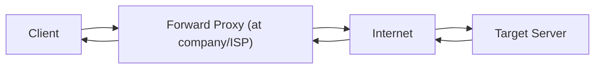
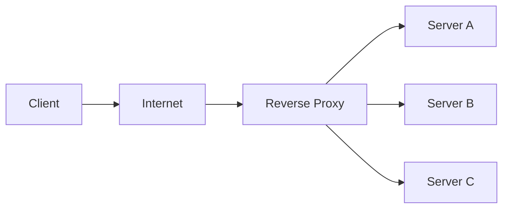

# Proxy Server

### Overview

A **proxy server** is an intermediate component that sits between clients and servers, forwarding requests and responses. It can provide caching, filtering, load balancing, security, and anonymity.

### Forward Proxy vs. Reverse Proxy

| Aspect | Forward Proxy | Reverse Proxy |
|---|---|---|
| **Position** | In front of client | In front of server |
| **Purpose** | Represents the client to external servers | Represents the server to external clients |
| **Client knows** | Uses proxy explicitly | Does not know about proxy |
| **Server knows** | Receives requests from proxy | Receives requests from proxy |
| **Primary use** | Access control, anonymity | Load balancing, caching, security |
| **Example** | Corporate firewall, browser VPN extension | Nginx, AWS ELB, Cloudflare |

### Forward Proxy

#### How It Works



#### Use Cases

| Use Case | Description |
|---|---|
| **Corporate web filtering** | Block access to certain websites (social media, streaming) |
| **Anonymity** | Hide client IP address from target server |
| **Caching** | Cache frequently accessed web content ( ISP proxies) |
| **Bypassing geo-restrictions** | Route traffic through a proxy in a different region |
| **Monitoring & Logging** | Log all outbound web requests |

### Reverse Proxy

#### How It Works



#### Use Cases

| Use Case | Description |
|---|---|
| **Load Balancing** | Distribute traffic across multiple backend servers |
| **SSL Termination** | Decrypt HTTPS requests; reduce backend overhead |
| **Caching Static Content** | Cache images, CSS, JS at the edge |
| **Security** | Hide backend IPs, DDoS protection, WAF |
| **Compression** | gzip/deflate compression before sending to client |
| **A/B Testing** | Route traffic to different backend versions |
| **Canary Deployment** | Gradually shift traffic to new versions |
| **API Gateway** | Authentication, rate limiting, request transformation |

#### Reverse Proxy Examples

| Product | Type | Notable Features |
|---|---|---|
| **Nginx** | Software, L7 | Most popular, PHP/Node.js companion |
| **Apache httpd** | Software, L7 | Apache module system |
| **AWS ELB / ALB** | Cloud-managed | Deep AWS integration, auto-scaling |
| **Cloudflare** | CDN + Proxy | DDoS protection, global network, edge functions |
| **HAProxy** | Software, L4/L7 | High performance, TCP expert |
| **Traefik** | Cloud-native | Kubernetes-native, auto-discovery |

### Key Proxy Server Features

#### SSL/TLS Termination

```nginx
# Nginx: SSL termination
server {
    listen 443 ssl;
    ssl_certificate /etc/ssl/combined.crt;
    ssl_certificate_key /etc/ssl/server.key;
    ssl_protocols TLSv1.2 TLSv1.3;
    ssl_ciphers ECDHE-ECDSA-AES128-GCM-SHA256:ECDHE-RSA-AES128-GCM-SHA256;
    ssl_prefer_server_ciphers on;

    # Forward decrypted traffic to backend
    location / {
        proxy_pass http://backend_servers;
        proxy_set_header X-Real-IP $remote_addr;
        proxy_set_header X-Forwarded-Proto https;
    }
}
```

#### Caching

```nginx
# Cache static assets for 1 week
location ~* \.(jpg|jpeg|png|gif|ico|css|js)$ {
    proxy_cache_valid 200 7d;
    proxy_cache_valid 404 1m;
    proxy_cache_use_stale error timeout updating;
    add_header X-Cache-Status $upstream_cache_status;
}
```

#### Rate Limiting

```nginx
# Rate limiting configuration
limit_req_zone $binary_remote_addr zone=api_limit:10m rate=10r/s;
limit_req_zone $api_key zone=api_key_limit:10m rate=100r/s;

server {
    location /api/ {
        limit_req zone=api_limit burst=20 nodelay;
        limit_req_status 429;
        proxy_pass http://backend;
    }
}
```

#### WAF (Web Application Firewall)

| Rule Type | Purpose |
|---|---|
| **SQL Injection Prevention** | Block patterns like `' OR 1=1--` |
| **XSS Prevention** | Block `<script>` tags in input |
| **Rate Limiting** | Prevent brute force and DDoS |
| **Geo-blocking** | Block traffic from specific countries |
| **Bot Detection** | Block known bot signatures |

### Proxy vs. VPN

| Aspect | Proxy | VPN |
|---|---|---|
| **Scope** | Application-level (single app/browser) | System-level (all traffic) |
| **Encryption** | Usually none (unless HTTPS) | Full tunnel encryption |
| **Performance** | Faster (less overhead) | Slower (encryption overhead) |
| **Setup** | Per-app configuration | System-wide |
| **Use Case** | Web browsing, API routing | Privacy, security, bypassing restrictions |

### Common Interview Points

| Question | Answer |
|---|---|
| **Nginx vs. Apache?** | Nginx: async, event-driven, better for static/high concurrency. Apache: more modules, .htaccess per-directory config |
| **Why use Cloudflare in front of origin?** | DDoS protection, CDN, free SSL, performance optimization |
| **How does a reverse proxy help with microservices?** | Single entry point, can route `/users/*` to user service, `/orders/*` to order service |
| **What is a sidecar proxy?** | Envoy deployed alongside each service in a pod (Kubernetes), handles cross-cutting concerns |

> **Tip:** In system design, when discussing infrastructure, remember that a reverse proxy is often the **first line of defense**. It handles SSL termination, basic security rules, and traffic distribution before requests even reach your application servers.
