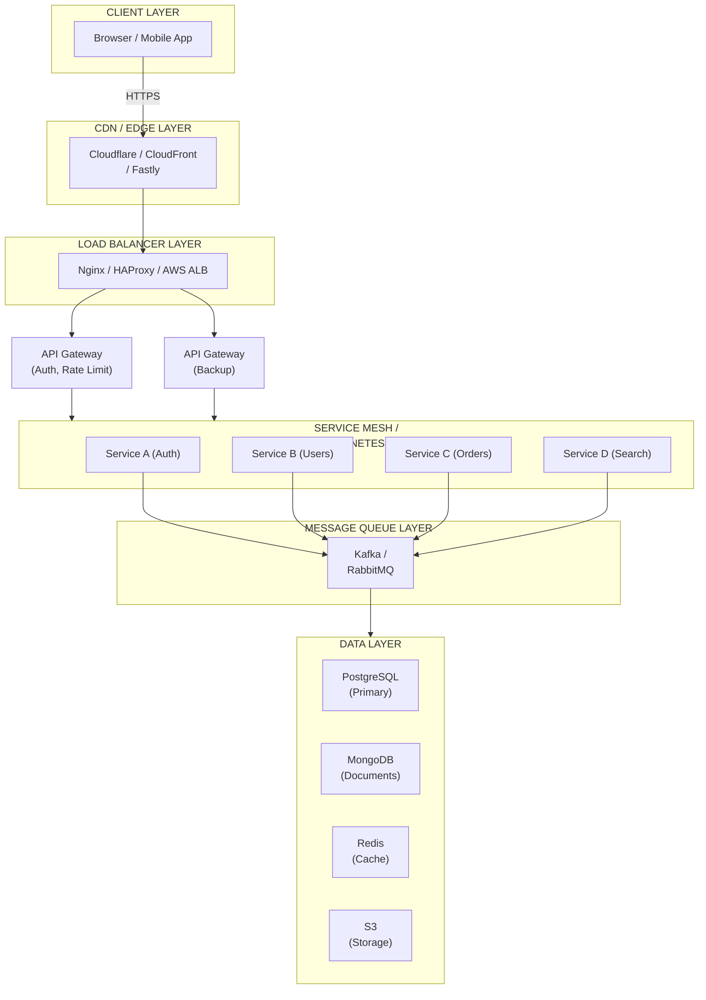

# Production Application Architecture

## 

A typical production web application consists of multiple layers, each with specific responsibilities.

### Architecture Overview



### Frontend Layer

| Concern | Technology |
|---|---|
| **Deployment** | CDN (CloudFront, Cloudflare) |
| **Security** | HTTPS, CSP (Content Security Policy), Subresource Integrity |
| **Performance** | Lazy loading, code splitting, image optimization |
| **State Management** | Redux, Zustand, React Query |

### Backend Layer

| Component | Description |
|---|---|
| **API Gateway** | Single entry point. Handles routing, authentication, rate limiting, request/response transformation |
| **Services** | Microservices or modular monolith (Spring Boot, Node.js, Go, .NET) |
| **GraphQL Federation** | For complex query needs across services |

```bash
# Example: Nginx configuration for API Gateway
upstream backend {
    least_conn;
    server service-a:8080;
    server service-b:8080;
    server service-c:8080;
}

server {
    listen 443 ssl;
    ssl_certificate /certs/server.crt;
    ssl_certificate_key /certs/server.key;

    location /api/ {
        proxy_pass http://backend;
        proxy_set_header Host $host;
        proxy_set_header X-Real-IP $remote_addr;
        proxy_set_header X-Forwarded-For $proxy_add_x_forwarded_for;
    }

    location / {
        # Rate limiting
        limit_req zone=api_limit burst=20 nodelay;
    }
}
```

### Database Layer

| Type | Examples | Use Case |
|---|---|---|
| **Relational (RDBMS)** | PostgreSQL, MySQL | Structured data, transactions, complex queries |
| **Document Store** | MongoDB | Flexible schema, JSON documents |
| **Key-Value** | Redis, DynamoDB | Caching, session storage |
| **Time-Series** | InfluxDB, TimescaleDB | Metrics, IoT sensor data |
| **Graph** | Neo4j | Relationships, social networks |
| **Search** | Elasticsearch | Full-text search, log analysis |

#### Database Best Practices

- **Replication:** Primary-replica setup for read scaling and failover
- **Sharding:** Horizontal partitioning for very large datasets
- **Backup:** Regular automated backups with point-in-time recovery
- **Access Control:** Principle of least privilege for application accounts

### Caching Layer

| Technology | Use Case |
|---|---|
| **Redis** | Session store, distributed cache, pub/sub, rate limiting |
| **Memcached** | Simple key-value caching (e.g., cached API responses) |
| **Varnish** | HTTP caching proxy |

### Message Queue Layer

| Technology | Characteristics |
|---|---|
| **Kafka** | High throughput, persistent, log-based. Event streaming, analytics |
| **RabbitMQ** | Flexible routing, easy setup. Business workflows, task queues |
| **AWS SQS** | Fully managed, simple queue service |
| **ActiveMQ** | Java ecosystem integration |

### File Storage

| Service | Description |
|---|---|
| **AWS S3** | Object storage for images, videos, documents |
| **GCS** | Google Cloud Storage |
| **Azure Blob** | Microsoft Azure blob storage |
| **MinIO** | Self-hosted S3-compatible storage |

### DevOps & CI/CD

| Category | Tools |
|---|---|
| **Containerization** | Docker, containerd |
| **Orchestration** | Kubernetes, Docker Swarm |
| **CI/CD** | GitHub Actions, Jenkins, GitLab CI, ArgoCD |
| **Infrastructure as Code** | Terraform, Pulumi, AWS CDK |
| **Configuration Management** | Helm charts, Kustomize |

### Monitoring & Logging

| Category | Tools |
|---|---|
| **Metrics** | Prometheus, Datadog |
| **Dashboards** | Grafana |
| **Logging** | ELK Stack (Elasticsearch, Logstash, Kibana), Loki |
| **Distributed Tracing** | Jaeger, Zipkin, OpenTelemetry |
| **Uptime Monitoring** | PagerDuty, UptimeRobot |

### Security Layer

| Concern | Solution |
|---|---|
| **Transport** | HTTPS (TLS 1.3), HSTS |
| **Authentication** | JWT, OAuth 2.0, OpenID Connect |
| **Authorization** | RBAC, ABAC |
| **Secrets Management** | HashiCorp Vault, AWS Secrets Manager |
| **API Security** | API keys, rate limiting, input validation |
| **DDoS Protection** | Cloudflare, AWS Shield, Akamai |

### High Availability & Scalability

| Strategy | Description |
|---|---|
| **Load Balancing** | Distribute traffic (Nginx, HAProxy, AWS ELB) |
| **Auto-scaling** | Horizontal Pod Autoscaler (HPA), AWS ASG |
| **Multi-region** | Deploy across geographic regions for DR and latency |
| **Circuit Breaker** | Prevent cascade failures (Resilience4j, Hystrix) |
| **Graceful Degradation** | Keep core features running under load |

> **Tip:** When designing a production system, always start with the simplest architecture that meets current requirements. Add complexity (caching, message queues, multiple services) only when you have clear evidence (metrics, user growth) that it is needed.
