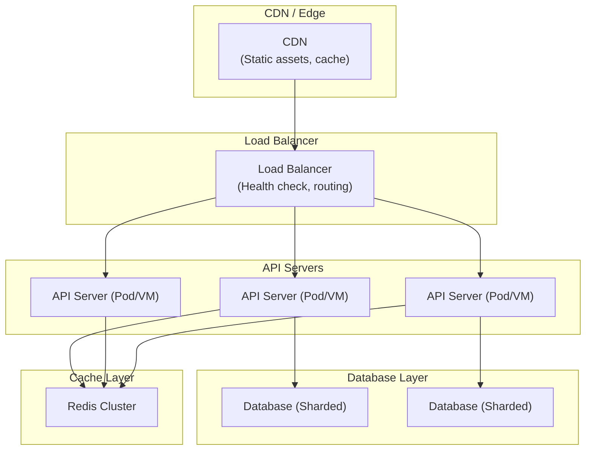
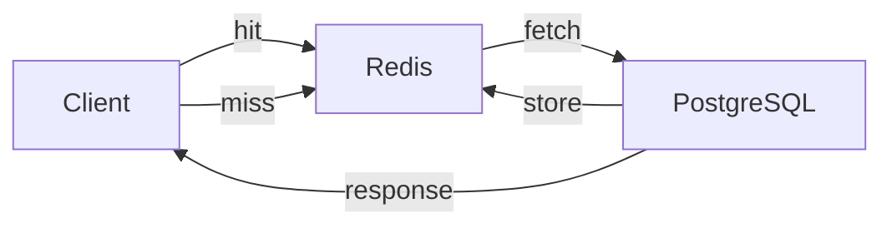
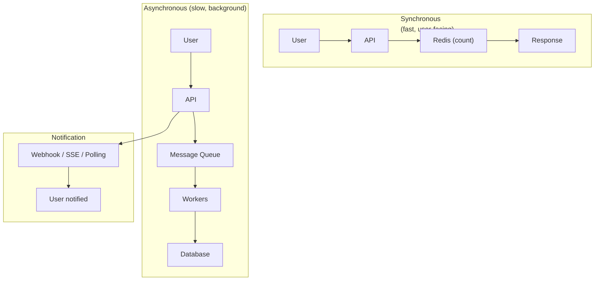

# Design for Millions of Users

## Key Optimization Points

### 1. Scalability Strategy



### 2. Horizontal vs Vertical Scaling

| Strategy | Pros | Cons |
|----------|------|------|
| **Vertical** (bigger machine) | Simple, no code changes | Hardware limits, single point of failure |
| **Horizontal** (more machines) | Unlimited scale, fault tolerance | Complexity, data consistency |

**Recommendation:** Always prefer horizontal scaling for millions of users.

### 3. Database Optimization

```
Sharding Strategy by User ID:
┌─────────────┬─────────────┬─────────────┐
│ Shard 0     │ Shard 1     │ Shard 2     │
│ user_id % 3 │ user_id % 3 │ user_id % 3 │
│ = 0         │ = 1         │ = 2         │
│             │             │             │
│ PostgreSQL  │ PostgreSQL  │ PostgreSQL  │
│ (8 vCPU)   │ (8 vCPU)    │ (8 vCPU)    │
└─────────────┴─────────────┴─────────────┘
```

**Key points:**
- **Read replicas** for read-heavy workloads
- **Write sharding** when single DB can't handle writes
- **Connection pooling** (HikariCP) essential
- **Proper indexing** on hot query patterns

### 4. Caching Strategy

| Cache Layer | What to Cache | TTL |
|------------|--------------|-----|
| **CDN** | Static assets (images, CSS, JS) | 1 day - 1 year |
| **Redis** | API responses, sessions, hot data | 1 min - 1 hour |
| **Local cache** | Config, enum values | Application lifetime |



### 5. API Design for Scale

```java
// Good: Pagination, field selection
GET /api/v1/products?page=1&size=20&sort=createdAt,desc&fields=id,name,price

// Good: ETag for conditional requests
GET /api/v1/users/123
Response: ETag: "v1-abc123"
→ Subsequent: If-None-Match: "v1-abc123" → 304 Not Modified

// Good: Async for long operations
POST /api/v1/reports  → 202 Accepted { "jobId": "123" }
GET  /api/v1/jobs/123 → 200 OK { "status": "completed", "url": "..." }
```

### 6. Message Queue for Async Processing



**Use cases for message queue:**
- Sending emails/SMS notifications
- Processing file uploads (resize, transcode)
- Generating reports
- Social media activity feeds
- Any operation > 100ms

### 7. Key Numbers to Remember

| Metric | Value |
|--------|-------|
| CDN latency | < 10 ms |
| In-memory cache (Redis) | 0.1 - 1 ms |
| Database query (optimized) | 1 - 50 ms |
| Point of presence (PoP) | < 50 ms from any user |
| Max concurrent connections per server | ~10,000 (connection pooling critical) |

### 8. Monitoring & Observability

```
Golden Signals (Google SRE):
┌─────────────────────────────────────────────────────┐
│ 1. Latency     - p50, p95, p99 response times       │
│ 2. Traffic     - Requests per second, throughput     │
│ 3. Errors      - Error rate (4xx, 5xx)              │
│ 4. Saturation  - CPU %, Memory %, Queue depth        │
└─────────────────────────────────────────────────────┘
```

**Essential tools:** Prometheus + Grafana, ELK Stack, distributed tracing (Jaeger/Zipkin)

### 9. Capacity Planning

```
Estimating for 1 million users:

DAU (Daily Active Users) = 1,000,000 × 10% = 100,000
Peak concurrent = DAU × 20% = 20,000
Avg requests/user/day = 50
Total requests/day = 5,000,000
Requests/second = 5,000,000 / 86400 ≈ 58 RPS
Peak RPS = 58 × 10 = 580 RPS

→ Start with 4 API servers, 2 DB instances, 1 Redis cluster
→ Scale based on actual metrics
```

### 10. Summary: Scale Checklist

- [ ] Stateless application servers (horizontally scalable)
- [ ] Database: connection pooling + read replicas + sharding strategy
- [ ] Multi-layer caching (CDN → Redis → local)
- [ ] Async processing for non-critical operations
- [ ] Load balancer with health checks
- [ ] Rate limiting + API throttling
- [ ] Proper indexing on all hot queries
- [ ] Monitoring: latency, errors, saturation
- [ ] Graceful degradation under load
- [ ] CDN for all static assets
