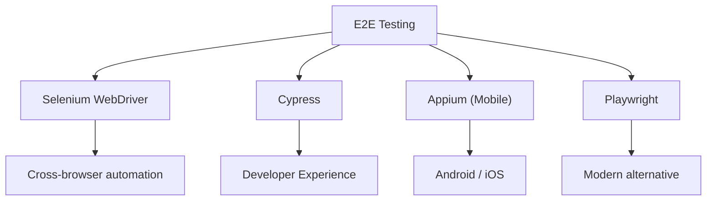
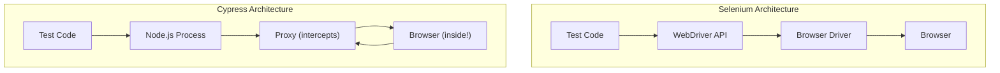

# Other Skills

## Selenium & Cypress (E2E Testing)

### 1. Overview

**E2E testing** (End-to-End testing) validates the complete flow of an application from the user's perspective. Unlike unit tests that test isolated components, E2E tests simulate real user interactions through the full stack — browser, frontend, backend, and database.



### 2. Selenium WebDriver

**Selenium WebDriver** is the industry-standard browser automation framework. It drives a browser by sending commands via browser-specific drivers (ChromeDriver, GeckoDriver, etc.).

#### 2.1. Architecture

```
Test Script (Selenium API)
        ↓
  WebDriver API
        ↓
  Browser Driver (chromedriver, geckodriver, etc.)
        ↓
  Browser (Chrome, Firefox, Safari, Edge)
```

#### 2.2. Element Locators

| Locator | Syntax | Example |
|---------|--------|---------|
| **ID** | `By.id()` | `driver.findElement(By.id("submit"))` |
| **Name** | `By.name()` | `driver.findElement(By.name("email"))` |
| **CSS Selector** | `By.cssSelector()` | `driver.findElement(By.cssSelector(".btn.primary"))` |
| **XPath** | `By.xpath()` | `driver.findElement(By.xpath("//button[@type='submit']"))` |
| **Link Text** | `By.linkText()` | `driver.findElement(By.linkText("Sign In"))` |
| **Partial Link** | `By.partialLinkText()` | `driver.findElement(By.partialLinkText("Sign"))` |

#### 2.3. XPath Expressions

```java
// Basic XPath
// Find element by text
By.xpath("//button[text()='Submit']")

// Find element by attribute
By.xpath("//input[@type='email']")

// Find element by multiple attributes
By.xpath("//input[@type='text' and @name='username']")

// Relative path with contains()
By.xpath("//div[contains(@class, 'error-message')]")

// Navigate DOM: parent, child, sibling
By.xpath("//form[@id='login']/div[2]/input")        // child
By.xpath("//input[@name='email']/parent::div")      // parent
By.xpath("//label[text()='Email']/following-sibling::input")  // sibling

// Index-based selection
By.xpath("(//table[@class='data']//tr)[2]/td[3]")   // 2nd row, 3rd cell
```

#### 2.4. Selenium Java Example

```java
import org.openqa.selenium.By;
import org.openqa.selenium.WebDriver;
import org.openqa.selenium.WebElement;
import org.openqa.selenium.chrome.ChromeDriver;
import org.openqa.selenium.support.ui.ExpectedConditions;
import org.openqa.selenium.support.ui.WebDriverWait;

public class LoginTest {
    public static void main(String[] args) {
        // Initialize WebDriver
        System.setProperty("webdriver.chrome.driver", "/path/to/chromedriver");
        WebDriver driver = new ChromeDriver();

        try {
            // Navigate to login page
            driver.get("https://app.example.com/login");
            driver.manage().window().maximize();

            // Enter email
            WebElement emailField = driver.findElement(By.id("email"));
            emailField.clear();
            emailField.sendKeys("user@example.com");

            // Enter password
            WebElement passwordField = driver.findElement(By.name("password"));
            passwordField.sendKeys("password123");

            // Click submit
            WebElement submitBtn = driver.findElement(By.cssSelector("button[type='submit']"));
            submitBtn.click();

            // Wait for navigation
            WebDriverWait wait = new WebDriverWait(driver, 10);
            wait.until(ExpectedConditions.urlContains("/dashboard"));

            // Verify
            String currentUrl = driver.getCurrentUrl();
            if (currentUrl.contains("/dashboard")) {
                System.out.println("Test PASSED: Login successful");
            } else {
                System.out.println("Test FAILED: Did not navigate to dashboard");
            }

        } finally {
            driver.quit();  // Always close browser
        }
    }
}
```

#### 2.5. Selenium with TestNG

```java
import org.openqa.selenium.By;
import org.openqa.selenium.WebDriver;
import org.openqa.selenium.chrome.ChromeDriver;
import org.testng.Assert;
import org.testng.annotations.*;

public class SeleniumTestNGTest {
    WebDriver driver;

    @BeforeClass
    public void setup() {
        System.setProperty("webdriver.chrome.driver", "/path/to/chromedriver");
        driver = new ChromeDriver();
    }

    @Test(priority = 1, description = "Login with valid credentials")
    public void testLoginSuccess() {
        driver.get("https://app.example.com/login");
        driver.findElement(By.id("email")).sendKeys("user@example.com");
        driver.findElement(By.name("password")).sendKeys("password123");
        driver.findElement(By.cssSelector("button[type='submit']")).click();

        Assert.assertTrue(driver.getCurrentUrl().contains("/dashboard"));
    }

    @Test(priority = 2, description = "Login with invalid credentials")
    public void testLoginFailure() {
        driver.get("https://app.example.com/login");
        driver.findElement(By.id("email")).sendKeys("invalid@example.com");
        driver.findElement(By.name("password")).sendKeys("wrongpass");
        driver.findElement(By.cssSelector("button[type='submit']")).click();

        WebElement errorMsg = driver.findElement(By.cssSelector(".error-message"));
        Assert.assertTrue(errorMsg.isDisplayed());
    }

    @AfterClass
    public void teardown() {
        if (driver != null) {
            driver.quit();
        }
    }
}
```

---

### 3. Selenium Grid

**Selenium Grid** enables parallel test execution across multiple machines and browsers.

#### 3.1. Hub and Node Architecture

```
                    ┌─────────────┐
                    │    Hub      │  (Port 4444)
                    │ (Controller)│
                    └──────┬──────┘
                           │
          ┌────────────────┼────────────────┐
          │                │                │
    ┌─────▼─────┐    ┌─────▼─────┐    ┌─────▼─────┐
    │   Node 1  │    │   Node 2  │    │   Node 3  │
    │  Chrome   │    │  Firefox  │    │   Edge    │
    │  Windows  │    │   Linux   │    │  Windows  │
    └───────────┘    └───────────┘    └───────────┘
```

#### 3.2. Starting Selenium Grid

```bash
# Start Hub
java -jar selenium-server-standalone.jar -role hub

# Start Node (on same machine)
java -jar selenium-server-standalone.jar -role node
#        -hub http://hub-host:4444/grid/register
#        -browser "browserName=chrome,maxInstances=5"

# Docker (Docker Compose)
# docker-compose.yml:
version: '3'
services:
  selenium-hub:
    image: selenium/hub:4.0
    ports:
      - "4444:4444"
  chrome:
    image: selenium/node-chrome:4.0
    depends_on:
      - selenium-hub
    environment:
      - HUB_HOST=selenium-hub
      - HUB_PORT=4444
```

#### 3.3. Remote WebDriver

```java
// Connect to Selenium Grid
WebDriver driver = new RemoteWebDriver(
    new URL("http://hub-host:4444/wd/hub"),
    DesiredCapabilities.chrome()
);

// With specific capabilities
DesiredCapabilities caps = new DesiredCapabilities();
caps.setBrowserName("chrome");
caps.setPlatform(Platform.WIN10);
caps.setVersion("latest");

WebDriver driver = new RemoteWebDriver(
    new URL("http://hub-host:4444/wd/hub"),
    caps
);
```

---

### 4. Cypress

**Cypress** is a modern, developer-centric E2E testing framework built on a unique architecture. Unlike Selenium (which runs outside the browser), Cypress runs **inside the browser**, giving it direct access to everything.

#### 4.1. Cypress Architecture (vs Selenium)



| Aspect | Selenium | Cypress |
|--------|----------|---------|
| **Runs** | Outside the browser | Inside the browser |
| **Languages** | Any (Java, Python, JS, C#) | JavaScript/TypeScript only |
| **Browser Support** | All browsers | Chromium-based + Firefox + Electron |
| **Speed** | Slower (network protocol) | Faster (in-browser) |
| **Debugging** | Harder (DevTools limited) | Excellent (built-in time travel) |
| **Parallel Execution** | Requires Grid | Via Dashboard or third-party |
| **Community** | Large, mature | Growing rapidly |

#### 4.2. Cypress Commands

```javascript
// cypress/e2e/login.cy.js

describe('Login Flow', () => {
  beforeEach(() => {
    // Visit before each test
    cy.visit('/login');
  });

  it('should login successfully with valid credentials', () => {
    // Type into input fields
    cy.get('[data-testid="email"]').type('user@example.com');
    cy.get('[data-testid="password"]').type('password123');

    // Click button
    cy.get('[data-testid="login-button"]').click();

    // Assertions
    cy.url().should('include', '/dashboard');
    cy.contains('Welcome back').should('be.visible');
  });

  it('should show error with invalid credentials', () => {
    cy.get('[data-testid="email"]').type('wrong@example.com');
    cy.get('[data-testid="password"]').type('wrongpass');
    cy.get('[data-testid="login-button"]').click();

    cy.get('[data-testid="error-message"]')
      .should('be.visible')
      .and('contain', 'Invalid credentials');
  });

  it('should redirect unauthenticated users to login', () => {
    cy.visit('/dashboard');
    cy.url().should('include', '/login');
  });
});
```

#### 4.3. Cypress Intercepts and Mocks

```javascript
// Mock API response
cy.intercept('GET', '/api/users', {
  statusCode: 200,
  body: [
    { id: 1, name: 'Alice', email: 'alice@example.com' },
    { id: 2, name: 'Bob', email: 'bob@example.com' },
  ],
}).as('getUsers');

// Mock slow API
cy.intercept('GET', '/api/products/*', {
  delayMs: 3000,  // 3 second delay
  body: [...],
}).as('slowProducts');

// Wait for intercepted request
cy.wait('@getUsers').then((interception) => {
  expect(interception.response.statusCode).to.equal(200);
  expect(interception.response.body).to.have.length(2);
});

// Intercept and modify response
cy.intercept('POST', '/api/orders', (req) => {
  // Modify request before it goes out
  req.body.customerId = 'modified-123';
  req.continue((res) => {
    // Modify response before it reaches browser
    res.body.orderId = 'ORD-MOCK-999';
  });
});
```

#### 4.4. Cypress Best Practices

```javascript
// DO: Use data-testid instead of CSS selectors
cy.get('[data-testid="submit-button"]')

// DON'T: Use brittle CSS selectors
cy.get('.btn-primary.form-submit:nth-child(3)')

// DO: Use cy.wait() with alias for waiting
cy.intercept('/api/users').as('getUsers');
cy.wait('@getUsers');

// DON'T: Use arbitrary sleep
cy.wait(5000); // BAD!

// DO: Scope commands within specific containers
cy.get('[data-testid="user-list"]')
  .find('[data-testid="user-item"]')
  .first()
  .click();

// DO: Use should() for retry-ability
cy.get('[data-testid="status"]')
  .should('not.have.class', 'loading')
  .and('contain', 'Ready');
```

---

### 5. Appium (Mobile Testing)

**Appium** is an open-source tool for automating native, mobile web, and hybrid applications on Android and iOS.

#### 5.1. Appium Architecture

```
Test Script (WebDriver Protocol)
         ↓
   Appium Server
         ↓
   Android: UiAutomator2 / Espresso
   iOS: XCUITest / UIAutomation
         ↓
   Android Device / iOS Simulator
```

#### 5.2. Appium Java Example

```java
import io.appium.java_client.AppiumDriver;
import io.appium.java_client.android.AndroidDriver;
import org.openqa.selenium.By;
import org.openqa.selenium.remote.DesiredCapabilities;
import java.net.URL;

public class MobileTest {
    public static void main(String[] args) throws Exception {
        DesiredCapabilities caps = new DesiredCapabilities();
        caps.setCapability("platformName", "Android");
        caps.setCapability("deviceName", "Pixel_6");
        caps.setCapability("app", "/path/to/app.apk");
        caps.setCapability("automationName", "UiAutomator2");

        AppiumDriver driver = new AndroidDriver(
            new URL("http://localhost:4723/wd/hub"),
            caps
        );

        try {
            // Find element by accessibility ID
            By emailField = By.xpath("//android.widget.EditText[@content-desc='Email']");
            driver.findElement(emailField).sendKeys("user@example.com");

            // Find by text
            By loginBtn = By.androidUIAutomator("text(\"Sign In\")");
            driver.findElement(loginBtn).click();

            // Wait for element
            Thread.sleep(2000);

            // Verify
            By dashboardTitle = By.xpath("//android.widget.TextView[@text='Dashboard']");
            assert driver.findElement(dashboardTitle).isDisplayed();

        } finally {
            driver.quit();
        }
    }
}
```

#### 5.3. Appium iOS (XCUITest)

```java
DesiredCapabilities caps = new DesiredCapabilities();
caps.setCapability("platformName", "iOS");
caps.setCapability("deviceName", "iPhone 14");
caps.setCapability("app", "/path/to/app.ipa");
caps.setCapability("automationName", "XCUITest");
caps.setCapability("bundleId", "com.example.app");

// iOS-specific locators
By emailField = MobileBy.iOSNsPredicateString("type == 'XCUIElementTypeTextField'");
driver.findElement(emailField).sendKeys("user@example.com");

By signInBtn = MobileBy.iOSNsPredicateString("name == 'Sign In' AND enabled == true");
driver.findElement(signInBtn).click();
```

---

### 6. Best Practices

#### 6.1. Page Object Model (POM)

The **Page Object Model** is a design pattern that creates an object repository for web elements, reducing code duplication and improving maintainability.

```java
// Page Objects/LoginPage.java
public class LoginPage {
    private WebDriver driver;

    // Locators
    private By emailInput = By.id("email");
    private By passwordInput = By.name("password");
    private By submitButton = By.cssSelector("button[type='submit']");
    private By errorMessage = By.cssSelector(".error-message");

    // Constructor
    public LoginPage(WebDriver driver) {
        this.driver = driver;
    }

    // Page Methods
    public void enterEmail(String email) {
        driver.findElement(emailInput).clear();
        driver.findElement(emailInput).sendKeys(email);
    }

    public void enterPassword(String password) {
        driver.findElement(passwordInput).clear();
        driver.findElement(passwordInput).sendKeys(password);
    }

    public DashboardPage clickSubmit() {
        driver.findElement(submitButton).click();
        return new DashboardPage(driver);  // Return next page object
    }

    public void login(String email, String password) {
        enterEmail(email);
        enterPassword(password);
        clickSubmit();
    }

    public String getErrorMessage() {
        return driver.findElement(errorMessage).getText();
    }
}

// Tests/TestLogin.java
public class TestLogin {
    private WebDriver driver;
    private LoginPage loginPage;

    @Before
    public void setup() {
        driver = new ChromeDriver();
        loginPage = new LoginPage(driver);
        loginPage.navigateToLogin();
    }

    @Test
    public void testValidLogin() {
        loginPage.login("user@example.com", "password123");
        // POM handles element interaction internally
        // Tests remain stable when UI changes
    }

    @After
    public void teardown() {
        driver.quit();
    }
}
```

#### 6.2. Waiting Strategies

```java
// BAD: Hard-coded sleep (flaky, slow)
Thread.sleep(5000);

// BETTER: Explicit Wait (selenium)
WebDriverWait wait = new WebDriverWait(driver, Duration.ofSeconds(10));
wait.until(ExpectedConditions.elementToBeClickable(By.id("submit")));

// BEST: ExpectedConditions
wait.until(ExpectedConditions.and(
    ExpectedConditions.elementToBeClickable(submitBtn),
    ExpectedConditions.textToBePresentInElement(errorMsg, "")
));

// Cypress: Automatic retry
cy.get('[data-testid="loading"]').should('not.exist');  // Retries until true
cy.get('[data-testid="data"]').should('be.visible');     // Retries until visible
```

#### 6.3. Parallel Execution

```xml
<!-- testng.xml - parallel testing -->
<suite name="Parallel Test Suite" parallel="tests" thread-count="4">
    <test name="Chrome Tests">
        <classes>
            <class name="tests.ChromeLoginTest"/>
        </classes>
    </test>
    <test name="Firefox Tests">
        <classes>
            <class name="tests.FirefoxLoginTest"/>
        </classes>
    </test>
</suite>
```

---

### 7. Interview Questions

**Q: Cypress vs Selenium — which one would you choose and when?**

> Choose **Cypress** when: you need fast feedback and excellent debugging (developer-centric workflow), you're working on a JavaScript frontend (React/Vue/Angular), you value time-travel debugging and automatic screenshots on failure, and your project can accept its limitations (JS/TS only, limited browser support). Choose **Selenium** when: you need multi-language support (Java, Python, C#), cross-browser testing is critical (Safari, older browsers), you need to test desktop applications (via Selenium IDE or Appium), or you have an existing large investment in Selenium infrastructure.

**Q: What is the Page Object Model and why is it important?**

> **POM** is a design pattern where web page elements are encapsulated in a **Page Class**. Tests use these Page Objects to interact with the UI instead of directly accessing elements. This is important because: when the UI changes (e.g., element IDs change), you only update the Page Object, not every test. It reduces code duplication, improves maintainability, and makes tests more readable. A well-designed POM has **no assertions** in page objects — only interaction methods and locators.

**Q: How do you handle flaky tests in E2E automation?**

> Flaky tests are caused by timing issues, network instability, or test interdependencies. Strategies to reduce flakiness: use **explicit waits** instead of hard sleeps, implement **retry mechanisms** (Cypress has built-in retries, Selenium can use TestNG retry analyzer), **isolate tests** so they don't share state, **mock external dependencies** where possible, and **run tests in a stable environment**. Also prioritize which tests are critical enough to warrant the additional complexity of retry logic.
