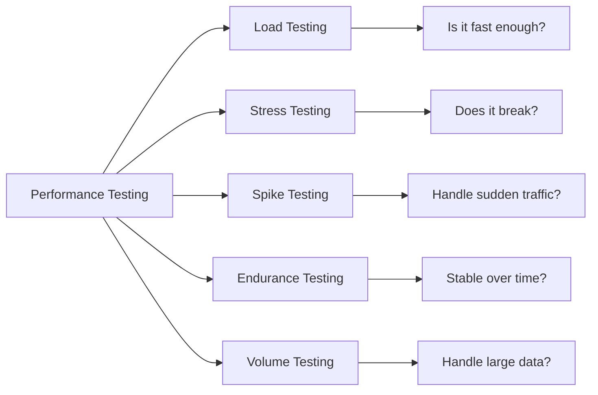
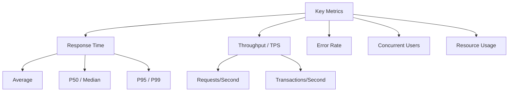

# Other Skills

## Performance & Load Testing

### 1. Overview

**Performance testing** evaluates how a system behaves under expected load conditions. Unlike functional testing (does it work correctly?), performance testing (how fast and stable is it under load?).



### 2. Types of Performance Testing

| Type | Goal | Duration | Load Pattern |
|------|------|----------|--------------|
| **Load Testing** | Verify system under expected load | Normal | Gradual increase to target |
| **Stress Testing** | Find breaking point beyond limits | Short | Exceed normal capacity |
| **Spike Testing** | Handle sudden traffic bursts | Brief | Sharp sudden spikes |
| **Endurance Testing** | Stability under prolonged load | Long (hours/days) | Sustained normal load |
| **Volume Testing** | Handle large data quantities | Varies | Large data volumes |

### 3. Key Metrics



| Metric | Description | Good Benchmark |
|--------|-------------|----------------|
| **Response Time (Avg)** | Average time to respond | < 200ms for APIs |
| **Response Time (P95/P99)** | 95th/99th percentile latency | P99 < 1s for critical paths |
| **TPS / Throughput** | Transactions or requests per second | Depends on SLA |
| **Error Rate** | Percentage of failed requests | < 1% (or 0% for critical) |
| **Concurrent Users** | Simultaneous active users | Target: 1000+ depending on system |
| **CPU Usage** | Processor utilization | < 70-80% sustained |
| **Memory Usage** | RAM consumption | Stable, no leaks |

> **P95 vs P99:** P95 means 95% of requests are faster than this time. P99 means 99%. P99 is more important for SLA commitments because outliers affect the top percentile.

### 4. Performance Testing Process

```
Requirements → Planning → Scripting → Execution → Analysis → Report
     ↓            ↓           ↓           ↓           ↓         ↓
  Define     Select tool   Record      Run test    Identify   Present
  SLAs,      & topology    scripts     scenarios   bottlenecks findings
  thresholds
```

#### Step 1: Requirements Analysis
- Define **SLA targets** (e.g., P99 < 500ms, 10,000 concurrent users)
- Identify critical **user journeys** (login, search, checkout)
- Determine **load patterns** (steady, peak, gradual)

#### Step 2: Test Planning
- Select appropriate **tool** (JMeter, k6, Gatling)
- Design **scenarios** (normal load, peak load, stress)
- Plan **environment** and **data requirements**

#### Step 3: Scripting
- Record or write scripts simulating user behavior
- Parameterize data (usernames, search terms)
- Add correlations, think times, assertions

#### Step 4: Execution
- Execute in **non-production** environment
- Monitor **resource utilization** during test
- Collect **metrics** from APM tools

#### Step 5: Analysis
- Identify **bottlenecks** (CPU, memory, DB, network)
- Analyze **response time distribution**
- Compare against **SLA thresholds**

---

### 5. JMeter

**Apache JMeter** is the most widely used open-source load testing tool. It simulates heavy loads on servers, networks, or objects to test strength or analyze overall performance.

#### 5.1. Core Components

| Component | Purpose |
|-----------|---------|
| **Thread Group** | Defines number of users, ramp-up time, loop count |
| **Samplers** | Send requests (HTTP, JDBC, FTP, etc.) |
| **Listeners** | View/save test results (View Results Tree, Summary Report) |
| **Controllers** | Logic for request execution (Loop, If, Random, Transaction) |
| **Timers** | Add delays between requests (Constant, Gaussian, Uniform) |
| **Config Elements** | Defaults, variables (CSV Data Set Config) |
| **Assertions** | Validate responses (Response Assertion, JSON Assertion) |

#### 5.2. Basic Thread Group Configuration

```
Thread Group:
  Number of Threads: 1000      (concurrent users)
  Ramp-up Period: 300          (ramp up over 300 seconds)
  Loop Count: 10               (each user repeats 10 times)
```

This means: 1000 users × 10 loops = 10,000 total requests, ramping up over 5 minutes.

#### 5.3. JMeter Script Example (HTTP Request)

```
Thread Group
  └─ Once Only Controller
  │    └─ Login Request (POST /api/login)
  │         Body: {"email": "user@test.com", "password": "pass123"}
  │
  └─ Loop Controller (10 times)
       └─ Search Request (GET /api/search?q=${searchTerm})
            Response Assertion: Contains "results"
            Duration Assertion: < 2000ms
```

#### 5.4. CSV Data Set Config

```bash
# users.csv
username,password,searchTerm
user1@test.com,pass123,laptop
user2@test.com,pass456,phone
user3@test.com,pass789,tablet
```

In JMeter: Add **CSV Data Set Config** pointing to `users.csv`. Reference variables as `${username}`, `${password}`, `${searchTerm}`.

#### 5.5. JMeter via CLI

```bash
# Run headless (non-GUI) test
jmeter -n -t test-plan.jmx -l results.jtl -e -o report/

# Options:
# -n: non-GUI mode
# -t: test plan file
# -l: results file (binary)
# -e: generate HTML report after test
# -o: output folder for HTML report
```

---

### 6. k6

**k6** is a modern, developer-friendly load testing tool written in Go. Scripts are written in JavaScript, making it easy for developers to write and maintain tests.

#### 6.1. Basic Script

```javascript
// load-test.js
import http from 'k6/http';
import { check, sleep } from 'k6';
import { Rate, Counter } from 'k6/metrics';

// Custom metrics
const errorRate = new Rate('errors');
const requests = new Counter('http_requests');

export const options = {
  // Key configurations for the test
  stages: [
    { duration: '2m', target: 100 },   // Ramp up to 100 users
    { duration: '5m', target: 100 },   // Stay at 100 users
    { duration: '2m', target: 200 },   // Ramp up to 200 users
    { duration: '5m', target: 200 },   // Stay at 200 users
    { duration: '2m', target: 0 },     // Ramp down
  ],

  thresholds: {
    // Assertions on metrics
    'http_req_duration': ['p(95)<500', 'p(99)<1000'],
    'http_req_failed': ['rate<0.01'],
    'errors': ['rate<0.1'],
  },
};

const BASE_URL = 'https://api.example.com';

export default function () {
  requests.add(1);

  // Login
  const loginRes = http.post(`${BASE_URL}/auth/login`, {
    email: 'test@example.com',
    password: 'password123',
  });

  check(loginRes, {
    'login status 200': (r) => r.status === 200,
    'login has token': (r) => r.json('accessToken') !== '',
  });
  errorRate.add(loginRes.status !== 200);

  // Search products
  const searchRes = http.get(`${BASE_URL}/products?search=laptop`, {
    headers: { Authorization: `Bearer ${loginRes.json('accessToken')}` },
  });

  check(searchRes, {
    'search status 200': (r) => r.status === 200,
    'search returns results': (r) => r.json('results').length > 0,
  });
  errorRate.add(searchRes.status !== 200);

  sleep(1); // Think time
}
```

#### 6.2. Running k6

```bash
# Run locally
k6 run load-test.js

# Run with environment variables
k6 run -e BASE_URL=https://staging.example.com load-test.js

# Run cloud test (k6.io cloud)
k6 cloud load-test.js

# Run with custom metrics output
k6 run --out influxdb=http://localhost:8086/k6 load-test.js
```

#### 6.3. k6 Checks vs Thresholds

```javascript
// Checks: Per-VU pass/fail conditions (don't fail the test)
// Use for: Business logic validation
check(response, {
  'has user data': (r) => r.json('user') !== null,
  'email is valid': (r) => r.json('user.email').includes('@'),
});

// Thresholds: Global pass/fail criteria for the test run
// Use for: SLA enforcement
thresholds: {
  'http_req_duration': ['p(95)<300'],  // Test FAILS if p95 > 300ms
  'http_req_failed': ['rate<0.05'],    // Test FAILS if error rate > 5%
}
```

---

### 7. Gatling

**Gatling** is a load testing framework based on **Scala**. It is highly performant, with a DSL (Domain Specific Language) that makes scripts readable and maintainable.

#### 7.1. Gatling Script Example

```scala
// Simulations/LoginSimulation.scala
package simulations

import io.gatling.core.Predef._
import io.gatling.http.Predef._
import scala.concurrent.duration._

class LoginSimulation extends Simulation {

  // HTTP Configuration
  val httpProtocol = http
    .baseUrl("https://api.example.com")
    .acceptHeader("application/json")
    .contentTypeHeader("application/json")

  // Scenario: User Login Flow
  val userScenario = scenario("User Login Flow")
    .exec(
      http("Login Request")
        .post("/auth/login")
        .body(StringBody("""{
          "email": "user@example.com",
          "password": "password123"
        }""")).asJson
        .check(status.is(200))
        .check(jsonPath("$.accessToken").saveAs("accessToken"))
    )
    .pause(1) // Think time
    .exec(
      http("Get User Profile")
        .get("/users/me")
        .header("Authorization", "Bearer ${accessToken}")
        .check(status.is(200))
    )

  // Load Configuration
  setUp(
    userScenario
      .inject(
        rampUsers(1000).during(5.minutes),  // 1000 users over 5 minutes
        constantUsersPerSec(100).during(10.minutes)  // 100 req/s for 10 minutes
      )
      .protocols(httpProtocol)
      .assertions(
        global.responseTime.percentile(95).lt(500),
        global.successfulRequests.percent(gt(99))
      )
  )
}
```

#### 7.2. Gatling vs JMeter vs k6

| Feature | JMeter | k6 | Gatling |
|---------|--------|-----|--------|
| **Language** | GUI / XML | JavaScript | Scala |
| **Learning Curve** | Medium | Low | High |
| **Scalability** | Medium | High | High |
| **Reporting** | Basic | Good (HTML) | Excellent |
| **CI/CD Integration** | Good | Excellent | Excellent |
| **Best For** | Teams preferring GUI | Devs comfortable with code | Complex scenarios |

---

### 8. Artillery (Node.js)

**Artillery** is a Node.js-based load testing tool that uses **YAML** for test configuration. It is simple, lightweight, and great for teams already using Node.js.

```yaml
# config.yml
config:
  target: "https://api.example.com"
  phases:
    - duration: 60
      arrivalRate: 10
      name: "Warm up"
    - duration: 120
      arrivalRate: 50
      name: "Sustained load"
    - duration: 60
      arrivalRate: 100
      name: "Stress test"

scenarios:
  - name: "User Login and Search"
    flow:
      - post:
          url: "/auth/login"
          json:
            email: "user@example.com"
            password: "password123"
          capture:
            - json: "$.accessToken"
              as: "token"

      - think: 1

      - get:
          url: "/products?search=laptop"
          headers:
            Authorization: "Bearer {{ token }}"
          expect:
            - statusCode: 200
            - contentType: /application\/json/
```

```bash
# Run Artillery test
artillery run config.yml

# Generate HTML report
artillery report

# Quick smoke test
artillery quick --duration 10 --num 50 https://api.example.com/health
```

---

### 9. APM Tools (Application Performance Monitoring)

APM tools monitor application performance in production and provide insights during load testing.

#### 9.1. New Relic

```javascript
// New Relic agent integration
// Node.js example
require('newrelic');

const app = express();
app.get('/api/products', (req, res) => {
  // Automatic transaction tracing
  // Database query monitoring
  // Error tracking
  res.json(products);
});
```

#### 9.2. Datadog

```yaml
# datadog-agent.yaml
# Docker compose integration
services:
  app:
    environment:
      - DD_AGENT_HOST: datadog-agent
      - DD_API_KEY: ${DD_API_KEY}
    labels:
      - "com.datadoghq.ad.instances": '[{"host": "localhost", "port": 8080}]'
```

#### 9.3. APM Metrics Comparison

| Tool | APM Features | Distributed Tracing | Infrastructure | Cost |
|------|-------------|---------------------|-----------------|------|
| **New Relic** | Full APM | Yes | Basic | Per GB ingested |
| **Datadog** | Full APM | Yes | Deep | Per host + ingested |
| **Dynatrace** | Full APM | Yes | Deep | Per host |
| **Prometheus + Grafana** | Metrics focused | Manual | Deep | Open source |

---

### 10. Interview Questions

**Q: What is the difference between Load Testing and Stress Testing?**

> **Load Testing** verifies system performance under expected/normal load conditions. **Stress Testing** pushes the system beyond its normal capacity to find its breaking point and how it recovers. Load testing asks "can it handle our expected users?", while stress testing asks "what happens if traffic spikes 10x beyond normal?"

**Q: What does P95/P99 latency mean, and why is it important?**

> P95 latency means 95% of requests complete faster than this value. P99 means 99% of requests complete faster. These are important because averages can hide outliers. If average response time is 100ms but P99 is 5000ms, most users are happy but 1% suffer severe delays. P99 is critical for SLA commitments and user experience.

**Q: How do you simulate realistic user behavior in load testing?**

> Realistic behavior includes: **ramp-up period** (not all users arrive at once), **think time** (delays between actions), **correlation** (sessions/tokens shared between requests), **parameterization** (different data per user), and **mixing scenarios** (not everyone does the same thing — most browse, few checkout).
