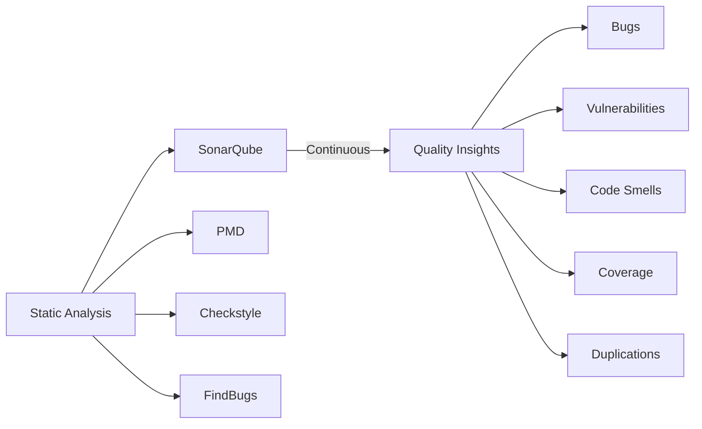
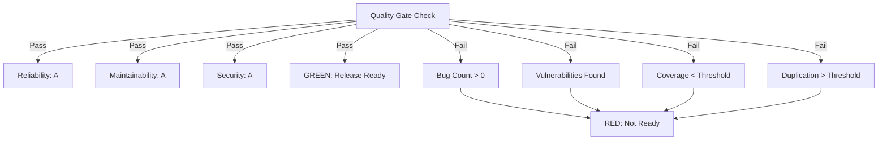

# Other Skills

## SonarQube (Static Code Analysis)

### 1. Overview

**SonarQube** is an open-source platform for continuous code quality inspection. It performs **static code analysis** — examining source code without executing it — to detect bugs, vulnerabilities, code smells, security hotspots, and measure code coverage.



> **Static Analysis** is different from dynamic analysis. Static analysis inspects code structure, patterns, and style without running the program. Dynamic analysis (like testing) executes the code. Both are complementary — static analysis catches issues that testing might miss.

### 2. SonarQube Architecture

```
┌──────────────────────────────────────────────────────┐
│                    SonarQube Server                   │
│                                                      │
│  ┌────────────┐  ┌──────────────┐  ┌────────────┐  │
│  │  Web Server │──│ Scanner (CLI) │──│  Database   │  │
│  │ (Dashboard) │  │              │  │  (PostgreSQL│  │
│  └──────┬─────┘  └──────────────┘  │   / H2)     │  │
│         │                          └────────────┘  │
│         │            ┌──────────────┐              │
│         └────────────│ SonarQube DB  │              │
│                      └──────────────┘              │
└──────────────────────────────────────────────────────┘
                              ↑
                    ┌─────────┴─────────┐
                    │   Scanner Runs    │
                    │  (CI/CD Pipeline) │
                    └─────────┬─────────┘
                              ↓
              ┌───────────────────────────────────┐
              │ Maven / Gradle / MSBuild / CLI    │
              │     Analyze Source Code           │
              │    Report to SonarQube Server     │
              └───────────────────────────────────┘
```

| Component | Role |
|-----------|------|
| **Web Server** | UI dashboard, project management, rule configuration |
| **Database** | Stores analysis results, metrics, and project history |
| **Scanner** | Analyzes source code and sends results to server |

### 3. Quality Gates

A **Quality Gate** is a set of conditions a project must meet to be considered production-ready. It acts as a gatekeeper for code quality.

#### 3.1. Default Quality Gate Conditions

| Metric | Condition | Rating |
|--------|-----------|--------|
| **Bugs** | 0 | A |
| **Vulnerabilities** | 0 | A |
| **Security Hotspots** | Reviewed | A |
| **Code Smells** | Maintainability rating >= A | A |
| **Coverage** | >= 80% (or 0% if not relevant) | A |
| **Duplications** | < 3% | A |
| **Lines of Code** | Within size limits | Pass |

#### 3.2. Maintainability, Reliability, Security Ratings

SonarQube rates projects on three axes:

| Rating | Letter | Definition |
|--------|--------|------------|
| **Reliability** | A | No known bugs, 0 Bugs |
| **Maintainability** | A | Code is easy to maintain, low tech debt |
| **Security** | A | No vulnerabilities, no unpatched security hotspots |
| D, E | Failing | Requires immediate attention |



### 4. Issue Types

#### 4.1. Bugs

**Bugs** are coding mistakes that produce incorrect, unexpected, or unintended behavior.

```java
// Bug: NullPointerException risk
public String getUserName(Long userId) {
    User user = userRepository.findById(userId);
    return user.getName();  // BUG: user could be null!
}

// Fixed
public String getUserName(Long userId) {
    User user = userRepository.findById(userId);
    if (user == null) {
        throw new UserNotFoundException(userId);
    }
    return user.getName();
}
```

#### 4.2. Vulnerabilities

**Vulnerabilities** are security weaknesses that can be exploited by attackers.

```java
// Vulnerability: SQL Injection
public List<User> searchUsers(String query) {
    String sql = "SELECT * FROM users WHERE name LIKE '%" + query + "%'";
    return jdbcTemplate.query(sql);  // VULN: SQL Injection!
}

// Fixed: Use parameterized query
public List<User> searchUsers(String query) {
    String sql = "SELECT * FROM users WHERE name LIKE ?";
    return jdbcTemplate.query(sql, "%" + query + "%");  // Safe
}
```

```java
// Vulnerability: Hardcoded password
String password = "admin123";  // VULN: Never hardcode secrets!

// Fixed: Use environment variables or secrets manager
String password = System.getenv("DB_PASSWORD");
```

#### 4.3. Code Smells (Maintainability Issues)

**Code smells** are characteristics of code that suggest deeper problems. They don't cause bugs but make code harder to maintain.

| Smell Type | Example | Fix |
|------------|---------|-----|
| **Long Method** | Method > 20 lines | Split into smaller methods |
| **Duplicate Code** | Same code in 3+ places | Extract to common method |
| **Unused Parameters** | Parameters never used | Remove parameter |
| **Cognitive Complexity** | Nested if/else/loops | Simplify logic |
| **Magic Numbers** | `if (status == 1)` | Use named constants |
| **Long Class** | Class > 500 lines | Split into smaller classes |

```java
// Code Smell: Cognitive Complexity (hard to understand)
public boolean isValid(Order order) {
    if (order != null) {                    // level 1
        if (order.getItems() != null) {    // level 2
            if (order.getItems().size() > 0) {  // level 3
                if (order.getTotal() > 0) {     // level 4
                    return true;
                }
            }
        }
    }
    return false;
}

// Fixed: Simplified with early returns
public boolean isValid(Order order) {
    if (order == null) return false;
    if (order.getItems() == null) return false;
    if (order.getItems().isEmpty()) return false;
    return order.getTotal() > 0;
}
```

#### 4.4. Security Hotspots

**Security Hotspots** highlight security-sensitive pieces of code that need human review. Unlike vulnerabilities, they don't automatically mean the code is exploitable — they need a developer to review and confirm the code is safe.

```java
// Security Hotspot: Cryptographic operation
public String hashPassword(String password) {
    // S2544: Make sure that using a non-standard cryptographic algorithm is safe here.
    return DigestUtils.md5Hex(password);  // HOTSPOT: MD5 is weak!
}
```

### 5. Clean as You Code

**Clean as You Code** is SonarQube's approach to code quality. Instead of trying to fix all legacy code at once, it focuses on ensuring that **new code added is clean**.

```
┌─────────────────────────────────────────────────────┐
│           Clean as You Code Principle                │
│                                                     │
│  Focus: Only the code YOU change needs to be clean  │
│                                                     │
│  Legacy code: Won't fail the gate (it's old code)  │
│  New code (yours): Must meet all quality standards │
│                                                     │
└─────────────────────────────────────────────────────┘
```

Benefits:
- Developers are responsible only for their own changes
- Quality gates fail on **new code**, not legacy debt
- Gradual improvement over time without massive refactoring effort
- Motivates teams to keep their code clean incrementally

### 6. SonarScanner Integration

#### 6.1. Maven

```xml
<!-- pom.xml -->
<properties>
    <sonar.host.url>http://localhost:9000</sonar.host.url>
</properties>
```

```bash
# Run Maven with SonarQube
mvn clean verify sonar:sonar
# Or with specific properties
mvn clean verify -Dsonar.projectKey=my-project \
  -Dsonar.host.url=http://localhost:9000 \
  -Dsonar.token=sqp_xxxxxxxxxxxxx
```

#### 6.2. Gradle

```groovy
// build.gradle
plugins {
    id 'org.sonarqube' version '4.0.0.2929'
}

sonarqube {
    properties {
        property "sonar.projectKey", "my-java-app"
        property "sonar.host.url", "http://localhost:9000"
    }
}
```

```bash
./gradlew sonarqube -Dsonar.token=sqp_xxxxxxxxxxxxx
```

#### 6.3. CLI (SonarScanner)

```bash
# Download and install SonarScanner
# sonar-scanner.properties
sonar.host.url=http://localhost:9000
sonar.projectKey=my-project
sonar.sourceEncoding=UTF-8
sonar.sources=src
sonar.java.source=17

# Run
sonar-scanner
```

#### 6.4. NPM

```bash
# Install
npm install --save-dev sonar-scanner

# Add to package.json
# "sonar": "sonar-scanner"
npm run sonar
```

### 7. CI/CD Integration

#### 7.1. GitHub Actions

```yaml
# .github/workflows/sonar.yml
name: SonarQube Analysis

on:
  push:
    branches: [main, develop]
  pull_request:
    branches: [main]

jobs:
  sonarcloud:
    name: SonarCloud Scan
    runs-on: ubuntu-latest

    steps:
      - uses: actions/checkout@v4
        with:
          fetch-depth: 0  # Needed for blame analysis

      - name: Set up JDK 17
        uses: actions/setup-java@v4
        with:
          java-version: '17'
          distribution: 'temurin'

      - name: Cache Maven packages
        uses: actions/cache@v3
        with:
          path: ~/.m2/repository
          key: ${{ runner.os }}-m2-${{ hashFiles('**/pom.xml') }}

      - name: Run Maven tests
        run: mvn clean verify

      - name: SonarCloud Scan
        uses: SonarSource/sonarcloud-github-action@v2
        env:
          SONAR_TOKEN: ${{ secrets.SONAR_TOKEN }}
          GITHUB_TOKEN: ${{ secrets.GITHUB_TOKEN }}
```

#### 7.2. Jenkins

```groovy
// Jenkinsfile
pipeline {
    agent any

    stages {
        stage('Checkout') {
            steps {
                checkout scm
            }
        }

        stage('Build & Test') {
            steps {
                sh 'mvn clean verify'
            }
        }

        stage('SonarQube Analysis') {
            steps {
                script {
                    def scannerHome = tool 'SonarScanner';
                    withSonarQubeEnv('SonarQube') {
                        sh "${scannerHome}/bin/sonar-scanner"
                    }
                }
            }
        }
    }

    post {
        always {
            recordIssues(
                enabledForFailure: true,
                tools: [java(), checkStyle()],
                qualityGates: [sonarQube('SonarQube')]
            )
        }
    }
}
```

### 8. SonarQube Rules

SonarQube comes with thousands of **language-specific rules**. Rules are organized by:

| Category | Language Coverage |
|----------|------------------|
| **Java** | 600+ rules (FindBugs, PMD, custom) |
| **JavaScript/TypeScript** | 300+ rules |
| **Python** | 200+ rules |
| **C#** | 400+ rules |
| **Go** | 150+ rules |
| **Kotlin** | 200+ rules |

Rules are categorized by:
- **Impact**: How serious is this issue? (High, Medium, Low)
- **Likelihood**: How likely is it to cause problems? (High, Medium, Low)
- **Remediation Cost**: How easy is it to fix? (Low, Medium, High)

### 9. Interview Questions

**Q: What is the difference between a Bug, Vulnerability, and Code Smell?**

> A **Bug** is a coding error that produces incorrect behavior — the code is literally wrong. A **Vulnerability** is a security weakness that attackers could exploit (SQL injection, XSS, etc.). A **Code Smell** is not technically wrong, but it violates good design principles and makes code hard to maintain. Code smells don't cause bugs directly, but they increase technical debt and the likelihood of future bugs.

**Q: What is a Quality Gate in SonarQube?**

> A **Quality Gate** is a set of threshold conditions (like "0 bugs", "coverage >= 80%", "duplications < 3%") that a project must satisfy to be considered ready for production. If any condition fails, the quality gate is red and code should not be released. It's a checklist that enforces minimum quality standards.

**Q: What is the "Clean as You Code" principle?**

> **Clean as You Code** means focusing quality efforts on code you are currently writing or changing, rather than trying to fix all legacy code at once. New code you introduce must meet all quality standards, while legacy code won't block your quality gate. This creates incremental improvement without overwhelming refactoring efforts. Each developer is responsible only for the code they touch.

**Q: How do you integrate SonarQube into a CI/CD pipeline?**

> The typical flow: Install the SonarScanner (Maven plugin, Gradle plugin, or CLI), configure the SonarQube server URL and project key in your build configuration, run your tests and compile code, execute the scanner which analyzes the code and uploads results to the SonarQube server, and the quality gate check either passes or fails the pipeline. In GitHub Actions, use the `SonarSource/sonarcloud-github-action`. In Jenkins, use the `withSonarQubeEnv` block in your pipeline.
