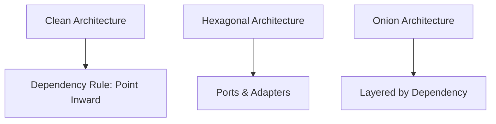
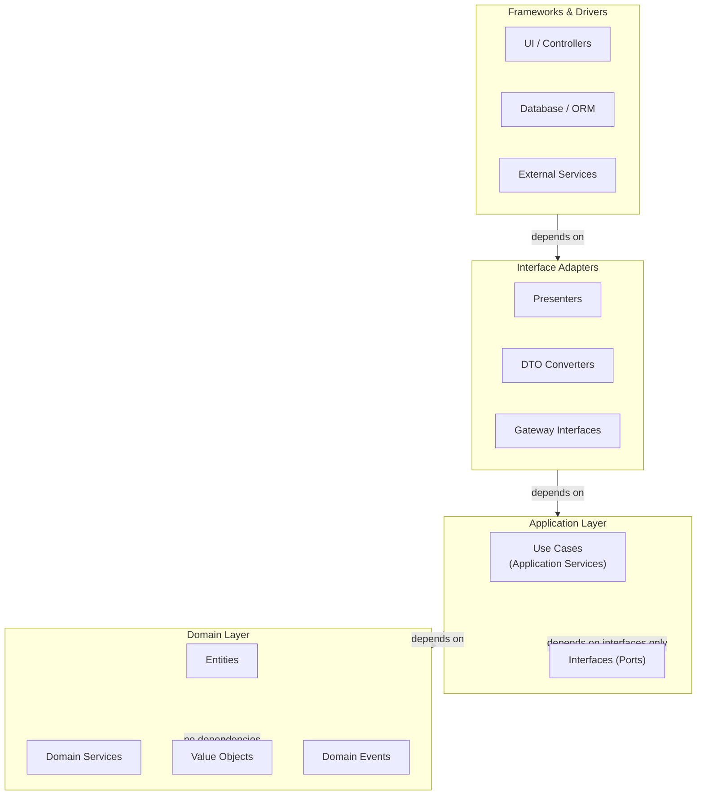
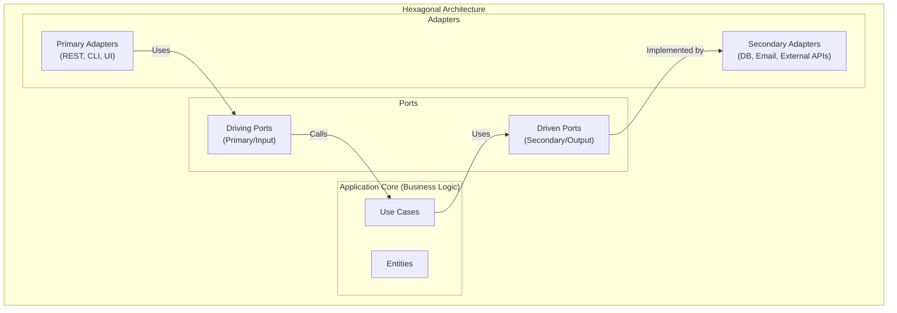
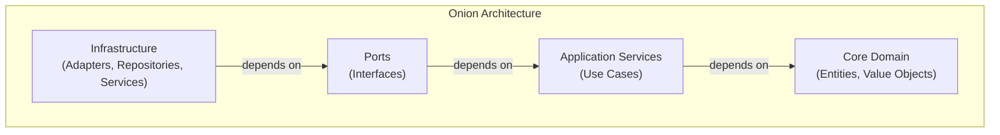

# Software Architecture

## Clean & Hexagonal Architecture

### 1. Overview

**Clean Architecture** and **Hexagonal Architecture** (also called Ports & Adapters) are architectural patterns that share a common goal: creating systems that are **independent of frameworks, databases, and external agencies**, with the business logic at the center.



These architectures are related — they all emphasize:
- **Separation of concerns** across layers
- **Inward dependencies only** (inner layers don't depend on outer)
- **Business logic isolation** from infrastructure
- **Testability** at every layer

---

### 2. Clean Architecture (Robert C. Martin)

Clean Architecture, introduced by Robert C. Martin (Uncle Bob), organizes code into layers where dependencies always point inward.



#### 2.1. Layer Details

| Layer | Responsibility | Dependencies | Examples |
|-------|---------------|--------------|---------|
| **Entities** | Core business logic, enterprise-wide rules | None (pure) | `Order`, `User`, `Money` |
| **Use Cases** | Application-specific business rules | Entities, Port interfaces | `PlaceOrderUseCase`, `TransferFundsUseCase` |
| **Interface Adapters** | Convert data between formats | Use Cases, External | `OrderController`, `OrderPresenter` |
| **Frameworks & Drivers** | External tools, DB, UI, web | Everything | `Spring MVC`, `JPA`, `REST API` |

#### 2.2. Dependency Rule

> **The Dependency Rule**: Source code dependencies can only point inward. Outer layers can depend on inner layers, but inner layers never depend on outer layers.

```
    Frameworks & Drivers
           ↓
    Interface Adapters
           ↓
      Use Cases
           ↓
       Entities
```

This means:
- Entities know nothing about databases, web frameworks, or controllers
- Use Cases know only about Entities and interfaces (not implementations)
- Infrastructure implements interfaces defined by inner layers

#### 2.3. Code Example

```java
// ========== DOMAIN LAYER (Core) ==========
// Entities: Pure business logic, no framework dependencies
public class Order {
    private final OrderId id;
    private CustomerId customerId;
    private OrderStatus status;
    private List<OrderItem> items;

    // Domain logic enforced here
    public void addItem(Product product, int quantity) {
        if (status != OrderStatus.DRAFT) {
            throw new OrderException("Cannot modify confirmed order");
        }
        if (quantity <= 0) {
            throw new OrderException("Quantity must be positive");
        }
        this.items.add(new OrderItem(product.getId(), product.getPrice(), quantity));
    }

    public void confirm() {
        if (items.isEmpty()) {
            throw new OrderException("Cannot confirm empty order");
        }
        this.status = OrderStatus.CONFIRMED;
    }
}

// Value Objects
public record Money(BigDecimal amount, Currency currency) {
    public Money add(Money other) {
        if (!this.currency.equals(other.currency)) {
            throw new IllegalArgumentException("Currency mismatch");
        }
        return new Money(this.amount.add(other.amount), this.currency);
    }
}

// Port interfaces (defined in inner layer)
public interface OrderRepository {
    Order findById(OrderId id);
    void save(Order order);
    void delete(OrderId id);
}

public interface ProductRepository {
    Product findById(ProductId id);
    List<Product> findByCategory(CategoryId categoryId);
}

public interface NotificationService {
    void sendOrderConfirmation(Order order);
}
```

```java
// ========== APPLICATION LAYER (Use Cases) ==========
// Use Case: Orchestrates domain objects, implements business rules
public class PlaceOrderUseCase {
    private final OrderRepository orderRepository;
    private final ProductRepository productRepository;
    private final NotificationService notificationService;

    // Dependencies are injected (interface-based)
    public PlaceOrderUseCase(
            OrderRepository orderRepository,
            ProductRepository productRepository,
            NotificationService notificationService) {
        this.orderRepository = orderRepository;
        this.productRepository = productRepository;
        this.notificationService = notificationService;
    }

    public OrderResult execute(PlaceOrderCommand command) {
        // 1. Validate and find products
        List<OrderItemData> itemData = new ArrayList<>();
        for (ItemRequest item : command.items()) {
            Product product = productRepository.findById(item.productId());
            if (product == null) {
                throw new ProductNotFoundException(item.productId());
            }
            itemData.add(new OrderItemData(product, item.quantity()));
        }

        // 2. Create and populate order
        Order order = Order.create(command.customerId());
        for (OrderItemData item : itemData) {
            order.addItem(item.product(), item.quantity());
        }

        // 3. Persist
        orderRepository.save(order);

        // 4. Notify
        notificationService.sendOrderConfirmation(order);

        return new OrderResult(order.getId(), order.getTotal());
    }
}

// ========== INTERFACE ADAPTERS LAYER ==========
// Controller: Adapts HTTP request to Use Case input
@RestController
@RequestMapping("/api/orders")
public class OrderController {
    private final PlaceOrderUseCase placeOrderUseCase;

    @PostMapping
    public ResponseEntity<OrderResponse> createOrder(
            @RequestBody CreateOrderRequest request) {
        PlaceOrderCommand command = new PlaceOrderCommand(
            new CustomerId(request.customerId()),
            request.items().stream()
                .map(i -> new ItemRequest(
                    new ProductId(i.productId()),
                    i.quantity()))
                .toList()
        );

        OrderResult result = placeOrderUseCase.execute(command);

        return ResponseEntity.created(
            URI.create("/api/orders/" + result.orderId()))
            .body(new OrderResponse(result.orderId().toString(),
                                   result.total().toString()));
    }
}
```

```java
// ========== FRAMEWORKS & DRIVERS LAYER (Infrastructure) ==========
// Repository Implementation: Adapts JPA to the port interface
@Repository
public class JpaOrderRepository implements OrderRepository {
    private final SpringDataOrderRepository jpaRepo;

    @Override
    public Order findById(OrderId id) {
        return jpaRepo.findById(id.getValue())
            .map(entity -> OrderMapper.toDomain(entity))
            .orElse(null);
    }

    @Override
    public void save(Order order) {
        OrderEntity entity = OrderMapper.toEntity(order);
        jpaRepo.save(entity);
    }
}

// Notification Implementation
@Service
public class EmailNotificationService implements NotificationService {
    private final JavaMailSender mailSender;

    @Override
    public void sendOrderConfirmation(Order order) {
        // Send email via JavaMailSender
        SimpleMailMessage email = new SimpleMailMessage();
        email.setTo(order.getCustomerId().toString());
        email.setSubject("Order Confirmed: " + order.getId());
        email.setText("Your order has been confirmed...");
        mailSender.send(email);
    }
}
```

---

### 3. Hexagonal Architecture (Ports & Adapters)

Hexagonal Architecture, introduced by Alistair Cockburn, uses the metaphor of a **hexagon** where the center is the application core and the edges are ports connected by adapters.



#### 3.1. Ports

**Ports** are interfaces defined by the application core. They come in two types:

| Port Type | Direction | Purpose | Example |
|-----------|-----------|---------|---------|
| **Driving (Primary)** | Inward | How external actors interact with the core | `OrderService` interface |
| **Driven (Secondary)** | Outward | What the core needs from external systems | `OrderRepository`, `EmailService` |

```java
// Driving Port (Primary) — how external world drives the application
public interface OrderServicePort {
    OrderId placeOrder(CustomerId customerId, List<OrderItemRequest> items);
    OrderDTO getOrder(OrderId orderId);
    void cancelOrder(OrderId orderId);
}

// Driven Port (Secondary) — what the application needs from outside
public interface OrderRepositoryPort {
    Order findById(OrderId id);
    void save(Order order);
}

public interface ProductCatalogPort {
    Product findById(ProductId id);
}

public interface NotificationPort {
    void sendOrderConfirmation(Order order);
}
```

#### 3.2. Adapters

**Adapters** are implementations that connect ports to the outside world.

```java
// Primary Adapter: REST API
@RestController
public class OrderRestAdapter implements OrderServicePort {
    private final OrderServicePort orderService;

    @PostMapping("/orders")
    public ResponseEntity<OrderId> placeOrder(@RequestBody CreateOrderRequest req) {
        OrderId orderId = orderService.placeOrder(req.customerId(), req.items());
        return ResponseEntity.created(URI.create("/orders/" + orderId)).build();
    }
}

// Secondary Adapter: JPA Repository
@Repository
public class JpaOrderAdapter implements OrderRepositoryPort {
    private final OrderJpaRepository jpaRepo;

    @Override
    public Order findById(OrderId id) {
        return jpaRepo.findById(id.getValue()).map(OrderMapper::toDomain).orElse(null);
    }
}

// Secondary Adapter: Email Service
@Service
public class SmtpNotificationAdapter implements NotificationPort {
    private final JavaMailSender mailSender;

    @Override
    public void sendOrderConfirmation(Order order) {
        // Send email
    }
}
```

---

### 4. Onion Architecture

Onion Architecture, introduced by Jeffrey Palermo, organizes layers in concentric circles around the core domain.



It is very similar to Clean Architecture — the main difference is the naming:
- **Domain Core** = Entities layer
- **Application Services** = Use Cases layer
- **Ports** = Interface Adapters
- **Infrastructure** = Frameworks & Drivers

---

### 5. Layered Architecture (Comparison)

**Traditional Layered Architecture** is the ancestor of these patterns:

```
┌─────────────────────────┐
│   Presentation Layer    │  (Controllers, Views)
├─────────────────────────┤
│    Service Layer        │  (Business Logic)
├─────────────────────────┤
│     Data Access         │  (Repositories, DAOs)
├─────────────────────────┤
│    Database Layer       │  (SQL, NoSQL)
└─────────────────────────┘
```

| Aspect | Layered | Clean/Hexagonal |
|--------|---------|-----------------|
| **Dependency Direction** | All layers depend downward | Only inward dependencies |
| **Framework Coupling** | Service layer often coupled to framework | Domain isolated from frameworks |
| **Testability** | Harder to unit test business logic | Easy to test domain in isolation |
| **Flexibility** | Changes to DB affect service layer | DB changes isolated to outer layer |
| **Complexity** | Simpler for small projects | More structure, better for large projects |

---

### 6. Dependency Injection in Practice

All these architectures benefit from **Dependency Injection (DI)** to achieve loose coupling:

```java
// Spring Boot auto-configuration wires adapters to ports
@Configuration
public class AppConfig {

    // Infrastructure adapter implements port interface
    @Bean
    public OrderRepositoryPort orderRepository(JpaOrderRepository jpaRepo) {
        return new JpaOrderAdapter(jpaRepo);
    }

    @Bean
    public NotificationPort notificationService(JavaMailSender mailSender) {
        return new SmtpNotificationAdapter(mailSender);
    }

    // Use case depends on port interfaces (not implementations)
    @Bean
    public PlaceOrderUseCase placeOrderUseCase(
            OrderRepositoryPort orderRepository,
            ProductCatalogPort productCatalog,
            NotificationPort notification) {
        return new PlaceOrderUseCase(orderRepository, productCatalog, notification);
    }

    // Controller depends on use case interface
    @Bean
    public OrderController orderController(PlaceOrderUseCase useCase) {
        return new OrderController(useCase);
    }
}
```

---

### 7. Testing at Each Layer

One major benefit of these architectures is **testability at every layer**.

```java
// 1. Domain Layer: Pure unit tests (no dependencies)
class OrderTest {
    @Test
    void cannotConfirmEmptyOrder() {
        Order order = Order.create(customerId);
        assertThrows(OrderException.class, order::confirm);
    }
}

// 2. Use Case Layer: Mock ports
class PlaceOrderUseCaseTest {
    @Mock OrderRepositoryPort orderRepository;
    @Mock ProductCatalogPort productCatalog;
    @Mock NotificationPort notification;

    @Test
    void placeOrderSavesAndNotifies() {
        when(productCatalog.findById(any())).thenReturn(testProduct);
        PlaceOrderUseCase useCase = new PlaceOrderUseCase(
            orderRepository, productCatalog, notification);
        useCase.execute(command);
        verify(orderRepository).save(any());
        verify(notification).sendOrderConfirmation(any());
    }
}

// 3. Controller Layer: Mock use case
class OrderControllerTest {
    @Mock PlaceOrderUseCase useCase;

    @Test
    void createOrderReturns201() {
        when(useCase.execute(any())).thenReturn(new OrderResult(testOrderId, total));
        OrderController controller = new OrderController(useCase);
        ResponseEntity<?> response = controller.createOrder(testRequest);
        assertEquals(201, response.getStatusCode());
    }
}
```

---

### 8. When to Use Each Pattern

| Pattern | Best For | Consider When |
|---------|---------|---------------|
| **Clean Architecture** | Large projects, DDD, complex business logic | You need testable business rules, multiple deployment options |
| **Hexagonal** | Systems needing multiple delivery mechanisms (REST, CLI, MQ) | Core business must remain stable while adapters change |
| **Onion** | Similar to Clean, prefers naming convention | Team is familiar with "onion" metaphor |
| **Layered** | Small to medium projects, simple CRUD | Project is simple enough that full isolation is overkill |

> **Start simple**: For small projects, a well-structured layered architecture may be sufficient. As complexity grows, migrate toward Clean/Hexagonal. The goal is **sufficient structure** — not maximum complexity.

---

### 9. Interview Questions

**Q: What is the Dependency Rule in Clean Architecture?**

> The Dependency Rule states that source code dependencies must only point inward. Outer layers (UI, frameworks, databases) can depend on inner layers (use cases, entities), but inner layers must never depend on outer layers. This means: entities know nothing about databases or frameworks; use cases know only about entities and interface abstractions; infrastructure implements interfaces defined by inner layers. This rule ensures that the business logic remains isolated and unaffected by changes in external systems.

**Q: What's the difference between Hexagonal Architecture and Clean Architecture?**

> They are very similar and often considered the same pattern with different terminology. **Hexagonal** emphasizes the ports-and-adapters metaphor — the application core is surrounded by driving ports (input) and driven ports (output), with adapters connecting them to the outside world. **Clean Architecture** emphasizes the layered dependency structure and the dependency rule. The core principles are identical: isolate the business logic, define ports as interfaces, and implement adapters in the outer layer. Hexagonal is slightly older and uses different vocabulary; Clean Architecture provides more detailed layer definitions.

**Q: How do you implement these architectures in a Spring Boot application?**

> Key steps: Define **domain entities** with no Spring annotations or framework dependencies. Define **port interfaces** (e.g., `OrderRepository`, `NotificationService`) in the domain or application layer. Implement **use cases** that depend only on port interfaces. In the infrastructure layer, implement **adapters** (JPA repositories, email services) that implement the port interfaces. Configure **dependency injection** (via `@Bean` methods or constructor injection) to wire adapters to their ports. This way, the core business logic is completely isolated from Spring — you can test it without Spring, and change the framework without changing the business logic.

**Q: What is the main benefit of these architectures over traditional layered architecture?**

> The primary benefit is **framework and infrastructure independence**. In a traditional layered architecture, the service/business logic layer often depends on specific database frameworks, ORM annotations, or web framework classes. In Clean/Hexagonal architecture, the domain is completely isolated — it has no imports from Spring, Hibernate, or any other framework. This means: the business logic is **testable in complete isolation**, the **framework can be replaced** without rewriting business logic, and the **same core** can be exposed via REST, GraphQL, or CLI without modification.
