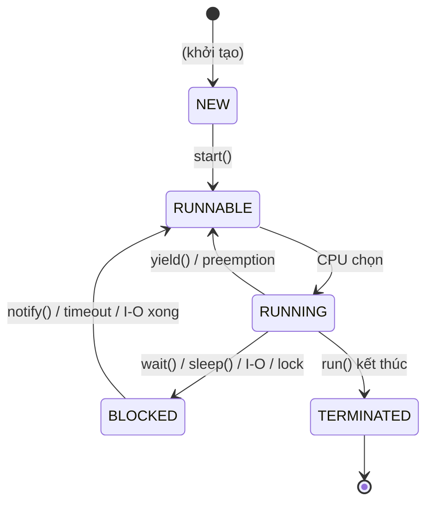

# Java Core — Concurrency

## 1. Process vs Thread

| Khái niệm | Mô tả |
|---|---|
| **Process** | Chương trình đang chạy, có bộ nhớ và tài nguyên riêng biệt |
| **Thread** | Luồng thực thi nhỏ hơn trong process, các thread **chia sẻ** bộ nhớ |

> **Tip:** Một process có thể chứa nhiều thread. Thread nhẹ hơn process vì không cần cấp phát bộ nhớ riêng.

## 2. Runnable vs Thread

| Tiêu chí | `Runnable` | `Thread` |
|---|---|---|
| **Loại** | Interface | Class |
| **Method** | `run()` | `run()`, `start()` |
| **Mục đích** | Định nghĩa task | Định nghĩa task + quản lý thread |
| **Kết quả trả về** | Không | Không |
| **Implement** | `implements Runnable` | `extends Thread` |

### 2.1. Ví dụ

```java
// Runnable — linh hoạt hơn, khuyên dùng
Runnable task = () -> {
    System.out.println("Running in: " + Thread.currentThread().getName());
};
Thread t1 = new Thread(task, "worker-1");
t1.start();

// Thread class
Thread t2 = new Thread(() -> {
    System.out.println("Thread2 is running...");
}, "worker-2");
t2.start();
```

> **Khuyến nghị:** Dùng `Runnable` thay vì `Thread` vì:
> - Tách logic chạy và quản lý thread rõ ràng.
> - Một class có thể `implements` nhiều interface.
> - Phù hợp với **Executor Framework**.

## 3. Vòng đời của Thread



| Trạng thái | Mô tả |
|---|---|
| **NEW** | Đối tượng Thread được tạo, chưa gọi `start()` |
| **RUNNABLE** | Đã gọi `start()`, sẵn sàng được CPU thực thi |
| **RUNNING** | CPU đang thực sự chạy code của thread |
| **BLOCKED/WAITING** | Tạm dừng: chờ lock, I/O, `wait()`, `sleep()` |
| **TERMINATED** | Đã thoát khỏi `run()`, không thể restart |

## 4. synchronized và volatile

### 4.1. So sánh

| Tiêu chí | `synchronized` | `volatile` |
|---|---|---|
| **Phạm vi** | Method hoặc block | Chỉ biến |
| **Visibility** | Đảm bảo | Đảm bảo |
| **Atomicity** | Đảm bảo | Không |
| **Performance** | Chậm hơn | Nhanh hơn |

### 4.2. synchronized

Đảm bảo chỉ **1 thread** truy cập tại một thời điểm.

```java
// synchronized method
public synchronized void increment() {
    counter++;
}

// synchronized block — hiệu năng tốt hơn
public void increment() {
    synchronized (this) {
        counter++;
    }
}

// lock trên object khác
private final Object lock = new Object();
public void process() {
    synchronized (lock) {
        // chỉ 1 thread vào đây
    }
}
```

### 4.3. volatile

Đảm bảo khi 1 thread thay đổi giá trị, các thread khác nhìn thấy **ngay lập tức** (visibility).

```java
// Phù hợp cho biến nguyên tử: flag, status, boolean
private volatile boolean running = true;

public void stop() {
    running = false; // các thread khác thấy ngay
}
```

### 4.4. Khi nào dùng?

| Tình huống | Dùng |
|---|---|
| Biến nguyên tử (boolean, flag) | `volatile` |
| Thao tác phức tạp (counter++, check-then-act) | `synchronized` |
| Đọc nhiều thread cùng lúc | `volatile` |
| Ghi chung tài nguyên | `synchronized` |

> **Lưu ý:** `counter++` gồm **3 bước**: đọc, tăng, ghi — không phải atomic, cần `synchronized`.

## 5. wait(), notify(), notifyAll()

Ba method này **phải được gọi trong khối `synchronized`**:

| Method | Mô tả |
|---|---|
| `wait()` | Thread hiện tại **dừng chờ** notify/notifyAll |
| `notify()` | Đánh thức **một** thread bất kì đang `wait()` trên cùng object |
| `notifyAll()` | Đánh thức **tất cả** thread đang `wait()` |

### 5.1. Ví dụ: Producer-Consumer

```java
class Buffer {
    private int data;
    private boolean hasData = false;

    public synchronized void put(int value) throws InterruptedException {
        while (hasData) {
            wait(); // đợi consumer lấy
        }
        data = value;
        hasData = true;
        System.out.println("Produced: " + value);
        notifyAll(); // báo cho consumer
    }

    public synchronized int get() throws InterruptedException {
        while (!hasData) {
            wait(); // đợi producer tạo
        }
        hasData = false;
        notifyAll(); // báo cho producer
        return data;
    }
}
```

## 6. Thread Pool và Executor Framework

**Thread Pool** là bể chứa thread được tạo sẵn để tái sử dụng — tránh tạo/hủy thread liên tục, tối ưu tài nguyên.

### 6.1. ExecutorService

```java
import java.util.concurrent.ExecutorService;
import java.util.concurrent.Executors;

// Tạo thread pool cố định 4 threads
ExecutorService executor = Executors.newFixedThreadPool(4);

for (int i = 0; i < 10; i++) {
    final int taskId = i;
    executor.submit(() -> {
        System.out.println("Task " + taskId + " running on " + Thread.currentThread().getName());
    });
}

executor.shutdown(); // không nhận task mới, chờ task đang chạy xong
```

### 6.2. Các loại Thread Pool

| Loại | Mô tả |
|---|---|
| `newFixedThreadPool(n)` | Cố định n threads |
| `newCachedThreadPool()` | Thread mới khi cần, tái sử dụng thread rảnh |
| `newSingleThreadExecutor()` | Một thread duy nhất |
| `newScheduledThreadPool(n)` | Thread pool có thể lên lịch |

## 7. Callable và Future

| Tiêu chí | `Runnable` | `Callable<V>` |
|---|---|---|
| **Return type** | `void` | `V` (generic) |
| **Exception** | Không ném checked | Có ném checked |
| **Kết quả** | Không | Trả về qua `Future` |

### 7.1. Ví dụ

```java
import java.util.concurrent.*;

ExecutorService executor = Executors.newFixedThreadPool(2);

// Callable trả về kết quả
Callable<Integer> task = () -> {
    Thread.sleep(1000);
    return 42;
};

Future<Integer> future = executor.submit(task);

// Blocking — chờ kết quả
try {
    Integer result = future.get();       // chờ vô hạn
    // Integer result = future.get(5, TimeUnit.SECONDS); // chờ 5 giây
    System.out.println("Result: " + result);
} catch (ExecutionException | InterruptedException e) {
    e.printStackTrace();
}

// Kiểm tra trạng thái
System.out.println("Done? " + future.isDone());
System.out.println("Cancelled? " + future.isCancelled());

executor.shutdown();
```

## 8. Concurrent Collections

| Collection | Mô tả | Phù hợp |
|---|---|---|
| `ConcurrentHashMap` | Thread-safe, lock chia nhỏ (bucket-level) | Đọc/ghi đồng thời nhiều |
| `CopyOnWriteArrayList` | Mỗi lần ghi tạo bản sao | Đọc nhiều, ghi ít |
| `ConcurrentLinkedQueue` | Queue không khóa (lock-free) | Throughput cao |
| `BlockingQueue` | Hỗ trợ wait/notify cho producer-consumer | Bài toán producer-consumer |
| `ConcurrentSkipListMap` | Thread-safe, sorted | Map cần sắp xếp |

### 8.1. Ví dụ BlockingQueue

```java
BlockingQueue<Integer> queue = new LinkedBlockingQueue<>(5);

// Producer
new Thread(() -> {
    for (int i = 0; i < 10; i++) {
        try {
            queue.put(i); // blocking nếu queue đầy
            System.out.println("Produced: " + i);
        } catch (InterruptedException e) {
            Thread.currentThread().interrupt();
        }
    }
}).start();

// Consumer
new Thread(() -> {
    for (int i = 0; i < 10; i++) {
        try {
            Integer val = queue.take(); // blocking nếu queue rỗng
            System.out.println("Consumed: " + val);
        } catch (InterruptedException e) {
            Thread.currentThread().interrupt();
        }
    }
}).start();
```

## 9. Atomic Variables

Dùng cơ chế **CAS (Compare-And-Swap)** — câu lệnh gốc của CPU, nhanh hơn `synchronized`.

| Class | Mô tả |
|---|---|
| `AtomicInteger` | Số nguyên nguyên tử |
| `AtomicLong` | Số dài nguyên tử |
| `AtomicBoolean` | Boolean nguyên tử |
| `AtomicReference<V>` | Tham chiếu object nguyên tử |

### 9.1. Ví dụ

```java
import java.util.concurrent.atomic.AtomicInteger;

AtomicInteger counter = new AtomicInteger(0);

// Thay counter++ (3 bước: đọc-tăng-ghi)
counter.incrementAndGet();       // ++i
counter.getAndIncrement();       // i++
counter.addAndGet(5);            // i += 5

System.out.println(counter.get()); // 6
```

## 10. Synchronizers

### 10.1. CountDownLatch

Cho phép thread **chờ** đến khi một số tác vụ hoàn thành:

```java
CountDownLatch latch = new CountDownLatch(3);

for (int i = 0; i < 3; i++) {
    final int id = i;
    new Thread(() -> {
        System.out.println("Task " + id + " done");
        latch.countDown(); // giảm counter
    }).start();
}

latch.await(); // main thread chờ đến khi counter = 0
System.out.println("All tasks completed");
```

### 10.2. CyclicBarrier

Nhóm thread **chờ nhau** tại một điểm, cùng tiếp tục khi tất cả đến:

```java
CyclicBarrier barrier = new CyclicBarrier(3, () -> {
    System.out.println("All ready, go!");
});

for (int i = 0; i < 3; i++) {
    new Thread(() -> {
        System.out.println("Thread " + i + " ready");
        barrier.await(); // chờ tất cả
    }).start();
}
```

## 11. Fork/Join Framework

Dùng cho **parallelism**, chia task lớn thành task nhỏ (fork), ghép lại (join). Tối ưu trên CPU đa nhân.

```java
import java.util.concurrent.*;

class SumTask extends RecursiveTask<Long> {
    private final long[] array;
    private final int start, end;
    private static final int THRESHOLD = 10_000;

    SumTask(long[] array, int start, int end) {
        this.array = array;
        this.start = start;
        this.end = end;
    }

    @Override
    protected Long compute() {
        if (end - start <= THRESHOLD) {
            long sum = 0;
            for (int i = start; i < end; i++) sum += array[i];
            return sum;
        }

        int mid = (start + end) / 2;
        SumTask left = new SumTask(array, start, mid);
        SumTask right = new SumTask(array, mid, end);
        left.fork(); // chạy song song
        return right.compute() + left.join(); // ghép kết quả
    }
}

// Sử dụng
ForkJoinPool pool = new ForkJoinPool();
long result = pool.invoke(new SumTask(array, 0, array.length));
```

## 12. Deadlock và Livelock

### 12.1. Deadlock

2 hoặc nhiều thread **chờ lẫn nhau** giải phóng tài nguyên, dẫn đến treo vô thời hạn.

```java
// Ví dụ Deadlock
class DeadlockDemo {
    private final Object lockA = new Object();
    private final Object lockB = new Object();

    public void methodA() {
        synchronized (lockA) {
            synchronized (lockB) {
                System.out.println("A");
            }
        }
    }

    public void methodB() {
        synchronized (lockB) {  // Thread 2 lấy lockB trước
            synchronized (lockA) { // chờ lockA mãi không được
                System.out.println("B");
            }
        }
    }
}
```

#### Phòng tránh Deadlock

| Cách | Mô tả |
|---|---|
| **Thứ tự lock cố định** | Luôn lấy A rồi mới lấy B |
| **Dùng `tryLock()`** | Thử lấy lock, không được thì release |
| **`tryLock(timeout)`** | Tránh chờ vô hạn |
| **Hạn chế lock nhiều tài nguyên** | Lock ít nhất có thể |

```java
// Giải pháp: dùng tryLock với timeout
Lock lockA = new ReentrantLock();
Lock lockB = new ReentrantLock();

public void methodA() {
    lockA.lock();
    try {
        while (!lockB.tryLock(100, TimeUnit.MILLISECONDS)) {
            lockB.unlock();
            Thread.sleep(10);
        }
        // xử lý
    } catch (InterruptedException e) {
        Thread.currentThread().interrupt();
    } finally {
        lockB.unlock();
        lockA.unlock();
    }
}
```

### 12.2. Livelock

Các thread vẫn chạy nhưng công việc **không tiến triển** (luôn nhường nhau).

**Giải pháp:**

- Quy định ai chạy trước.
- Giới hạn số lần nhường (retry limit).
- Thêm thời gian chờ ngẫu nhiên (random backoff).

## 13. Best Practices

| Thực hành | Lý do |
|---|---|
| Dùng **Thread Pool** thay vì tự tạo Thread | Tránh tạo/hủy thread tốn kém |
| Thiết kế **immutable objects** khi có thể | An toàn đa luồng, không cần synchronization |
| Luôn bắt exception trong từng thread | Tránh exception không được xử lý |
| Dùng **try-with-resources** đóng tài nguyên | Đảm bảo giải phóng resource |
| Trong **Spring Boot**, dùng `@Async` | Không cần quản lý đa luồng thủ công |
| Tránh dùng `Thread.stop()` | deprecated, không an toàn |
| Dùng `volatile` cho **shared flags** | Đảm bảo visibility |
