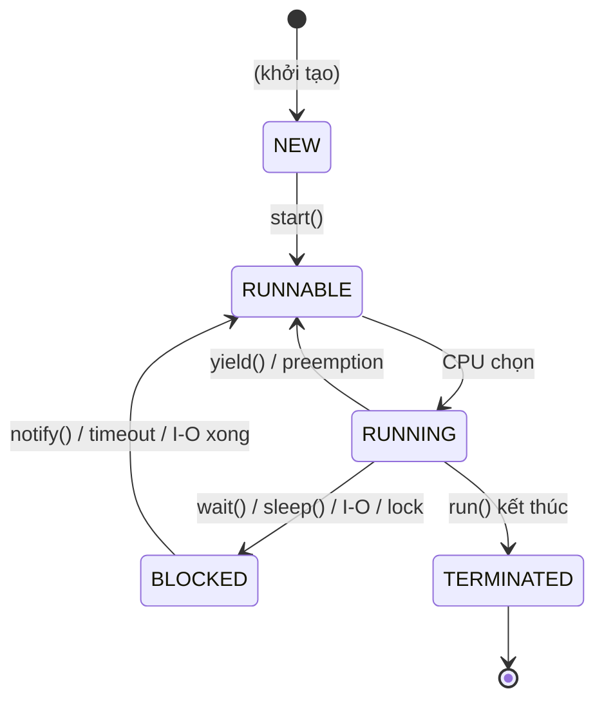
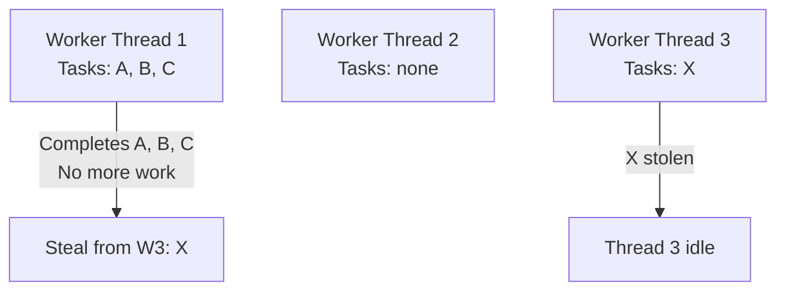

# Java Core — Concurrency

## 1. Process vs Thread

| Khái niệm | Mô tả |
|---|---|
| **Process** | Chương trình đang chạy, có bộ nhớ và tài nguyên riêng biệt |
| **Thread** | Luồng thực thi nhỏ hơn trong process, các thread **chia sẻ** bộ nhớ |

> **Tip:** Một process có thể chứa nhiều thread. Thread nhẹ hơn process vì không cần cấp phát bộ nhớ riêng.

## 2. Runnable vs Thread

| Tiêu chí | `Runnable` | `Thread` |
|---|---|---|
| **Loại** | Interface | Class |
| **Method** | `run()` | `run()`, `start()` |
| **Mục đích** | Định nghĩa task | Định nghĩa task + quản lý thread |
| **Kết quả trả về** | Không | Không |
| **Implement** | `implements Runnable` | `extends Thread` |

### 2.1. Ví dụ

```java
// Runnable — linh hoạt hơn, khuyên dùng
Runnable task = () -> {
    System.out.println("Running in: " + Thread.currentThread().getName());
};
Thread t1 = new Thread(task, "worker-1");
t1.start();

// Thread class
Thread t2 = new Thread(() -> {
    System.out.println("Thread2 is running...");
}, "worker-2");
t2.start();
```

> **Khuyến nghị:** Dùng `Runnable` thay vì `Thread` vì:
> - Tách logic chạy và quản lý thread rõ ràng.
> - Một class có thể `implements` nhiều interface.
> - Phù hợp với **Executor Framework**.

## 3. Vòng đời của Thread



| Trạng thái | Mô tả |
|---|---|
| **NEW** | Đối tượng Thread được tạo, chưa gọi `start()` |
| **RUNNABLE** | Đã gọi `start()`, sẵn sàng được CPU thực thi |
| **RUNNING** | CPU đang thực sự chạy code của thread |
| **BLOCKED/WAITING** | Tạm dừng: chờ lock, I/O, `wait()`, `sleep()` |
| **TERMINATED** | Đã thoát khỏi `run()`, không thể restart |

## 4. synchronized và volatile

### 4.1. So sánh

| Tiêu chí | `synchronized` | `volatile` |
|---|---|---|
| **Phạm vi** | Method hoặc block | Chỉ biến |
| **Visibility** | Đảm bảo | Đảm bảo |
| **Atomicity** | Đảm bảo | Không |
| **Performance** | Chậm hơn | Nhanh hơn |

### 4.2. synchronized

Đảm bảo chỉ **1 thread** truy cập tại một thời điểm.

```java
// synchronized method
public synchronized void increment() {
    counter++;
}

// synchronized block — hiệu năng tốt hơn
public void increment() {
    synchronized (this) {
        counter++;
    }
}

// lock trên object khác
private final Object lock = new Object();
public void process() {
    synchronized (lock) {
        // chỉ 1 thread vào đây
    }
}
```

### 4.3. volatile

Đảm bảo khi 1 thread thay đổi giá trị, các thread khác nhìn thấy **ngay lập tức** (visibility).

```java
// Phù hợp cho biến nguyên tử: flag, status, boolean
private volatile boolean running = true;

public void stop() {
    running = false; // các thread khác thấy ngay
}
```

### 4.4. Khi nào dùng?

| Tình huống | Dùng |
|---|---|
| Biến nguyên tử (boolean, flag) | `volatile` |
| Thao tác phức tạp (counter++, check-then-act) | `synchronized` |
| Đọc nhiều thread cùng lúc | `volatile` |
| Ghi chung tài nguyên | `synchronized` |

> **Lưu ý:** `counter++` gồm **3 bước**: đọc, tăng, ghi — không phải atomic, cần `synchronized`.

## 5. wait(), notify(), notifyAll()

Ba method này **phải được gọi trong khối `synchronized`**:

| Method | Mô tả |
|---|---|
| `wait()` | Thread hiện tại **dừng chờ** notify/notifyAll |
| `notify()` | Đánh thức **một** thread bất kì đang `wait()` trên cùng object |
| `notifyAll()` | Đánh thức **tất cả** thread đang `wait()` |

### 5.1. Ví dụ: Producer-Consumer

```java
class Buffer {
    private int data;
    private boolean hasData = false;

    public synchronized void put(int value) throws InterruptedException {
        while (hasData) {
            wait(); // đợi consumer lấy
        }
        data = value;
        hasData = true;
        System.out.println("Produced: " + value);
        notifyAll(); // báo cho consumer
    }

    public synchronized int get() throws InterruptedException {
        while (!hasData) {
            wait(); // đợi producer tạo
        }
        hasData = false;
        notifyAll(); // báo cho producer
        return data;
    }
}
```

## 6. Thread Pool và Executor Framework

**Thread Pool** là bể chứa thread được tạo sẵn để tái sử dụng — tránh tạo/hủy thread liên tục, tối ưu tài nguyên.

### 6.1. ExecutorService

```java
import java.util.concurrent.ExecutorService;
import java.util.concurrent.Executors;

// Tạo thread pool cố định 4 threads
ExecutorService executor = Executors.newFixedThreadPool(4);

for (int i = 0; i < 10; i++) {
    final int taskId = i;
    executor.submit(() -> {
        System.out.println("Task " + taskId + " running on " + Thread.currentThread().getName());
    });
}

executor.shutdown(); // không nhận task mới, chờ task đang chạy xong
```

### 6.2. Các loại Thread Pool

| Loại | Mô tả |
|---|---|
| `newFixedThreadPool(n)` | Cố định n threads |
| `newCachedThreadPool()` | Thread mới khi cần, tái sử dụng thread rảnh |
| `newSingleThreadExecutor()` | Một thread duy nhất |
| `newScheduledThreadPool(n)` | Thread pool có thể lên lịch |
| `newWorkStealingPool()` | Work-stealing pool (Java 8+) — tối ưu cho divide-and-conquer tasks |

## 7. Callable và Future

| Tiêu chí | `Runnable` | `Callable<V>` |
|---|---|---|
| **Kiểu trả về** | `void` | `V` (generic) |
| **Exception** | Không ném checked | Có ném checked |
| **Kết quả** | Không | Trả về qua `Future` |

### 7.1. Ví dụ

```java
import java.util.concurrent.*;

ExecutorService executor = Executors.newFixedThreadPool(2);

// Callable trả về kết quả
Callable<Integer> task = () -> {
    Thread.sleep(1000);
    return 42;
};

Future<Integer> future = executor.submit(task);

// Blocking — chờ kết quả
try {
    Integer result = future.get();       // chờ vô hạn
    // Integer result = future.get(5, TimeUnit.SECONDS); // chờ 5 giây
    System.out.println("Result: " + result);
} catch (ExecutionException | InterruptedException e) {
    e.printStackTrace();
}

// Kiểm tra trạng thái
System.out.println("Done? " + future.isDone());
System.out.println("Cancelled? " + future.isCancelled());

executor.shutdown();
```

## 8. Concurrent Collections

| Collection | Mô tả | Phù hợp |
|---|---|---|
| `ConcurrentHashMap` | Thread-safe, lock chia nhỏ (bucket-level) | Đọc/ghi đồng thời nhiều |
| `CopyOnWriteArrayList` | Mỗi lần ghi tạo bản sao | Đọc nhiều, ghi ít |
| `ConcurrentLinkedQueue` | Queue không khóa (lock-free) | Throughput cao |
| `BlockingQueue` | Hỗ trợ wait/notify cho producer-consumer | Bài toán producer-consumer |
| `ConcurrentSkipListMap` | Thread-safe, sorted | Map cần sắp xếp |

### 8.1. Ví dụ BlockingQueue

```java
BlockingQueue<Integer> queue = new LinkedBlockingQueue<>(5);

// Producer
new Thread(() -> {
    for (int i = 0; i < 10; i++) {
        try {
            queue.put(i); // blocking nếu queue đầy
            System.out.println("Produced: " + i);
        } catch (InterruptedException e) {
            Thread.currentThread().interrupt();
        }
    }
}).start();

// Consumer
new Thread(() -> {
    for (int i = 0; i < 10; i++) {
        try {
            Integer val = queue.take(); // blocking nếu queue rỗng
            System.out.println("Consumed: " + val);
        } catch (InterruptedException e) {
            Thread.currentThread().interrupt();
        }
    }
}).start();
```

## 9. Atomic Variables

Dùng cơ chế **CAS (Compare-And-Swap)** — câu lệnh gốc của CPU, nhanh hơn `synchronized`.

| Class | Mô tả |
|---|---|
| `AtomicInteger` | Số nguyên nguyên tử |
| `AtomicLong` | Số dài nguyên tử |
| `AtomicBoolean` | Boolean nguyên tử |
| `AtomicReference<V>` | Tham chiếu object nguyên tử |

### 9.1. Ví dụ

```java
import java.util.concurrent.atomic.AtomicInteger;

AtomicInteger counter = new AtomicInteger(0);

// Thay counter++ (3 bước: đọc-tăng-ghi)
counter.incrementAndGet();       // ++i
counter.getAndIncrement();       // i++
counter.addAndGet(5);            // i += 5

System.out.println(counter.get()); // 6
```

## 10. Synchronizers

Các utilities đồng bộ cấp cao để quản lý phối hợp giữa các threads.

| Synchronizer | Mô tả | Method chính |
|-------------|-------------|-------------|
| `CountDownLatch` | Thread chờ đến khi countdown về 0 (một lần) | `countDown()`, `await()` |
| `CyclicBarrier` | Threads chờ nhau tại một barrier point (tái sử dụng được) | `await()` |
| `Semaphore` | Kiểm soát truy cập đến shared resource (permits) | `acquire()`, `release()` |
| `Exchanger<V>` | Hai threads trao đổi dữ liệu | `exchange()` |

### 10.1. CountDownLatch

Cho phép thread **chờ** đến khi một số tác vụ hoàn thành:

```java
CountDownLatch latch = new CountDownLatch(3);

for (int i = 0; i < 3; i++) {
    final int id = i;
    new Thread(() -> {
        System.out.println("Task " + id + " done");
        latch.countDown(); // giảm counter
    }).start();
}

latch.await(); // main thread chờ đến khi counter = 0
System.out.println("All tasks completed");
```

### 10.2. CyclicBarrier

Nhóm thread **chờ nhau** tại một điểm, cùng tiếp tục khi tất cả đến:

```java
CyclicBarrier barrier = new CyclicBarrier(3, () -> {
    System.out.println("All ready, go!");
});

for (int i = 0; i < 3; i++) {
    new Thread(() -> {
        System.out.println("Thread " + i + " ready");
        barrier.await(); // chờ tất cả
    }).start();
}
```

### 10.3. Exchanger<V>

Cho hai thread **trao đổi dữ liệu** với nhau tại một điểm đồng bộ. Mỗi thread giữ một object và đợi để swap với thread kia.

```java
Exchanger<String> exchanger = new Exchanger<>();

new Thread(() -> {
    String data = "Gửi từ Thread 1";
    try {
        String received = exchanger.exchange(data);
        System.out.println("Thread 1 nhận: " + received);
    } catch (InterruptedException e) {
        Thread.currentThread().interrupt();
    }
}).start();

new Thread(() -> {
    String data = "Gửi từ Thread 2";
    try {
        String received = exchanger.exchange(data);
        System.out.println("Thread 2 nhận: " + received);
    } catch (InterruptedException e) {
        Thread.currentThread().interrupt();
    }
}).start();
```

> **Use case:** Cached data swapping, producer-consumer với hai chiều, genetic algorithms.

## 11. Fork/Join Framework

Dùng cho **parallelism**, chia task lớn thành task nhỏ (fork), ghép lại (join). Tối ưu trên CPU đa nhân.

```java
import java.util.concurrent.*;

class SumTask extends RecursiveTask<Long> {
    private final long[] array;
    private final int start, end;
    private static final int THRESHOLD = 10_000;

    SumTask(long[] array, int start, int end) {
        this.array = array;
        this.start = start;
        this.end = end;
    }

    @Override
    protected Long compute() {
        if (end - start <= THRESHOLD) {
            long sum = 0;
            for (int i = start; i < end; i++) sum += array[i];
            return sum;
        }

        int mid = (start + end) / 2;
        SumTask left = new SumTask(array, start, mid);
        SumTask right = new SumTask(array, mid, end);
        left.fork(); // chạy song song
        return right.compute() + left.join(); // ghép kết quả
    }
}

// Sử dụng
ForkJoinPool pool = new ForkJoinPool();
long result = pool.invoke(new SumTask(array, 0, array.length));
```

## 12. Deadlock và Livelock

### 12.1. Deadlock

2 hoặc nhiều thread **chờ lẫn nhau** giải phóng tài nguyên, dẫn đến treo vô thời hạn.

```java
// Ví dụ Deadlock
class DeadlockDemo {
    private final Object lockA = new Object();
    private final Object lockB = new Object();

    public void methodA() {
        synchronized (lockA) {
            synchronized (lockB) {
                System.out.println("A");
            }
        }
    }

    public void methodB() {
        synchronized (lockB) {  // Thread 2 lấy lockB trước
            synchronized (lockA) { // chờ lockA mãi không được
                System.out.println("B");
            }
        }
    }
}
```

#### 12.1.1. Phòng tránh Deadlock

| Cách | Mô tả |
|---|---|
| **Thứ tự lock cố định** | Luôn lấy A rồi mới lấy B |
| **Dùng `tryLock()`** | Thử lấy lock, không được thì release |
| **`tryLock(timeout)`** | Tránh chờ vô hạn |
| **Hạn chế lock nhiều tài nguyên** | Lock ít nhất có thể |

```java
// Giải pháp: dùng tryLock với timeout
Lock lockA = new ReentrantLock();
Lock lockB = new ReentrantLock();

public void methodA() {
    lockA.lock();
    try {
        while (!lockB.tryLock(100, TimeUnit.MILLISECONDS)) {
            lockB.unlock();
            Thread.sleep(10);
        }
        // xử lý
    } catch (InterruptedException e) {
        Thread.currentThread().interrupt();
    } finally {
        lockB.unlock();
        lockA.unlock();
    }
}
```

### 12.2. Livelock — Chi tiết

Khác với deadlock (threads bị blocked), trong livelock các threads **đang chạy tích cực** nhưng không hoàn thành gì cả.

```java
// Ví dụ kinh điển: hai thread liên tục retry operation thất bại
public class TransactionLivelock {
    public void processWithRetry() {
        int attempts = 0;
        while (attempts < 100) {
            try {
                executeTransaction();
                return;
            } catch (DeadlockException e) {
                attempts++;
                // Vấn đề: hai transaction retry cùng lúc
                // gây deadlock giống nhau lặp đi lặp lại
                Thread.yield(); // Điều này làm tình hình tệ hơn
            }
        }
        throw new RuntimeException("Transaction failed after max retries");
    }

    // Fix: thêm random backoff
    public void processWithBackoff() {
        int attempts = 0;
        while (attempts < 100) {
            try {
                executeTransaction();
                return;
            } catch (DeadlockException e) {
                attempts++;
                // Exponential backoff với jitter ngăn cản đồng bộ hóa
                long delay = (1L << attempts) + ThreadLocalRandom.current().nextLong(100);
                try {
                    Thread.sleep(delay);
                } catch (InterruptedException ie) {
                    Thread.currentThread().interrupt();
                    return;
                }
            }
        }
    }
}
```

#### 12.2.1. Cách tránh Livelock

| Chiến lược | Mô tả |
|------------|-------|
| **Random backoff** | Thêm random delay giữa các retry — ngăn cản cả hai threads retry cùng lúc |
| **Retry limit** | Từ bỏ sau N lần và fail gracefully |
| **Lock-free structures** | Dùng `ConcurrentHashMap.compute()` thay vì manual locking |
| **Thứ tự lock nhất quán** | Định nghĩa thứ tự lock nhất quán cho tất cả code paths |
| **Exponential backoff** | Tăng delay với mỗi retry (với jitter) |

---

## 13. CompletableFuture — Lập trình Asynchronous

`CompletableFuture` mở rộng `Future` với khả năng composition, transformation và error handling phong phú cho lập trình bất đồng bộ.

### 13.1. So sánh: Future vs CompletableFuture

| Tiêu chí | `Future<T>` | `CompletableFuture<T>` |
|---------|------------|----------------------|
| **Completion** | Chỉ manual (`FutureTask`) | Nhiều methods để complete |
| **Chaining** | Không hỗ trợ | Hỗ trợ via `thenApply`, `thenCompose` |
| **Exception handling** | Không hỗ trợ | Via `exceptionally`, `handle` |
| **Combining futures** | Không hỗ trợ | `thenCombine`, `allOf`, `anyOf` |
| **Multiple results** | Chỉ một kết quả | Có thể trả về stream of results |
| **Callback style** | Chỉ blocking `get()` | Non-blocking callbacks |

### 13.2. Tạo CompletableFutures

```java
// Từ một giá trị
CompletableFuture<String> cf1 = CompletableFuture.completedFuture("Hello");

// Từ một supplier (async)
CompletableFuture<String> cf2 = CompletableFuture.supplyAsync(() -> {
    // Chạy trong ForkJoinPool.commonPool() theo mặc định
    return fetchDataFromDB();
});

// Với executor cụ thể
ExecutorService executor = Executors.newFixedThreadPool(4);
CompletableFuture<String> cf3 = CompletableFuture.supplyAsync(() -> {
    return computeHeavy();
}, executor);

// Failed CompletableFuture
CompletableFuture<String> cf4 = CompletableFuture.failedFuture(
    new RuntimeException("Error!")
);
```

### 13.3. Các method Transformation

```java
CompletableFuture<Integer> cf = CompletableFuture.supplyAsync(() -> "100");

// thenApply — transform kết quả (synchronous transformation)
CompletableFuture<Integer> parsed = cf.thenApply(Integer::parseInt);

// thenApplyAsync — transform trong thread riêng
CompletableFuture<Integer> parsedAsync = cf.thenApplyAsync(Integer::parseInt);

// thenAccept — consume kết quả (void)
cf.thenAccept(result -> System.out.println("Result: " + result));

// thenRun — chạy gì đó sau (không nhận kết quả)
cf.thenRun(() -> System.out.println("Computation done"));
```

### 13.4. Chaining và Composition

```java
// thenCompose — cho async operations phụ thuộc nhau (flatMap cho futures)
// Dùng khi bước tiếp theo trả về CompletableFuture
CompletableFuture<User> getUser(String id) { ... }
CompletableFuture<Order> getOrder(String orderId) { ... }

CompletableFuture<Order> cf = getUser(userId)
    .thenCompose(user -> getOrder(user.getLastOrderId()));

// thenCombine — cho async operations độc lập
CompletableFuture<String> name = CompletableFuture.supplyAsync(() -> getName());
CompletableFuture<Integer> age = CompletableFuture.supplyAsync(() -> getAge());

CompletableFuture<String> result = name.thenCombine(age, (n, a) -> n + " is " + a + " years old");
```

### 13.5. Error Handling

```java
CompletableFuture<String> cf = CompletableFuture
    .supplyAsync(() -> fetchData())
    .thenApply(data -> process(data))
    .exceptionally(ex -> {
        // Handle any exception từ các stages trước
        System.err.println("Error: " + ex.getMessage());
        return "DEFAULT_VALUE"; // Provide fallback
    })
    .handle((result, ex) -> {
        // Handle cả success và failure
        if (ex != null) {
            return "Error: " + ex.getMessage();
        }
        return result;
    });

// recover — recovery cụ thể cho known exception types
cf.recover(ex -> {
    if (ex instanceof TimeoutException) {
        return "TIMEOUT";
    }
    throw new RuntimeException(ex);
});
```

### 13.6. Kết hợp nhiều Futures

```java
// allOf — chờ TẤT CẢ futures hoàn thành
CompletableFuture<String> f1 = fetchUser();
CompletableFuture<String> f2 = fetchProfile();
CompletableFuture<String> f3 = fetchSettings();

CompletableFuture<Void> allDone = CompletableFuture.allOf(f1, f2, f3);
allDone.join(); // Block cho đến khi tất cả complete

// Lưu ý: allOf không trả về results — phải get từng cái:
String u = f1.join();
String p = f2.join();
String s = f3.join();

// anyOf — chờ FUTURE đầu tiên hoàn thành
CompletableFuture<Object> first = CompletableFuture.anyOf(f1, f2, f3);
Object winner = first.join(); // Future đầu tiên hoàn thành

// thenAcceptBoth — làm gì đó khi cả hai complete
f1.thenAcceptBoth(f2, (r1, r2) -> {
    System.out.println("Both done: " + r1 + ", " + r2);
});

// runAfterEither — chạy khi EITHER hoàn thành
f1.runAfterEither(f2, () -> System.out.println("First one done!"));
```

### 13.7. Ví dụ hoàn chỉnh

```java
public CompletableFuture<UserProfile> getUserProfile(String userId) {
    return CompletableFuture
        .supplyAsync(() -> userService.findById(userId))      // Async: fetch user
        .thenCompose(user -> {                                  // Async: dependent
            CompletableFuture<List<Order>> orders =
                CompletableFuture.supplyAsync(() -> orderService.findByUser(user.getId()));
            CompletableFuture<List<Review>> reviews =
                CompletableFuture.supplyAsync(() -> reviewService.findByUser(user.getId()));

            return orders.thenCombine(reviews, (o, r) ->         // Combine results
                new UserProfile(user, o, r));
        })
        .exceptionally(ex -> {
            logger.error("Failed to load profile", ex);
            return UserProfile.empty(userId);                    // Fallback
        });
}
```

---

## 14. Semaphore — Resource Pooling

`Semaphore` kiểm soát truy cập đến shared resource sử dụng một counter. Threads phải **acquire** permit trước khi truy cập và **release** sau khi xong.

### 14.1. Các method chính

| Method | Mô tả |
|--------|-------|
| `acquire()` | Acquire một permit (blocks nếu không có) |
| `acquire(n)` | Acquire n permits |
| `tryAcquire()` | Thử acquire không blocking (trả về boolean) |
| `tryAcquire(timeout)` | Thử acquire với timeout |
| `release()` | Release một permit |
| `release(n)` | Release n permits |
| `availablePermits()` | Số permits hiện có |

### 14.2. Bounded Resource Pool

```java
import java.util.concurrent.Semaphore;

public class ConnectionPool {
    private final Connection[] connections;
    private final Semaphore semaphore;
    private final boolean[] used;

    public ConnectionPool(int poolSize) {
        this.connections = new Connection[poolSize];
        this.semaphore = new Semaphore(poolSize, true); // fair=true
        this.used = new boolean[poolSize];

        for (int i = 0; i < poolSize; i++) {
            connections[i] = new Connection("Connection-" + i);
        }
    }

    public Connection acquire() throws InterruptedException {
        semaphore.acquire(); // Blocks nếu không có permits
        return getAvailableConnection();
    }

    public void release(Connection conn) {
        returnConnection(conn);
        semaphore.release();
    }

    private synchronized Connection getAvailableConnection() {
        for (int i = 0; i < connections.length; i++) {
            if (!used[i]) {
                used[i] = true;
                return connections[i];
            }
        }
        throw new RuntimeException("No available connection");
    }

    private synchronized void returnConnection(Connection conn) {
        for (int i = 0; i < connections.length; i++) {
            if (connections[i] == conn) {
                used[i] = false;
                return;
            }
        }
    }
}

// Usage
ConnectionPool pool = new ConnectionPool(5);
Connection conn = pool.acquire();
try {
    conn.execute("SELECT * FROM users");
} finally {
    pool.release(conn);
}
```

### 14.3. Fair vs Unfair Semaphore

```java
// Unfair (default) — throughput tốt hơn, nhưng có thể gây starvation
Semaphore unfair = new Semaphore(3);

// Fair — FIFO guarantee, không starvation
// Threads được serve theo thứ tự họ request
Semaphore fair = new Semaphore(3, true);

// tryAcquire example — non-blocking với fairness
Semaphore semaphore = new Semaphore(2, true);

if (semaphore.tryAcquire(1, 5, TimeUnit.SECONDS)) {
    try {
        // Access resource
    } finally {
        semaphore.release();
    }
} else {
    System.out.println("Could not acquire permit within timeout");
}
```

### 14.4. Use Cases

| Trường hợp sử dụng | Ví dụ |
|----------|-------|
| **Rate limiting** | Giới hạn API calls đến N mỗi giây |
| **Resource pooling** | Database connection pool, thread pool |
| **Throttling** | Giới hạn concurrent requests đến một service |
| **Điều phối** | Traffic light pattern |

```java
// Rate limiter sử dụng Semaphore
public class RateLimiter {
    private final Semaphore permits;
    private final int maxCalls;
    private final long timeWindowMs;
    private long windowStart;

    public RateLimiter(int maxCalls, long timeWindowMs) {
        this.maxCalls = maxCalls;
        this.timeWindowMs = timeWindowMs;
        this.permits = new Semaphore(maxCalls);
        this.windowStart = System.currentTimeMillis();
    }

    public void acquire() throws InterruptedException {
        refreshWindow();
        permits.acquire();
    }

    private void refreshWindow() {
        long now = System.currentTimeMillis();
        if (now - windowStart >= timeWindowMs) {
            permits.release(maxCalls - permits.availablePermits());
            windowStart = now;
        }
    }
}
```

---

## 15. CountDownLatch vs CyclicBarrier vs Phaser

Ba synchronizers này thường bị nhầm lẫn nhưng phục vụ các mục đích khác nhau.

### 15.1. Bảng so sánh

| Tiêu chí | `CountDownLatch` | `CyclicBarrier` | `Phaser` |
|---------|-----------------|----------------|---------|
| **Tính tái sử dụng** | Một lần (không reset được) | Tái sử dụng được (auto-resets) | Tái sử dụng, dynamic parties |
| **Cơ chế blocking** | Threads chờ đến khi count = 0 | Threads chờ nhau tại barrier | Threads chờ ở phase changes |
| **Ai countdown?** | Chỉ external threads | Bất kỳ party thread nào | Bất kỳ party thread nào |
| **Action on reset** | Tạo latch mới | Tất cả parties được release cùng lúc | Tất cả parties advance sang phase tiếp |
| **Java version** | Java 5+ | Java 5+ | Java 7+ |

### 15.2. CountDownLatch — Tín hiệu một lần

Dùng khi một hoặc nhiều threads phải **chờ một set threads khác** hoàn thành.

```java
// Scenario: Main thread chờ tất cả services initialize
class ServiceHealthCheck {
    public static void main(String[] args) throws InterruptedException {
        CountDownLatch latch = new CountDownLatch(3);

        ExecutorService executor = Executors.newFixedThreadPool(3);
        executor.submit(() -> { initializeDB(); latch.countDown(); });
        executor.submit(() -> { initializeCache(); latch.countDown(); });
        executor.submit(() -> { initializeQueue(); latch.countDown(); });

        latch.await(); // Block cho đến khi tất cả 3 services up
        System.out.println("All services ready! Starting application...");

        executor.shutdown();
    }
}
```

### 15.3. CyclicBarrier — Threads chờ nhau

Dùng khi một set threads cần **đồng bộ tại một barrier point** trước khi tiếp tục cùng nhau.

```java
// Scenario: Parallel sorting — chia array, sort từng phần, sau đó merge
class ParallelMergeSort {
    public void sort(int[] array, int numThreads) throws InterruptedException {
        int chunkSize = array.length / numThreads;
        CyclicBarrier barrier = new CyclicBarrier(numThreads, () -> {
            System.out.println("All threads finished, starting merge...");
        });

        Thread[] threads = new Thread[numThreads];
        for (int i = 0; i < numThreads; i++) {
            final int start = i * chunkSize;
            final int end = (i == numThreads - 1) ? array.length : start + chunkSize;
            threads[i] = new Thread(() -> {
                Arrays.sort(array, start, end);
                try {
                    barrier.await(); // Chờ tất cả threads finish sorting
                } catch (BrokenBarrierException e) {
                    Thread.currentThread().interrupt();
                }
            });
            threads[i].start();
        }

        for (Thread t : threads) t.join();
        // Tất cả chunks sorted — giờ merge
        mergeSort(array, 0, array.length);
    }
}

// CyclicBarrier CÓ THỂ TÁI SỬ DỤNG
// Sau khi tất cả threads pass, barrier tự động reset
```

### 15.4. Phaser — Đồng bộ hóa linh hoạt theo Phase

`Phaser` là linh hoạt nhất — hỗ trợ số parties động và nhiều phases. Nó kết hợp concepts của `CountDownLatch` và `CyclicBarrier` với phase-based synchronization.

```java
import java.util.concurrent.Phaser;

// Scenario: Multi-phase processing
class PhaserExample {
    public static void main(String[] args) throws InterruptedException {
        Phaser phaser = new Phaser(3); // 3 parties (threads)

        for (int i = 0; i < 3; i++) {
            final int workerId = i;
            new Thread(() -> {
                // Phase 1: Load data
                System.out.println("Worker " + workerId + " loading data...");
                phaser.arriveAndAwaitAdvance(); // Chờ tất cả workers

                // Phase 2: Process data
                System.out.println("Worker " + workerId + " processing...");
                phaser.arriveAndAwaitAdvance();

                // Phase 3: Write results
                System.out.println("Worker " + workerId + " writing results...");
                phaser.arriveAndAwaitAdvance();

                System.out.println("Worker " + workerId + " done!");
                phaser.arriveAndDeregister();
            }).start();
        }

        phaser.awaitAdvance(0);
        System.out.println("All phases complete!");
    }
}

// Dynamic parties
Phaser phaser = new Phaser();
phaser.register();                    // Party count = 1
phaser.bulkRegister(5);               // Party count = 6
phaser.arriveAndDeregister();          // Bỏ đăng ký

// Monitor phases
int currentPhase = phaser.getPhase();  // 0, 1, 2, ...
```

### 15.5. Khi nào dùng cái nào

| Trường hợp sử dụng | Synchronizer |
|----------|-------------|
| **Chờ N tasks hoàn thành, sau đó proceed** | `CountDownLatch` |
| **Chờ N threads đến một barrier point, sau đó all proceed cùng nhau** | `CyclicBarrier` |
| **Nhiều phases, cần dynamic party count, hoặc parties có thể drop out** | `Phaser` |

---

## 16. Fork/Join Framework — Chi tiết

### 16.1. Work-Stealing Algorithm

Fork/Join framework sử dụng **work-stealing** để cân bằng load hiệu quả giữa các threads:



- Mỗi worker thread có **deque** (double-ended queue) riêng
- Khi worker hoàn thành tasks, nó **steal** tasks từ worker khác
- Điều này giữ tất cả threads busy với ít contention nhất

### 16.2. Common Pool

Java 8+ cung cấp một **shared `ForkJoinPool`** qua `ForkJoinPool.commonPool()`:

```java
// Common pool được dùng tự động với parallel streams
ForkJoinPool common = ForkJoinPool.commonPool();
System.out.println("Parallelism: " + common.getParallelism());
System.out.println("Pool size: " + common.getPoolSize());

// Submit tasks vào common pool
ForkJoinTask<Integer> task = ForkJoinPool.commonPool().submit(() -> 42);
Integer result = task.join();

// Parallel stream sử dụng common pool
List<String> results = list.parallelStream()
    .map(String::toUpperCase)
    .collect(Collectors.toList());
```

### 16.3. RecursiveAction vs RecursiveTask

```java
// RecursiveAction — không có giá trị trả về
class ArrayPrintAction extends RecursiveAction {
    private final String[] array;
    private final int start, end;
    private static final int THRESHOLD = 10;

    ArrayPrintAction(String[] array, int start, int end) {
        this.array = array;
        this.start = start;
        this.end = end;
    }

    @Override
    protected void compute() {
        if (end - start <= THRESHOLD) {
            for (int i = start; i < end; i++) {
                System.out.println(array[i]);
            }
        } else {
            int mid = (start + end) / 2;
            invokeAll(
                new ArrayPrintAction(array, start, mid),
                new ArrayPrintAction(array, mid, end)
            );
        }
    }
}

// RecursiveTask — trả về giá trị
class MaxTask extends RecursiveTask<Integer> {
    private final int[] array;
    private final int start, end;
    private static final int THRESHOLD = 1000;

    MaxTask(int[] array, int start, int end) {
        this.array = array;
        this.start = start;
        this.end = end;
    }

    @Override
    protected Integer compute() {
        if (end - start <= THRESHOLD) {
            return Arrays.stream(array, start, end).max().orElse(Integer.MIN_VALUE);
        }
        int mid = (start + end) / 2;
        MaxTask left = new MaxTask(array, start, mid);
        MaxTask right = new MaxTask(array, mid, end);
        left.fork();
        int rightResult = right.compute();
        return Math.max(rightResult, left.join());
    }
}
```

### 16.4. Best Practices cho ForkJoinPool

| Thực hành | Tại sao |
|-----------|---------|
| **Dùng `invokeAll(a, b)`** thay vì `a.fork(); b.fork(); a.join(); b.join();` | `invokeAll` xử lý fork/compute/join hiệu quả hơn |
| **Submit big tasks trước** | Tasks lớn = overhead ít hơn = work stealing tốt hơn |
| **Không dùng cho I/O-bound tasks** | Thiết kế cho CPU-bound parallelism |
| **Tránh blocking bên trong compute()** | Blocks worker thread, defeat work stealing |
| **Dùng `getParallelism()` để size pool** | Set pool size dựa trên CPU cores và workload |

---

## 17. Best Practices

| Thực hành | Lý do |
|---|---|
| Dùng **Thread Pool** thay vì tự tạo Thread | Tránh tạo/hủy thread tốn kém |
| Thiết kế **immutable objects** khi có thể | An toàn đa luồng, không cần synchronization |
| Luôn bắt exception trong từng thread | Tránh exception không được xử lý |
| Dùng **try-with-resources** đóng tài nguyên | Đảm bảo giải phóng resource |
| Trong **Spring Boot**, dùng `@Async` | Không cần quản lý đa luồng thủ công |
| Tránh dùng `Thread.stop()` | deprecated, không an toàn |
| Dùng `volatile` cho **shared flags** | Đảm bảo visibility |

## 18. Câu hỏi phỏng vấn thường gặp

### 18.1. `synchronized` khác `Lock` như thế nào?

`synchronized` là cơ chế built-in của ngôn ngữ, phù hợp cho mutual exclusion cơ bản. `Lock` cho nhiều quyền kiểm soát hơn như `tryLock`, timeout, interruptible lock acquisition và nhiều condition queue.

### 18.2. Khi nào dùng `Callable` thay vì `Runnable`?

Dùng `Callable` khi task cần trả về kết quả hoặc ném checked exception. Nó thường đi cùng `ExecutorService` và `Future`.

### 18.3. `CountDownLatch` và `CyclicBarrier` khác nhau ở đâu?

`CountDownLatch` thường dùng một lần để chờ count về 0. `CyclicBarrier` cho một nhóm thread chờ nhau nhiều lần tại cùng một điểm đồng bộ.
