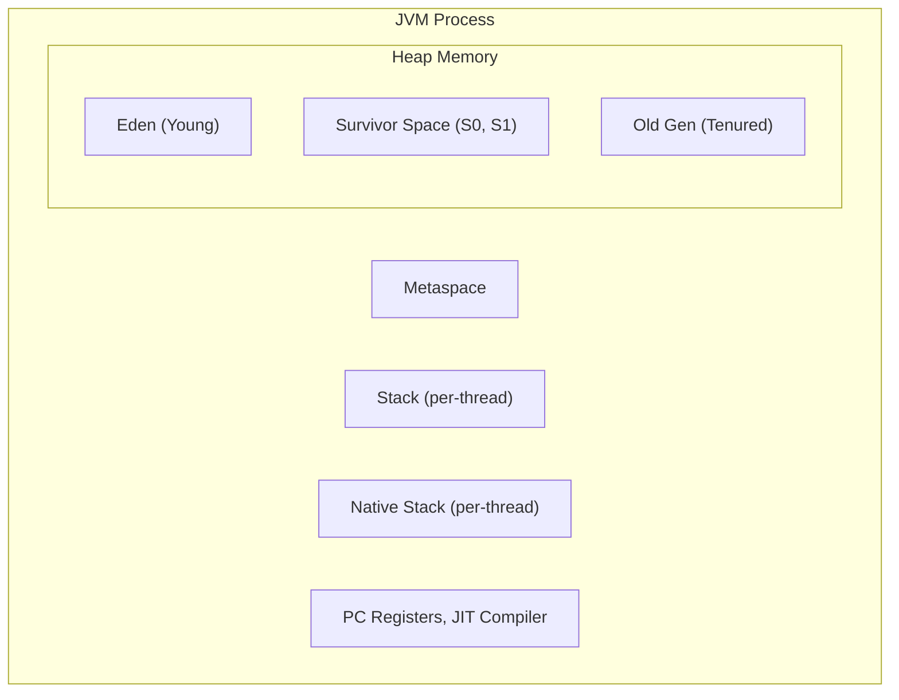
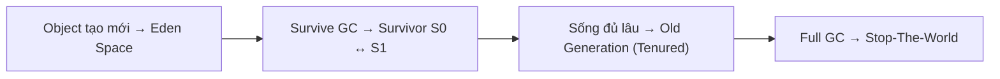
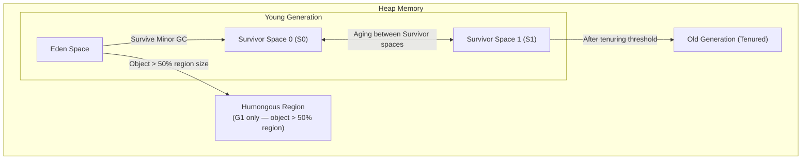
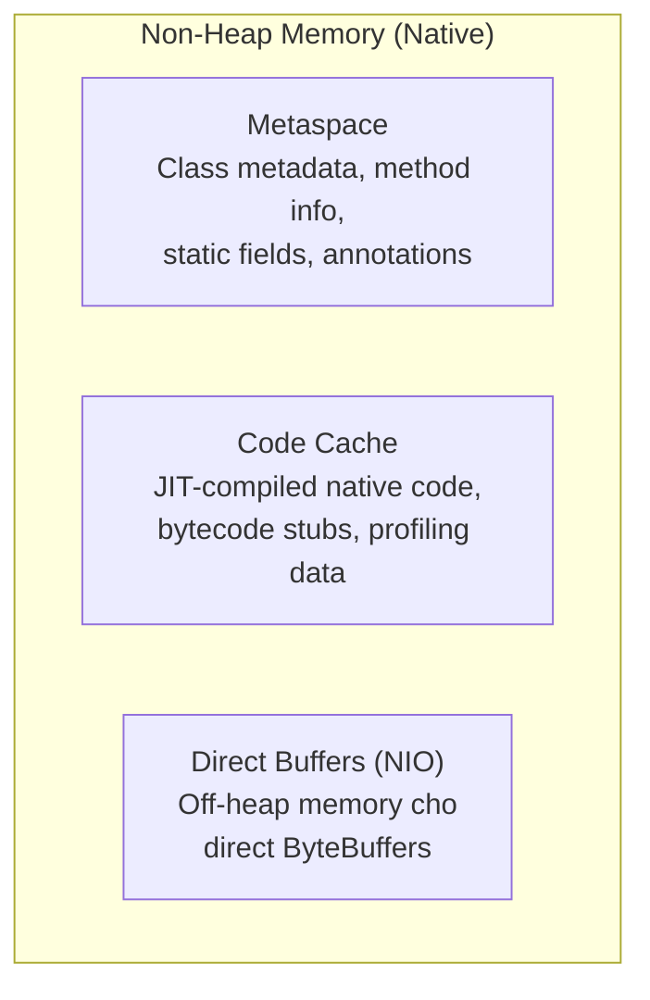
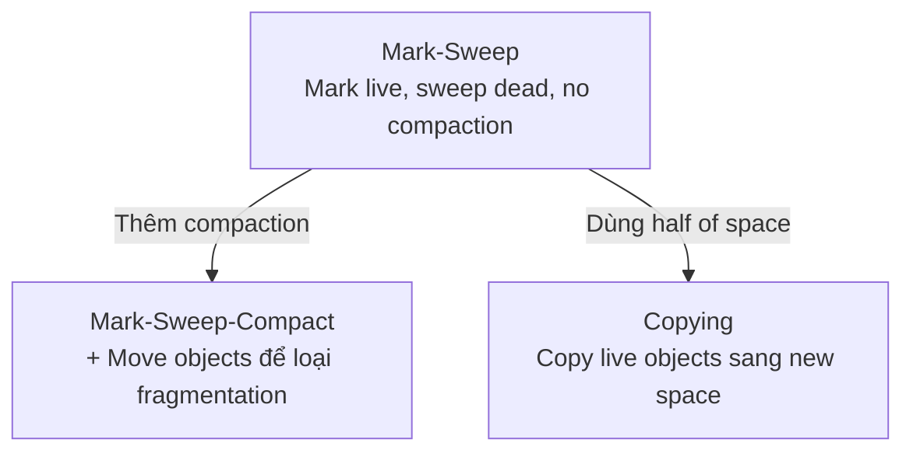
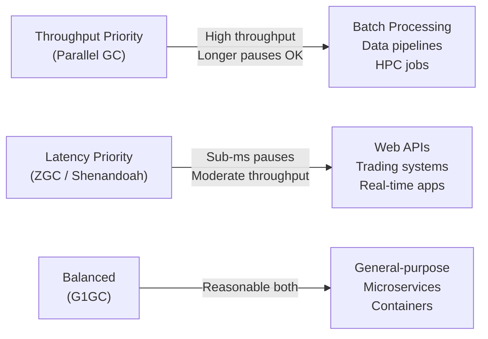

# Java Core — JVM & Garbage Collection

## 1. JVM Architecture



## 2. Memory Regions

### 2.1. So sánh Heap vs Stack vs Metaspace

| Vùng nhớ | Thuộc về | Dùng để | GC | Kích thước | Shared? |
|---|---|---|---|---|---|
| **Heap** | Object instance | Lưu trữ object, array | **Có** | Lớn (GB) | Tất cả threads |
| **Stack** | Thread | Biến local, tham số, call stack | **Không** | Nhỏ (KB) | Mỗi thread |
| **Metaspace** | Class | Class metadata, constants, static | **Không** | Tùy thuộc | Tất cả threads |

### 2.2. Heap Memory

```java
// Heap lưu object instance
public class Person {
    String name; // reference → heap
    int age;     // primitive → không vào heap nếu trong stack
}

Person p = new Person();
// p reference → stack
// new Person() object → heap
```

**Cấu trúc Heap (Generational GC):**

| Vùng | Mô tả | Tần suất GC |
|---|---|---|
| **Young Generation** (Eden + S0 + S1) | Object mới tạo | Thường xuyên |
| **Old Generation** (Tenured) | Object sống lâu, promoted từ Young | Ít thường xuyên |
| **Metaspace** (Java 8+) | Class metadata, thay thế PermGen | Không GC tự động |

### 2.3. Stack Memory

```java
public void methodA() {
    int x = 10;            // x trong stack của thread
    Person p = new Person(); // p reference trong stack, object trong heap
    methodB(p);
}

public void methodB(Person p) { // p param trong stack
    int y = 20;             // y trong stack
    // gọi methodC...
}
```

> **Quy tắc:** Mỗi thread có stack riêng. Khi thread kết thúc, stack bị hủy tự động — không cần GC.

### 2.4. Metaspace (Java 8+)

```java
// Metaspace lưu:
class MyClass {
    static int staticField = 100; // static → metaspace
    static final int CONST = 200;  // final static → metaspace
    String instanceField;          // instance → heap

    void method() { } // method metadata → metaspace
}

// PermGen (Java 7 và trước) vs Metaspace (Java 8+)
| Tiêu chí | PermGen | Metaspace |
|---|---|---|
| Vị trí | JVM heap | Native memory (RAM) |
| Kích thước | Cố định, giới hạn | Tự mở rộng |
| OutOfMemory | PermGen full | Native memory full |
| Config | -XX:PermSize, -XX:MaxPermSize | -XX:MetaspaceSize, -XX:MaxMetaspaceSize |
```

## 3. JVM Flags

| Flag | Mô tả | Ví dụ giá trị |
|---|---|---|
| `-Xms` | Heap ban đầu | `-Xms512m` |
| `-Xmx` | Heap tối đa | `-Xmx2g` |
| `-Xss` | Stack size mỗi thread | `-Xss1m` |
| `-XX:+UseG1GC` | Chọn G1 Garbage Collector | Nên dùng cho app hiện đại |
| `-XX:+UseZGC` | Chọn ZGC | Java 11+, latency cực thấp |
| `-XX:MetaspaceSize` | Metaspace ban đầu | `-XX:MetaspaceSize=256m` |
| `-XX:+PrintGCDetails` | In chi tiết GC logs | Debug performance |

```bash
# Ví dụ: chạy app với 1GB heap, G1GC
java -Xms512m -Xmx1g -XX:+UseG1GC -XX:+PrintGCDetails -jar app.jar
```

## 4. Garbage Collection

### 4.1. Quy trình hoạt động



**Minor GC:** Dọn Young Generation — thường xuyên, nhanh.
**Major GC / Full GC:** Dọn Old Generation — ít thường xuyên, chậm, có thể **Stop-The-World**.

### 4.2. Các thuật toán GC

| Thuật toán | Mô tả | Ưu điểm | Nhược điểm |
|---|---|---|---|
| **Mark-Sweep-Compact** | Đánh dấu, xóa, nén object | Đơn giản | Chậm, fragmentation |
| **Copying** | Copy object còn sống sang vùng khác | Nhanh, không fragmentation | Tốn bộ nhớ gấp đôi |
| **Generational** | Chia theo tuổi object | Hiệu quả cho hầu hết object | Phức tạp |

### 4.3. Các GC Collectors

| Collector | Java Version | Mặc định | Phù hợp | Độ trễ | Throughput |
|---|---|---|---|---|---|
| **Serial GC** | Tất cả | Java < 8 (client) | Single-thread, test | Cao | Thấp |
| **Parallel GC** | Tất cả | Java 8 server | Batch processing | Cao | **Cao** |
| **G1 GC** | 7+ (mặc định từ 9+) | **Java 9+ server** | Web/microservices | Trung bình | Trung bình |
| **ZGC** | 11+ | Không | Heap lớn (TB), latency cực thấp | **Rất thấp** | Cao |
| **Shenandoah** | 12+ | Không | Heap lớn, non-STW GC | **Rất thấp** | Trung bình |

### 4.4. G1 GC (Garbage-First) — Mặc định Java 17+

```java
// G1 chia heap thành regions (khoảng 2048 regions)
// Target: cân bằng throughput và latency
// Thay vì Young/Old cố định, G1 linh hoạt

// Key flags cho G1
// -XX:MaxGCPauseMillis=200  — target pause time
// -XX:G1HeapRegionSize=n    — kích thước region (1, 2, 4, 8, 16, 32MB)
// -XX:InitiatingHeapOccupancyPercent=45 — khi nào bắt đầu GC
```

### 4.5. ZGC — Ultra-low Latency (Java 11+)

```bash
# Enable ZGC
java -XX:+UseZGC -Xmx16g -jar app.jar

// Đặc điểm của ZGC:
// - Pause time < 1ms bất kể heap size
// - Throughput similar to G1
// - Phù hợp heap lớn (hàng trăm GB đến TB)
```

## 5. Object Reachability

Một object bị GC khi **không còn reference** trỏ đến nó.

### 5.1. Các mức reachability

```
Strongly Reachable ← GC Root ← Stack/Metaspace
        ↑
  Softly Reachable (có thể GC khi memory đầy)
        ↑
  Weakly Reachable (sẽ bị GC trong next GC cycle)
        ↑
  Phantom Reachable (đã finalize, đang chờ GC)
        ↑
  Unreachable (sẽ bị GC)
```

### 5.2. GC Roots

```java
// GC Root — điểm bắt đầu để tracing
class GCRootDemo {
    static Object staticObj = new Object(); // GC Root: static field
    Object instanceObj = new Object();      // GC Root: stack local var

    void method() {
        Object local = new Object(); // GC Root: local variable (stack)
        // Khi method kết thúc, local không còn reachable
    }
}
```

**GC Roots bao gồm:**

| GC Root | Mô tả |
|---|---|
| Local variables trong stack | Biến local trong method đang chạy |
| Active Java threads | Thread đang chạy |
| Static fields | Trường `static` của class |
| JNI references | Tham chiếu native code |
| Class objects | Class đang load |

## 6. Memory Issues

### 6.1. OutOfMemoryError

```java
// Heap OutOfMemory — tạo object không ngừng
List<byte[]> list = new ArrayList<>();
while (true) {
    list.add(new byte[1024 * 1024]); // 1MB mỗi lần
}
// Exception: java.lang.OutOfMemoryError: Java heap space
```

```java
// Metaspace OutOfMemory — load class không ngừng
// (thường do frameworks tạo proxy class liên tục)
while (true) {
    Class<?> c = loader.defineClass(
        "generated.Class" + counter++,
        bytecode
    );
}
// Exception: java.lang.OutOfMemoryError: Metaspace
```

### 6.2. StackOverflowError

```java
// Đệ quy vô hạn
public int factorial(int n) {
    return factorial(n) * n; // không có base case
    // StackOverflowError khi recursion quá sâu
}

// Hoặc stack quá nhỏ
// java -Xss128k → giảm stack size, dễ overflow
```

### 6.3. Memory Leak

Object không còn dùng nhưng **vẫn có reference** nên GC không thu hồi.

```java
// Ví dụ: static collection không clean
class Cache {
    static Map<String, Object> cache = new HashMap<>();

    public static void put(String key, Object value) {
        cache.put(key, value); // THÊM mà KHÔNG xóa
        // → cache grow vô hạn → OOM
    }
}

// Giải pháp: dùng WeakHashMap
class CacheFixed {
    // WeakHashMap tự động remove entry khi key không còn reachable
    static Map<String, Object> cache = new WeakHashMap<>();
}

// Hoặc: listener không unregister
class EventManager {
    static List<Listener> listeners = new ArrayList<>();

    public static void addListener(Listener l) {
        listeners.add(l); // THÊM mà KHÔNG xóa
    }
    // → listeners giữ reference → leak
}
```

## 7. Best Practices

| Thực hành | Lý do |
|---|---|
| Tránh tạo object trong loop | Tăng GC pressure |
| Dùng **StringBuilder** thay vì nối String | Tránh tạo nhiều String object trung gian |
| Dùng **Object pooling** cho object tạo thường xuyên | Tái sử dụng, giảm GC |
| Set `-Xmx` phù hợp, không quá nhỏ | Tránh frequent GC hoặc OOM |
| Dùng **G1GC** (mặc định) hoặc **ZGC** (heap lớn) | Tối ưu cho app hiện đại |
| Monitor GC bằng: `-Xlog:gc*` hoặc VisualVM, GC logs | Phát hiện GC issues |
| Tránh **finalizers** | Chậm, không deterministic |
| Dùng **WeakReference/SoftReference** cho cache | Cho phép GC thu hồi khi cần |

---

## 8. Class Loading

### 8.1. Class Loaders (Parent Delegation Model)

| Class Loader | Load gì | Phạm vi |
|-------------|---------|---------|
| **Bootstrap ClassLoader** | Core Java classes (`java.lang`, etc.) | Core của JVM |
| **Extension ClassLoader** | Classes trong `jre/lib/ext` | Thư viện mở rộng |
| **Application ClassLoader** | Classes từ classpath | Code ứng dụng |

### 8.2. Class Loading Process

1. **Loading** — Tìm và load binary representation của class
2. **Linking** — Verify, prepare, resolve
3. **Initialization** — Execute static initializers, assign static fields

---

## 9. JIT Compiler

**Just-In-Time (JIT) Compiler** compile bytecode thường xuyên được sử dụng thành **native machine code** tại runtime để cải thiện hiệu năng.

| Khái niệm | Mô tả |
|-----------|-------|
| **Interpretation** | JVM ban đầu interpret bytecode trực tiếp (chậm) |
| **JIT Compilation** | Hot methods (thường xuyên gọi) được compile thành native code |
| **Tiered Compilation** | Client compiler (C1) cho startup nhanh, Server compiler (C2/Opt) cho hiệu năng cao |
| **Inlining** | JIT thay method calls bằng actual method body (loại bỏ call overhead) |
| **Deoptimization** | JIT revert compiled code nếu assumptions bị vi phạm |

---

## 10. JVM Memory Structure — Heap và Non-Heap

### 10.1. Các vùng Heap Memory

Heap được chia thành các generations để tối ưu GC performance dựa trên lifespan pattern của objects.



| Vùng | Mục đích | Tỷ lệ kích thước (G1 mặc định) |
|------|---------|------------------------------|
| **Eden** | Cấp phát object mới | ~80% của Young Gen |
| **Survivor S0/S1** | Object sống qua Minor GC | ~10% mỗi cái của Young Gen |
| **Old Generation** | Object sống lâu dài | ~60% của total heap |
| **Humongous** (chỉ G1) | Object > 50% kích thước region | Regions đặc biệt |

### 10.2. Các vùng Non-Heap Memory

Non-heap memory nằm ngoài Java heap trong native memory.



| Vùng | Mục đích | Hành vi tăng trưởng |
|------|---------|----------------|
| **Metaspace** | Class metadata, runtime constants, method info, static fields | Tự tăng trưởng (giới hạn bởi native memory) |
| **Code Cache** | JIT-compiled machine code, inline stubs | Cố định theo mặc định |
| **Direct Buffers** | NIO `ByteBuffer.allocateDirect()` memory | Không thuộc Java heap |

### 10.3. Stack Memory (Mỗi Thread)

Mỗi thread có stack riêng:

```java
// Mỗi thread có stack riêng
public class StackDemo {
    public static void main(String[] args) {
        for (int i = 0; i < 3; i++) {
            final int id = i;
            new Thread(() -> {
                recursiveMethod(0); // Mỗi thread có stack riêng
            }, "Thread-" + id).start();
        }
    }

    public static void recursiveMethod(int depth) {
        // Mỗi recursion thêm một stack frame
        // Stack grow cho đến StackOverflowError hoặc base case
        byte[] data = new byte[1024]; // Part of this thread's stack
        recursiveMethod(depth + 1);
    }
}
```

### 10.4. JVM Flags cho các vùng nhớ

```bash
# Heap Size
java -Xms2g -Xmx2g                    # Initial và max heap (bằng nhau tránh resizing)

# Stack Size per Thread
java -Xss1m                           # 1MB stack per thread (default ~1MB)

# Metaspace
java -XX:MetaspaceSize=256m           # Initial metaspace size
java -XX:MaxMetaspaceSize=512m        # Max metaspace (prevent native OOM)

# Young/Old Generation Ratio
java -XX:NewRatio=2                   # Old Gen = 2x Young Gen (i.e., Old = 2/3 heap)
java -XX:NewRatio=1                   # Equal Young và Old

# Survivor Spaces
java -XX:SurvivorRatio=8              # Eden : Survivor = 8 : 1 : 1 (default)
java -XX:SurvivorRatio=4              # Eden : Survivor = 4 : 1 : 1 (faster aging)
```

---

## 11. Chi tiết các thuật toán GC

### 9.1. Tổng quan thuật toán



### 9.2. Serial GC (`-XX:+UseSerialGC`)

- **Single-threaded** — cả minor và full GC chạy trên một thread
- Dùng **Mark-Sweep-Compact** algorithm
- **Stop-the-world** pauses cho tất cả GC types
- **Use case:** Single-CPU, small heaps (< 100MB), containers với CPU limits

```bash
java -XX:+UseSerialGC -Xms256m -Xmx256m -jar app.jar
```

### 9.3. Parallel GC (`-XX:+UseParallelGC`) — Mặc định Java 8

- **Multi-threaded** — dùng tất cả CPU cores
- **Throughput-focused** — maximize throughput
- **Stop-the-world** pauses nhưng ngắn hơn Serial nhờ parallelism
- **Use case:** Batch processing, ETL jobs, CPU-bound batch analytics

```bash
java -XX:+UseParallelGC \
     -XX:MaxGCPauseMillis=500 \      # Target pause time (soft goal)
     -XX:GCTimeRatio=19 \            # 1/(1+19) = 5% time in GC = 95% throughput
     -Xms4g -Xmx4g -jar batch-app.jar
```

### 9.4. CMS GC (`-XX:+UseConcMarkSweepGC`) — Deprecated Java 9, Removed Java 14

- **Concurrent Mark Sweep** — hầu hết các phases chạy concurrently với application
- Aims for **low latency** với short pause times
- Does **not** compact — có thể dẫn đến fragmentation
- **Use case:** Legacy applications. **Deprecated** — dùng G1GC thay thế.

### 9.5. G1GC (`-XX:+UseG1GC`) — Mặc định từ Java 9

**Garbage-First** collector chia heap thành các **regions** có kích thước bằng nhau (~1MB default). Nó ưu tiên các regions với nhiều garbage nhất (garbage-first).

#### Các loại Collection trong G1

| Loại | Trigger | Xảy ra gì | Kiểu Pause |
|------|---------|-------------|------------|
| **Young Collection** | Eden đầy | Copy live objects từ Eden sang Survivor regions | Short STW |
| **Mixed Collection** | Old Gen occupancy vượt threshold | Collects Young + selected Old regions với nhiều garbage | Short STW |
| **Humongous Allocation** | Object > 50% region size | Dedicated humongous regions | — |

#### Tuning G1GC

```bash
java -XX:+UseG1GC \
     -XX:MaxGCPauseMillis=200 \       # Target max pause time (default 200ms)
     -XX:G1HeapRegionSize=4m \         # Region size: 1, 2, 4, 8, 16, 32 MB
     -XX:InitiatingHeapOccupancyPercent=45 \ # Bắt đầu concurrent cycle khi heap đầy 45%
     -XX:G1ReservePercent=10 \         # Reserve 10% cho promotion
     -Xms4g -Xmx4g -jar web-app.jar
```

#### G1GC Tuning Guidelines

| Triệu chứng | Điều chỉnh |
|---------|-----------------|
| **Pause times quá dài** | Giảm `-XX:MaxGCPauseMillis` |
| **Quá nhiều mixed collections** | Tăng `-XX:InitiatingHeapOccupancyPercent` |
| **Vấn đề về Humongous allocation** | Tăng `-XX:G1HeapRegionSize` |
| **Fragmentation** | Tăng heap size hoặc điều chỉnh survivor ratio |
| **Young Gen quá lớn/nhỏ** | Điều chỉnh `-XX:NewRatio` hoặc `-XX:SurvivorRatio` |

### 9.6. ZGC (`-XX:+UseZGC`) — Java 11+, Scalable Low-Latency

ZGC được thiết kế cho **ultra-low latency** applications với very large heaps (lên đến multi-terabytes). Nó đạt pause times dưới **1 millisecond** bất kể heap size.

#### ZGC hoạt động thế nào: Colored Pointers

ZGC dùng **colored pointers** — extra bits trong object references để encode GC state:

```
64-bit reference on ZGC:
┌─────────┬──────────────────────────┬──────────┐
│ Reserved│        Object Address    │  Mark    │
│  (bits) │      (42 bits usable)    │  (bits)  │
└─────────┴──────────────────────────┴──────────┘
                Normal pointer          Colored bits

Mark bits: Finalizable, Remapped, Marked0, Marked1
```

Colored pointers cho phép ZGC track object states **mà không dừng application** — threads có thể access objects trong khi GC chạy.

```bash
# Enable ZGC
java -XX:+UseZGC \
     -XX:MaxGCPauseMillis=1 \        # Target < 1ms pause
     -Xmx16g -Xms16g \
     -jar low-latency-app.jar

# For very large heaps
java -XX:+UseZGC -Xmx512g -jar tb-scale-app.jar
```

| ZGC Phase | Mô tả | Pauses? |
|-----------|-------|---------|
| **Pause Mark Start** | Root marking | **Yes** (sub-ms) |
| **Concurrent Mark** | Trace object graph | No |
| **Pause Mark End** | Mark completion | **Yes** (sub-ms) |
| **Concurrent Relocate** | Move objects, update references | No |
| **Pause Relocate Start** | Root relocate | **Yes** (sub-ms) |

#### ZGC Key Properties

- **No compaction pauses** — objects được move concurrently
- **Scalable** — pause times giữ thấp bất kể heap size
- **Throughput** — hơi thấp hơn G1 (nhiều CPU hơn cho GC)
- **NUMA-aware** — optimized cho NUMA systems

### 9.7. Shenandoah (`-XX:+UseShenandoahGC`) — Java 12+

Giống ZGC về mục tiêu (low-latency) nhưng dùng **thuật toán khác**:

- Dùng **brooks pointer** (extra word per object) thay vì colored pointers
- Thực hiện **concurrent compaction** — move objects trong khi app chạy
- Không scalable bằng ZGC cho multi-TB heaps
- Lựa chọn tốt cho **medium-to-large heaps** nơi G1 quá chậm nhưng ZGC không có sẵn

```bash
java -XX:+UseShenandoahGC \
     -XX:MaxGCPauseMillis=10 \
     -Xmx8g -Xms8g \
     -jar app.jar
```

---

## 12. Chọn Garbage Collector đúng

### 12.1. Ma trận quyết định

| Loại ứng dụng | Khuyến nghị GC | Lý do |
|-----------------|-------------------|-----------|
| **Batch / ETL / Background Jobs** | Parallel GC | Tối đa hóa throughput, pause time có thể chấp nhận được |
| **Web Application / API Server** | G1GC (mặc định) | Cân bằng throughput và latency |
| **Low-latency Trading / Gaming** | ZGC | Yêu cầu pauses dưới millisecond |
| **Medium-scale, latency-sensitive** | Shenandoah | Thay thế ZGC tốt nếu ZGC không có sẵn |
| **Embedded / Small memory** | Serial GC | Single-threaded, overhead tối thiểu |
| **Short-lived CLI tools** | Epsilon GC | Không GC overhead, không reclaim bộ nhớ |

### 12.2. Throughput vs Latency Tradeoff



### 12.3. Heap Size Guidelines

| Kích thước Heap | Lựa chọn GC | Ghi chú |
|-----------|-----------|-------|
| < 256MB | Serial | Overhead tối thiểu |
| 256MB - 4GB | G1GC | Mặc định cho hầu hết các ứng dụng |
| 4GB - 64GB | G1GC hoặc ZGC | G1 nếu latency target ~200ms; ZGC nếu <10ms |
| 64GB - TB | ZGC | G1 pauses trở nên không thể chấp nhận ở scale này |
| TB+ | ZGC | Chỉ ZGC duy trì low latency ở scale này |

> **Warning:** Không bao giờ dùng `-XX:+UseSerialGC` trong production trừ khi có lý do cụ thể. Parallel GC hoặc G1GC luôn outperform nó trên multi-core systems.

---

## 13. Advanced JVM Tuning

### 13.1. JVM Flags cho Production

```bash
# Memory settings
java -Xms4g -Xmx4g \                  # Equal min/max heap
   -Xss1m \                           # Stack size per thread
   -XX:MetaspaceSize=256m \
   -XX:MaxMetaspaceSize=512m \

# GC selection và tuning
   -XX:+UseG1GC \
   -XX:MaxGCPauseMillis=200 \
   -XX:+PrintGCDetails \
   -XX:+PrintGCDateStamps \

# Logging (Java 9+ unified logging)
   -Xlog:gc*:file=gc.log:time:filecount=5,filesize=10M,level=tags \

# OOM handling
   -XX:+HeapDumpOnOutOfMemoryError \
   -XX:HeapDumpPath=/var/log/ \

# Disable explicit GC
   -XX:+DisableExplicitGC \

# Java 17+ security và performance
   -XX:+AlwaysPreTouch \               # Pre-touch memory pages
   -XX:+UseStringDeduplication \      # Deduplicate equal strings (requires G1)
   -jar application.jar
```

### 13.2. Monitoring Tools

| Công cụ | Command | Mục đích |
|------|---------|---------|
| **jstat** | `jstat -gcutil <pid> 1000` | Thống kê GC real-time mỗi 1s |
| **jinfo** | `jinfo -flags <pid>` | Xem JVM flags hiện tại |
| **jmap** | `jmap -heap <pid>` | Tóm tắt heap |
| **jcmd** | `jcmd <pid> VM.flags` | Tất cả JVM flags |
| **VisualVM** | GUI tool | Profiling, heap dumps, phân tích thread |
| **Java Flight Recorder** | `-XX:StartFlightRecording` | Profiling liên tục |

