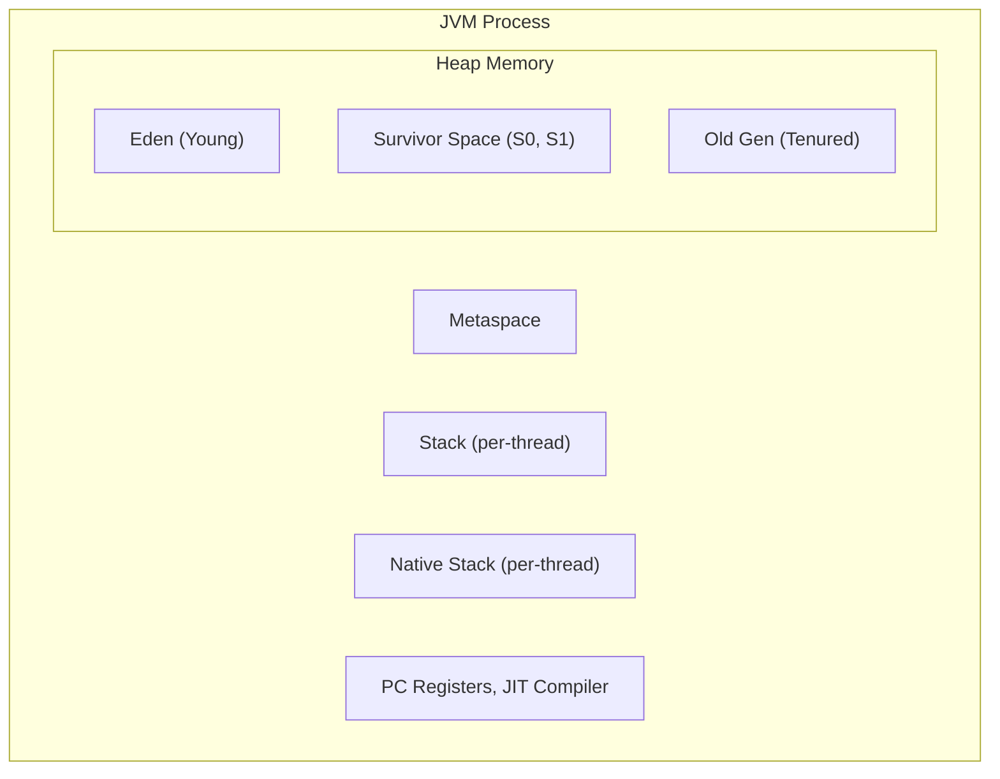
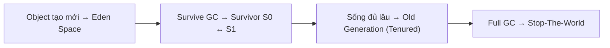

# Java Core — JVM & Garbage Collection

## 1. JVM Architecture



## 2. Memory Regions

### 2.1. So sánh Heap vs Stack vs Metaspace

| Vùng nhớ | Thuộc về | Dùng để | GC | Kích thước | Shared? |
|---|---|---|---|---|---|
| **Heap** | Object instance | Lưu trữ object, array | **Có** | Lớn (GB) | Tất cả threads |
| **Stack** | Thread | Biến local, tham số, call stack | **Không** | Nhỏ (KB) | Mỗi thread |
| **Metaspace** | Class | Class metadata, constants, static | **Không** | Tùy thuộc | Tất cả threads |

### 2.2. Heap Memory

```java
// Heap lưu object instance
public class Person {
    String name; // reference → heap
    int age;     // primitive → không vào heap nếu trong stack
}

Person p = new Person();
// p reference → stack
// new Person() object → heap
```

**Cấu trúc Heap (Generational GC):**

| Vùng | Mô tả | Tần suất GC |
|---|---|---|
| **Young Generation** (Eden + S0 + S1) | Object mới tạo | Thường xuyên |
| **Old Generation** (Tenured) | Object sống lâu, promoted từ Young | Ít thường xuyên |
| **Metaspace** (Java 8+) | Class metadata, thay thế PermGen | Không GC tự động |

### 2.3. Stack Memory

```java
public void methodA() {
    int x = 10;            // x trong stack của thread
    Person p = new Person(); // p reference trong stack, object trong heap
    methodB(p);
}

public void methodB(Person p) { // p param trong stack
    int y = 20;             // y trong stack
    // gọi methodC...
}
```

> **Quy tắc:** Mỗi thread có stack riêng. Khi thread kết thúc, stack bị hủy tự động — không cần GC.

### 2.4. Metaspace (Java 8+)

```java
// Metaspace lưu:
class MyClass {
    static int staticField = 100; // static → metaspace
    static final int CONST = 200;  // final static → metaspace
    String instanceField;          // instance → heap

    void method() { } // method metadata → metaspace
}

// PermGen (Java 7 và trước) vs Metaspace (Java 8+)
| Tiêu chí | PermGen | Metaspace |
|---|---|---|
| Vị trí | JVM heap | Native memory (RAM) |
| Kích thước | Cố định, giới hạn | Tự mở rộng |
| OutOfMemory | PermGen full | Native memory full |
| Config | -XX:PermSize, -XX:MaxPermSize | -XX:MetaspaceSize, -XX:MaxMetaspaceSize |
```

## 3. JVM Flags

| Flag | Mô tả | Ví dụ giá trị |
|---|---|---|
| `-Xms` | Heap ban đầu | `-Xms512m` |
| `-Xmx` | Heap tối đa | `-Xmx2g` |
| `-Xss` | Stack size mỗi thread | `-Xss1m` |
| `-XX:+UseG1GC` | Chọn G1 Garbage Collector | Nên dùng cho app hiện đại |
| `-XX:+UseZGC` | Chọn ZGC | Java 11+, latency cực thấp |
| `-XX:MetaspaceSize` | Metaspace ban đầu | `-XX:MetaspaceSize=256m` |
| `-XX:+PrintGCDetails` | In chi tiết GC logs | Debug performance |

```bash
# Ví dụ: chạy app với 1GB heap, G1GC
java -Xms512m -Xmx1g -XX:+UseG1GC -XX:+PrintGCDetails -jar app.jar
```

## 4. Garbage Collection

### 4.1. Quy trình hoạt động



**Minor GC:** Dọn Young Generation — thường xuyên, nhanh.
**Major GC / Full GC:** Dọn Old Generation — ít thường xuyên, chậm, có thể **Stop-The-World**.

### 4.2. Các thuật toán GC

| Thuật toán | Mô tả | Ưu điểm | Nhược điểm |
|---|---|---|---|
| **Mark-Sweep-Compact** | Đánh dấu, xóa, nén object | Đơn giản | Chậm, fragmentation |
| **Copying** | Copy object còn sống sang vùng khác | Nhanh, không fragmentation | Tốn bộ nhớ gấp đôi |
| **Generational** | Chia theo tuổi object | Hiệu quả cho hầu hết object | Phức tạp |

### 4.3. Các GC Collectors

| Collector | Java Version | Mặc định | Phù hợp | Latency | Throughput |
|---|---|---|---|---|---|
| **Serial GC** | Tất cả | Java < 8 (client) | Single-thread, test | Cao | Thấp |
| **Parallel GC** | Tất cả | Java 8 server | Batch processing | Cao | **Cao** |
| **G1 GC** | 7+ (mặc định từ 9+) | **Java 9+ server** | Web/microservices | Trung bình | Trung bình |
| **ZGC** | 11+ | Không | Heap lớn (TB), latency cực thấp | **Rất thấp** | Cao |
| **Shenandoah** | 12+ | Không | Heap lớn, non-STW GC | **Rất thấp** | Trung bình |

### 4.4. G1 GC (Garbage-First) — Mặc định Java 17+

```java
// G1 chia heap thành regions (khoảng 2048 regions)
// Target: cân bằng throughput và latency
// Thay vì Young/Old cố định, G1 linh hoạt

// Key flags cho G1
// -XX:MaxGCPauseMillis=200  — target pause time
// -XX:G1HeapRegionSize=n    — kích thước region (1, 2, 4, 8, 16, 32MB)
// -XX:InitiatingHeapOccupancyPercent=45 — khi nào bắt đầu GC
```

### 4.5. ZGC — Ultra-low Latency (Java 11+)

```bash
# Enable ZGC
java -XX:+UseZGC -Xmx16g -jar app.jar

// ZGC特点:
// - Pause time < 1ms bất kể heap size
// - Throughput similar to G1
// - Phù hợp heap lớn (hàng trăm GB đến TB)
```

## 5. Object Reachability

Một object bị GC khi **không còn reference** trỏ đến nó.

### 5.1. Các mức reachability

```
Strongly Reachable ← GC Root ← Stack/Metaspace
        ↑
  Softly Reachable (có thể GC khi memory đầy)
        ↑
  Weakly Reachable (sẽ bị GC trong next GC cycle)
        ↑
  Phantom Reachable (đã finalize, đang chờ GC)
        ↑
  Unreachable (sẽ bị GC)
```

### 5.2. GC Roots

```java
// GC Root — điểm bắt đầu để tracing
class GCRootDemo {
    static Object staticObj = new Object(); // GC Root: static field
    Object instanceObj = new Object();      // GC Root: stack local var

    void method() {
        Object local = new Object(); // GC Root: local variable (stack)
        // Khi method kết thúc, local không còn reachable
    }
}
```

**GC Roots bao gồm:**

| GC Root | Mô tả |
|---|---|
| Local variables trong stack | Biến local trong method đang chạy |
| Active Java threads | Thread đang chạy |
| Static fields | Trường `static` của class |
| JNI references | Tham chiếu native code |
| Class objects | Class đang load |

## 6. Memory Issues

### 6.1. OutOfMemoryError

```java
// Heap OutOfMemory — tạo object không ngừng
List<byte[]> list = new ArrayList<>();
while (true) {
    list.add(new byte[1024 * 1024]); // 1MB mỗi lần
}
// Exception: java.lang.OutOfMemoryError: Java heap space
```

```java
// Metaspace OutOfMemory — load class không ngừng
// (thường do frameworks tạo proxy class liên tục)
while (true) {
    Class<?> c = loader.defineClass(
        "generated.Class" + counter++,
        bytecode
    );
}
// Exception: java.lang.OutOfMemoryError: Metaspace
```

### 6.2. StackOverflowError

```java
// Đệ quy vô hạn
public int factorial(int n) {
    return factorial(n) * n; // không có base case
    // StackOverflowError khi recursion quá sâu
}

// Hoặc stack quá nhỏ
// java -Xss128k → giảm stack size, dễ overflow
```

### 6.3. Memory Leak

Object không còn dùng nhưng **vẫn có reference** nên GC không thu hồi.

```java
// Ví dụ: static collection không clean
class Cache {
    static Map<String, Object> cache = new HashMap<>();

    public static void put(String key, Object value) {
        cache.put(key, value); // THÊM mà KHÔNG xóa
        // → cache grow vô hạn → OOM
    }
}

// Giải pháp: dùng WeakHashMap
class CacheFixed {
    // WeakHashMap tự động remove entry khi key không còn reachable
    static Map<String, Object> cache = new WeakHashMap<>();
}

// Hoặc: listener không unregister
class EventManager {
    static List<Listener> listeners = new ArrayList<>();

    public static void addListener(Listener l) {
        listeners.add(l); // THÊM mà KHÔNG xóa
    }
    // → listeners giữ reference → leak
}
```

## 7. Best Practices

| Thực hành | Lý do |
|---|---|
| Tránh tạo object trong loop | Tăng GC pressure |
| Dùng **StringBuilder** thay vì nối String | Tránh tạo nhiều String object trung gian |
| Dùng **Object pooling** cho object tạo thường xuyên | Tái sử dụng, giảm GC |
| Set `-Xmx` phù hợp, không quá nhỏ | Tránh frequent GC hoặc OOM |
| Dùng **G1GC** (mặc định) hoặc **ZGC** (heap lớn) | Tối ưu cho app hiện đại |
| Monitor GC bằng: `-Xlog:gc*` hoặc VisualVM, GC logs | Phát hiện GC issues |
| Tránh **finalizers** | Chậm, không deterministic |
| Dùng **WeakReference/SoftReference** cho cache | Cho phép GC thu hồi khi cần |
