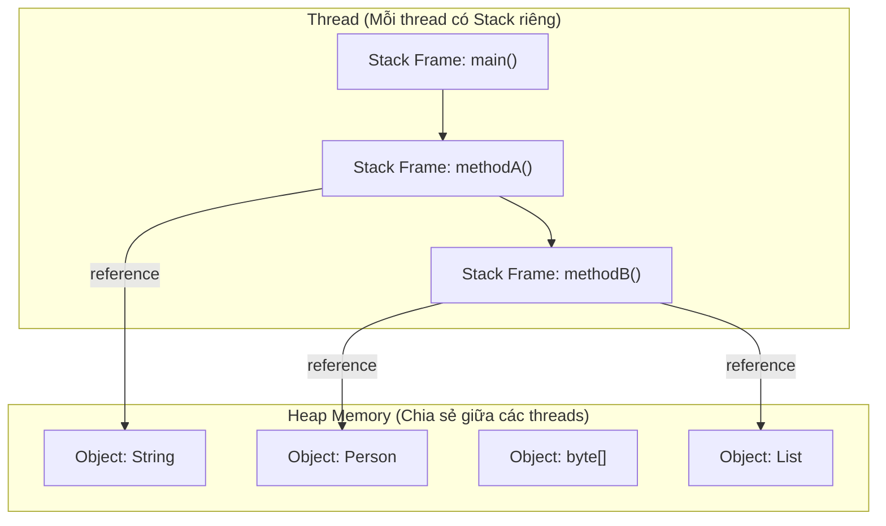
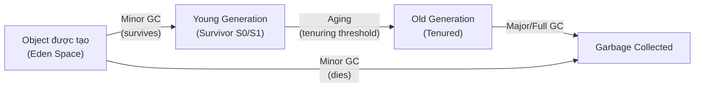

# Java Core — Quản lý Bộ nhớ

## 1. Stack vs Heap

Stack và Heap là hai vùng nhớ chính trong JVM, phục vụ các mục đích khác nhau.

### 1.1. So sánh Stack vs Heap

| Tiêu chí | Stack | Heap |
|----------|-------|------|
| **Mục đích** | Thực thi method, biến local | Cấp phát object |
| **Dữ liệu lưu trữ** | Primitives, tham chiếu object | Object instance, array |
| **Truy cập** | LIFO (Last In First Out) | Truy cập ngẫu nhiên |
| **Kích thước** | Cố định, nhỏ (thường 1MB/thread) | Lớn, động |
| **Thời gian sống** | Theo method (tự động) | Đến khi GC thu hồi |
| **Chia sẻ** | Mỗi thread riêng | Tất cả threads chia sẻ |
| **Quản lý** | Tự động (push/pop) | Garbage Collection |
| **Tốc độ** | Nhanh (push/pop trực tiếp) | Chậm hơn (cấp phát + GC overhead) |
| **Overflow** | `StackOverflowError` | `OutOfMemoryError` |

### 1.2. Sơ đồ trực quan



### 1.3. Ví dụ phân bổ bộ nhớ

```java
public class MemoryAllocation {
    // Static field → stored in Metaspace
    private static String STATIC_NAME = "Static Data";

    // Instance field → stored on Heap
    private String instanceName;

    public void process() {
        // Primitive: lưu trực tiếp trên Stack
        int x = 10;

        // Reference variable: reference trên Stack, object trên Heap
        String str = new String("Hello");

        // Local variable (reference): trên Stack, trỏ đến Heap object
        Person p = new Person("Alice", 25);

        // Array: reference trên Stack, array thực trên Heap
        int[] numbers = {1, 2, 3, 4, 5};

        // Gọi method lồng nhau
        nestedMethod(p, numbers);
        // Khi process() kết thúc: x, str, p, numbers đều pop khỏi stack
        // Object trên Heap trở nên eligible for GC
    }

    private void nestedMethod(Person p, int[] numbers) {
        // p và numbers là parameters trên Stack
        // Chúng trỏ đến cùng Heap objects
        int sum = 0;
        for (int n : numbers) {
            sum += n;
        }
    }
}
```

---

## 2. Object Allocation và GC Roots

### 2.1. Cách Object Được Cấp Phát

Khi tạo object bằng `new`, JVM thực hiện:
1. Kiểm tra không gian trong Eden space của Young Generation
2. Cấp phát bộ nhớ (dùng bump-the-pointer để nhanh)
3. Khởi tạo object (zero out bộ nhớ)
4. Gọi constructor

### 2.2. GC Roots (Điều gì giữ Object sống)

Object **reachable** nếu có thể truy cập từ một GC Root. Chỉ object reachable mới sống sót qua GC.

| GC Root Type | Mô tả | Ví dụ |
|-------------|-------|--------|
| **Stack Reference** | Biến local trong method đang chạy | Parameters, biến local |
| **Static Fields** | Biến class-level đánh dấu `static` | `private static Cache cache` |
| **JNI References** | Tham chiếu từ native code | Objects truyền vào native methods |
| **Thread Object** | Thread đang active | Thread chưa terminate |
| **Class Object** | Class objects của class đang load | Class metadata |
| **Monitor Objects** | Objects dùng cho synchronization | Objects trong `synchronized` blocks |

### 2.3. Vòng đời Object



---

## 3. Các Loại Reference trong Java

Java cung cấp bốn loại reference, từ mạnh đến yếu. Hiểu chúng là chìa khóa để xây dựng cache và quản lý bộ nhớ linh hoạt.

### 3.1. Bảng so sánh

| Loại Reference | Khi nào bị GC | Use Case |
|---------------|---------------|----------|
| **Strong Reference** | Không bao giờ (trừ khi unreachable) | Object reference thông thường |
| **Soft Reference** | Khi memory thấp | Memory-sensitive cache |
| **Weak Reference** | Trong next GC cycle | Canonicalized mappings, listeners |
| **Phantom Reference** | Không bao giờ tự động (enqueue sau finalize) | Post-mortem cleanup |

### 3.2. Strong Reference

Loại reference mặc định. Object không bao giờ bị GC miễn là còn reachable.

```java
Object obj = new Object(); // Strong reference
obj = null;                 // Object eligible for GC
```

### 3.3. Soft Reference

Object bị GC khi JVM low memory. Phù hợp cho memory-sensitive caches.

```java
import java.lang.ref.SoftReference;

public class SoftCache<K, V> {
    private final Map<K, SoftReference<V>> cache = new HashMap<>();

    public V get(K key) {
        SoftReference<V> ref = cache.get(key);
        return ref != null ? ref.get() : null;
    }

    public void put(K key, V value) {
        cache.put(key, new SoftReference<>(value));
    }
}
```

> **Tip:** `SoftReference` là lựa chọn lý tưởng cho cache nhạy cảm với bộ nhớ. Khi memory pressure tăng, GC sẽ xóa các references này, ngăn `OutOfMemoryError`.

### 3.4. Weak Reference

Object bị GC trong next GC cycle bất kể memory conditions. Dùng cho `WeakHashMap` và ngăn memory leaks.

```java
import java.lang.ref.WeakReference;

WeakReference<String> weakRef = new WeakReference<>("Hello");
System.out.println(weakRef.get()); // "Hello"

// Sau khi GC chạy, weakRef.get() trả về null
System.gc();
System.out.println(weakRef.get()); // null
```

**Use case phổ biến: `ThreadLocal` với thread pools**

```java
// ThreadLocal không remove đúng cách gây memory leak
class BadExample {
    ThreadLocal<Connection> threadLocal = new ThreadLocal<>();

    public void process() {
        threadLocal.set(getConnection());
        // Nếu thread được trả về pool mà không remove():
        // Connection object bị leak vì ThreadLocal giữ reference
    }
}

// Fix: luôn luôn remove
threadLocal.remove(); // Quan trọng khi thread được reuse trong pool
```

### 3.5. Phantom Reference

Reference yếu nhất. Dùng cho post-mortem cleanup — biết khi nào object đã finalize và sắp bị collect.

```java
import java.lang.ref.PhantomReference;
import java.lang.ref.ReferenceQueue;

ReferenceQueue<Object> queue = new ReferenceQueue<>();
PhantomReference<Object> phantomRef = new PhantomReference<>(obj, queue);

// phantomRef.get() LUÔN trả về null
// Dùng queue để phát hiện object đã được collect
Object polled = queue.remove(); // Blocks cho đến khi reference được enqueue
// Thực hiện cleanup tasks ở đây
```

> **Note:** Không giống `WeakReference`, bạn không thể lấy lại object từ `PhantomReference`. Mục đích duy nhất là thông báo rằng object đã được finalize và sẵn sàng bị collect.

---

## 4. Memory Leaks trong Java

Khác với C/C++, Java có automatic garbage collection. Tuy nhiên, memory leaks vẫn có thể xảy ra khi objects được retain vô tình.

### 4.1. Nguyên nhân phổ biến của Memory Leaks

| Nguyên nhân | Mô tả | Ví dụ |
|------------|-------|--------|
| **Static collections** | Collections phát triển vô hạn | `static Map<K,V> cache` không eviction |
| **ThreadLocal without remove** | Bị retain khi thread pool reuse | Connection objects trong thread pools |
| **Unclosed resources** | Streams, connections, file handles | `BufferedReader` không close |
| **Listener/Observer không unregister** | Event listeners không detach | Observer pattern không cleanup |
| **Internal class references** | Non-static inner class giữ outer reference | Anonymous inner Runnable |
| **equals/hashCode sai** | Objects trong HashMap/HashSet không tìm thấy | Class với keys thay đổi |

### 4.2. ThreadLocal Memory Leak

Đây là một trong những leaks phổ biến và nguy hiểm nhất trong Java enterprise:

```java
// Vấn đề: ThreadLocal trong môi trường thread pool
public class UserContextFilter {
    private static final ThreadLocal<User> currentUser = new ThreadLocal<>();

    public void doFilter(...) {
        try {
            currentUser.set(authenticate(request));
            chain.doFilter(request, response);
        } finally {
            // QUAN TRỌNG: Phải remove, không thì User object leak
            currentUser.remove();
        }
    }
}

// Kịch bản leak:
// 1. Thread T1 từ pool set User object trong ThreadLocal
// 2. Request hoàn thành nhưng remove() không được gọi
// 3. Thread T1 được trả về pool
// 4. Thread T1 sẽ được reuse cho user khác (hoặc idle giữ User)
// 5. User object và tất cả objects nó tham chiếu bị leak

// Nguy hiểm hơn: nếu User giữ Database Connection
// Connection bị leak về pool, gây pool exhaustion
```

### 4.3. Static Collection Leak

```java
// Leak kinh điển: unbounded cache
public class ImageLoader {
    private static final Map<String, BufferedImage> cache = new HashMap<>();

    public static BufferedImage loadImage(String path) {
        return cache.computeIfAbsent(path, p -> {
            try {
                return ImageIO.read(new File(p));
            } catch (IOException e) {
                return null;
            }
        });
    }
    // cache grow mãi → eventually OOM
}

// Giải pháp 1: WeakHashMap (GC thu hồi khi keys không còn reachable)
private static final Map<String, SoftReference<BufferedImage>> cache =
    new WeakHashMap<>();

// Giải pháp 2: Size-bounded cache với eviction
private static final Cache<String, BufferedImage> cache =
    CacheBuilder.newBuilder()
        .maximumSize(1000)
        .expireAfterAccess(30, TimeUnit.MINUTES)
        .build();

// Giải pháp 3: Caffeine (cache high-performance)
private static final Cache<String, BufferedImage> cache = Caffeine.newBuilder()
    .maximumSize(10_000)
    .expireAfterWrite(10, TimeUnit.MINUTES)
    .build();
```

### 4.4. Unclosed Resources

```java
// Leak: Stream không bao giờ được close
public List<String> readLines(String path) throws IOException {
    BufferedReader reader = new BufferedReader(new FileReader(path));
    List<String> lines = new ArrayList<>();
    String line;
    while ((line = reader.readLine()) != null) {
        lines.add(line);
    }
    // reader không bao giờ close — file handle leak
    // Đặc biệt problematic nếu method được gọi thường xuyên
}

// Fix: try-with-resources (Java 7+)
public List<String> readLines(String path) throws IOException {
    try (BufferedReader reader = new BufferedReader(new FileReader(path))) {
        return reader.lines().toList();
    }
    // Tự động close, kể cả khi có exception
}
```

### 4.5. Phát hiện Memory Leaks

| Tool | Mô tả |
|------|-------|
| **VisualVM** | Profiler tích hợp, heap dump analysis |
| **Eclipse MAT** | Heap dump analyzer, leak suspects report |
| **YourKit** | Commercial profiler với leak detection |
| **async-profiler** | CPU/memory profiler low-overhead |
| **Java Flight Recorder (JFR)** | JDK monitoring tích hợp |
| **jmap + jhat** | Heap dump và analysis |
| **GC logs** | Monitor heap growth theo thời gian |

```bash
# Tạo heap dump khi OOM
java -XX:+HeapDumpOnOutOfMemoryError -XX:HeapDumpPath=/var/log/ app.jar

# Phân tích với jmap
jmap -histo:live <pid>        # Live object histogram
jmap -dump:format=b,file=heap.bin <pid>  # Full heap dump

# Enable GC logging (Java 9+)
java -Xlog:gc*:file=gc.log:time:filecount=5,filesize=10M -jar app.jar
```

---

## 5. Escape Analysis và Stack Allocation

JIT compiler thực hiện **Escape Analysis** tại runtime để xác định xem object lifetime có giới hạn trong một thread hay không. Nếu có, nó có thể cấp phát object trên stack thay vì heap.

### 5.1. Cách hoạt động

```java
public void process() {
    // Không có escape analysis: Point cấp phát trên Heap
    // Có escape analysis: Point có thể cấp phát trên Stack
    Point p = new Point(x, y);

    // Nếu p chỉ dùng trong method này và không escape,
    // JIT có thể cấp phát nó trên stack
    double distance = Math.sqrt(p.x * p.x + p.y * p.y);
    // Khi process() return, p được tự động giải phóng (không cần GC)
}
```

### 5.2. Trạng thái Escape

| Trạng thái | Mô tả | Cấp phát |
|-----------|-------|----------|
| **NoEscape** | Object ở trong method | Stack (scalar replaced) |
| **ArgEscape** | Truyền như argument nhưng không escape | Heap (nhưng optimized) |
| **GlobalEscape** | Escape sang thread khác hoặc lưu globally | Heap |

### 5.3. Lợi ích

- **Zero allocation cost** — không có overhead cấp phát heap
- **No GC pressure** — không có object để collect
- **Better cache locality** — stack memory cache-friendly hơn
- **Faster deallocation** — tự động qua stack pop

> **Note:** Stack allocation là optimization, không guaranteed. Bật với `-XX:+DoEscapeAnalysis` (mặc định trong Java 8+). Dùng `-XX:+PrintEscapeAnalysis` để xem JIT decisions.

---

## 6. Metaspace vs Heap

### 6.1. Sự khác biệt chính

| Tiêu chí | Metaspace | Heap |
|---------|-----------|------|
| **Vị trí** | Native memory (off-heap) | JVM-managed heap |
| **Mục đích** | Class metadata, method info | Object instances |
| **Kích thước** | Mở rộng động theo mặc định | Cố định qua `-Xms`/`-Xmx` |
| **GC** | Không được GC (phần lớn) | Hoàn toàn được GC |
| **OOM error** | `OutOfMemoryError: Metaspace` | `OutOfMemoryError: Java heap space` |
| **Tuning flags** | `-XX:MetaspaceSize`, `-XX:MaxMetaspaceSize` | `-Xms`, `-Xmx` |
| **Nguồn bộ nhớ** | Native OS memory | JVM-controlled heap từ RAM |

### 6.2. Lưu trữ gì trong Metaspace

```
Metaspace
  ├── Class Metadata (class name, modifiers, field info, method info)
  ├── Runtime Constant Pool (string constants, symbolic references)
  ├── Method Data (bytecode, JIT-compiled code)
  ├── Static Fields (static variables — objects vẫn trên Heap)
  ├── Annotations
  └── Code Cache (JIT-compiled native code)
```

### 6.3. Các vấn đề Metaspace phổ biến

```java
// Classloader leak — thường trong app servers
// Mỗi classloader giữ references đến tất cả loaded classes
// Nếu classloader cũ không được GC:
while (true) {
    URLClassLoader loader = new URLClassLoader(urls);
    Class<?> c = loader.loadClass("com.app.DynamicClass");
    // classes được tạo nhưng classloader reference được giữ → metaspace grow
}
// Trong production: thường do frameworks (Spring, Hibernate)
// tạo proxy classes động

// Fix: đảm bảo classloaders được dereference đúng cách
// Dùng -XX:MetaspaceSize và -XX:MaxMetaspaceSize để giới hạn
// Monitor với: -XX:+PrintMetaspaceInParallel
```

### 6.4. Static Fields — Chúng ở đâu?

```java
class Example {
    static int counter = 0;           // Metadata trong Metaspace
    static String name = "Test";       // Reference trong Metaspace, String object trên Heap
    static final int MAX = 100;        // Compile-time constant → trong Metaspace
    static final String CONST = "Hi";  // Interned string → trong Metaspace
    static final Integer WRAPPED = 5; // Object reference trong Metaspace, Integer object trên Heap
}
```

---

## 7. Best Practices

| Thực hành | Lý do |
|----------|--------|
| Dùng `WeakHashMap` cho caches | Ngăn memory leaks trong caches |
| Luôn gọi `ThreadLocal.remove()` trong thread pool environments | Ngăn ThreadLocal leaks |
| Dùng `try-with-resources` cho tất cả closable resources | Ngăn stream/connection leaks |
| Tránh lưu large objects trong `ThreadLocal` | Có thể gây memory growth bất ngờ |
| Ưu tiên immutable objects | Dễ reason hơn, ít synchronization cần thiết |
| Dùng `SoftReference` cho memory-sensitive caches | Tự động evict khi memory thấp |
| Set `-Xms` và `-Xmx` bằng nhau | Loại bỏ heap resizing overhead |
| Monitor Metaspace với `-XX:MetaspaceSize` | Ngăn metaspace-driven GC |
| Dùng `jstat -gc` để monitor heap và GC activity | Visibility real-time memory usage |
