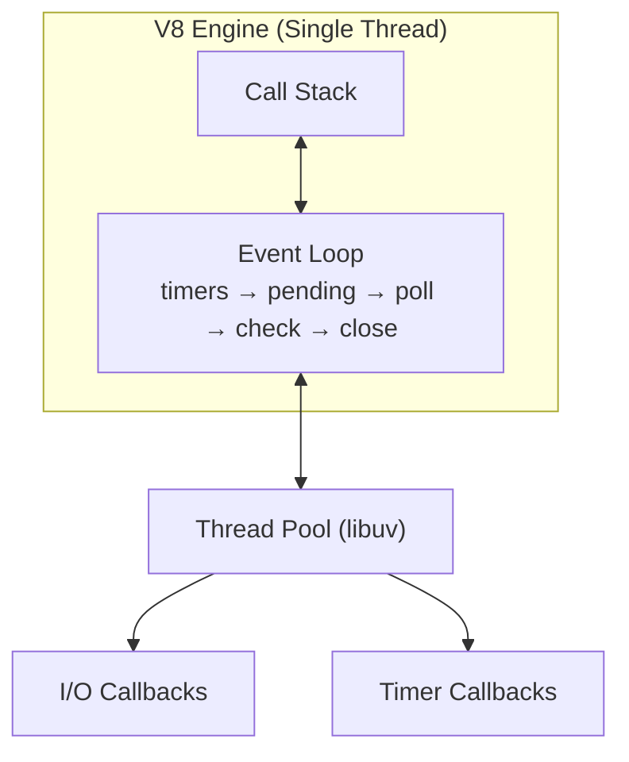
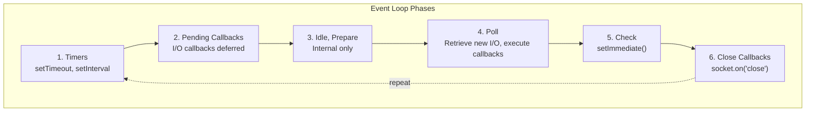

# Chủ đề Node.js Event Loop

## 1. Tổng quan

### 1.1. Node.js là gì?

Node.js là runtime JavaScript được xây dựng trên **V8 JavaScript Engine** (của Chrome), cho phép chạy JavaScript ở phía server. Node.js nổi tiếng với mô hình **non-blocking, event-driven I/O**, phù hợp cho các ứng dụng I/O-intensive.

### 1.2. Single-Threaded Event Loop

Node.js chạy trên một single thread (main thread), nhưng xử lý concurrency thông qua **event loop** và **non-blocking I/O operations**.



### 1.3. Non-blocking I/O

```javascript
// Blocking (đồng bộ) - chặn thread cho đến khi hoàn thành
const data = fs.readFileSync('/path/to/file'); // Block
console.log(data);

// Non-blocking (bất đồng bộ) - không chặn thread
fs.readFile('/path/to/file', (err, data) => {
  if (err) throw err;
  console.log(data);
});
console.log('This runs immediately!'); // Chạy trước khi file được đọc xong
```

---

## 2. Event Loop Phases

Event loop trong Node.js có 6 phases chính, mỗi phase xử lý một loại callbacks khác nhau:



### 2.1. Phase 1: Timers

Phase này thực thi callbacks đã được đăng ký bởi `setTimeout()` và `setInterval()`.

```javascript
// setTimeout callback
setTimeout(() => {
  console.log('setTimeout callback executed');
}, 1000);

// setInterval callback
const intervalId = setInterval(() => {
  console.log('Every 1 second');
}, 1000);

// Hủy interval sau 5 giây
setTimeout(() => {
  clearInterval(intervalId);
  console.log('Interval stopped');
}, 5000);
```

**Thứ tự thực thi trong Timers phase:**
- Callbacks được sắp xếp theo thứ tự thời gian (expiration time).
- Nếu nhiều callbacks có cùng expiration, được thực thi theo FIFO.

### 2.2. Phase 2: Pending Callbacks

Thực thi các I/O callbacks đã bị defer (hoãn lại) từ previous loop iteration. Thường là các errors hoặc callbacks đã được đặt trong hàng đợi nhưng không thể gọi ngay.

```javascript
// Các callbacks này thường là:
// - TCP errors (ECONNREFUSED, etc.)
// - UDP sockets
// - Các operation không thể gọi trong poll phase
```

### 2.3. Phase 3: Idle, Prepare

Chỉ dùng nội bộ bởi libuv. Không có callbacks user-space ở phase này.

### 2.4. Phase 4: Poll

Phase quan trọng nhất, nơi:
- **Retrieve new I/O events**: Kiểm tra và nhận các I/O events mới.
- **Execute callbacks** cho hầu hết các loại I/O (file, network, etc.).

```javascript
// Poll phase xử lý:
// - fs.readFile callbacks
// - HTTP request handlers
// - Database queries
// - Stream operations

fs.readFile('/path/to/file', (err, data) => {
  // Callback này được thực thi trong Poll phase
  console.log(data);
});

http.createServer((req, res) => {
  // Handler này được gọi khi có request (I/O event)
  res.end('Hello');
}).listen(3000);
```

**Poll phase behavior:**

```javascript
// Nếu poll queue KHÔNG trống:
// Thực thi tất cả callbacks trong queue cho đến khi queue empty hoặc đạt system limit

// Nếu poll queue TRỐNG:
// - Nếu có setImmediate() callbacks -> chuyển sang Check phase
// - Nếu KHÔNG có -> đợi callbacks mới được thêm vào
```

### 2.5. Phase 5: Check

Phase đặc biệt cho `setImmediate()` callbacks.

```javascript
// setImmediate() - thực thi ngay sau poll phase
setImmediate(() => {
  console.log('Immediate callback');
});

fs.readFile('/path/to/file', () => {
  // File read xong -> Poll phase
  setImmediate(() => {
    console.log('Immediate inside file callback');
  });
});
```

### 2.6. Phase 6: Close Callbacks

Thực thi các callbacks của các resource đã được close (đóng).

```javascript
const net = require('net');
const server = net.createServer(() => {});

server.on('close', () => {
  console.log('Server closed');
});

server.close();
```

---

## 3. setImmediate vs setTimeout

### 3.1. Sự khác biệt

| Function | Thực thi ở phase | Độ chính xác | Use case |
|---|---|---|---|
| `setTimeout(fn, 0)` | Timers phase | ~1ms minimum | Defer execution đến next tick |
| `setImmediate(fn)` | Check phase | Ngay sau poll | Execute sau I/O callbacks |

### 3.2. Thứ tự thực thi

```javascript
// Case 1: Trong I/O cycle
fs.readFile('/path', (err, data) => {
  console.log('1. readFile callback');

  setTimeout(() => {
    console.log('2. setTimeout inside I/O');
  }, 0);

  setImmediate(() => {
    console.log('3. setImmediate inside I/O');
  });
});

// Output:
// 1. readFile callback
// 3. setImmediate inside I/O  (Check phase - trước)
// 2. setTimeout inside I/O     (Timers phase - sau)

// Lý do: setImmediate() được thực thi ngay sau poll phase
//        setTimeout(0) phải đợi đến next event loop iteration
```

```javascript
// Case 2: Không có I/O - không có guarantee thứ tự
setTimeout(() => console.log('setTimeout'), 0);
setImmediate(() => console.log('setImmediate'));

// Output có thể:
// setTimeout -> setImmediate
// Hoặc:
// setImmediate -> setTimeout
// Thứ tự không deterministic!
```

```javascript
// Case 3: Multiple timers
setTimeout(() => console.log('timeout1'), 0);
setTimeout(() => console.log('timeout2'), 0);
setImmediate(() => console.log('immediate1'));
setImmediate(() => console.log('immediate2'));

// Thứ tự thực thi:
// - timers callbacks theo FIFO
// - check callbacks theo FIFO
// Output:
// timeout1
// timeout2
// immediate1
// immediate2
```

---

## 4. process.nextTick()

### 4.1. nextTick Queue

`process.nextTick()` không thuộc về event loop phases. Nó đẩy callbacks vào một queue riêng, được xử lý **sau mỗi operation** hiện tại, **trước khi** event loop tiếp tục.

```
Operation completed
       │
       ▼
┌──────────────────────────┐
│   nextTick Queue          │
│   (microtask - highest    │
│    priority)              │
└──────────────┬─────────────┘
               │ Processed after current operation
               ▼
       Event Loop Continues
```

```javascript
console.log('1. Start');

process.nextTick(() => {
  console.log('3. nextTick callback');
});

console.log('2. End');

// Output:
// 1. Start
// 2. End
// 3. nextTick callback
```

### 4.2. So sánh nextTick vs setImmediate

| | `process.nextTick()` | `setImmediate()` |
|---|---|---|
| **Queue** | nextTick queue (microtask) | Check phase queue |
| **Priority** | Cao nhất | Sau nextTick queue |
| **Khi nào chạy** | Ngay sau current operation | Sau poll phase |
| **Use case** | Đảm bảo callback chạy async sớm nhất | Sau I/O operations |
| **Recursive calls** | Có thể block event loop | An toàn hơn |

### 4.3. Nguy hiểm của Recursive nextTick

```javascript
// BAD: Recursive nextTick có thể block event loop
function processItems(items) {
  if (items.length === 0) return;

  const item = items.pop();
  process.nextTick(() => {
    // Xử lý item
    processItems(items); // Recursive!
  });
}

// GOOD: Dùng setImmediate để yield
function processItems(items) {
  if (items.length === 0) return;

  const item = items.pop();
  // Xử lý item
  setImmediate(() => {
    processItems(items);
  });
}
```

---

## 5. Microtasks vs Macrotasks

### 5.1. Phân biệt

| Loại | Ví dụ | Priority | Khi nào thực thi |
|---|---|---|---|
| **Microtasks** | Promise callbacks, `process.nextTick()` | **Cao nhất** | Sau mỗi phase, trước khi bắt đầu phase tiếp theo |
| **Macrotasks** | setTimeout, setInterval, I/O, setImmediate | Thấp hơn | Theo đúng phases |

```
┌──────────────────────────────────────────────────────┐
│ Event Loop Iteration                                 │
│                                                      │
│  ┌────────────────────────────────────────────────┐  │
│  │ Phase: timers                                   │  │
│  │   Execute timers callbacks...                   │  │
│  │   [microtasks check: process.nextTick, Promises]│  │
│  │   Execute microtasks BEFORE NEXT phase!         │  │
│  └────────────────────────────────────────────────┘  │
│                       │                              │
│  ┌────────────────────────────────────────────────┐  │
│  │ Phase: pending callbacks                        │  │
│  │   Execute pending callbacks...                  │  │
│  │   [microtasks check]                            │  │
│  └────────────────────────────────────────────────┘  │
│                       │                              │
│  ... (continue through all phases)                  │
└──────────────────────────────────────────────────────┘
```

### 5.2. Thứ tự ưu tiên

```javascript
console.log('1. Synchronous');

setTimeout(() => console.log('2. setTimeout (macrotask)'), 0);

Promise.resolve().then(() => console.log('3. Promise (microtask)'));

process.nextTick(() => console.log('4. nextTick (microtask - highest)'));

console.log('5. Synchronous');

// Output:
// 1. Synchronous
// 5. Synchronous
// 4. nextTick (highest priority microtask)
// 3. Promise (microtask)
// 2. setTimeout (macrotask)
```

### 5.3. Promise microtasks

```javascript
Promise.resolve()
  .then(() => console.log('Promise then 1'))
  .then(() => console.log('Promise then 2'));

Promise.resolve()
  .then(() => console.log('Promise then 3'));

setTimeout(() => console.log('setTimeout'), 0);

// Output:
// Promise then 1
// Promise then 3
// Promise then 2
// setTimeout

// Microtasks queue được xử lý hết trước macrotasks
// Promise.then() queue được drain hoàn toàn trước khi chuyển phase
```

---

## 6. libuv

### 6.1. libuv là gì?

**libuv** là thư viện C được Node.js sử dụng để handle asynchronous I/O operations và event loop implementation. Nó cung cấp abstraction cho:

- File system operations
- Network operations (TCP, UDP)
- Thread pool cho blocking operations
- Signal handling
- Timer implementation

### 6.2. Thread Pool

libuv sử dụng một thread pool mặc định có **4 threads** (có thể tăng lên tối đa 1024) để xử lý các operations không thể thực hiện non-blocking:

```
┌─────────────────────────────────┐
│         Main Thread            │
│      (Event Loop)               │
│                                 │
│   Request ──────────────────────┐
│            │                    │
└────────────┼────────────────────┘
             │
    ┌────────▼────────┐
    │   Thread Pool   │
    │  ┌───┐ ┌───┐   │
    │  │ T1│ │ T2│   │  (Default: 4 threads)
    │  └───┘ └───┘   │
    │  ┌───┐ ┌───┐   │
    │  │ T3│ │ T4│   │
    │  └───┘ └───┘   │
    └─────────────────┘
```

```javascript
// Các operations dùng thread pool:
const crypto = require('crypto');
const fs = require('fs');
const dns = require('dns');
const zlib = require('zlib');

// Cấu hình thread pool size
process.env.UV_THREADPOOL_SIZE = 8;

// Operations dùng thread pool:
crypto.pbkdf2('password', 'salt', 100000, 512, 'sha512', (err, key) => {});
// File system operations
fs.readFile('/path', (err, data) => {});
// DNS lookups
dns.lookup('google.com', (err, address) => {});
```

---

## 7. Common Pitfalls

### 7.1. Blocking the Event Loop

```javascript
// BAD: CPU-intensive task block event loop
function fibonacci(n) {
  if (n <= 1) return n;
  return fibonacci(n - 1) + fibonacci(n - 2);
}

app.get('/calculate', (req, res) => {
  // fibonacci(45) mất ~4 giây CPU time!
  // Tất cả requests khác phải đợi!
  const result = fibonacci(45);
  res.json({ result });
});

// GOOD: Sử dụng Worker Threads
const { Worker } = require('worker_threads');

function runInWorker(workerData) {
  return new Promise((resolve, reject) => {
    const worker = new Worker('./fibonacci-worker.js', {
      workerData
    });
    worker.on('message', resolve);
    worker.on('error', reject);
  });
}

app.get('/calculate', async (req, res) => {
  const result = await runInWorker({ n: 45 });
  res.json({ result });
});
```

### 7.2. Memory Leaks

```javascript
// BAD: Thêm event listeners mà không remove
app.use((req, res, next) => {
  someEmitter.on('data', (data) => {
    // Mỗi request thêm listener mới!
    // Không bao giờ được remove!
  });
  next();
});

// GOOD: Đặt listener ở module level
const someEmitter = new EventEmitter();
someEmitter.on('data', handleData); // 1 listener, reused

// Hoặc remove listener khi không cần
const handler = (data) => { /* ... */ };
someEmitter.on('data', handler);
someEmitter.removeListener('data', handler);
```

### 7.3. Callback Hell

```javascript
// BAD: Callback hell
fs.readFile('file1.txt', (err, data1) => {
  if (err) throw err;
  fs.readFile('file2.txt', (err, data2) => {
    if (err) throw err;
    fs.readFile('file3.txt', (err, data3) => {
      if (err) throw err;
      // ...
    });
  });
});

// GOOD: Async/await
async function readAllFiles() {
  const [data1, data2, data3] = await Promise.all([
    fs.promises.readFile('file1.txt'),
    fs.promises.readFile('file2.txt'),
    fs.promises.readFile('file3.txt'),
  ]);
  return { data1, data2, data3 };
}
```

### 7.4. Not Handling Errors

```javascript
// BAD: Unhandled rejection
app.get('/user/:id', async (req, res) => {
  const user = await db.query(`SELECT * FROM users WHERE id = ${req.params.id}`);
  // Nếu query lỗi -> UnhandledPromiseRejection!
  res.json(user);
});

// GOOD: Always handle errors
app.get('/user/:id', async (req, res) => {
  try {
    const user = await db.query('SELECT * FROM users WHERE id = $1', [req.params.id]);
    if (!user) {
      return res.status(404).json({ error: 'User not found' });
    }
    res.json(user);
  } catch (error) {
    console.error('Database error:', error);
    res.status(500).json({ error: 'Internal server error' });
  }
});
```

### 7.5. Missing Error Handler for EventEmitter

```javascript
// BAD: EventEmitter without error handler
const EventEmitter = require('events');
const emitter = new EventEmitter();

emitter.emit('error', new Error('Something went wrong'));
// => Uncaught exception! Process crash!

// GOOD: Always add error handler
emitter.on('error', (err) => {
  console.error('Emitter error:', err);
});
```

---

## 8. Node.js Event Loop trong thực tế

### 8.1. Event Loop với Express

```javascript
const express = require('express');
const app = express();

app.get('/api/users', async (req, res) => {
  // 1. Express middleware (sync)
  // 2. Async handler
  // 3. Database query (I/O - non-blocking)
  // 4. Response (I/O - non-blocking)

  // Event loop vẫn có thể xử lý:
  // - Other incoming requests
  // - setTimeout/setImmediate callbacks
  // - Process.nextTick callbacks
});

// Async errors cần được handle
app.use((err, req, res, next) => {
  console.error(err.stack);
  res.status(500).json({ error: 'Something went wrong!' });
});

app.listen(3000, () => {
  console.log('Server running on port 3000');
});
```

### 8.2. Event Loop với Streams

```javascript
const fs = require('fs');
const zlib = require('zlib');

// Stream pipeline - xử lý theo chunks, không block event loop
const readStream = fs.createReadStream('large-file.txt');
const gzipStream = zlib.createGzip();
const writeStream = fs.createWriteStream('large-file.txt.gz');

readStream
  .pipe(gzipStream)
  .pipe(writeStream)
  .on('finish', () => {
    console.log('Compression done');
  });
```

### 8.3. Scheduling Patterns

```javascript
// Pattern 1: process.nextTick cho async initialization
class Database {
  constructor() {
    this.connected = false;
    process.nextTick(() => this.connect());
  }

  connect() {
    // Kết nối database
    this.connected = true;
    console.log('Database connected');
  }

  query(sql) {
    if (!this.connected) {
      throw new Error('Database not connected');
    }
    // ...
  }
}

// Pattern 2: setImmediate cho background processing
function backgroundTask() {
  const work = findWork();
  if (work) {
    processWork(work);
    setImmediate(backgroundTask); // Yield to event loop
  }
}
setImmediate(backgroundTask);

// Pattern 3: Batch processing với setImmediate
async function batchProcess(items, batchSize = 100) {
  for (let i = 0; i < items.length; i += batchSize) {
    const batch = items.slice(i, i + batchSize);
    await processBatch(batch);

    // Yield to event loop giữa các batches
    await new Promise(resolve => setImmediate(resolve));
  }
}
```

---

## 9. Performance Considerations

### 9.1. Event Loop Latency

```javascript
// Measure event loop lag
let lastTime = Date.now();

setInterval(() => {
  const now = Date.now();
  const lag = now - lastTime - 1000; // Expected 1000ms interval
  lastTime = now;

  if (lag > 100) {
    console.warn(`Event loop lag detected: ${lag}ms`);
    // Consider scaling or optimization
  }
}, 1000);
```

### 9.2. Best Practices

| Practice | Mô tả |
|---|---|
| **Tránh CPU-intensive trên main thread** | Dùng Worker Threads hoặc child processes |
| **Sử dụng async/await** | Tránh callback hell, đồng nhất error handling |
| **Sử dụng streaming** | Xử lý large data theo chunks |
| **Connection pooling** | Giảm overhead kết nối database |
| **Caching** | Giảm tải event loop |
| **Monitor lag** | Theo dõi event loop performance |
| **Graceful shutdown** | Handle SIGTERM/SIGINT đúng cách |

### 9.3. Graceful Shutdown

```javascript
const server = app.listen(3000);

const connections = new Set();

server.on('connection', (conn) => {
  connections.add(conn);
  conn.on('close', () => connections.delete(conn));
});

async function shutdown() {
  console.log('Shutting down gracefully...');

  server.close(() => {
    console.log('HTTP server closed');
  });

  // Close existing connections
  for (const conn of connections) {
    conn.destroy();
  }

  // Close DB connections
  await db.end();

  process.exit(0);
}

process.on('SIGTERM', shutdown);
process.on('SIGINT', shutdown);
```

---

## 10. Node.js Versions và Event Loop Changes

### 10.1. Các phiên bản quan trọng

| Version | Event Loop Changes |
|---|---|
| **Node 10** | Thêm `diagnostics_channel`, cải thiện `setImmediate` ordering |
| **Node 11** | `process.nextTick` queue được drain giữa mỗi phase callback |
| **Node 12** | Cải thiện `timer` phase, thêm `AbortController` support |
| **Node 14** | `EventEmitter` custom errors được warning |
| **Node 16** | Cải thiện timer precision |
| **Node 18** | V8 10.1, fetch API tích hợp sẵn |
| **Node 22** | Test runner built-in, permission model |

### 10.2. Checking Event Loop Availability

```javascript
// Kiểm tra event loop có đang "blocked"
const { performance } = require('perf_hooks');

function isEventLoopBlocked(thresholdMs = 50) {
  const start = performance.now();
  const end = start + 0; // Synchronous work

  // Yield
  setImmediate(() => {
    const elapsed = performance.now() - start;
    if (elapsed > thresholdMs) {
      console.warn(`Event loop was blocked for ${elapsed}ms`);
    }
  });

  return elapsed <= thresholdMs;
}
```

---

## 11. Summary - Event Loop Flow

```
┌──────────────────┐
│  Call Stack      │  Execute JavaScript code
│  (V8)            │
└────────┬─────────┘
         │ Empty
         ▼
┌──────────────────┐
│  Microtasks      │  process.nextTick(), Promise.then()
│  (after each     │
│   operation)     │
└────────┬─────────┘
         │ Empty
         ▼
┌──────────────────────────────────────────────────────┐
│                    EVENT LOOP                         │
│                                                       │
│  [timers] ──► [pending] ──► [idle/prepare] ──►       │
│    │                                              │   │
│    │         ┌──────────────────────────────────┘   │
│    │         │                                         │
│    │    [poll]  ◄──────┐                             │
│    │         │         │                             │
│    │         ▼         │ (if immediate callbacks     │
│    │    [check]  ──────┘  exist, go to check)       │
│    │         │                                      │
│    └──────► [close] ───────────────────────────────►│
│                                                       │
└───────────────────────────────────────────────────────┘
         │ Continue looping
         ▼
┌──────────────────┐
│  Microtasks      │  (before next loop iteration)
└──────────────────┘
```

## 12. Câu hỏi phỏng vấn thường gặp

### 12.1. Node.js có thực sự single-threaded không?

Luồng JavaScript chính là single-threaded theo góc nhìn ứng dụng, nhưng Node.js vẫn dùng libuv, hệ điều hành và thread pool hoặc worker thread ở phía dưới.

### 12.2. `process.nextTick()` khác `setImmediate()` như thế nào?

`process.nextTick()` chạy trước khi event loop chuyển sang phase tiếp theo. `setImmediate()` chạy ở check phase, sau poll phase.

### 12.3. Vì sao CPU-bound task làm Node.js đau nhiều như vậy?

Vì CPU task dài sẽ block main JavaScript thread, làm chậm timer, I/O callback, xử lý request và promise resolution.
