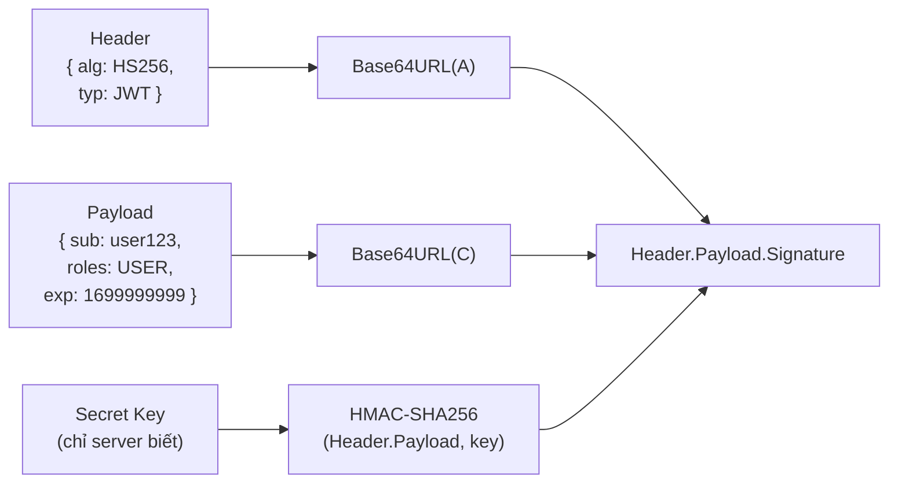
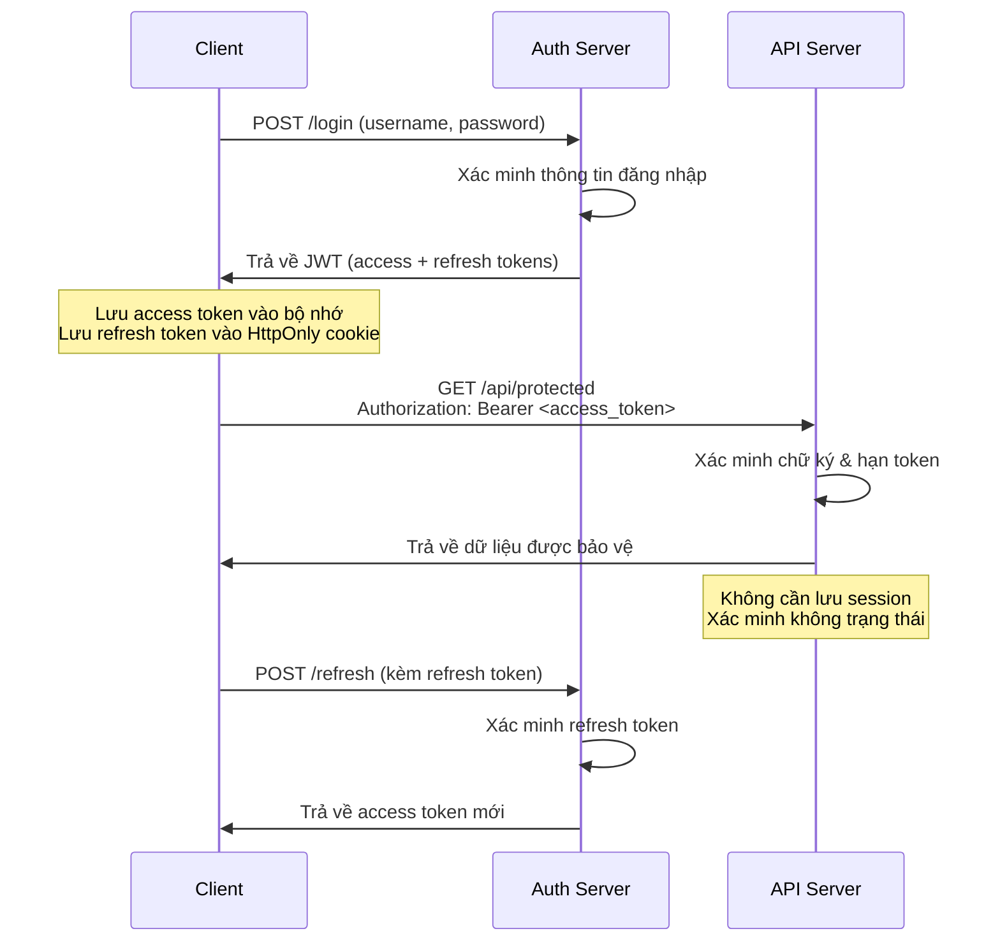
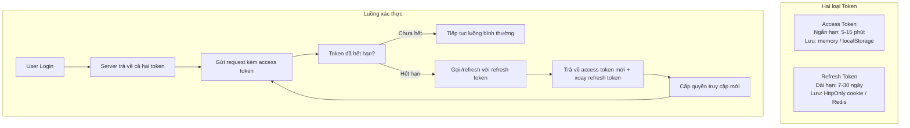
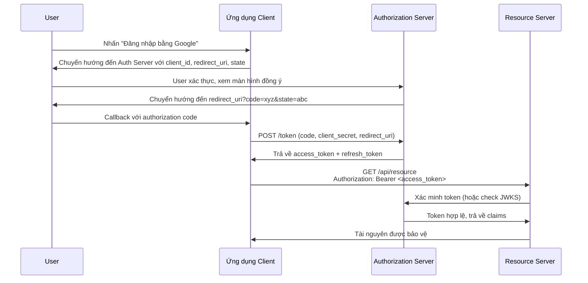
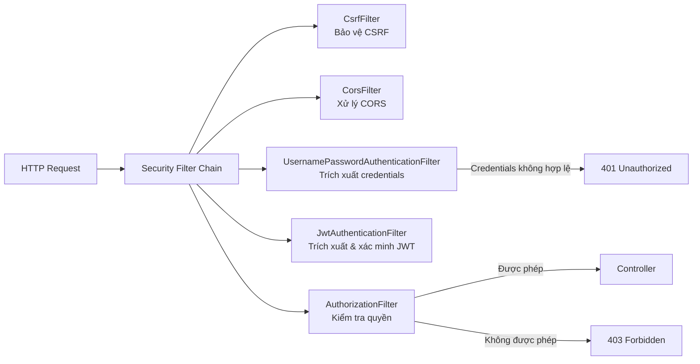
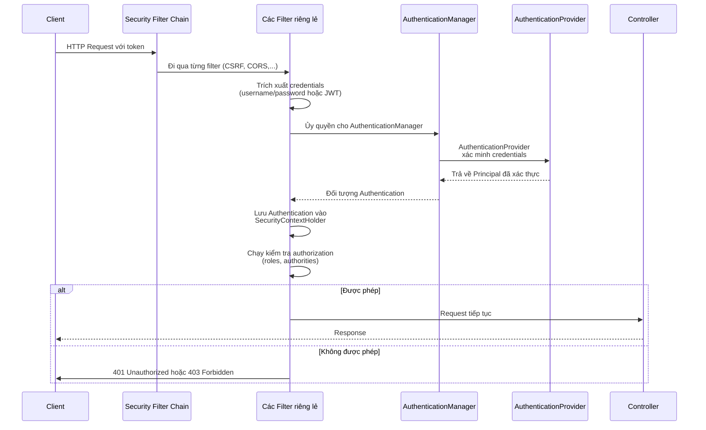
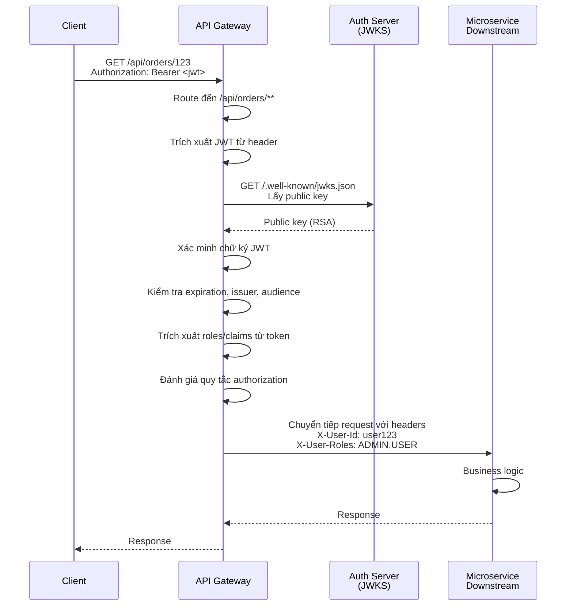

# Spring Security 6

## 1. Authentication vs Authorization

Hai khái niệm này thường bị nhầm lẫn nhưng phục vụ hai mục đích khác nhau.

| Khái niệm | Câu hỏi | Trả lời |
|-----------|---------|---------|
| **Authentication** | Bạn là ai? | Xác minh danh tính người dùng (đăng nhập) |
| **Authorization** | Bạn có quyền gì? | Kiểm soát quyền truy cập (phân quyền) |

Để dễ hiểu: authentication giống như việc bạn xuất trình CMND/CCCD ở cổng vào để chứng minh bạn là ai. Authorization là tấm vé quy định bạn được vào khu vực nào. Bạn phải qua được bước xác thực (authentication) trước thì mới kiểm tra quyền (authorization) được.

---

## 2. Cấu hình Spring Security 6

**Thay đổi quan trọng so với Security 5:** Spring Security 6 đã bỏ `WebSecurityConfigurerAdapter`. Bây giờ bạn định nghĩa các bean `SecurityFilterChain` thay thế.

```java
@Configuration
@EnableWebSecurity
@EnableMethodSecurity
public class SecurityConfig {

    @Bean
    public SecurityFilterChain securityFilterChain(HttpSecurity http) throws Exception {
        http
            .csrf(csrf -> csrf.disable())  // Tắt cho stateless JWT APIs
            .cors(Customizer.withDefaults())
            .authorizeHttpRequests(auth -> auth
                .requestMatchers("/api/public/**").permitAll()
                .requestMatchers("/api/admin/**").hasRole("ADMIN")
                .anyRequest().authenticated()
            )
            .sessionManagement(session -> session
                .sessionCreationPolicy(STATELESS)
            )
            .httpBasic(Customizer.withDefaults())
            .addFilterBefore(jwtFilter, UsernamePasswordAuthenticationFilter.class);

        return http.build();
    }
}
```

### 2.1. Nhiều Security Filter Chain

Spring Security hỗ trợ nhiều bean `SecurityFilterChain` với các `RequestMatcher` khác nhau. Chain phù hợp đầu tiên sẽ xử lý request. Rất hữu ích khi bạn muốn tách biệt đường dẫn public và API:

```java
@Bean
@Order(1)
public SecurityFilterChain actuatorSecurityFilterChain(HttpSecurity http) throws Exception {
    http
        .securityMatcher("/actuator/**")
        .authorizeHttpRequests(auth -> auth.anyRequest().hasRole("ADMIN"))
        .httpBasic(Customizer.withDefaults());
    return http.build();
}

@Bean
@Order(2)
public SecurityFilterChain apiSecurityFilterChain(HttpSecurity http) throws Exception {
    http
        .securityMatcher("/api/**")
        .csrf(csrf -> csrf.disable())
        .authorizeHttpRequests(auth -> auth.anyRequest().authenticated())
        .addFilterBefore(jwtFilter, AuthorizationFilter.class);
    return http.build();
}
```

---

## 3. UserDetails & UserDetailsService

`UserDetails` là interface cốt lõi của Spring Security, đóng vai trò như một "hợp đồng" giữa dữ liệu user của bạn và hệ thống authentication của Spring Security. Nó chứa toàn bộ thông tin về user mà Spring Security cần.

```java
// Entity implement UserDetails
@Entity
@Table(name = "users")
public class User implements UserDetails {
    @Id private Long id;
    private String username;
    private String password;
    private String role; // ROLE_USER, ROLE_ADMIN

    @Override
    public Collection<? extends GrantedAuthority> getAuthorities() {
        return List.of(new SimpleGrantedAuthority(role));
    }

    @Override public boolean isAccountNonExpired() { return true; }
    @Override public boolean isAccountNonLocked() { return true; }
    @Override public boolean isCredentialsNonExpired() { return true; }
    @Override public boolean isEnabled() { return true; }
}

// Service implement UserDetailsService
@Service
public class CustomUserDetailsService implements UserDetailsService {
    @Autowired private UserRepository userRepository;

    @Override
    public UserDetails loadUserByUsername(String username) throws UsernameNotFoundException {
        return userRepository.findByUsername(username)
            .orElseThrow(() -> new UsernameNotFoundException("Không tìm thấy user"));
    }
}
```

**Lưu ý:** Các method `isAccountNonExpired`, `isAccountNonLocked`... thường trả về `true`. Chúng tồn tại để hỗ trợ các tính năng quản lý tài khoản như khóa tài khoản khi đăng nhập sai quá nhiều lần.

---

## 4. Mã hóa Password

**Tuyệt đối không lưu password dạng plain text.** Nếu database bị lộ, password plain text sẽ khiến kẻ tấn công truy cập ngay vào tất cả tài khoản (và hầu hết người dùng đều dùng chung password cho nhiều trang web).

### 4.1. BCrypt (Khuyến nghị)

BCrypt là thuật toán mã hóa password mặc định của Spring Security. Nó sử dụng thuật toán Blowfish với một "cost factor" — làm cho quá trình mã hóa cố tình chậm lại. Khi phần cứng mạnh hơn, bạn có thể tăng cost factor mà không cần thay đổi hash đã lưu.

```java
@Bean
public PasswordEncoder passwordEncoder() {
    return new BCryptPasswordEncoder();
}

// Khi đăng ký user
public void register(User user) {
    user.setPassword(passwordEncoder.encode(user.getPassword()));
    userRepository.save(user);
}

// Khi đăng nhập (so sánh password nhập vào với hash đã lưu)
public boolean checkPassword(String rawPassword, String encodedPassword) {
    return passwordEncoder.matches(rawPassword, encodedPassword);
}
```

### 4.2. Các loại Encoder khác

| Encoder | Trường hợp sử dụng |
|---------|-------------------|
| **BCryptPasswordEncoder** | Mục đích chung — **khuyến nghị** |
| **Argon2PasswordEncoder** | Bảo mật cao nhất, cần Java 9+ |
| **SCryptPasswordEncoder** | Thay thế BCrypt |
| **NoOpPasswordEncoder** | Chỉ dùng cho test — không bao giờ dùng production |
| **DelegatingPasswordEncoder** | Hỗ trợ nhiều loại encoder cùng lúc (dùng khi migrate) |

```java
// DelegatingPasswordEncoder dùng khi migrate encoder
@Bean
public PasswordEncoder passwordEncoder() {
    Map<String, PasswordEncoder> encoders = Map.of(
        "bcrypt", new BCryptPasswordEncoder(),
        "noop", NoOpPasswordEncoder.getInstance()
    );
    return new DelegatingPasswordEncoder("bcrypt", encoders);
}
// Dạng lưu: {bcrypt}xxxxx hoặc {noop}plaintext
```

---

## 5. JWT (JSON Web Token)

JWT là một chuẩn token dạng compact, tự chứa thông tin (self-contained), dùng để truyền tải thông tin giữa các bên dưới dạng JSON. Nó đã trở thành chuẩn thực tế cho xác thực không trạng thái (stateless) trong các REST API hiện đại.

### 5.1. Cấu trúc JWT

Một JWT gồm 3 phần ngăn cách bởi dấu chấm (`.`):

```
Header.Payload.Signature
```

Mỗi phần được mã hóa Base64URL.



### 5.2. Header

Header chứa metadata về token:

```json
{
  "alg": "HS256",
  "typ": "JWT"
}
```

| Trường | Mô tả |
|--------|-------|
| **alg** | Thuật toán dùng để ký token. `HS256` dùng shared secret key. `RS256` dùng cặp public/private key. |
| **typ** | Loại token — theo convention luôn là `JWT`. |

**HS256 vs RS256:**
- **HS256** (đối xứng): Cùng một secret key dùng để ký và xác minh. Nhanh, đơn giản. Secret phải được bảo vệ kỹ vì ai có secret đều có thể tạo token giả. Phù hợp cho một service duy nhất.
- **RS256** (bất đối xứng): Private key ký, public key xác minh. Public key có thể chia sẻ thoải mái (ví dụ qua endpoint JWKS). Phù hợp cho kiến trúc microservices và xác thực liên service.

### 5.3. Payload

Payload chứa **claims** — các phát biểu về user và token:

```json
{
  "sub": "user123",
  "iat": 1699900000,
  "exp": 1699903600,
  "iss": "https://api.example.com",
  "aud": "https://app.example.com",
  "roles": ["USER", "ADMIN"]
}
```

| Claim | Tên | Mô tả |
|-------|-----|-------|
| `sub` | Subject | Thường là user ID hoặc username. Là định danh chính của user. |
| `iss` | Issuer | Ai đã phát hành token (URL server của bạn). Dùng để xác nhận token đến từ đâu. |
| `aud` | Audience | Token dành cho ai. Dùng khi nhiều service chia sẻ token. |
| `iat` | Issued At | Timestamp khi token được tạo. |
| `exp` | Expiration | Timestamp khi token hết hạn. **Rất quan trọng cho bảo mật.** |
| `nbf` | Not Before | Token chưa hợp lệ trước thời điểm này. |
| `jti` | JWT ID | Định danh duy nhất cho token. Hữu ích cho việc thu hồi/blacklist. |

**Lưu ý bảo mật quan trọng:** Payload được **Base64URL-encoded, KHÔNG phải encrypted**. Bất kỳ ai cũng có thể giải mã để đọc nội dung. Vì vậy, **tuyệt đối không lưu thông tin nhạy cảm** (password, số thẻ tín dụng, dữ liệu cá nhân) trong JWT payload. Nếu cần che giấu dữ liệu, hãy mã hóa riêng (ví dụ dùng JWE — JSON Web Encryption).

### 5.4. Chữ ký (Signature)

Chữ ký được tính như sau:

```
HMAC-SHA256(Base64URL(header) + "." + Base64URL(payload), secret_key)
```

Điều này chứng minh:
1. Token được tạo bởi người sở hữu secret key.
2. Payload không bị giả mạo trong quá trình truyền tải.

**Mọi người đều có thể giải mã header và payload (chúng chỉ là Base64URL, không phải encrypted).** Nhưng không ai có thể tạo chữ ký hợp lệ nếu không có secret key (hoặc private key với RS256).

### 5.5. Luồng JWT với xác thực không trạng thái (Stateless)



Trong kiến trúc JWT không trạng thái:
- **Server KHÔNG lưu session.** Mỗi request tự xác thực chính nó.
- Server chỉ cần xác minh chữ ký và kiểm tra thời hạn.
- Dễ dàng scale ngang — bất kỳ server nào cũng xác minh được token mà không cần shared session store.

### 5.6. Nhược điểm của JWT

Hiểu rõ nhược điểm của JWT cũng quan trọng như biết ưu điểm:

1. **Không thể thu hồi ngay lập tức.** Khi đã phát hành, JWT hợp lệ cho đến khi hết hạn. Bạn không thể "đăng xuất" một token ở phía server (trừ khi dùng blacklist — nhưng điều đó phá vỡ mục đích stateless).
2. **Kích thước token lớn hơn session ID.** Mỗi request đều chứa token trong header, tạo overhead không cần thiết.
3. **Payload có thể đọc được.** Dữ liệu nhạy cảm trong payload ai cũng đọc được.
4. **Clock skew.** Nếu đồng hồ các server không đồng bộ, kiểm tra expiration có thể sai lệch.
5. **Phức tạp trong quản lý token.** Với refresh token, token rotation, blacklist... logic phía client và server phức tạp hơn nhiều so với session đơn giản.

**Khi KHÔNG nên dùng JWT:**
- Khi bạn cần chức năng logout ngay lập tức (ví dụ: app ngân hàng).
- Khi kích thước token là vấn đề (API call tần suất cực cao).
- Khi session đơn giản là đủ.

### 5.7. Hệ thống Access Token + Refresh Token

Dùng chỉ một token có thời hạn dài rất nguy hiểm — nếu bị lộ, kẻ tấn công có quyền truy cập lâu dài. Dùng chỉ token ngắn hạn thì bất tiện — user phải đăng nhập lại liên tục. Giải pháp là **kiến trúc dual-token (hai token)**.



**Access Token:**
- Thời hạn ngắn (5-15 phút)
- Lưu trong JavaScript memory (ưu tiên) hoặc localStorage
- Chứa thông tin user và roles
- Dùng cho mọi API call
- Nếu bị lộ, cửa sổ khai thác bị giới hạn nhờ thời hạn ngắn

**Refresh Token:**
- Thời hạn dài (7-30 ngày, tùy mức bảo mật)
- Chỉ dùng để lấy access token mới
- Phải lưu trữ an toàn:
  - **HttpOnly cookie:** Chống XSS, tự động gửi kèm request
  - **Redis:** Lưu phía server, cho phép thu hồi ngay lập tức
- Nên **xoay (rotate)** mỗi lần sử dụng (phát hành refresh token mới cùng access token mới)

```java
// RefreshTokenService.java — Quản lý refresh token
@Service
public class RefreshTokenService {

    @Autowired private RefreshTokenRepository refreshTokenRepository;

    public RefreshToken createRefreshToken(User user, String deviceId) {
        // Mỗi thiết bị một refresh token riêng (hỗ trợ multi-device)
        refreshTokenRepository.deleteByUserAndDeviceId(user, deviceId);

        RefreshToken token = RefreshToken.builder()
            .user(user)
            .deviceId(deviceId)  // Theo dõi thiết bị nào
            .token(UUID.randomUUID().toString())  // Opaque token, không phải JWT
            .expiryDate(Instant.now().plus(Duration.ofDays(30)))
            .build();
        return refreshTokenRepository.save(token);
    }

    public UserDetails verifyRefreshToken(String token) {
        RefreshToken refreshToken = refreshTokenRepository
            .findByToken(token)
            .orElseThrow(() -> new RuntimeException("Refresh token không hợp lệ"));

        if (refreshToken.getExpiryDate().isBefore(Instant.now())) {
            refreshTokenRepository.delete(refreshToken);
            throw new RuntimeException("Refresh token đã hết hạn");
        }
        return refreshToken.getUser();
    }

    public void revokeAllUserTokens(User user) {
        // Dùng cho tính năng logout khỏi tất cả thiết bị
        refreshTokenRepository.deleteAllByUser(user);
    }
}
```

**Token Blacklist với Redis:**
Để thu hồi ngay lập tức (ví dụ: logout cưỡng chế, vi phạm bảo mật), dùng blacklist dựa trên Redis:

```java
@Service
public class JwtBlacklistService {

    @Autowired private StringRedisTemplate redisTemplate;
    private static final String BLACKLIST_PREFIX = "jwt:blacklist:";

    public void blacklistToken(String token, Instant expiry) {
        long ttlSeconds = Duration.between(Instant.now(), expiry).getSeconds();
        if (ttlSeconds > 0) {
            redisTemplate.opsForValue().set(
                BLACKLIST_PREFIX + token,
                "1",
                Duration.ofSeconds(ttlSeconds)
            );
        }
    }

    public boolean isBlacklisted(String token) {
        return Boolean.TRUE.equals(
            redisTemplate.hasKey(BLACKLIST_PREFIX + token));
    }
}
```

### 5.8. Implement JWT đầy đủ

```java
// JwtService.java — Tạo và xác minh token
@Service
public class JwtService {

    @Value("${jwt.secret}")
    private String secret;

    @Value("${jwt.expiration-ms:900000}")  // 15 phút mặc định
    private long expirationMs;

    public String generateToken(UserDetails user) {
        Map<String, Object> claims = new HashMap<>();
        claims.put("roles", user.getAuthorities().stream()
            .map(GrantedAuthority::getAuthority)
            .collect(Collectors.toList()));
        claims.put("type", "access");

        return Jwts.builder()
            .claims(claims)
            .subject(user.getUsername())
            .issuedAt(new Date())
            .expiration(new Date(System.currentTimeMillis() + expirationMs))
            .signWith(Keys.hmacShaKeyFor(secret.getBytes(StandardCharsets.UTF_8)), Jwts.SIG.HS256)
            .compact();
    }

    public String extractUsername(String token) {
        return extractAllClaims(token).getSubject();
    }

    public List<String> extractRoles(String token) {
        return extractAllClaims(token).get("roles", List.class);
    }

    public boolean isTokenValid(String token, UserDetails user) {
        final String username = extractUsername(token);
        return (username.equals(user.getUsername())) && !isTokenExpired(token);
    }

    private boolean isTokenExpired(String token) {
        return extractAllClaims(token).getExpiration().before(new Date());
    }

    private Claims extractAllClaims(String token) {
        return Jwts.parser()
            .verifyWith(Keys.hmacShaKeyFor(secret.getBytes(StandardCharsets.UTF_8)))
            .build()
            .parseSignedClaims(token)
            .getPayload();
    }
}
```

```java
// JwtAuthenticationFilter.java — Trích xuất token từ request và thiết lập SecurityContext
@Component
public class JwtAuthenticationFilter extends OncePerRequestFilter {

    @Autowired private JwtService jwtService;
    @Autowired private UserDetailsService userDetailsService;
    @Autowired private JwtBlacklistService blacklistService;

    @Override
    protected void doFilterInternal(HttpServletRequest request,
            HttpServletResponse response, FilterChain chain) throws Exception {

        String authHeader = request.getHeader("Authorization");

        if (authHeader == null || !authHeader.startsWith("Bearer ")) {
            chain.doFilter(request, response);
            return;
        }

        String token = authHeader.substring(7);

        // Kiểm tra blacklist để thu hồi ngay lập tức
        if (blacklistService.isBlacklisted(token)) {
            chain.doFilter(request, response);
            return;
        }

        String username = jwtService.extractUsername(token);

        if (username != null &&
            SecurityContextHolder.getContext().getAuthentication() == null) {

            UserDetails user = userDetailsService.loadUserByUsername(username);

            if (jwtService.isTokenValid(token, user)) {
                UsernamePasswordAuthenticationToken authToken =
                    new UsernamePasswordAuthenticationToken(
                        user, null, user.getAuthorities());
                authToken.setDetails(
                    new WebAuthenticationDetailsSource().buildDetails(request));
                SecurityContextHolder.getContext().setAuthentication(authToken);
            }
        }

        chain.doFilter(request, response);
    }
}
```

### 5.9. Tóm tắt Best Practices

| Thực hành | Khuyến nghị |
|-----------|-------------|
| Thời hạn token | Access: 5-15 phút, Refresh: 7-30 ngày |
| Lưu trữ | Access: memory (tốt nhất) hoặc localStorage, Refresh: HttpOnly cookie |
| Thuật toán | HS256 tối thiểu, RS256 cho microservices |
| Secret key | Tối thiểu 256 bits, lưu trong biến môi trường |
| HTTPS | Luôn bật — token trong header dạng plain text rất nguy hiểm |
| Dữ liệu payload | Không lưu thông tin nhạy cảm — payload không được mã hóa |
| Thu hồi | Dùng Redis blacklist hoặc token có thời hạn ngắn |
| Refresh rotation | Xoay refresh token mỗi lần sử dụng |
| Token theo thiết bị | Refresh token riêng cho từng thiết bị để quản lý chặt chẽ |

---

## 6. OAuth2

OAuth 2.0 là một **framework ủy quyền** cho phép ứng dụng có thể lấy quyền truy cập giới hạn đến tài khoản user trên một dịch vụ HTTP. Bản thân nó không phải là giao thức xác thực, mà là một giao thức ủy quyền (delegation protocol).

### 6.1. Các vai trò trong OAuth2

| Vai trò | Mô tả |
|---------|-------|
| **Resource Owner** | Người dùng cuối. Người sở hữu dữ liệu và có quyền cấp quyền truy cập. |
| **Client** | Ứng dụng yêu cầu quyền truy cập vào dữ liệu của user. |
| **Authorization Server** | Server xác thực user và phát hành tokens. |
| **Resource Server** | Server lưu trữ tài nguyên được bảo vệ và xác minh tokens. |

### 6.2. Các Grant Types (Loại ủy quyền)

| Grant Type | Trường hợp sử dụng | Mô tả |
|------------|-------------------|-------|
| **Authorization Code** | Web app, SPA, mobile app | Bảo mật nhất — dùng mã tạm thời để exchange, token không nằm trên URL |
| **Client Credentials** | Machine-to-machine (M2M) | Không có user — service tự xác thực với tư cách chính nó |
| **Refresh Token** | Gia hạn token | Dùng refresh token để lấy access + refresh token mới |
| **PKCE** | Public clients (mobile, SPA) | Mở rộng của Authorization Code — chống chặn authorization code |
| **Device Code** | CLI tools, smart TV | User vào URL trên thiết bị khác để xác thực |
| **Password (không dùng)** | Chỉ legacy app | User cung cấp credentials trực tiếp cho client — tránh nếu có thể |

### 6.3. Luồng Authorization Code (Chi tiết)



### 6.4. OAuth2 + JWT tích hợp như thế nào

OAuth2 định nghĩa **ai được quyền truy cập cái gì**, còn JWT là **định dạng token** dùng để mang thông tin đó. Chúng làm việc cùng nhau:

1. Authorization Server xác thực user và phát hành JWT access token.
2. JWT chứa claims về user (subject, roles, scope).
3. Resource Servers xác minh chữ ký JWT và kiểm tra claims.
4. Không cần lưu session — token tự chứa mọi thông tin cần thiết.

```java
// OAuth2 Resource Server với JWT
// application.yml
spring:
  security:
    oauth2:
      resourceserver:
        jwt:
          issuer-uri: https://auth-server-cua-ban.com

// Cấu hình
@Bean
public SecurityFilterChain securityFilterChain(HttpSecurity http) throws Exception {
    http
        .authorizeHttpRequests(auth -> auth
            .requestMatchers("/api/public/**").permitAll()
            .requestMatchers("/api/admin/**").hasRole("ADMIN")
            .anyRequest().authenticated()
        )
        .oauth2ResourceServer(oauth2 -> oauth2
            .jwt(Customizer.withDefaults())  // Spring tự xác minh JWT với issuer-uri
        );
    return http.build();
}
```

### 6.5. OAuth2 vs JWT — Khác nhau chỗ nào?

| Khía cạnh | JWT | OAuth2 |
|-----------|-----|--------|
| **Là gì?** | Định dạng token (specification) | Framework ủy quyền (protocol) |
| **Mục đích** | Mã hóa claims một cách bảo mật trong token | Ủy quyền truy cập mà không chia sẻ credentials |
| **Mối quan hệ** | JWT thường là định dạng token dùng trong OAuth2 | OAuth2 có thể dùng JWT hoặc opaque token |
| **Phạm vi** | Cấu trúc của một token | Toàn bộ luồng xác thực/ủy quyền |

Tóm gọn: **OAuth2 là "cách làm" (giao thức), JWT là "cái gì" (định dạng token).**

---

## 7. Security Filter Chain

Security Filter Chain là trái tim của Spring Security. Mọi HTTP request đều đi qua một chuỗi các servlet filters trước khi đến controller của bạn. Spring Security implement điều này bằng cách đăng ký một chuỗi các `Filter` instances với `SecurityFilterChain`.

### 7.1. Cách nó hoạt động



### 7.2. Luồng xử lý request từng bước



### 7.3. Các Filter quan trọng

| Filter | Mục đích |
|--------|---------|
| `SecurityContextPersistenceFilter` | Load SecurityContext từ session (hoặc tạo mới) |
| `LogoutFilter` | Xử lý request POST /logout |
| `UsernamePasswordAuthenticationFilter` | Xử lý form login (username + password) |
| `JwtAuthenticationFilter` | Trích xuất và xác minh JWT từ Authorization header |
| `AuthorizationFilter` | Ép buộc quyền truy cập theo endpoint |
| `ExceptionTranslationFilter` | Bắt các exception của Spring Security, chuyển thành HTTP response |
| `CsrfFilter` | Xác minh CSRF token cho các request thay đổi trạng thái |
| `CorsFilter` | Xử lý CORS preflight requests |

### 7.4. Tùy chỉnh thứ tự Filter

```java
@Bean
public SecurityFilterChain securityFilterChain(HttpSecurity http) throws Exception {
    http
        .addFilterBefore(correlationIdFilter, HeaderWriterFilter.class)
        .addFilterAfter(rateLimitFilter, AuthorizationFilter.class)
        .addFilterAt(captchaFilter, AuthorizationFilter.class)  // Thay thế filter hiện tại
        .csrf(csrf -> csrf.disable())
        .cors(Customizer.withDefaults())
        .authorizeHttpRequests(auth -> auth.anyRequest().authenticated())
        .sessionManagement(session -> session
            .sessionCreationPolicy(STATELESS)
        )
        .httpBasic(Customizer.withDefaults());
    return http.build();
}
```

---

## 8. Xử lý Exception

Spring Security hoạt động ở tầng filter, có nghĩa là nó chặn requests **trước khi** chúng đến được `@ControllerAdvice` exception handler của bạn. Bạn cần cấu hình Spring Security exception handler riêng để trả về response lỗi nhất quán với API của bạn.

### 8.1. AuthenticationEntryPoint (401)

Kích hoạt khi request không có credentials xác thực hợp lệ. Ví dụ: JWT bị thiếu hoặc không hợp lệ.

```java
@Component
public class JwtAuthenticationEntryPoint implements AuthenticationEntryPoint {

    @Override
    public void commence(HttpServletRequest request,
                         HttpServletResponse response,
                         AuthenticationException authException) throws IOException {

        response.setContentType("application/json");
        response.setStatus(HttpServletResponse.SC_UNAUTHORIZED);
        response.getWriter().write(
            "{\"error\":\"Unauthorized\",\"message\":\"" +
            authException.getMessage() + "\"}"
        );
    }
}
```

### 8.2. AccessDeniedHandler (403)

Kích hoạt khi user đã xác thực nhưng không có quyền truy cập tài nguyên.

```java
@Component
public class CustomAccessDeniedHandler implements AccessDeniedHandler {

    @Override
    public void handle(HttpServletRequest request,
                        HttpServletResponse response,
                        AccessDeniedException accessDeniedException) throws IOException {

        response.setContentType("application/json");
        response.setStatus(HttpServletResponse.SC_FORBIDDEN);
        response.getWriter().write(
            "{\"error\":\"Forbidden\",\"message\":\"" +
            accessDeniedException.getMessage() + "\"}"
        );
    }
}
```

### 8.3. Gắn Exception Handlers vào Security Config

```java
@Bean
public SecurityFilterChain securityFilterChain(HttpSecurity http) throws Exception {
    http
        .exceptionHandling(ex -> ex
            .authenticationEntryPoint(jwtAuthenticationEntryPoint)
            .accessDeniedHandler(customAccessDeniedHandler)
        )
        // ... phần cấu hình còn lại
        ;
    return http.build();
}
```

### 8.4. Định dạng Error Response nhất quán

Dùng global exception handler bên trên các Spring Security handlers cho các exception ở tầng ứng dụng:

```java
@RestControllerAdvice
public class GlobalExceptionHandler {

    @ExceptionHandler(ResourceNotFoundException.class)
    public ResponseEntity<ErrorResponse> handleNotFound(ResourceNotFoundException ex) {
        return ResponseEntity.status(404)
            .body(new ErrorResponse("NOT_FOUND", ex.getMessage()));
    }

    @ExceptionHandler(BusinessException.class)
    public ResponseEntity<ErrorResponse> handleBusiness(BusinessException ex) {
        return ResponseEntity.badRequest()
            .body(new ErrorResponse("BAD_REQUEST", ex.getMessage()));
    }

    record ErrorResponse(String code, String message) {}
}
```

---

## 9. API Gateway + Spring Cloud Security

Trong kiến trúc microservices, API Gateway là điểm vào duy nhất cho tất cả request từ client. Nó xử lý xác thực và ủy quyền để các service downstream không cần phải làm.

### 9.1. Luồng Request qua Gateway



### 9.2. Cấu hình Security trên Gateway

```java
// API Gateway application.yml
spring:
  cloud:
    gateway:
      routes:
        - id: order-service
          uri: http://order-service:8080
          predicates:
            - Path=/api/orders/**
          filters:
            - name: RequestSize
              args:
                maxSize: 10MB

// Cấu hình bảo mật
@Configuration
@EnableWebFluxSecurity
public class GatewaySecurityConfig {

    @Bean
    public SecurityWebFilterChain securityWebFilterChain(
            ServerHttpSecurity http,
            ReactiveJwtDecoder jwtDecoder) {

        return http
            .csrf(csrf -> csrf.disable())
            .authorizeExchange(ex -> ex
                .pathMatchers("/actuator/**").hasRole("ADMIN")
                .pathMatchers("/api/public/**").permitAll()
                .pathMatchers("/api/orders/**").hasAnyRole("USER", "ADMIN")
                .pathMatchers("/api/admin/**").hasRole("ADMIN")
                .anyExchange().authenticated()
            )
            .oauth2ResourceServer(oauth2 -> oauth2
                .jwt(jwt -> jwt.decoder(jwtDecoder))
            )
            .build();
    }
}
```

### 9.3. Các chiến lược xác minh Token

| Chiến lược | Mô tả | Trường hợp dùng |
|------------|-------|----------------|
| **JWT xác minh cục bộ** | Gateway có public key (JWKS), xác minh token tại chỗ | Độ trễ thấp, không gọi bên ngoài |
| **Opaque token introspection** | Gateway gọi endpoint introspection của Auth Server | Quản lý token tập trung, thu hồi ngay |
| **Pass-through** | Gateway kiểm tra định dạng token, service downstream xác minh | Xác minh phân tán |

```java
// Xác minh JWT cục bộ với JWKS
@Bean
public ReactiveJwtDecoder jwtDecoder() {
    return JwtDecoders.fromIssuerLocation("https://auth.example.com");

    // Hoặc cấu hình thủ công với public key cụ thể
    // return NimbusReactiveJwtDecoder
    //     .withJwkSetUri("https://auth.example.com/.well-known/jwks.json")
    //     .build();
}
```

### 9.4. Chuyển tiếp thông tin User đến Downstream Services

Sau khi gateway xác minh token, nó nên chuyển tiếp thông tin identity của user đến các service downstream qua headers:

```java
@Component
public class HeadersForwardingFilter extends AbstractGatewayFilterFactory<HeadersForwardingFilter.Config> {

    @Override
    public GatewayFilter apply(Config config) {
        return (exchange, chain) -> {
            Jwt token = exchange.getAttribute("jwt");
            if (token != null) {
                ServerHttpRequest mutated = exchange.getRequest().mutate()
                    .header("X-User-Id", token.getSubject())
                    .header("X-User-Roles", String.join(",",
                        token.getClaimAsStringList("roles")))
                    .header("X-Request-Id", UUID.randomUUID().toString())
                    .build();
                return chain.filter(exchange.mutate().request(mutated).build());
            }
            return chain.filter(exchange);
        };
    }
}
```

---

## 10. Bảo vệ CSRF

CSRF (Cross-Site Request Forgery) là một cuộc tấn công mà trang web độc hại lừa trình duyệt của user gửi một request không mong muốn đến trang của bạn.

| Loại ứng dụng | Bảo vệ CSRF |
|--------------|-------------|
| Session-based (trình duyệt) | **Bắt buộc bật** |
| Stateless REST API (JWT) | **Tắt đi** |
| Refresh token trong HttpOnly cookie | Bật cho endpoint refresh |
| SPA với SameSite cookies | Cân nhắc tắt nếu dùng SameSite=Lax |

**Tại sao tắt cho REST API?** Trong setup JWT stateless, trình duyệt tự động gửi cookies cho các request SameSite=Lax. Nếu refresh token nằm trong cookie, CSRF vẫn là rủi ro. Giải pháp:
- CSRF token cho endpoint refresh
- `SameSite=None` kèm CSRF token
- Kiểm tra header `Origin`/`Referer`

```java
// Tắt cho stateless JWT APIs
http.csrf(csrf -> csrf.disable());

// Bật cho session-based
http.csrf(csrf -> csrf
    .csrfTokenRepository(CookieCsrfTokenRepository.withHttpOnlyFalse())
);

// Bật cho refresh token trong cookie (chỉ endpoint /refresh)
http.csrf(csrf -> csrf
    .ignoringRequestMatchers("/api/auth/refresh")
    .csrfTokenRepository(CookieCsrfTokenRepository.withHttpOnlyFalse())
);
```

---

## 11. Bảo mật ở cấp Method

Bảo mật ở cấp method cho phép bạn bảo vệ các method cụ thể thay vì chỉ URL patterns. Spring Security AOP chặn các lời gọi method và đánh giá biểu thức authorization.

```java
@EnableMethodSecurity  // Cần có trong SecurityConfig

@Service
public class AdminService {

    // Cần role ADMIN
    @PreAuthorize("hasRole('ADMIN')")
    public void deleteUser(Long id) { }

    // Cần authority cụ thể
    @PreAuthorize("hasAuthority('SCOPE_read')")
    public User getUser(Long id) { }

    // Biểu thức phức tạp: dữ liệu của mình HOẶC admin
    @PreAuthorize("#userId == authentication.principal.id or hasRole('ADMIN')")
    public void updateProfile(Long userId, Profile profile) { }

    // Biểu thức SpEL tùy chỉnh
    @PreAuthorize("@securityService.canAccessDocument(#documentId, authentication)")
    public Document getDocument(Long documentId) { }

    // @Secured — annotation cũ (không hỗ trợ SpEL)
    @Secured({"ROLE_ADMIN", "ROLE_USER"})
    public void doSomething() { }

    // Annotation JSR-250
    @RolesAllowed({"ADMIN", "USER"})
    public void doSomethingElse() { }

    // Từ chối mọi truy cập
    @PreAuthorize("denyAll()")
    public void neverCallThis() { }
}
```

**`hasRole` vs `hasAuthority`:**
- `hasRole('ADMIN')` tự động thêm prefix `ROLE_` (kiểm tra `ROLE_ADMIN`)
- `hasAuthority('ROLE_ADMIN')` kiểm tra chính xác chuỗi authority

---

## 12. Cấu hình CORS

CORS (Cross-Origin Resource Sharing) là cơ chế bảo mật của trình duyệt, giới hạn các trang web gửi request đến origin khác. Không có cấu hình CORS đúng, frontend ở `http://localhost:3000` không thể gọi API ở `http://localhost:8080`.

```java
@Configuration
public class CorsConfig implements WebMvcConfigurer {

    @Override
    public void addCorsMappings(CorsRegistry registry) {
        registry.addMapping("/api/**")
            .allowedOrigins(
                "http://localhost:3000",
                "https://app.example.com"
            )
            .allowedMethods("GET", "POST", "PUT", "DELETE", "PATCH", "OPTIONS")
            .allowedHeaders("*")
            .exposedHeaders("Authorization")  // Cho phép client đọc header này
            .allowCredentials(true)
            .maxAge(3600);  // Cache preflight request
    }
}
```

Với Spring Security, bạn cũng phải bật CORS trong security config:

```java
http.cors(Customizer.withDefaults())  // Bật filter CORS
```

---

## 13. Security Headers

Spring Security mặc định thêm các HTTP headers liên quan đến bảo mật:

| Header | Giá trị mặc định | Mục đích |
|--------|------------------|---------|
| **X-Content-Type-Options** | `nosniff` | Ngăn trình duyệt đoán MIME type |
| **X-Frame-Options** | `DENY` | Ngăn clickjacking (nhúng iframe) |
| **X-XSS-Protection** | `1; mode=block` | Filter XSS legacy (phần lớn đã lỗi thời) |
| **Cache-Control** | `no-cache, no-store` | Ngăn cache dữ liệu nhạy cảm |
| **Strict-Transport-Security** | Tắt mặc định | Bắt buộc HTTPS |

```java
http.securityHeaders(headers -> headers
    .frameOptions(frame -> frame.deny())            // Ngăn clickjacking
    .contentTypeOptions(Customizer.withDefaults())  // X-Content-Type-Options: nosniff
    .xssProtection(Customizer.withDefaults())        // X-XSS-Protection: 1; mode=block
    .cacheControl(Customizer.withDefaults())         // no-cache, no-store
    .httpStrictTransportSecurity(hsts -> hsts       // HSTS
        .includeSubDomains(true)
        .maxAgeInSeconds(31536000))                  // 1 năm
);
```

---

## 14. Câu hỏi phỏng vấn thường gặp

**Q: Authentication và Authorization khác nhau chỗ nào?**
Authentication trả lời câu hỏi "bạn là ai?" bằng cách xác minh danh tính (username/password, sinh trắc học, token). Authorization trả lời câu hỏi "bạn được làm gì?" bằng cách kiểm tra quyền (quy tắc role-based, kiểm tra ownership). Authentication phải xảy ra trước Authorization.

**Q: Tại sao password nên được encode chứ không phải encrypt?**
Encoding là một chiều (không thể đảo ngược để lấy lại password gốc), còn encryption là hai chiều (có thể giải mã). Với password, ta chỉ cần xác minh password nhập vào khớp với hash đã lưu. Nếu encoding có thể đảo ngược, kẻ tấn công lấy được key sẽ khôi phục toàn bộ password.

**Q: Chuyện gì xảy ra khi JWT token hết hạn giữa request?**
Server trả về response 401 Unauthorized. Client nên dùng refresh token để lấy access token mới. Nếu refresh token cũng hết hạn, user phải đăng nhập lại.

**Q: JWT token có thể bị thu hồi không?**
Mặc định, JWT không thể thu hồi vì server không lưu trạng thái session. Các giải pháp: (1) Thời hạn ngắn, (2) Token blacklist (Redis), (3) Opaque token với xác minh phía server (OAuth2 introspection), (4) Token families với revocation list.

**Q: HS256 và RS256 khác nhau thế nào trong việc ký JWT?**
HS256 dùng symmetric key (cùng key cho ký và xác minh). Nhanh hơn nhưng key phải được bảo mật. RS256 dùng asymmetric keys (private key ký, public key xác minh). Public key có thể chia sẻ thoải mái. RS256 phù hợp cho microservices và khi nhiều bên cần xác minh token.

**Q: Security filter chain của Spring Security hoạt động thế nào?**
Mỗi request đều đi qua một chuỗi servlet filters. Spring Security đăng ký một `SecurityFilterChain` chặn requests trước khi chúng đến controller. Mỗi filter có trách nhiệm riêng: kiểm tra CSRF, CORS, trích xuất credentials, xác thực, và phân quyền. Nếu bất kỳ filter nào từ chối request, nó trả về error response. Nếu tất cả filters đều pass, request đến được controller.

**Q: @PreAuthorize và @Secured khác nhau chỗ nào?**
`@Secured` là annotation cũ, chỉ hỗ trợ tên role đơn giản (không hỗ trợ biểu thức SpEL). `@PreAuthorize` hỗ trợ biểu thức SpEL đầy đủ, cho phép các điều kiện phức tạp như `#userId == authentication.principal.id`, gọi method (`@securityService.canAccess(...)`), hoặc kết hợp nhiều điều kiện với `and`, `or`, `not`.

**Q: Tại sao tắt CSRF cho REST API?**
CSRF bảo vệ chống lại các cross-site requests mà cookies được gửi tự động. REST API stateless dùng JWT thường lưu token trong `Authorization: Bearer` header, header này không được trình duyệt gửi tự động. Do đó tấn công CSRF không áp dụng được. Tuy nhiên, nếu dùng cookies để lưu token, CSRF vẫn cần thiết.

**Q: Làm sao xử lý logout với JWT?**
Vì JWT không trạng thái, bạn không thể vô hiệu hóa trực tiếp. Các cách: (1) Logout phía client — xóa token khỏi bộ nhớ client. (2) Blacklist token — thêm token vào Redis blacklist đến khi hết hạn. (3) Thời hạn ngắn — giảm thiểu cửa sổ khai thác. (4) Vô hiệu hóa refresh token — thu hồi refresh token, ngăn việc gia hạn.

**Q: SecurityContext là gì và hoạt động thế nào?**
`SecurityContext` chứa thông tin chi tiết về user đang được xác thực (principal, credentials, authorities). Mặc định, nó được lưu trong `ThreadLocal`, cho phép truy cập ở bất kỳ đâu trong request thread. Sau khi xác thực thành công, `SecurityContextHolder` điền đầy context này, và các service của bạn có thể truy cập qua `SecurityContextHolder.getContext().getAuthentication()`.
