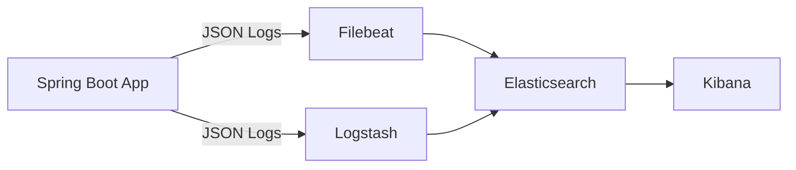
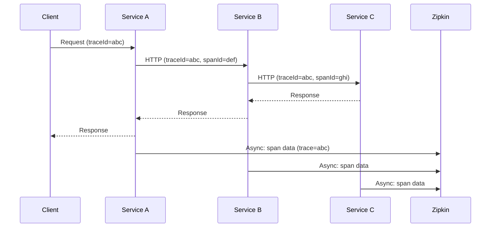

# Spring → Cloud

## 1. Tổng quan

Spring Cloud cung cấp các công cụ để xây dựng các patterns phổ biến trong hệ thống phân tán.

### 1.1. Các Patterns chính

| Pattern | Spring Cloud | Mô tả |
|---------|-------------|--------|
| **Config** | Spring Cloud Config | Cấu hình tập trung |
| **Discovery** | Netflix Eureka | Service registration & discovery |
| **Gateway** | Spring Cloud Gateway | API routing, filtering |
| **Circuit Breaker** | Resilience4j | Fault tolerance |
| **Load Balancing** | Spring Cloud LoadBalancer | Client-side LB |
| **Tracing** | Spring Cloud Sleuth | Distributed tracing |
| **Messaging** | Spring Cloud Stream | Event-driven microservices |

## 2. Spring Cloud Config Server

Quản lý cấu hình tập trung.

### 2.1. Server Setup

```xml
<dependency>
    <groupId>org.springframework.cloud</groupId>
    <artifactId>spring-cloud-config-server</artifactId>
</dependency>
```

```java
@SpringBootApplication
@EnableConfigServer
public class ConfigServerApplication { }
```

```properties
# application.properties
spring.application.name=config-server
spring.cloud.config.server.git.uri=https://github.com/your-org/config-repo
spring.cloud.config.server.git.default-label=main
spring.cloud.config.server.git.search-paths=configs/{application}
```

### 2.2. Client Setup

```xml
<dependency>
    <groupId>org.springframework.cloud</groupId>
    <artifactId>spring-cloud-starter-config</artifactId>
</dependency>
```

```properties
# bootstrap.properties (load trước application.properties)
spring.application.name=user-service
spring.cloud.config.uri=http://localhost:8888
spring.cloud.config.profile=prod
spring.cloud.config.label=main
```

## 3. Service Discovery (Eureka)

### 3.1. Eureka Server

```xml
<dependency>
    <groupId>org.springframework.cloud</groupId>
    <artifactId>spring-cloud-starter-netflix-eureka-server</artifactId>
</dependency>
```

```java
@SpringBootApplication
@EnableEurekaServer
public class EurekaServerApplication { }
```

```properties
spring.application.name=eureka-server
server.port=8761
eureka.client.register-with-eureka=false
eureka.client.fetch-registry=false
```

### 3.2. Eureka Client

```xml
<dependency>
    <groupId>org.springframework.cloud</groupId>
    <artifactId>spring-cloud-starter-netflix-eureka-client</artifactId>
</dependency>
```

```properties
spring.application.name=user-service
eureka.client.service-url.defaultZone=http://localhost:8761/eureka
```

```java
@RestController
public class UserController {
    @Autowired
    private RestTemplate restTemplate;

    // Dùng service name thay vì IP/port
    public Order getOrder(Long orderId) {
        return restTemplate.getForObject(
            "http://order-service/api/orders/" + orderId, Order.class);
    }
}
```

## 4. Spring Cloud Gateway

API Gateway cho routing và filtering.

```xml
<dependency>
    <groupId>org.springframework.cloud</groupId>
    <artifactId>spring-cloud-starter-gateway</artifactId>
</dependency>
```

```properties
spring.cloud.gateway.routes:
  - id: user-service
    uri: http://user-service:8080
    predicates:
      - Path=/api/users/**
    filters:
      - StripPrefix=1
      - name: RequestRateLimiter
        args:
          redis-rate-limiter.replenishRate: 10
          redis-rate-limiter.burstCapacity: 20

  - id: order-service
    uri: lb://order-service
    predicates:
      - Header=X-API-Key, .+
    filters:
      - name: CircuitBreaker
        args:
          name: orderCircuitBreaker
          fallbackUri: forward:/fallback
```

```java
@Configuration
public class GatewayConfig {

    @Bean
    public RouteLocator customRouteLocator(RouteLocatorBuilder builder) {
        return builder.routes()
            .route("user-route", r -> r.path("/users/**")
                .filters(f -> f.stripPrefix(1).addRequestHeader("X-Gateway", "true"))
                .uri("lb://user-service"))
            .build();
    }
}

// Global filter
@Component
public class AuthenticationFilter implements GlobalFilter {
    @Override
    public Mono<Void> filter(ServerWebExchange exchange, GatewayFilterChain chain) {
        String token = exchange.getRequest().getHeaders().getFirst("Authorization");
        if (token == null) {
            exchange.getResponse().setStatusCode(HttpStatus.UNAUTHORIZED);
            return exchange.getResponse().setComplete();
        }
        return chain.filter(exchange);
    }
}
```

## 5. Circuit Breaker (Resilience4j)

```xml
<dependency>
    <groupId>io.github.resilience4j</groupId>
    <artifactId>resilience4j-spring-boot3</artifactId>
</dependency>
<dependency>
    <groupId>org.springframework.cloud</groupId>
    <artifactId>spring-cloud-starter-circuitbreaker-resilience4j</artifactId>
</dependency>
```

```properties
resilience4j.circuitbreaker:
  instances:
    orderService:
      slidingWindowSize: 10
      failureRateThreshold: 50
      waitDurationInOpenState: 10s
      permittedNumberOfCallsInHalfOpenState: 3
      automaticTransitionFromOpenToHalfOpenEnabled: true

resilience4j.retry:
  instances:
    orderService:
      maxAttempts: 3
      waitDuration: 500ms
      enableExponentialBackoff: true
      exponentialBackoffMultiplier: 2

resilience4j.timelimiter:
  instances:
    orderService:
      timeoutDuration: 3s
```

```java
@Service
public class OrderClient {

    @CircuitBreaker(name = "orderService", fallbackMethod = "getOrderFallback")
    @Retry(name = "orderService")
    public Order getOrder(Long id) {
        return restTemplate.getForObject("http://order-service/orders/" + id, Order.class);
    }

    // Fallback method phải cùng signature + Throwable parameter
    public Order getOrderFallback(Long id, Throwable t) {
        log.error("Order service failed: {}", t.getMessage());
        return new Order(id, "Order unavailable", "FALLBACK");
    }
}

// Bulkhead
@Bulkhead(name = "orderService", fallbackMethod = "bulkheadFallback")
public Order getOrder(Long id) { }
```

## 6. Spring Cloud LoadBalancer

Client-side load balancing (thay thế Netflix Ribbon).

```java
@Configuration
public class LoadBalancerConfig {
    @Bean
    public ReactorLoadBalancer<ServiceInstance> randomLoadBalancer(
            Environment environment,
            LoadBalancerClientFactory factory) {
        String name = environment.getProperty(
            LoadBalancerClientFactory.PROPERTY_NAME);
        return new RandomLoadBalancer(
            factory.getLazyProvider(name, ServiceInstanceListSupplier.class),
            name);
    }
}

// Usage
@Service
public class UserService {
    @Autowired
    private LoadBalancerClient loadBalancer;

    public String getServiceUrl() {
        ServiceInstance instance = loadBalancer.choose("order-service");
        return instance.getUri().toString();
    }
}
```

## 7. Spring Cloud OpenFeign

Declarative HTTP client.

```xml
<dependency>
    <groupId>org.springframework.cloud</groupId>
    <artifactId>spring-cloud-starter-openfeign</artifactId>
</dependency>
```

```java
@EnableFeignClients
@SpringBootApplication
public class Application { }

// Define client
@FeignClient(name = "order-service", url = "http://order-service:8080")
public interface OrderClient {

    @GetMapping("/api/orders/{id}")
    Order getOrder(@PathVariable("id") Long id);

    @PostMapping("/api/orders")
    Order createOrder(@RequestBody CreateOrderRequest request);

    @GetMapping("/api/orders")
    List<Order> getOrders(@RequestParam("userId") Long userId);
}

// Use
@Service
public class UserService {
    @Autowired
    private OrderClient orderClient;

    public List<Order> getUserOrders(Long userId) {
        return orderClient.getOrders(userId);
    }
}
```

## 8. Spring Cloud Stream (Messaging)

```xml
<dependency>
    <groupId>org.springframework.cloud</groupId>
    <artifactId>spring-cloud-stream</artifactId>
</dependency>
```

```properties
spring.cloud.stream:
  bindings:
    output:
      destination: orders
      content-type: application/json
    input:
      destination: notifications
      group: notification-group
  binders:
    kafka:
      type: kafka
      environment:
        spring.cloud.stream.kafka.binder.brokers: localhost:9092
```

```java
// Producer
@EnableBinding(Source.class)
public class OrderPublisher {

    @Autowired
    private Source source;

    public void publishOrder(Order order) {
        source.output().send(MessageBuilder
            .withPayload(order)
            .setHeader("partitionKey", order.getUserId())
            .build());
    }
}

// Consumer
@EnableBinding(Sink.class)
public class NotificationConsumer {

    @StreamListener(Sink.INPUT)
    public void handleOrder(@Payload Order order) {
        emailService.sendConfirmation(order);
    }
}
```

## 9. Spring Cloud Sleuth (Distributed Tracing)

```xml
<dependency>
    <groupId>org.springframework.cloud</groupId>
    <artifactId>spring-cloud-starter-sleuth</artifactId>
</dependency>
```

Tự động thêm trace ID và span ID vào logs:
```
2024-01-15 10:30:00.001 INFO  [user-service,abc123,def456] - Processing order
2024-01-15 10:30:00.005 INFO  [order-service,abc123,ghi789] - Creating order
```

---

## 10. Consul (Thay thế Eureka)

HashiCorp Consul cung cấp service discovery, health checking và distributed configuration.

### 10.1. Consul Server

```xml
<dependency>
    <groupId>org.springframework.cloud</groupId>
    <artifactId>spring-cloud-starter-consul-config</artifactId>
</dependency>
<dependency>
    <groupId>org.springframework.cloud</groupId>
    <artifactId>spring-cloud-starter-consul-discovery</artifactId>
</dependency>
```

```properties
spring.application.name=user-service
spring.consul.host=localhost
spring.consul.port=8500
spring.cloud.consul.discovery.health-check-path=/actuator/health
spring.cloud.consul.discovery.health-check-interval=10s
spring.cloud.consul.config.enabled=true
spring.cloud.consul.config.prefix=config
```

```java
@SpringBootApplication
@EnableDiscoveryClient
public class UserServiceApplication { }
```

### 10.2. Eureka vs Consul

| Tính năng | Eureka | Consul |
|---------|--------|--------|
| **CAP** | AP (availability + partition tolerance) | CP (consistency + partition tolerance) |
| **Data store** | In-memory (không persist) | Persistent (boltDB) |
| **Health check** | Heartbeat (renewal) | Multiple (HTTP, TCP, Script, Docker) |
| **Multi-datacenter** | Via AWS metadata | Native federation |
| **Config** | Registration only | Service discovery + KV config store |
| **UI** | Dashboard | Web UI + CLI |

---

## 11. Rate Limiter (Resilience4j)

Giới hạn số lượng requests trong một khoảng thời gian.

```properties
resilience4j.ratelimiter:
  instances:
    orderService:
      limitForPeriod: 10          # Max calls per period
      limitRefreshPeriod: 1s       # Period duration
      timeoutDuration: 500ms       # Max wait time for permit
      registerHealthIndicator: true
```

```java
@RateLimiter(name = "orderService", fallbackMethod = "rateLimitFallback")
public Order getOrder(Long id) {
    return restTemplate.getForObject("http://order-service/orders/" + id, Order.class);
}

public Order rateLimitFallback(Long id, RateLimiterExceededException e) {
    log.warn("Rate limit exceeded: {}", e.getMessage());
    return new Order(id, "Rate limited", "QUEUED");
}
```

---

## 12. Bulkhead (Resilience4j)

Giới hạn số lượng concurrent calls đến một service (ngăn chặn resource exhaustion).

```properties
resilience4j.bulkhead:
  instances:
    orderService:
      maxConcurrentCalls: 5         # Max parallel calls
      maxWaitDuration: 100ms        # Max wait for a permit
```

```java
@Bulkhead(name = "orderService", fallbackMethod = "bulkheadFallback")
public Order getOrder(Long id) {
    return restTemplate.getForObject("http://order-service/orders/" + id, Order.class);
}

public Order bulkheadFallback(Long id, BulkheadFullException e) {
    log.warn("Bulkhead full: {}", e.getMessage());
    return new Order(id, "Service busy", "RETRY_LATER");
}
```

---

## 13. Time Limiter (Resilience4j)

Đặt timeout cho các async operations.

```properties
resilience4j.timelimiter:
  instances:
    asyncService:
      timeoutDuration: 3s
      cancelRunningFuture: true
```

```java
@TimeLimiter(name = "asyncService", fallbackMethod = "timeoutFallback")
public CompletableFuture<Result> callAsyncService() {
    return CompletableFuture.supplyAsync(() -> externalService.getResult());
}

public CompletableFuture<Result> timeoutFallback(Throwable t) {
    return CompletableFuture.completedFuture(new Result("Timeout", t.getMessage()));
}
```

---

## 14. Centralized Logging (ELK Stack)

### 14.1. Kiến trúc



### 14.2. Logback JSON Configuration

```xml
<dependency>
    <groupId>net.logstash.logback</groupId>
    <artifactId>logstash-logback-encoder</artifactId>
    <version>7.4</version>
</dependency>
```

```xml
<!-- logback-spring.xml -->
<configuration>
    <springProperty scope="context" name="appName" source="spring.application.name"/>

    <appender name="CONSOLE" class="ch.qos.logback.core.ConsoleAppender">
        <encoder class="net.logstash.logback.encoder.LogstashEncoder">
            <includeMdc>true</includeMdc>
            <includeContext>true</includeContext>
            <customFields>{"application":"${appName}"}</customFields>
            <fieldNames>
                <timestamp>@timestamp</timestamp>
                <message>message</message>
                <logger>logger</logger>
                <thread>thread</thread>
                <level>level</level>
                <stackTrace>stack_trace</stackTrace>
            </fieldNames>
        </encoder>
    </appender>

    <appender name="LOGSTASH" class="net.logstash.logback.appender.LogstashTcpSocketAppender">
        <destination>logstash:5044</destination>
        <encoder class="net.logstash.logback.encoder.LogstashEncoder">
            <customFields>{"application":"${appName}"}</customFields>
        </encoder>
        <keepAliveDuration>5 minutes</keepAliveDuration>
    </appender>

    <appender name="FILE" class="ch.qos.logback.core.rolling.RollingFileAppender">
        <file>logs/application.log</file>
        <rollingPolicy class="ch.qos.logback.core.rolling.TimeBasedRollingPolicy">
            <fileNamePattern>logs/application.%d{yyyy-MM-dd}.log</fileNamePattern>
            <maxHistory>30</maxHistory>
            <totalSizeCap>1GB</totalSizeCap>
        </rollingPolicy>
        <encoder class="net.logstash.logback.encoder.LogstashEncoder"/>
    </appender>

    <root level="INFO">
        <appender-ref ref="CONSOLE"/>
        <appender-ref ref="FILE"/>
    </root>

    <logger name="com.example" level="DEBUG"/>
</configuration>
```

### 14.3. MDC với Trace ID

```java
@Configuration
public class MdcFilter extends OncePerRequestFilter {

    @Override
    protected void doFilterInternal(HttpServletRequest request,
            HttpServletResponse response, FilterChain chain)
            throws ServletException, IOException {

        String traceId = UUID.randomUUID().toString();
        MDC.put("traceId", traceId);
        MDC.put("requestUri", request.getRequestURI());

        try {
            chain.doFilter(request, response);
        } finally {
            MDC.clear();
        }
    }
}
```

### 14.4. ELK Stack Setup (Docker Compose)

```yaml
version: '3'
services:
  elasticsearch:
    image: docker.elastic.co/elasticsearch/elasticsearch:8.11.0
    environment:
      - discovery.type=single-node
      - xpack.security.enabled=false
    ports:
      - "9200:9200"

  logstash:
    image: docker.elastic.co/logstash/logstash:8.11.0
    volumes:
      - ./logstash/pipeline:/usr/share/logstash/pipeline
    ports:
      - "5044:5044"
    depends_on:
      - elasticsearch

  kibana:
    image: docker.elastic.co/kibana/kibana:8.11.0
    environment:
      - ELASTICSEARCH_HOSTS=http://elasticsearch:9200
    ports:
      - "5601:5601"
    depends_on:
      - elasticsearch
```

```conf
# logstash/pipeline/logstash.conf
input {
  tcp {
    port => 5044
    codec => json_lines
  }
}

filter {
  if [application] {
    mutate {
      add_field => { "[@metadata][index]" => "%{application}" }
    }
  }
}

output {
  elasticsearch {
    hosts => ["elasticsearch:9200"]
    index => "%{[@metadata][index]}-%{+YYYY.MM.dd}"
  }
}
```

---

## 15. Distributed Tracing — Chi tiết

### 15.1. Sleuth + Zipkin Architecture



### 15.2. Custom Span Creation

```java
@Service
@RequiredArgsConstructor
public class OrderService {

    private final Tracer tracer;

    public void processOrder(Order order) {
        // Start a new child span
        Span span = tracer.nextSpan()
            .name("processOrder")
            .tag("order.id", order.getId().toString());

        try (Tracer.SpanInScope scope = tracer.withSpanInScope(span.start())) {
            span.event("validating");
            validateOrder(order);

            span.event("charging");
            chargePayment(order);

            span.event("fulfilling");
            fulfillOrder(order);
        } catch (Exception e) {
            span.error(e).event("error");
            throw e;
        } finally {
            span.end();
        }
    }
}
```

### 15.3. Sampling Strategies

```properties
# Sample 10% of all traces
management.tracing.sampling.probability=0.1

# Or configure via bean
@Bean
public Sampler defaultSampler() {
    return Sampler.alwaysSample();  // Dev: sample everything
    // return Sampler.probabilitySampler(0.01);  // Prod: 1% sample
}
```

---

## 16. Spring Cloud Bus (Event-Driven Config Refresh)

Broadcast configuration changes đến tất cả service instances.

```xml
<dependency>
    <groupId>org.springframework.cloud</groupId>
    <artifactId>spring-cloud-bus</artifactId>
</dependency>
<dependency>
    <groupId>org.springframework.cloud</groupId>
    <artifactId>spring-cloud-stream-binder-kafka</artifactId>
</dependency>
```

```bash
# Refresh all instances
curl -X POST http://localhost:8080/actuator/busrefresh

# Refresh specific instance
curl -X POST http://localhost:8080/actuator/busrefresh/destinations/users:8080
```

---

## 17. Spring Cloud Gateway — Chi tiết

### 17.1. Predicate Factories

```yaml
spring.cloud.gateway.routes:
  - id: time-route
    uri: http://example.com
    predicates:
      - After=2024-01-01T00:00:00Z
      - Before=2025-12-31T23:59:59Z
      - Between=2024-01-01T00:00:00Z, 2025-12-31T23:59:59Z

  - id: cookie-route
    uri: http://example.com
    predicates:
      - Cookie=sessionId, ^[a-zA-Z0-9]+$

  - id: method-route
    uri: http://example.com
    predicates:
      - Method=GET,POST

  - id: query-route
    uri: http://example.com
    predicates:
      - Query=page, \d+
```

### 17.2. Filter Factories

```yaml
spring.cloud.gateway.routes:
  - id: add-headers
    uri: http://example.com
    filters:
      - AddRequestHeader=X-Request-Time, #{T(java.time.Instant).now()}
      - AddRequestHeader=X-Trace-Id, #{request.headers['X-Trace-Id'].firstOrNull()}
      - AddResponseHeader=X-Response-Time, #{T(java.time.Instant).now()}
      - RemoveRequestHeader=Accept-Language
      - SetPath=/new-path

  - id: modify-body
    uri: http://example.com
    filters:
      - ModifyRequestBody=String, String, application/json

  - id: retry
    uri: lb://order-service
    filters:
      - name: Retry
        args:
          retries: 3
          series: SERVER_ERROR
          methods: GET,POST
          exceptions: java.io.IOException,java.util.concurrent.TimeoutException
          backoff:
            firstBackoff: 10ms
            maxBackoff: 50ms
            factor: 2
```

### 17.3. Metrics Filter

```yaml
management.metrics.web.server.request.metrics.enabled=true
spring.cloud.gateway.metrics.enabled=true
```

Truy cập gateway metrics tại `/actuator/metrics/gateway.requests`.

---

## 18. Fallback Patterns

### 18.1. Static Fallback

```java
@CircuitBreaker(name = "productService", fallbackMethod = "getProductStaticFallback")
public Product getProduct(Long id) {
    return productClient.fetch(id);
}

public Product getProductStaticFallback(Long id, Throwable t) {
    return new Product(id, "Product Unavailable", "DEFAULT");
}
```

### 18.2. Cache Fallback

```java
@CircuitBreaker(name = "userService", fallbackMethod = "getUserCacheFallback")
public User getUser(Long id) {
    return userClient.fetch(id);
}

public User getUserCacheFallback(Long id, Throwable t) {
    User cached = cache.get("user:" + id);
    if (cached != null) {
        log.info("Serving {} from cache after fallback", id);
        return cached;
    }
    return User.UNKNOWN;
}
```

### 18.3. Fallback Chain

```java
// Primary -> Redis Cache -> Default Value
public String getData(String key) {
    try {
        return primarySource.fetch(key);
    } catch (ServiceUnavailable e) {
        try {
            return redis.get(key);  // Fallback 1
        } catch (RedisException ex) {
            return defaults.get(key);  // Fallback 2
        }
    }
}
```

---

## 19. Các câu hỏi phỏng vấn thường gặp

**Q: Eureka vs Consul cho service discovery — nên chọn cái nào?**
Chọn Eureka cho setup đơn giản, AP (Availability + Partition tolerance) được chấp nhận, chủ yếu trên AWS. Chọn Consul khi cần CP (Consistency + Partition tolerance), hỗ trợ multi-datacenter, hoặc giải pháp unified cho cả service discovery và distributed key-value configuration.

**Q: Circuit Breaker ngăn chặn cascading failures như thế nào?**
Khi một downstream service đang fail, circuit breaker chuyển sang trạng thái "open", fail ngay các requests mà không gọi service đó. Điều này ngăn thread pools bị fill up với các calls đang chờ, điều sẽ cascade đến các phần khác của hệ thống. Sau một cooldown period, nó chuyển sang "half-open", cho phép limited requests để test xem service đã phục hồi chưa.

**Q: Sự khác biệt giữa Rate Limiter và Bulkhead?**
Rate Limiter giới hạn số requests trên mỗi đơn vị thời gian (throughput). Bulkhead giới hạn concurrent calls tại bất kỳ thời điểm nào (concurrency).

**Q: Spring Cloud Sleuth trace một request qua nhiều services như thế nào?**
Sleuth propage trace ID qua HTTP headers (B3 format hoặc W3C TraceContext). Khi Service A gọi Service B, nó truyền trace ID trong request headers. Cả hai services đều report spans đến Zipkin với cùng trace ID, cho phép Zipkin reconstruct toàn bộ request flow.

**Q: Tại sao nên dùng API Gateway thay vì direct client-to-service?**
Single entry point cho tất cả clients (đơn giản hóa client code), cross-cutting concerns (auth, rate limiting, logging) tập trung một chỗ, protocol translation (REST to gRPC, WebSocket support), và layer 7 load balancing thông minh hơn network-level LB.
