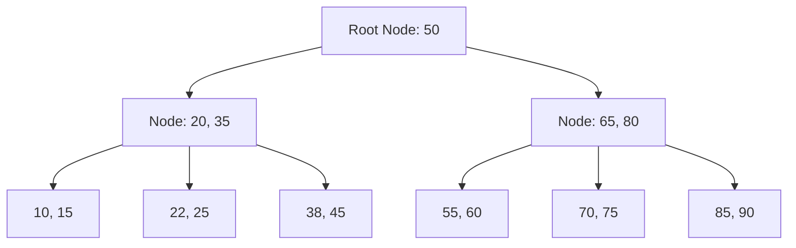

# Database Indexing & Query Optimization

## 1. Index là gì? (Cuốn chỉ mục của thư viện)

Hãy tưởng tượng bạn vào một thư viện có 1 triệu cuốn sách.
- **Không có Index:** Bạn phải đi xem từng cuốn một từ đầu đến cuối để tìm cuốn "Lập trình Java" (Full Table Scan). Mất cả ngày!
- **Có Index:** Bạn đến quầy tra cứu, tìm chữ "L", thấy ghi "Lập trình Java - Kệ 5, Tầng 2". Bạn đi thẳng đến đó lấy sách. Mất 10 giây!

**Bản chất kỹ thuật:** Index là một cấu trúc dữ liệu (thường là **B-Tree**) tách biệt với bảng chính, lưu trữ giá trị của cột và con trỏ (pointer) trỏ đến dòng dữ liệu tương ứng trong ổ cứng.

---

## 2. B-Tree Index - Trái tim của Database

Hầu hết Database (MySQL, Postgres, SQL Server) dùng **B-Tree** làm cấu trúc mặc định cho Index.



**Tại sao lại dùng B-Tree?**
- **Độ sâu cực thấp:** Một cây B-Tree chỉ cần 3-4 tầng là có thể chứa hàng triệu bản ghi. Chỉ cần 3-4 lần đọc ổ cứng là tìm thấy dữ liệu.
- **Duyệt theo khoảng (Range scan):** Các nút lá (Leaf nodes) được nối với nhau, nên tìm các số từ `20` đến `50` cực nhanh.

---

## 3. Các loại Index quan trọng cần nhớ

### 3.1. Single Column Index vs. Composite Index
- **Single:** `CREATE INDEX idx_name ON users(name);`
- **Composite (Nhiều cột):** `CREATE INDEX idx_name_age ON users(name, age);`

> [!IMPORTANT] **Quy tắc Leftmost Prefix (Tiền tố trái):**
> Nếu bạn đánh index `(name, age)`, DB sẽ hỗ trợ tìm theo `name` hoặc `name + age`. Nhưng nếu bạn chỉ tìm theo `age`, Index này **vô dụng**! Hãy tưởng tượng tìm từ điển theo "Tên" rồi đến "Họ", bạn không thể tìm nhanh nếu chỉ nhớ mỗi "Họ".

### 3.2. Covering Index (Index "Bao trùm")
Đây là kỹ thuật tối ưu đỉnh cao. Nếu Index của bạn chứa tất cả các cột mà câu lệnh `SELECT` cần, Database sẽ lấy dữ liệu từ Index luôn mà **không cần sờ vào bảng chính** (Heap).

```sql
-- Tạo Index chứa cả email
CREATE INDEX idx_user_id_email ON users(id, email);

-- Query này chạy cực nhanh vì id và email có sẵn trong Index
SELECT email FROM users WHERE id = 100;
```

---

## 4. Tối ưu Query - Những sai lầm chết người

### 4.1. Tránh tính toán trên cột Index
Nếu bạn dùng hàm trên cột đã đánh Index, DB sẽ **bỏ qua Index** và quét toàn bộ bảng.

```sql
-- ❌ Sai: Quét toàn bộ bảng (Full Scan)
SELECT * FROM orders WHERE YEAR(created_at) = 2024;

-- ✅ Đúng: Dùng khoảng giá trị (Index Seek)
SELECT * FROM orders WHERE created_at >= '2024-01-01' AND created_at < '2025-01-01';
```

### 4.2. "Hung thần" SELECT *
Việc `SELECT *` không chỉ làm tốn băng thông mà còn ngăn cản DB sử dụng **Covering Index** (như đã nói ở trên). Hãy luôn chỉ lấy những cột bạn thực sự cần.

### 4.3. N+1 Query Problem (Cực hay hỏi phỏng vấn)
Xảy ra khi bạn lấy danh sách 100 đơn hàng, sau đó với mỗi đơn hàng, bạn lại gọi 1 câu SQL để lấy thông tin khách hàng. Tổng cộng 1 + 100 = 101 câu SQL!
👉 **Giải pháp:** Dùng `JOIN` hoặc `In-clause` để lấy tất cả trong 1 hoặc 2 câu lệnh.

### 4.4. Đừng đánh Index cho tất cả mọi thứ!
Nhiều bạn nghĩ: "Cứ đánh index hết các cột cho chắc". Đây là sai lầm chết người.

**Tính chọn lọc (Selectivity):**
- Một cột có tính chọn lọc cao (ví dụ: Email, ID) là ứng viên tuyệt vời cho Index.
- Một cột có tính chọn lọc thấp (ví dụ: Giới tính Nam/Nữ, Trạng thái đơn hàng 0/1) thì **đánh Index chỉ làm chậm thêm**. Khi dữ liệu trùng lặp quá nhiều, Database thà quét toàn bộ bảng (Seq Scan) còn nhanh hơn là đi tra cứu từng dòng trong cây Index.

**Chi phí bảo trì:**
Mỗi khi bạn `INSERT` hoặc `UPDATE` một dòng, Database phải cập nhật lại tất cả các cây Index liên quan. Quá nhiều Index sẽ làm hệ thống Ghi của bạn "rùa bò".

---

## 5. EXPLAIN & EXPLAIN ANALYZE (Nhìn thấu Database)

Để biết một câu Query chạy nhanh hay chậm và tại sao, bạn KHÔNG ĐƯỢC đoán. Hãy dùng `EXPLAIN`.

### 5.1. EXPLAIN (Kế hoạch dự kiến)
Cho bạn biết Database **định làm gì** mà không thực sự chạy query.
```sql
EXPLAIN SELECT * FROM users WHERE email = 'huy@example.com';
```

### 5.2. EXPLAIN ANALYZE (Thực tế phũ phàng)
Database sẽ **chạy thật** query đó và đo lường thời gian chính xác từng bước. Đây là công cụ quan trọng nhất để tối ưu.
```sql
EXPLAIN ANALYZE SELECT * FROM orders WHERE customer_id = 123;
```

### 5.3. Các thông số cần đọc
Khi xem kết quả EXPLAIN, hãy chú ý các "từ khóa" sau:

| Thông số | Ý nghĩa | Đánh giá |
|:---|:---|:---|
| **Seq Scan** | Quét toàn bộ bảng từ đầu đến cuối. | ❌ Rất chậm (nếu bảng lớn) |
| **Index Scan** | Tìm kiếm dựa trên Index. | ✅ Nhanh |
| **Index Only Scan** | Chỉ đọc trên Index, không đụng vào bảng chính. | 🚀 Nhanh nhất |
| **cost=0.00..8.30** | Chi phí tính toán ước lượng. | Càng thấp càng tốt |
| **actual time** | Thời gian chạy thực tế (ms). | Con số thực tế cần tối ưu |
| **Rows Removed by Filter** | Số dòng bị loại bỏ sau khi quét. | Càng lớn nghĩa là Index càng kém hiệu quả |

---

## 6. Quy trình 6 bước tối ưu Query (Practical Guide)

Khi gặp một câu Query chạy chậm (ví dụ mất 5 giây), hãy làm theo đúng quy trình sau:

| Bước | Hành động | Mục tiêu |
|:---:|:---|:---|
| **1** | **Bật Slow Query Log** | Xác định chính xác câu SQL nào đang "rùa bò". |
| **2** | **EXPLAIN ANALYZE** | Xem DB đang dùng `Seq Scan` hay `Index Scan`. |
| **3** | **Kiểm tra Index** | Cột trong `WHERE` đã có Index chưa? Có bị vi phạm "Leftmost Prefix" không? |
| **4** | **Viết lại SQL** | Bỏ `SELECT *`, thay Subquery bằng `JOIN`, bỏ hàm bao quanh cột Index. |
| **5** | **Thêm/Sửa Index** | Tạo Composite Index nếu `WHERE` nhiều cột hoặc dùng `Covering Index`. |
| **6** | **Đo đạc lại** | Chạy lại `EXPLAIN ANALYZE` để so sánh thời gian trước và sau. |

---

## 7. Câu hỏi phỏng vấn "Hack não"

> **Q: Index có nhược điểm gì không? Đánh càng nhiều càng tốt à?**
>
> **A:** Không! Index giống như "viết thêm sách hướng dẫn".
> 1. **Tốn bộ nhớ:** Index chiếm diện tích ổ cứng và RAM.
> 2. **Chậm thao tác Ghi (INSERT/UPDATE/DELETE):** Mỗi lần bạn thêm 1 dòng, DB phải cập nhật lại tất cả các cây Index liên quan. Nếu bảng của bạn ghi dữ liệu liên tục (như Log), đánh quá nhiều Index sẽ làm sập hiệu năng ghi.

> **Q: Sự khác biệt giữa B-Tree và Hash Index?**
>
> **A:** B-Tree hỗ trợ tìm theo khoảng (`>`, `<`, `BETWEEN`) và sắp xếp. Hash Index chỉ hỗ trợ tìm chính xác (`=`) nhưng tốc độ là O(1) - nhanh tuyệt đối. Thường Hash Index chỉ dùng trong RAM (như Redis).

---

## 8. Checklist Tối ưu hóa Database

- [ ] Đã đánh Index cho các cột trong `WHERE`, `JOIN` và `ORDER BY` chưa?
- [ ] Có cột nào bị `SELECT *` dư thừa không?
- [ ] Các câu Query phức tạp đã có `EXPLAIN` để kiểm tra có dùng Index không chưa?
- [ ] Các cột Index có bị dùng hàm (YEAR, MONTH, UPPER...) bao quanh không?
- [ ] Bảng có quá nhiều Index (trên 5-7 cái) làm chậm thao tác Ghi không?
- [ ] Đã dùng Keyset Pagination (ID > N) thay cho OFFSET chưa (nếu data lớn)?
