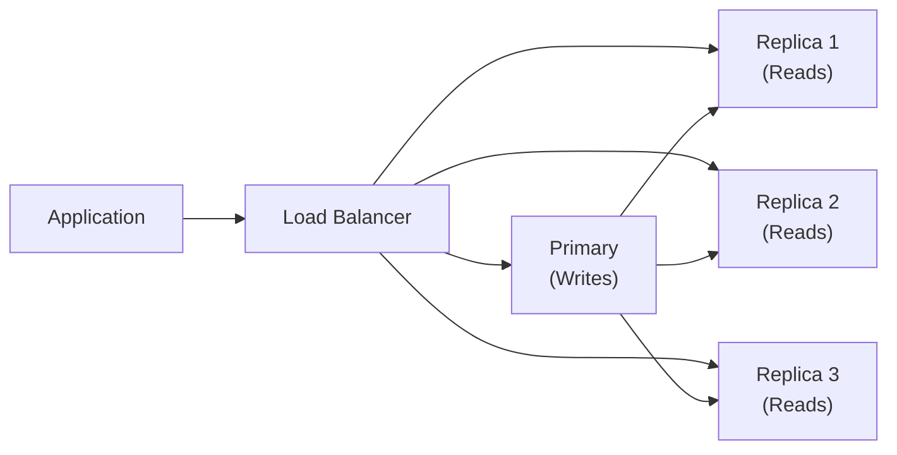

# Database -> Replication & High Availability

## Cac loai Replication

### Master-Slave (Primary-Replica)

Mot node (primary/master) chap nhan writes. Mot hoac nhieu replica nodes replicate data tu primary. Cac read queries co the duoc phan phoi den replicas.

```
Write ──► Primary (RW)
                │
                ├──► Replica 1 (RO)
                ├──► Replica 2 (RO)
                └──► Replica N (RO)
```

**Cau hinh MySQL:**
```ini
# Primary (my.cnf)
server-id = 1
log_bin = /var/log/mysql/mysql-bin
binlog_format = ROW

# Replica (my.cnf)
server-id = 2
relay_log = /var/log/mysql/mysql-relay-bin
log_slave_updates = 1
read_only = 1
```

```sql
-- Tren Primary: tao replication user
CREATE USER 'repl'@'%' IDENTIFIED WITH mysql_native_password BY 'password';
GRANT REPLICATION SLAVE ON *.* TO 'repl'@'%';

-- Tren Replica: bat dau replication
CHANGE MASTER TO
    MASTER_HOST = 'primary-host',
    MASTER_USER = 'repl',
    MASTER_PASSWORD = 'password',
    MASTER_LOG_FILE = 'mysql-bin.000001',
    MASTER_LOG_POS = 157;

START SLAVE;
SHOW SLAVE STATUS\G
```

### Master-Master (Multi-Primary)

Hai hoac nhieu nodes chap nhan writes. Moi node vua la primary vua la replica cua node khac. Writes co the di den bat ky node nao.

```
        ◄───────────────────►
        │                   │
        ▼                   ▼
  ┌─────────┐         ┌─────────┐
  │ Node A  │◄───────►│ Node B  │
  │  (RW)   │         │  (RW)   │
  └─────────┘         └─────────┘
```

| Khia canh | Master-Slave | Master-Master |
|-----------|-------------|---------------|
| **Write nodes** | 1 (chi primary) | Nhieu (tat ca nodes) |
| **Risk conflict** | Khong co (writes di mot noi) | Cao (writes dong thoi cung rows) |
| **Failover** | Don gian (promote replica) | Phuc tap (can conflict resolution) |
| **Use case** | Doc scaling, DR | Active-active cho nhieu sites |

### Slave Replication (Replica Only)

Read replicas phuc vu cac read-only queries, giam tai load tren primary. Day la setup replication pho bien nhat.

```sql
-- Application routing strategy
public DataSource selectDataSource() {
    // 80% reads di den replica pool
    if (Math.random() < 0.8) {
        return replicaDataSource;
    }
    // 20% + tat ca writes di den primary
    return primaryDataSource;
}
```

---

## Synchronous vs Asynchronous Replication

### Asynchronous Replication

Primary write noi bo, gui event den replicas, va xac nhan write cho client ma khong cho replicas xac nhan.

- **Pros**: Primary write nhanh, khong choi replica network latency.
- **Cons**: Co the mat data neu primary fail truoc khi replicas nhan duoc update (replication lag).

Hầu hết databases su dung asynchronous replication mac dinh.

### Synchronous Replication

Primary choi cho den khi tat ca (hoac quorum cua) replicas xac nhan write truoc khi xac nhan cho client.

- **Pros**: Khong mat data.
- **Cons**: Write latency bang network round-trip den slowest replica.

```sql
-- PostgreSQL: synchronous replication config
synchronous_commit = on  # choi cho all
synchronous_commit = remote_apply  # choi cho den khi applied
synchronous_standby_names = 'replica1,replica2'
```

```ini
# MySQL: semi-synchronous replication
plugin-load = "rpl_semi_sync_master=semisync_master.so;rpl_semi_sync_slave=semisync_slave.so"
rpl-semi-sync-master-wait-for-slave-count = 1
```

### Semi-Synchronous Replication

Mot giai phap trung gian: primary choi cho it nhat mot replica xac nhan nhan duoc (nhung khong nhat thiet apply) truoc khi xac nhan cho client.

---

## Replication Lag

Replication lag la thoi gian tre giua mot write tren primary va su phan anh cua no tren replica.

### Nguyen nhan

- Network latency giua primary va replica.
- Replica dang bi nang doc nang (khong the theo kip replication).
- Large transactions tren primary.
- Replica hardware cham hon primary (I/O, CPU, disk throughput).

### Tac dong

```sql
-- User dang mot comment
INSERT INTO comments (user_id, content) VALUES (1, 'Hello');

-- Ngay lap tuc doc lai (tren replica)
SELECT * FROM comments WHERE user_id = 1;
-- Comment co the chua thay vi (replication lag)
```

### Do lag

```sql
-- MySQL
SHOW SLAVE STATUS\G
-- Cac cot quan trong:
--   Seconds_Behind_Master: lag tinh bang giay
--   Slave_IO_Running: YES neu IO thread dang chay
--   Slave_SQL_Running: YES neu SQL thread dang chay

-- PostgreSQL
SELECT * FROM pg_stat_replication;
--   client_addr: replica IP
--   sent_lsn: last WAL da gui
--   write_lsn: last WAL da viet tren replica
--   flush_lsn: last WAL da flush ra disk tren replica
--   replay_lsn: last WAL da apply tren replica
--   lag: thoi gian chay sau primary
```

### Giai quyet Lag

- Dinh tuyen reads den primary khi can do dai.
- Monitor lag va alert khi no vuot nguong.
- Su dung connection poolers (PgBouncer) voi replication-aware routing.
- Toi uu hoa replica hardware de khop voi primary.

---

## Failover

Failover la qua trinh tu dong hoac thu cong promote mot replica thanh primary khi primary fail.

### Tu dong vs Thu cong

| Loai | Mo ta | Pros | Cons |
|------|-------|------|------|
| **Thu cong** | Admin thu cong promote replica | Toan quyen kiem soat | Cham, nguy co loi nhan suat |
| **Tu dong** | Cluster manager phat hien fail va promote | Nhanh, khong co delay nhan suat | Co the promote sai |

### Qua trinh Failover

```
1. Phat hien: Primary fail duoc phat hien (heartbeat timeout)
2. Xac nhan: Xac nhan primary that su down (khong phai chi la network blip)
3. Promote: Chon replica tot nhat (cao nhat) va promote
4. Routing: Cap nhat connection strings / VIP / DNS
5. Tich hop lai: Cac replicas con lai tro den primary moi
```

### VIP (Virtual IP) Migration

```bash
# Cau hinh keepalived cho VIP failover
vrrp_instance VI_1 {
    state BACKUP           # ca hai nodes bat dau la BACKUP
    interface eth0
    virtual_router_id 51
    priority 100           # primary co 100, replica co 90
    advert_int 1
    virtual_ipaddress {
        192.168.1.100/24   # Virtual IP
    }
    notify_master "/usr/local/bin/promote.sh"
}
```

### DNS Switching

```
Truoc failover:
  db.example.com -> 192.168.1.10 (Primary)

Sau failover:
  db.example.com -> 192.168.1.11 (New Primary)
  # TTL nen thap (60 seconds) de switchover nhanh
```

### Switchover vs Failover

- **Failover**: Khong du ke hoach, tu dong hoac thu cong (primary crash).
- **Switchover**: Du ke hoach, thu cong (primary xuong bao tri).

---

## Cac giai phap HA

### Pacemaker + Corosync

Cluster resource manager open-source cho Linux. Quan ly VIP, filesystem, va database failover.

```bash
# Install
yum install pacemaker pcs corosync

# Cau hinh cluster
pcs cluster setup --name mycluster node1 node2
pcs cluster start --all

# Tao VIP resource
pcs resource create db_vip ocf:heartbeat:IPaddr2 \
    ip=192.168.1.100 cidr_netmask=24 \
    op monitor interval=30s

# Tao database resource (Vi du PostgreSQL)
pcs resource create pgsql ocf:heartbeat:pgsqlms \
    pgdata=/var/lib/pgsql/data \
    op monitor interval=30s

# Colocation: VIP va DB tren cung mot node
pcs constraint colocation add db_vip pgsql INFINITY

# Ordering: DB truoc, sau do VIP
pcs constraint order pgsql then db_vip
```

### PgBouncer

Connection pooler cho PostgreSQL nam giua application va database. Giam connection overhead va co the dinh tuyen queries den replicas.

```ini
[databases]
mydb = host=primary port=5432 dbname=mydb
mydb_readonly = host=replica port=5432 dbname=mydb

[pgbouncer]
listen_addr = 0.0.0.0
listen_port = 6432
auth_type = md5
auth_file = userlist.txt
pool_mode = transaction
max_client_conn = 1000
default_pool_size = 20
server_idle_timeout = 600
```

```java
// Application ket noi PgBouncer thay vi truc tiep vao DB
// PgBouncer xu ly connection pooling va routing
String url = "jdbc:postgresql://pgbouncer:6432/mydb";
```

### Keepalived

Dung cho VIP failover o muc network:

```bash
# keepalived.conf
vrrp_instance VI_1 {
    state BACKUP
    interface ens33
    virtual_router_id 51
    priority 100
    advert_int 1
    authentication {
        auth_type PASS
        auth_pass 1111
    }
    virtual_ipaddress {
        192.168.1.100
    }
    notify_master /opt/scripts/become_master.sh
    notify_backup /opt/scripts/become_backup.sh
}
```

### Orchestrator (MySQL)

Cong cu quan ly MySQL replication va failover:

```bash
# Kiem tra topology
orchestrator -c discover -i myhost:3306

# Hien thi topology
orchestrator -c topology -i myhost:3306

# Failover thu cong
orchestrator -c graceful-master-takeover -i myhost:3306 -d mydb
```

---

## Read Replicas cho Scaling

Read replicas cho phep ban scale read-heavy workloads bang cach phan phoi reads qua nhieu replicas.



```java
// Read-write splitting voi Spring
@Bean
public DataSource routingDataSource(
        DataSource primary,
        DataSource replica1,
        DataSource replica2) {

    Map<Object, Object> dataSources = new HashMap<>();
    dataSources.put("primary", primary);
    dataSources.put("replica1", replica1);
    dataSources.put("replica2", replica2);

    RoutingDataSource rds = new RoutingDataSource();
    rds.setDefaultTargetDataSource(primary);
    rds.setTargetDataSources(dataSources);
    return rds;
}

// Trong service layer
@Transactional(readOnly = true)  // dinh tuyen den replica
public List<User> getUsers() { ... }

@Transactional(readOnly = false)  // dinh tuyen den primary
public void updateUser(Long id, String name) { ... }
```

---

## Consensus Protocols: Raft & Paxos

### Raft

Raft la mot consensus algorithm thiet ke de de hieu. No bat dau mot leader de quan ly log replication.

```
Raft Leader Election:

Term 1:  Node A (votes: A)      Node B (votes: A)      Node C (votes: A)
        ┌─────────┐              ┌─────────┐              ┌─────────┐
        │  Node   │              │  Node   │              │  Node   │
        │    A    │              │    B    │              │    C    │
        │  LEADER │              │FOLLOWER │              │FOLLOWER │
        └─────────┘              └─────────┘              └─────────┘

        A nhan duoc votes tu B va C → tro thanh Leader
```

Raft dam bao: **Leader election**, **Log replication** (majority writes), va **Safety** (chi mot leader moi term).

### Paxos

Paxos la nen tang ly thuyet cua distributed consensus. Hai phases:

1. **Prepare**: Leader (proposer) hoi majority de prepare.
2. **Accept**: Leader de xuat gia tri, majority phai accept.

Ca Raft va Paxos deu yeu cau **majority (quorum)** cua nodes dong y. Voi 3 nodes, co the chiu 1 fail. Voi 5 nodes, co the chiu 2 fails.

### Van de Split-Brain

Split-brain xay ra khi mot network partition chia cluster thanh hai hoac nhieu phan, moi phan tin rang phan kia da chet. Ca hai ben co the thu tro thanh primary.

```
Network Partition:

  Side A                      Side B
┌─────────┐                ┌─────────┐
│ Node A  │ ── X ─ X ─ X ─ │ Node B  │
│(thinks B│                │(thinks A│
│ is down)│                │ is down)│
└─────────┘                └─────────┘

Ket qua: Ca A va B co the thu accept writes
→ Data inconsistency (split-brain)
```

### Phong chong Split-Brain

- **Quorum**: Yeu cau majority cho writes (Raft/Paxos). Neu mot node khong the dat duoc majority, no ngung chap nhan writes.
- **Fencing**: Khi mot leader moi duoc bat dau, no phat hanh mot fencing token ma leader cu phai trinh bay de chap nhan writes.
- **Witness/Sidecar**: Mot so le nodes dam bao quorum luon co the dat duoc.
- **Redundant networking**: Nhieu network paths giua cac nodes.

---

## Cau hoi phong van thuong gap

> **Replication lag la gi va xu ly nhu the nao?**
>
> Replication lag la do tre giua mot write tren primary va su xuat hien cua no tren replica. Cho cac ung dung can read-after-write consistency, dinh tuyen reads den primary. Cho reporting/analytics co the chap nhan data hoi cu, replicas la ok. Monitor lag voi `SHOW SLAVE STATUS` (MySQL) hoac `pg_stat_replication` (PostgreSQL) va alert khi no vuot nguong.

> **Synchronous va asynchronous replication khac nhau the nao?**
>
> Asynchronous: primary write noi bo va xac nhan ngay lap tuc, replicate den replicas o background. Writes nhanh nhung data co the mat neu primary fail. Synchronous: primary choi cho replica xac nhan truoc khi xac nhan cho client. Khong mat data nhung write latency cao hon. Semi-synchronous la mot compromise: choi cho it nhat mot replica nhan duoc, nhung khong nhat thiet apply, write.

> **Split-brain la gi va phong chong nhu the nao?**
>
> Split-brain xay ra khi network partition chia cluster sao cho ca hai ben deu nghi ben kia da chet va ca hai deu thu accept writes, gay ra data inconsistency. Phong chong: quorum-based writes (majority phai dong y), fencing tokens (leader moi vo hieu hoa leader cu), va witness nodes cho cluster voi so chan.

> **Thiet ke HA cho PostgreSQL nhu the nao?**
>
> Su dung streaming replication de tao hot standbys. Su dung PgBouncer nhu connection pooler. Deploy voi Pacemaker+Corosync cho automatic failover cua VIP va database promotion. Dat `synchronous_commit = on` neu yeu cau khong mat data. Su dung replication slots de dam bao WAL khong bi discard truoc khi replicas nhan duoc. Test failover deu deu.
