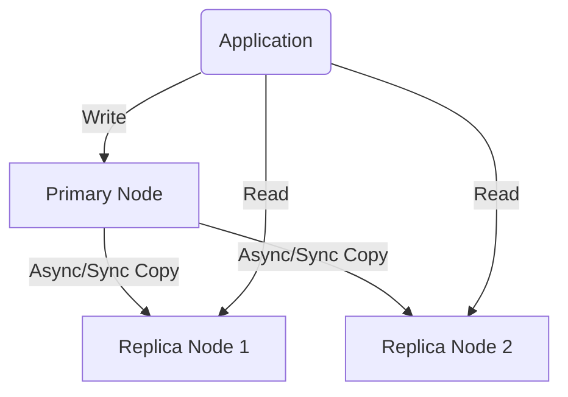

# Database Replication & High Availability (HA)

## 1. Replication là gì?

**Replication** (Sao chép) là cơ chế tự động copy dữ liệu từ một node chính (**Primary/Source**) sang một hoặc nhiều node phụ (**Replica/Standby**).

### Tại sao cần Replication?
- **Scale Read:** Chia bớt tải "Đọc" cho các node phụ, giúp hệ thống chịu tải tốt hơn.
- **Tính sẵn sàng (High Availability):** Nếu node chính chết, vẫn còn node phụ dự phòng.
- **Disaster Recovery:** Bảo vệ dữ liệu nếu một trung tâm dữ liệu (Data Center) gặp sự cố.

---

## 2. Các mô hình Replication phổ biến

### 2.1. Primary - Replica (Phổ biến nhất)
Chỉ một node được quyền Ghi (Write), các node khác chỉ phục vụ Đọc (Read).



- **Ưu điểm:** Đơn giản, dễ quản lý, giải quyết tốt bài toán Scale Read.
- **Nhược điểm:** Node Primary vẫn là "nút thắt" khi Ghi (Write Bottleneck). Có độ trễ dữ liệu (**Replication Lag**).

### 2.2. Multi-Primary (Nhiều điểm ghi)
Nhiều node cùng có quyền Ghi. Mô hình này cực kỳ phức tạp vì phải xử lý xung đột dữ liệu (Conflict) và thứ tự ghi.
- **Dùng khi:** Cần Active-Active đa vùng địa lý (Multi-region).

---

## 3. Cơ chế đồng bộ: Sync vs. Async vs. Semi-Sync

Đây là phần cốt lõi để trả lời phỏng vấn về độ tin cậy của hệ thống.

| Cơ chế | Cách hoạt động | Ưu điểm | Nhược điểm |
|:---:|:---|:---|:---|
| **Asynchronous** (Bất đồng bộ) | Primary ghi xong báo ngay cho Client, sau đó mới đẩy sang Replica. | **Write nhanh nhất.** Không phụ thuộc mạng. | **Dễ mất dữ liệu** mới nhất nếu Primary chết trước khi kịp đẩy sang Replica. |
| **Synchronous** (Đồng bộ) | Primary đợi **tất cả** Replica xác nhận đã ghi xong mới báo Client. | **An toàn tuyệt đối.** Dữ liệu các node luôn giống hệt nhau. | **Write siêu chậm.** Nếu một Replica gặp sự cố mạng, cả hệ thống Ghi sẽ bị treo. |
| **Semi-Sync** (Bán đồng bộ) | Primary chỉ đợi **ít nhất 1** Replica xác nhận là đủ. | Cân bằng giữa tốc độ và an toàn. | Latency vẫn cao hơn Async. |

---

## 4. Replication Lag - "Cơn ác mộng" của lập trình viên

**Replication Lag** là khoảng thời gian trễ từ lúc dữ liệu được ghi ở Primary đến khi nó xuất hiện ở Replica.

### Hệ quả: Mất tính nhất quán "Đọc ngay sau khi Ghi" (Read-after-write consistency)
**Ví dụ:**
1. User vừa đăng một Comment (Ghi vào Primary).
2. Trang web tự Load lại, gọi API lấy danh sách Comment (Đọc từ Replica).
3. Vì Lag, Replica chưa kịp cập nhật -> User không thấy Comment mình vừa đăng -> Tưởng lỗi.

### Cách xử lý:
- Các request quan trọng (như Dashboard quản trị, thanh toán) -> **Bắt buộc đọc từ Primary**.
- Request không quá nhạy cảm (như feed tin tức, thống kê) -> Đọc từ Replica.
- Tối ưu I/O, Network và tránh các Transaction quá lớn.

---

## 5. Cấu hình & Theo dõi (Thực tế)

### PostgreSQL:
Theo dõi trạng thái các node phụ qua bảng `pg_stat_replication`:
```sql
SELECT application_name, state, sync_state, write_lag, flush_lag, replay_lag 
FROM pg_stat_replication;
```

### MySQL 8+:
Dùng lệnh `SHOW REPLICA STATUS` (Lưu ý MySQL 8 dùng Source/Replica thay cho Master/Slave):
```sql
SHOW REPLICA STATUS\G
-- Các trường quan trọng:
-- Seconds_Behind_Source: Độ trễ tính bằng giây.
-- Replica_IO_Running: Luồng nhận dữ liệu có đang chạy không.
-- Replica_SQL_Running: Luồng thực thi dữ liệu có đang chạy không.
```

---

## 6. Failover & Split-brain

- **Failover:** Là quá trình "đôn" một Replica lên làm Primary khi Primary cũ gặp sự cố.
- **Split-brain (Chia cắt não):** Là lỗi cực kỳ nguy hiểm khi 2 node cùng tưởng mình là Primary và cùng nhận Ghi. 
  - **Hậu quả:** Dữ liệu bị sai lệch hoàn toàn ở hai phía.
  - **Giải pháp:** Dùng cơ chế bầu chọn theo đa số (Quorum/Majority) hoặc các công cụ tự động như **Patroni** (Postgres), **Orchestrator** (MySQL).

---

## 7. Best Practices

1. **Tách luồng Read/Write rõ ràng:** Trong code ứng dụng nên có 2 Connection String riêng biệt.
2. **Monitor Lag liên tục:** Đặt Alert nếu Lag vượt quá ngưỡng (ví dụ > 5 giây).
3. **Diễn tập Failover:** Đừng đợi đến lúc sự cố thật mới biết hệ thống tự động nhảy node có chạy hay không.
4. **Tránh Multi-Primary:** Nếu không thực sự cần thiết vì độ phức tạp của nó rất cao.

---

## 8. Câu hỏi phỏng vấn thường gặp

> **Q: Làm sao để đảm bảo User luôn thấy dữ liệu mình vừa mới sửa?**
>
> **A:** Với các dữ liệu do chính User đó vừa sửa, chúng ta nên hướng luồng đọc về **Primary** trong một khoảng thời gian nhất định (ví dụ 10-20s), hoặc dùng cơ chế Versioning/Session-based consistency.

> **Q: Replication và Backup khác nhau thế nào?**
>
> **A:** Replication là sao chép **Real-time** (ngay lập tức). Nếu bạn lỡ tay chạy `DELETE *` ở Primary, nó sẽ xóa luôn ở Replica trong tích tắc. **Backup** là bản chụp dữ liệu tại một thời điểm quá khứ (ví dụ 2h sáng). Nếu lỡ xóa nhầm, bạn chỉ có thể khôi phục từ bản Backup. **Phải có cả hai, không cái nào thay thế cái nào.**
