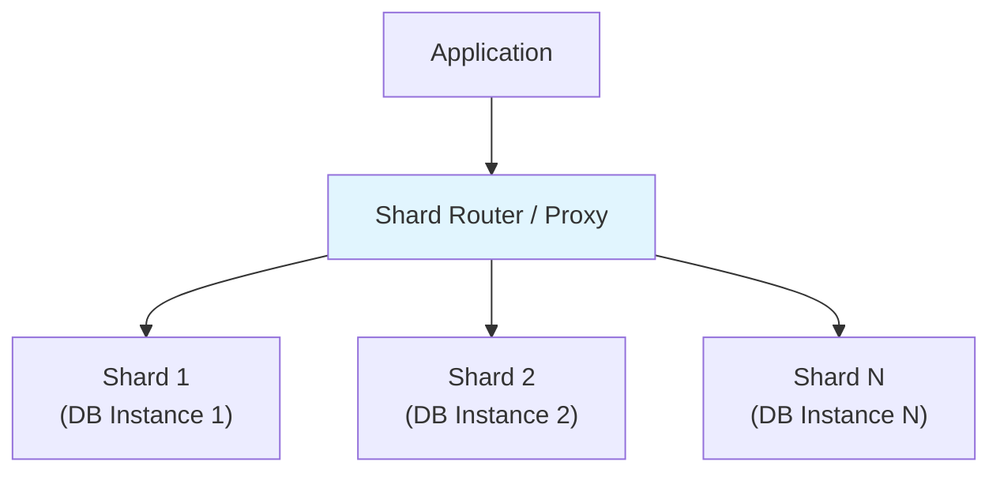

# Database -> Sharding & Partitioning

## Horizontal vs Vertical Partitioning (Sharding)

### Vertical Partitioning

Chia database theo **columns** (cac truong) thanh cac bang hoac database khac nhau. Cac bang duoc truy cap cung nhau se o cung nhau; cac cot it duoc truy cap hon duoc chuyen sang bang rieng.

```
Before:
┌─────────────────────────────────┐
│          users                  │
│  id | name | bio | avatar_url   │
└─────────────────────────────────┘

After:
┌──────────────┐   ┌──────────────────┐
│ users_core   │   │ users_extended  │
│ id | name    │   │ id | bio | avatar│
└──────────────┘   └──────────────────┘
```

Vi du: Chuyen `avatar_url` va `bio` (cac cot lon, it duoc truy cap) sang bang rieng vi chung gay bao phong data.

### Horizontal Partitioning (Sharding)

Chia bang theo **rows** thanh nhieu partitions hoac shards, moi cai tren mot vi tri vat ly khac nhau. Moi shard chua mot tap con cac rows.

```
Before:
┌─────────────────────────────────────┐
│             orders                   │
│ id | user_id | total | created_at   │
│ 1  | 100      | 250   | 2024-01-01  │
│ 2  | 101      | 180   | 2024-01-02  │
│ 3  | 100      | 320   | 2024-01-03  │
│ 4  | 102      | 90    | 2024-01-04  │
└─────────────────────────────────────┘

After (by user_id range):
┌─────────────────┐   ┌─────────────────┐
│  shard_0 (0-50)  │   │  shard_1 (51+)  │
│  orders 1,3      │   │  orders 2,4     │
└─────────────────┘   └─────────────────┘
```

| Khia canh | Vertical Partitioning | Horizontal Partitioning (Sharding) |
|-----------|----------------------|-----------------------------------|
| **Chia theo** | Cot | Dong |
| **Muc dich** | Hieu nang, luu tru | Hieu nang, scale, dung luong data |
| **Do phuc tap** | Thap | Cao |
| **Anh huong query** | Co the can JOINs qua cac partitions | Queries phai bao gom shard key |

---

## Database Partitioning (Internal)

Partitioning la **database-level** feature chia mot bang thanh nhieu physical segments (partitions), trong khi bang van xuat hien nhu mot entity logic duy nhat voi applications.

### Range Partitioning

Rows duoc phan phoi dua tren mot range cac gia tri cua partition key.

```sql
CREATE TABLE orders (
    id BIGSERIAL,
    user_id BIGINT,
    total DECIMAL(10,2),
    created_at DATE
) PARTITION BY RANGE (created_at);

-- Tao partitions cho cac range cu the
CREATE TABLE orders_2024_Q1 PARTITION OF orders
    FOR VALUES FROM ('2024-01-01') TO ('2024-04-01');

CREATE TABLE orders_2024_Q2 PARTITION OF orders
    FOR VALUES FROM ('2024-04-01') TO ('2024-07-01');

CREATE TABLE orders_2024_Q3 PARTITION OF orders
    FOR VALUES FROM ('2024-07-01') TO ('2024-10-01');

CREATE TABLE orders_2024_Q4 PARTITION OF orders
    FOR VALUES FROM ('2024-10-01') TO ('2025-01-01');

-- Catch-all partition cho data tuong lai
CREATE TABLE orders_future PARTITION OF orders
    FOR VALUES FROM ('2025-01-01') TO (MAXVALUE);
```

Tot cho: Time-series data, data voi natural ranges (dates, numeric IDs).

### List Partitioning

Rows duoc phan phoi dua tren mot tap cac gia tri roi rac.

```sql
CREATE TABLE users (
    id BIGSERIAL,
    username VARCHAR(100),
    country VARCHAR(50)
) PARTITION BY LIST (country);

CREATE TABLE users_asia PARTITION OF users
    FOR VALUES IN ('Vietnam', 'Thailand', 'Japan', 'Korea');

CREATE TABLE users_europe PARTITION OF users
    FOR VALUES IN ('Germany', 'France', 'UK', 'Spain');

CREATE TABLE users_other PARTITION OF users
    FOR VALUES IN (DEFAULT);
```

Tot cho: Data tu nhien duoc nhom theo discrete categories (country, region, category).

### Hash Partitioning

Rows duoc phan phoi dua tren ham hash ap dung vao partition key.

```sql
CREATE TABLE transactions (
    id BIGSERIAL,
    user_id BIGINT,
    amount DECIMAL(10,2),
    created_at TIMESTAMP
) PARTITION BY HASH (user_id);

-- Tao 4 hash partitions
CREATE TABLE transactions_p0 PARTITION OF transactions
    FOR VALUES WITH (MODULUS 4, REMAINDER 0);
CREATE TABLE transactions_p1 PARTITION OF transactions
    FOR VALUES WITH (MODULUS 4, REMAINDER 1);
CREATE TABLE transactions_p2 PARTITION OF transactions
    FOR VALUES WITH (MODULUS 4, REMAINDER 2);
CREATE TABLE transactions_p3 PARTITION OF transactions
    FOR VALUES WITH (MODULUS 4, REMAINDER 3);
```

Tot cho: Phan phoi deu khi khong co natural range ton tai. Dung de phan phoi deu data.

### Composite Partitioning

Ket hop hai phuong phap partitioning. Vi du, RANGE tren date + HASH tren user_id.

```sql
CREATE TABLE events (
    id BIGSERIAL,
    user_id BIGINT,
    event_type VARCHAR(50),
    created_at TIMESTAMP
) PARTITION BY RANGE (created_at) SUBPARTITION BY HASH (user_id) SUBPARTITIONS 4;

CREATE TABLE events_2024 PARTITION OF events
    FOR VALUES FROM ('2024-01-01') TO ('2025-01-01');
```

---

## Loi ich cua Partitioning

### 1. Hieu nang Query (Partition Pruning)

Query optimizer bo qua cac partitions khong lien quan.

```sql
-- Khong co partition pruning: scan tat ca partitions
SELECT * FROM orders WHERE created_at BETWEEN '2024-03-01' AND '2024-03-31';

-- Voi range partitioning theo date: chi Q1 partition duoc scan
-- PostgreSQL tu dong prune cac partitions khac
```

```sql
-- EXPLAIN output cho thay partition pruning:
EXPLAIN SELECT * FROM orders WHERE created_at = '2024-03-15';

-- Output bao gom:
--   -> Parallel Seq Scan on orders_2024_Q1 ...
-- (cac partitions khac khong duoc cham toi)
```

### 2. Luu tru va Xoa Data

De dang archive data cu bang cach detach partitions:

```sql
-- Detach old partition
ALTER TABLE orders DETACH PARTITION orders_2023_Q1;

-- Chuyen sang archive table
ALTER TABLE orders_2023_Q1 SET SCHEMA archive;

-- Hoac drop hoan toan (nhanh!)
DROP TABLE orders_2023_Q1;
```

So sanh voi deleting rows: `DELETE FROM orders WHERE created_at < '2023-04-01'` se cham va generate massive WAL logs. Dropping mot partition la gần nhu tức thì.

### 3. Cac thao tac Bao tri

```sql
-- Rebuild index tren mot partition (nhanh hon, it locking)
REINDEX TABLE PARTITION orders_2024_Q1;

-- VACUUM mot partition cu the
VACUUM orders_2024_Q1;

-- ANALYZE partition statistics
ANALYZE orders_2024_Q1;
```

### 4. Hieu nang Bulk Load

Loading data vao mot partition cu the nhanh hon va khong anh huong cac partitions khac.

---

## Sharding Architecture

Sharding phan phoi data qua **nhieu database instances** (shards). Khac voi partitioning (cung DB, cac files khac nhau), sharding co data tren cac server khac nhau.

### Application-Level Sharding

Application dinh tuyen queries den dung shard dua tren shard key.

```java
public class ShardRouter {

    private final Map<Integer, DataSource> shards;

    public DataSource getShardForUserId(Long userId) {
        int shardIndex = (int) (userId % shards.size());
        return shards.get(shardIndex);
    }

    public List<Order> getUserOrders(Long userId) {
        DataSource shard = getShardForUserId(userId);
        try (Connection conn = shard.getConnection()) {
            return jdbcTemplate.query(conn,
                "SELECT * FROM orders WHERE user_id = ?", userId);
        }
    }
}
```

### Lua chon Shard Key

Shard key xac dinh phan phoi data. Mot key yeu gay ra hotspots.

Shard key tot: `user_id` (high cardinality, phan phoi deu)
Shard key xau: `status` (chi it gia tri, phan phoi khong deu)

### Cac loai Architecture



| Architecture | Mo ta | Vi du |
|-------------|-------|-------|
| **Application-level** | App quyet dinh shard nao | Custom routing logic |
| **Proxy-based** | Middleware dinh tuyen queries | Vitess, Apache ShardingSphere |
| **Shared-nothing** | Moi shard la server doc lap | Hầu hết các sharding solutions |
| **Shared-disk** | Tat ca shards truy cap cung disk | Oracle RAC |
| **Shared-storage** | Tat ca shards chia se storage | Một số cloud DBs |

---

## Sharding Strategies

### Hash-Based Sharding

```java
// Shard = hash(key) % number_of_shards
int shardIndex = Math.abs(userId.hashCode()) % 4;
```

- **Pros**: Phan phoi deu, de implement.
- **Cons**: Them/xoa shards yeu cau reshard toan bo data.

### Range-Based Sharding

```sql
-- Dua tren user_id ranges
Shard 1: user_id 1 - 1,000,000
Shard 2: user_id 1,000,001 - 2,000,000
Shard 3: user_id 2,000,001 - 3,000,000
```

- **Pros**: De query ranges, thu tu tu nhien.
- **Cons**: Hotspots neu newer IDs duoc truy cap nhieu hon.

### Directory-Based Sharding

Mot bang lookup map shard keys den shard locations.

```sql
CREATE TABLE shard_map (
    shard_key VARCHAR(100) PRIMARY KEY,
    shard_id INT
);

-- Lookup
SELECT shard_id FROM shard_map WHERE shard_key = 'user:1001';
```

- **Pros**: Linh hoat, co the rebalance khong can move data.
- **Cons**: Query lookup them, directory co the tro thanh bottleneck.

---

## Sharding Challenges

### Cross-Shard Queries

Queries tra cuu nhieu shards la yeu toi vi phai merge results tu nhieu nguon.

```sql
-- Van de: Lay orders tu nhieu shards
-- Neu orders duoc shard theo user_id, query nhu nay can tat ca shards:
SELECT * FROM orders WHERE created_at > '2024-01-01'
-- (Khong co user_id filter, nen TAT CA shards phai duoc query)
```

Giai phap:
- **Denormalization**: Luu mot ban sao data lien quan tren moi shard.
- **Scatter-gather**: Query tat ca shards va merge results (yeu).
- **ESR pattern**: Thuc hien queries tren mot shard khi co the.

### Cross-Shard Joins

```java
// Xau: Join yeu cau nhieu shards
SELECT o.*, u.name FROM orders o
JOIN users u ON o.user_id = u.id
WHERE u.country = 'Vietnam'

// Tot hon: Join o application-level
// 1. Query shard(s) cho users o Vietnam -> lay user IDs
// 2. Dinh tuyen den shard cu the cho cac user IDs do -> lay orders
```

### Cross-Shard Transactions (2PC)

Distributed transactions qua cac shards cực kỳ phức tạp:

```java
@Transactional
public void transfer(Long fromUserId, Long toUserId, BigDecimal amount) {
    // Phai debit tu mot shard va credit tren shard khac
    // Khong co distributed transaction: partial failure co the xay ra
    debitAccount(fromUserId, amount);   // Shard A
    creditAccount(toUserId, amount);     // Shard B
    // Neu creditAccount that bai, tien bi mat
}
```

Giai phap: **Two-Phase Commit (2PC)**, Saga pattern, hoac tranh hoan toan cross-shard transactions.

### Rebalancing

Khi mot shard qua lon hoac phan phoi khong deu, can phai move data.

1. Tao new shard layout.
2. Backfill data den new shards.
3. Update routing.
4. Decommission old shards.

Day la operation phuc tap va thuong yeu cau downtime hoac mot giai doan dual-write.

---

## Vi du: MongoDB Sharding, Vitess, CockroachDB

### MongoDB Sharding

MongoDB cung cap built-in sharding voi phan phoi data tu dong.

```javascript
// Enable sharding tren mot database
sh.enableSharding("mydb")

// Shard collection theo user_id (hashed)
sh.shardCollection("mydb.orders", { "user_id": "hashed" })

// Shard theo range (vd: region)
sh.shardCollection("mydb.users", { "country": 1, "user_id": 1 })
```

```javascript
// Xem shard status
sh.status()

// Balancer tu dong di chuyen chunks giua cac shards
// de giu data phan phoi deu
```

Khai niem quan trong: **Chunks** (data segments, mac dinh 64MB), **Shard keys**, **Balancer** (tu dong rebalance), **Config servers** (metadata).

### Vitess (MySQL Sharding Solution cua YouTube)

Vitess nam giua MySQL va cung cap horizontal sharding:

```yaml
# vtgate configuration
vtgate:
  cells:
    - cell1
  tablet_types_to_wait:
    - PRIMARY
    - REPLICA

# Keyspace (sharded database)
keyspace:
  name: commerce
  type: sharded
  shard_count: 4
```

```sql
-- Vitess dinh tuyen queries dua tren shard key
-- Application truy van qua vtgate (SQL proxy)
-- Vitess xu ly routing, filtering, va merging
SELECT * FROM orders WHERE user_id = 1001;
-- Dinh tuyen den dung shard dua tren user_id
```

Features: Connection pooling, query routing, automated resharding, read replicas, va OLAP workloads qua Vitess vtgate.

### CockroachDB

CockroachDB la mot distributed SQL database xu ly sharding tu dong:

```sql
-- CockroachDB tu dong shard va replicate data
-- Khong can cau hinh sharding thu cong

-- Cau hinh zones cho data placement
ALTER DATABASE mydb CONFIGURE ZONE USING
  num_replicas = 5,
  gc.ttlseconds = 3600;

-- Kiem tra phan phoi data
SHOW RANGES FROM TABLE orders;
```

Features quan trong: **Automatic sharding** (data duoc chia thanh ranges 64MB), **Raft consensus** cho replication, **Distributed transactions** (khong co sharding thu cong), va **Multi-region deployment**.

---

## Cau hoi phong van thuong gap

> **Partitioning va sharding khac nhau the nao?**
>
> Partitioning chia mot bang trong mot database instance thanh nhieu physical files/partitions, tat ca van duoc quan ly boi mot database engine. Sharding chia data qua nhieu database servers doc lap (shards). Partitioning la mot database-level feature; sharding la mot architecture-level strategy.

> **Lam the nao chon mot shard key?**
>
> Chon mot key co high cardinality (nhieu gia tri phan biet), phan phoi reads va writes deu (tranh hotspots), va thuong duoc su dung trong query filters. Neu hầu hết queries loc theo `user_id`, hay dung no. Tranh low-cardinality keys (nhu status hoac country mot minh) vi chung tao ra phan phoi khong deu.

> **Nhung thu thach lon nhat voi sharding la gi?**
>
> Cross-shard queries va joins la thu thach chinh -- chung yeu cau scattering den tat ca shards va merge results. Distributed transactions qua cac shards la phức tạp va cham. Rebalancing data khi them/xoa shards la operation gian nan. Ngoai ra: do phuc tap cua application code tang len dang ke.

> **Khi nao nen shard vs. partition vs. optimize?**
>
> Optimize indexes va queries truoc. Partitioning la buoc tot dau tien khi mot bang phat trien qua lon cho bao tri hieu qua (vd: archive old partitions). Sharding can thiet khi mot database server khong the xu ly write throughput hoac dung luong data, ke ca voi partitioning. Sharding them nhieu do phuc tap -- nen la mot last resort.
