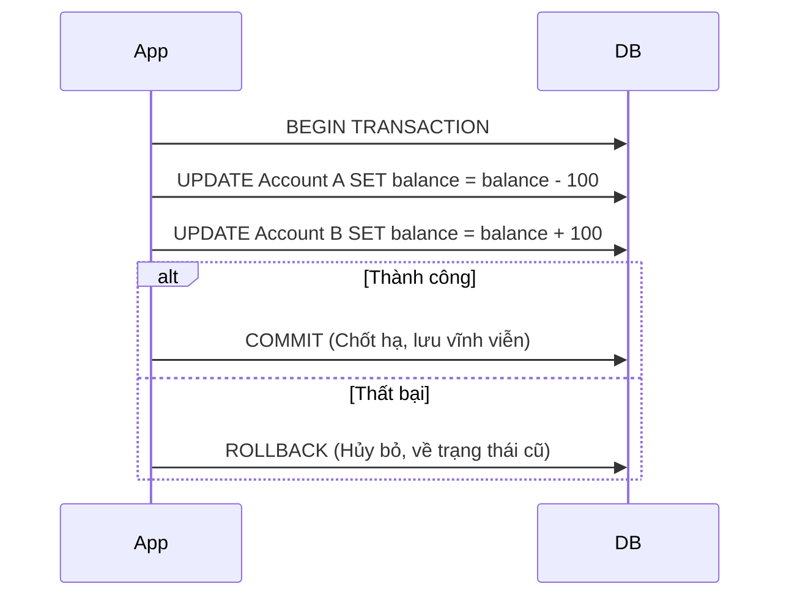

# Database Transactions & Isolation Levels

## 1. Transaction là gì? (Tính Nguyên Tử)

**Transaction** (Giao dịch) là một nhóm các câu lệnh SQL phải được thực hiện theo kiểu **"Tất cả hoặc không có gì"**.

**Ví dụ thực tế: Chuyển tiền ngân hàng**
Bạn chuyển 1 triệu cho bạn của mình. Hệ thống phải làm 2 việc:
1. Trừ 1 triệu trong tài khoản của bạn.
2. Cộng 1 triệu vào tài khoản của bạn mình.

Nếu bước 1 thành công mà bước 2 lỗi (mất điện, crash), và hệ thống không có Transaction, bạn sẽ mất trắng 1 triệu! Transaction đảm bảo nếu bước 2 lỗi, bước 1 sẽ bị **Rollback** (quay xe) như chưa từng có cuộc chia ly.

---

## 2. ACID - 4 Tiêu chuẩn vàng của Database

Để một Database được gọi là "tin cậy", nó phải tuân thủ ACID:

| Chữ | Ý nghĩa | Giải thích dân dã |
|:---:|:---|:---|
| **A** | **Atomicity** (Nguyên tử) | Làm hết hoặc không làm gì. Không có chuyện làm dở dang. |
| **C** | **Consistency** (Nhất quán) | Dữ liệu sau khi xong phải đúng luật (ví dụ: số dư không được âm). |
| **I** | **Isolation** (Cô lập) | Hai người cùng chuyển tiền một lúc không được làm loạn dữ liệu của nhau. |
| **D** | **Durability** (Bền vững) | Đã báo Thành công thì dù Server có cháy nổ, dữ liệu vẫn phải nằm trong ổ cứng. |

---

## 3. Isolation Levels (Các cấp độ cô lập)

Đây là phần **quan trọng nhất** khi đi phỏng vấn. Nó giải quyết bài toán: **"Khi nhiều người cùng sờ vào 1 bảng dữ liệu, họ sẽ thấy gì?"**

### 3.1. Các hiện tượng "Kinh dị" trong Database
Nếu không có sự cô lập tốt, bạn sẽ gặp:
1. **Dirty Read (Đọc bẩn):** Bạn đọc được dữ liệu mà người khác đang sửa nhưng **chưa lưu (Commit)**. Lỡ họ hủy (Rollback) thì bạn cầm trong tay dữ liệu rác.
2. **Non-Repeatable Read:** Trong cùng 1 transaction, bạn đọc dòng đó 2 lần mà ra 2 kết quả khác nhau (do đứa khác nhảy vào sửa và lưu mất rồi).
3. **Phantom Read (Đọc bóng ma):** Bạn đếm tổng số User là 10. Đứa khác thêm 1 User mới. Bạn đếm lại lần nữa thì ra 11.

### 3.2. Bảng so sánh 4 cấp độ cô lập (Standard SQL)

| Level | Dirty Read | Non-repeatable | Phantom Read | Hiệu năng |
|:---|:---:|:---:|:---:|:---:|
| **Read Uncommitted** | ❌ Có | ❌ Có | ❌ Có | Siêu nhanh |
| **Read Committed** | ✅ Không | ❌ Có | ❌ Có | Nhanh (Mặc định Postgres, Oracle) |
| **Repeatable Read** | ✅ Không | ✅ Không | ❌ Có | Trung bình (Mặc định MySQL) |
| **Serializable** | ✅ Không | ✅ Không | ✅ Không | Rất chậm |

---

## 4. MVCC (Multi-Version Concurrency Control) - Bí mật đằng sau tốc độ
Tại sao các Database hiện đại như PostgreSQL hay MySQL (InnoDB) có thể xử lý hàng ngàn giao dịch cùng lúc mà không bị "đứng hình"? 

Đó là nhờ **MVCC**. Thay vì khóa (lock) dữ liệu mỗi khi có người đọc, Database tạo ra các **phiên bản (versions)** khác nhau của cùng một dòng dữ liệu.
- Người Đọc (Read) sẽ đọc một "bản chụp" (Snapshot) dữ liệu tại một thời điểm nhất định.
- Người Ghi (Write) tạo ra một phiên bản mới.
👉 **Kết quả:** Người Đọc không bao giờ phải đợi người Ghi, và ngược lại. Đây là lý do tại sao hiệu năng DB tăng vọt so với cách dùng Lock truyền thống.

---

## 5. Locking - Cơ chế khóa dữ liệu (Khi MVCC là chưa đủ)
Dù có MVCC, đôi khi chúng ta vẫn cần khóa dữ liệu để đảm bảo an toàn tuyệt đối (ví dụ: trừ tiền ví điện tử).

### 4.1. Pessimistic Locking (Khóa bi quan)
**Tư tưởng:** "Đời toàn quân lừa đảo, mình phải khóa lại cho chắc".
Khi bạn đọc dữ liệu, bạn **khóa luôn** dòng đó lại. Thằng khác muốn đọc hay sửa đều phải xếp hàng chờ bạn xong.

*   **Dùng khi:** Tranh chấp xảy ra thường xuyên (Ví dụ: Hệ thống đặt vé máy bay, chỉ còn 1 chỗ cuối cùng).
*   **Code SQL:** `SELECT * FROM products WHERE id = 1 FOR UPDATE;`

### 4.2. Optimistic Locking (Khóa lạc quan)
**Tư tưởng:** "Đời toàn người tốt, chắc không ai sửa trùng mình đâu".
Bạn không khóa gì cả. Nhưng bạn thêm một cột `version`.

1. Bạn đọc dữ liệu kèm `version = 1`.
2. Lúc bạn lưu, bạn kiểm tra: `UPDATE ... SET version = 2 WHERE id = 1 AND version = 1`.
3. Nếu có đứa khác nhanh tay sửa trước, `version` đã lên 2. Câu lệnh của bạn sẽ tìm thấy 0 dòng phù hợp -> Báo lỗi xung đột.

*   **Dùng khi:** Ít khi tranh chấp (Read nhiều hơn Write).
*   **Code Java (JPA):** Chỉ cần thêm `@Version` vào Entity.

---

## 5. Câu hỏi phỏng vấn "Chốt hạ"

> **Q: Tại sao không dùng Serializable cho tất cả các Transaction cho an toàn?**
>
> **A:** Vì Serializable ép các Transaction phải chạy tuần tự từng cái một (như xếp hàng mua vé). Với hệ thống hàng triệu người dùng, việc này sẽ gây **nghẽn cổ chai kinh khủng**, server sẽ treo ngay lập tức. Chúng ta phải đánh đổi (Trade-off) giữa tính an toàn và hiệu năng. Thông thường, **Read Committed** kết hợp với **Optimistic Locking** là lựa chọn cân bằng nhất.

> **Q: MySQL và PostgreSQL khác nhau gì về Isolation mặc định?**
>
> **A:** MySQL dùng **Repeatable Read** (chặn được Non-repeatable Read). PostgreSQL dùng **Read Committed** (hiệu năng cao hơn nhưng chấp nhận Non-repeatable Read). Hiểu điều này giúp mình cấu hình DB cho phù hợp với đặc thù dự án.
