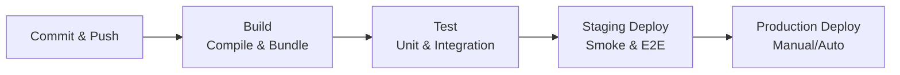

# DevOps - CI/CD

## 1. Tổng quan

**CI/CD** là tập hợp các phương pháp giúp tự động hóa việc tích hợp, kiểm thử, và triển khai code từ source repository đến production.

> **CI (Continuous Integration):** Tự động hóa việc build và test mỗi khi có commit. Đảm bảo code luôn working.
> **CD (Continuous Delivery/Deployment):** Tự động hóa việc deploy code đã pass tests đến các môi trường.

---

## 2. Continuous Integration (CI)

### 2.1. Mục tiêu

- Phát hiện bug **sớm**, giảm chi phí sửa lỗi.
- Đảm bảo code luôn **deployable**.
- Tăng **confidence** khi merge code.
- Tránh **integration hell** — nhiều developer commit cùng lúc mà không conflict.
- Cung cấp **feedback nhanh** cho developer.

### 2.2. Best Practices

- **Commit frequently:** Mỗi commit nên small, focused (atomic commits).
- **Automated tests:** Unit tests, integration tests chạy tự động.
- **Build automation:** Mọi build đều từ script, không manual.
- **Fast builds:** Build nhanh để feedback loop ngắn.
- **Immutable artifacts:** Build artifact không đổi, dùng cho tất cả environments.
- **Trunk-based development:** Nhiều small branches hoặc commit trực tiếp vào main.
- **Self-testing build:** Build tự động chạy tests, fail nếu tests fail.

### 2.3. CI Tools

| Tool | Mô tả | Đặc điểm |
|------|-------|----------|
| **Jenkins** | Open source, plugin ecosystem lớn | Cấu hình qua UI hoặc pipeline-as-code (Jenkinsfile) |
| **GitHub Actions** | Tích hợp GitHub | YAML-based, marketplace lớn, free cho public repos |
| **GitLab CI** | Tích hợp GitLab | `.gitlab-ci.yml`, auto DevOps, CI/CD tích hợp sẵn |
| **CircleCI** | Cloud-native | Fast, parallel execution, YAML config |
| **Travis CI** | Open source, GitHub integration | YAML-based, đơn giản |
| **Azure DevOps Pipelines** | Microsoft ecosystem | Full DevOps platform, YAML hoặc designer |
| **Bitbucket Pipelines** | Tích hợp Bitbucket | YAML-based, container-based builds |

---

## 3. Continuous Delivery vs Continuous Deployment

| Khía cạnh | **Continuous Delivery** | **Continuous Deployment** |
|-----------|----------------------|---------------------------|
| **Tự động hóa deploy** | Chỉ đến staging | Tự động đến production |
| **Production deploy** | **Manual approval** cần thiết | Hoàn toàn tự động |
| **Rủi ro** | Thấp (có human gate) | Cao hơn (cần comprehensive tests) |
| **Use case** | Business cần control | Teams có high confidence |
| **Automation level** | Partial | Full |

> **Continuous Delivery** = CI + Automated staging deploy
> **Continuous Deployment** = CI + Automated staging deploy + Automated production deploy

---

## 4. CI/CD Pipeline

### 4.1. Typical Pipeline Flow



### 4.2. Pipeline Stages

| Stage | Mô tả | Tools |
|-------|-------|-------|
| **Build** | Compile code, bundle assets, check syntax | Maven, Gradle, Webpack, Vite, esbuild |
| **Unit Test** | Test individual units, methods, functions | Jest, JUnit, pytest, Mocha, pytest |
| **Integration Test** | Test interactions between modules/services | Testcontainers, Postman, Supertest |
| **Security Scan** | Scan vulnerabilities trong code và dependencies | SonarQube, Snyk, Trivy, Dependabot |
| **Artifact** | Lưu build artifacts (immutable) | Nexus, Artifactory, S3, GCS |
| **Deploy Staging** | Deploy lên staging environment | kubectl, helm, terraform |
| **Smoke/E2E Test** | Test critical paths trên staging environment | Cypress, Playwright, Selenium |
| **Deploy Production** | Deploy lên production | Rolling/Blue-Green/Canary |

### 4.3. Multi-Environment Promotion

```
Feature Branch → PR → CI (build + test)
      ↓
develop branch → Auto-deploy Staging
      ↓
main branch → Manual approval → Auto-deploy Production
```

---

## 5. GitHub Actions

### 5.1. Basic Workflow

```yaml
# .github/workflows/ci.yml
name: CI Pipeline

on:
  push:
    branches: [main, develop]
  pull_request:
    branches: [main]

env:
  NODE_VERSION: '20'
  NODE_ENV: 'test'

jobs:
  build:
    runs-on: ubuntu-latest
    timeout-minutes: 30

    steps:
      - name: Checkout code
        uses: actions/checkout@v4

      - name: Setup Node.js
        uses: actions/setup-node@v4
        with:
          node-version: ${{ env.NODE_VERSION }}
          cache: 'npm'

      - name: Install dependencies
        run: npm ci

      - name: Lint
        run: npm run lint
        continue-on-error: false

      - name: Type check
        run: npm run type-check
        continue-on-error: false

      - name: Run tests
        run: npm test -- --coverage --ci
        env:
          CI: true

      - name: Build
        run: npm run build
        env:
          NODE_ENV: production

      - name: Upload artifacts
        uses: actions/upload-artifact@v4
        with:
          name: build-artifacts
          path: dist/
          retention-days: 30

      - name: Upload coverage
        if: always()
        uses: codecov/codecov-action@v4
        with:
          token: ${{ secrets.CODECOV_TOKEN }}
          files: ./coverage/lcov.info
          fail_ci_if_error: true
```

### 5.2. Deploy to Production

```yaml
# .github/workflows/deploy.yml
name: Deploy to Production

on:
  workflow_run:
    workflows: ["CI Pipeline"]
    types: [completed]
    branches: [main]

jobs:
  deploy:
    if: github.ref == 'refs/heads/main'
    runs-on: ubuntu-latest
    environment: production    # Requires environment approval
    timeout-minutes: 60
    steps:
      - name: Checkout code
        uses: actions/checkout@v4

      - name: Configure AWS credentials
        uses: aws-actions/configure-aws-credentials@v4
        with:
          aws-access-key-id: ${{ secrets.AWS_ACCESS_KEY_ID }}
          aws-secret-access-key: ${{ secrets.AWS_SECRET_ACCESS_KEY }}
          aws-region: ap-southeast-1

      - name: Download artifacts
        uses: actions/download-artifact@v4
        with:
          name: build-artifacts
          path: dist/

      - name: Deploy to ECS
        run: |
          aws ecs update-service \
            --cluster production \
            --service myapp \
            --force-new-deployment

      - name: Wait for deployment
        run: |
          aws ecs wait services-stable \
            --cluster production \
            --services myapp

      - name: Notify on Slack
        if: always()
        uses: slackapi/slack-github-action@v1.26.0
        with:
          payload: |
            {
              "text": "Deployment ${{ job.status }}: ${{ github.event.repository.name }}"
            }
        env:
          SLACK_WEBHOOK_URL: ${{ secrets.SLACK_WEBHOOK_URL }}
```

### 5.3. Matrix Strategy (Multiple versions)

```yaml
jobs:
  test:
    strategy:
      matrix:
        os: [ubuntu-latest, windows-latest, macos-latest]
        node-version: [18.x, 20.x, 22.x]
        include:
          - node-version: 22.x
            experimental: true
    runs-on: ${{ matrix.os }}
    steps:
      - uses: actions/setup-node@v4
        with:
          node-version: ${{ matrix.node-version }}
      - run: npm ci
      - run: npm test
```

### 5.4. Caching Dependencies

```yaml
- uses: actions/cache@v4
  with:
    path: |
      ~/.npm
      node_modules
    key: ${{ runner.os }}-npm-${{ hashFiles('**/package-lock.json') }}
    restore-keys: |
      ${{ runner.os }}-npm-

- uses: actions/cache@v4
  with:
    path: |
      ~/.cache/pip
      ~/.gradle/caches
    key: ${{ runner.os }}-${{ hashFiles('**/requirements.txt') }}
```

---

## 6. GitLab CI

```yaml
# .gitlab-ci.yml
stages:
  - build
  - test
  - deploy
  - notify

variables:
  NODE_VERSION: "20"
  DOCKER_IMAGE: "registry.example.com/myapp"

cache:
  key: ${CI_COMMIT_REF_SLUG}
  paths:
    - .npm/
    - node_modules/

build:
  stage: build
  image: node:$NODE_VERSION-alpine
  script:
    - npm ci
    - npm run build
  artifacts:
    paths:
      - dist/
    expire_in: 1 week
  only:
    - main
    - develop

test:unit:
  stage: test
  image: node:$NODE_VERSION-alpine
  script:
    - npm ci
    - npm run test:unit -- --coverage
  coverage: /All files[^|]*\|[^|]*\s+([\d\.]+)/
  artifacts:
    reports:
      junit: junit.xml
      coverage_report:
        coverage_format: cobertura
        path: coverage/cobertura-coverage.xml
    expire_in: 1 week
  only:
    - merge_requests
    - main
    - develop

test:e2e:
  stage: test
  image: cypress/base:20
  services:
    - postgres:15
  script:
    - npm ci
    - npm run test:e2e
  artifacts:
    when: always
    paths:
      - cypress/videos/
      - cypress/screenshots/
    expire_in: 1 week
  only:
    - main
    - develop

deploy:staging:
  stage: deploy
  environment:
    name: staging
    url: https://staging.example.com
  script:
    - kubectl config use-context staging
    - kubectl apply -f k8s/
    - kubectl rollout status deployment/myapp
  only:
    - develop
  when: manual

deploy:production:
  stage: deploy
  environment:
    name: production
    url: https://example.com
  script:
    - kubectl config use-context production
    - kubectl apply -f k8s/
    - kubectl rollout status deployment/myapp
  only:
    - main
  when: manual
  approval_rule:
    name: manager-approval
    approvals_required: 1
```

---

## 7. Jenkins Pipeline

```groovy
// Jenkinsfile
pipeline {
    agent any

    environment {
        DOCKER_IMAGE = "myapp"
        REGISTRY = "docker.io"
        DOCKER_TAG = "${env.BRANCH_NAME}-${env.BUILD_NUMBER}"
    }

    options {
        timeout(time: 30, unit: 'MINUTES')
        buildDiscarder(logRotator(numToKeepStr: '10'))
        disableConcurrentBuilds()
    }

    stages {
        stage('Checkout') {
            steps {
                checkout scm
            }
        }

        stage('Build') {
            steps {
                script {
                    docker.build("${DOCKER_IMAGE}:${DOCKER_TAG}")
                }
            }
        }

        stage('Test') {
            stages {
                stage('Unit Tests') {
                    steps {
                        sh 'npm test -- --coverage'
                    }
                    post {
                        always {
                            junit '**/junit.xml'
                            cobertura coberturaReportFile: 'coverage/cobertura-coverage.xml'
                        }
                    }
                }

                stage('Security Scan') {
                    steps {
                        sh 'trivy image --exit-code 1 --severity HIGH,CRITICAL ${DOCKER_IMAGE}:${DOCKER_TAG}'
                    }
                }
            }
        }

        stage('Push') {
            when { branch 'main' }
            steps {
                script {
                    def dockerPassword = credentials('docker-password')
                    sh '''
                        echo ${dockerPassword} | docker login -u ${DOCKER_USERNAME} --password-stdin
                        docker tag ${DOCKER_IMAGE}:${DOCKER_TAG} ${REGISTRY}/${DOCKER_IMAGE}:${DOCKER_TAG}
                        docker push ${REGISTRY}/${DOCKER_IMAGE}:${DOCKER_TAG}
                    '''
                }
            }
        }

        stage('Deploy') {
            when { branch 'main' }
            steps {
                sh "kubectl set image deployment/myapp app=${REGISTRY}/${DOCKER_IMAGE}:${DOCKER_TAG}"
            }
        }
    }

    post {
        always {
            cleanWs()
        }
        failure {
            slackSend channel: '#ci-cd', color: 'danger',
                message: "Build failed: ${env.JOB_NAME} #${env.BUILD_NUMBER}"
        }
        success {
            slackSend channel: '#ci-cd', color: 'good',
                message: "Build succeeded: ${env.JOB_NAME} #${env.BUILD_NUMBER}"
        }
    }
}
```

---

## 8. Deployment Strategies

### 8.1. Comparison

| Strategy | Downtime | Rollback | Complexity | Risk | Use case |
|----------|----------|----------|------------|------|----------|
| **Rolling Update** | None | Slow | Low | Gradual | Kubernetes default |
| **Blue/Green** | None | Instant | Medium | Full traffic switch | Zero-downtime required |
| **Canary** | None | Fast | High | Gradual, controlled | Test with real traffic |
| **Recreate** | Yes | Fast | Low | Full | Non-critical, dev envs |

### 8.2. Blue/Green Deployment

```yaml
# Deploy green version song song với blue
kubectl apply -f deployment-green.yaml

# Switch traffic (update Service selector)
kubectl patch service myapp -p '{"spec":{"selector":{"version":"green"}}}'

# Nếu có vấn đề, switch ngược lại
kubectl patch service myapp -p '{"spec":{"selector":{"version":"blue"}}}'

# Sau khi xác nhận ổn định, xóa blue deployment
kubectl delete deployment myapp-blue
```

### 8.3. Canary Deployment

```yaml
# Canary: 10% traffic sang version mới
apiVersion: v1
kind: Service
metadata:
  name: myapp-canary
spec:
  selector:
    app: myapp
    track: canary
  ports:
    - port: 80
      targetPort: 8080

---
# Canary deployment (1 replica = ~10% traffic nếu main có 9 replicas)
apiVersion: apps/v1
kind: Deployment
metadata:
  name: myapp-canary
spec:
  replicas: 1
  selector:
    matchLabels:
      app: myapp
      track: canary
  template:
    metadata:
      labels:
        app: myapp
        track: canary
    spec:
      containers:
        - name: myapp
          image: myapp:v2
```

---

## 9. Infrastructure as Code (IaC)

### 9.1. Terraform Pipeline

```yaml
# GitHub Actions với Terraform
name: Terraform

on:
  push:
    branches: [main]
    paths: ['infrastructure/**']
  pull_request:
    paths: ['infrastructure/**']

jobs:
  terraform:
    runs-on: ubuntu-latest
    steps:
      - uses: actions/checkout@v4

      - uses: hashicorp/setup-terraform@v3
        with:
          terraform_version: 1.6.0

      - name: Terraform Init
        working-directory: infrastructure
        run: terraform init
        env:
          AWS_ACCESS_KEY_ID: ${{ secrets.AWS_ACCESS_KEY_ID }}
          AWS_SECRET_ACCESS_KEY: ${{ secrets.AWS_SECRET_ACCESS_KEY }}

      - name: Terraform Format
        working-directory: infrastructure
        run: terraform fmt -check

      - name: Terraform Plan
        working-directory: infrastructure
        run: terraform plan -out=tfplan

      - name: Terraform Apply
        if: github.ref == 'refs/heads/main'
        working-directory: infrastructure
        run: terraform apply -auto-approve tfplan
        env:
          AWS_ACCESS_KEY_ID: ${{ secrets.AWS_ACCESS_KEY_ID }}
          AWS_SECRET_ACCESS_KEY: ${{ secrets.AWS_SECRET_ACCESS_KEY }}
```

---

## 10. Common Interview Questions

### Q: GitOps là gì?

**GitOps** là cách tiếp cận quản lý infrastructure và application deployment qua Git.

- **Core idea:** Git là **single source of truth** cho cả code và infrastructure config.
- **How it works:** Khi code/config thay đổi trong Git, CI/CD tự động sync xuống cluster.
- **Benefits:** Audit trail (git history), version control, easy rollback, DRY, declarative.
- **Tools:** **ArgoCD**, **FluxCD**.

### Q: Sự khác biệt giữa CI và CD?

- **CI** tập trung vào việc tự động hóa build và test khi có commit — đảm bảo code luôn working.
- **CD** mở rộng CI bằng cách tự động hóa việc deploy đến một hoặc nhiều environments.

### Q: Làm sao để handle database migrations trong CI/CD?

1. **Version control schemas:** Mỗi migration được versioned (sequential filenames).
2. **Backward compatible:** Migration nên backward-compatible để rollback an toàn.
3. **Zero-downtime:** Dùng **expand-contract pattern** (add column → deploy app → backfill → add constraint).
4. **Tooling:** Flyway, Liquibase, Alembic, Knex.
5. **Feature flags:** Bật/tắt features thay vì migrate nhiều lần.
6. **Separate migration step:** Chạy migration **trước** deploy application.

### Q: Caching strategies trong CI/CD?

```yaml
# GitHub Actions
- uses: actions/cache@v4
  with:
    path: |
      ~/.npm
      node_modules
    key: ${{ runner.os }}-npm-${{ hashFiles('**/package-lock.json') }}
    restore-keys: |
      ${{ runner.os }}-npm-

# Docker layer caching (BuildKit)
- name: Set up Docker Buildx
  uses: docker/setup-buildx-action@v3
- name: Build with cache
  uses: docker/build-push-action@v5
  with:
    cache-from: type=gha
    cache-to: type=gha,mode=max
```

### Q: Secret management trong CI/CD?

1. **Environment-specific secrets:** Lưu trong CI/CD tool's secret store (GitHub Secrets, GitLab CI Variables).
2. **External secrets manager:** HashiCorp Vault, AWS Secrets Manager, GCP Secret Manager.
3. ** принцип least privilege:** Chỉ cấp quyền cần thiết.
4. **Rotate secrets regularly:** Không hardcode, luôn dùng references.
5. **Never log secrets:** Ensure secrets không xuất hiện trong logs.

### Q: Best practices cho pipeline?

- **Fail fast:** Chạy fast tests trước, slow tests sau.
- **Parallel execution:** Chạy independent jobs/stages song song.
- **Idempotent:** Pipeline có thể chạy nhiều lần mà không có side effects.
- **Artifact versioning:** Mỗi build có unique tag (commit SHA hoặc semantic version).
- **Notification:** Slack/email khi pipeline fail.
- **Retention policy:** Cleanup old artifacts để tiết kiệm storage.
