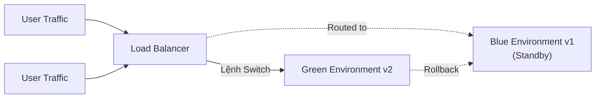
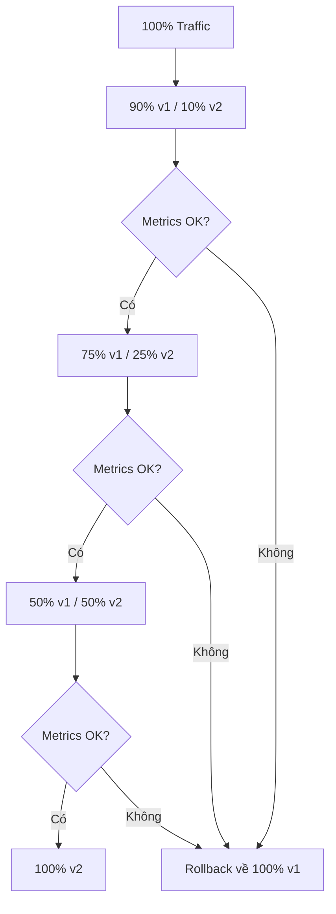
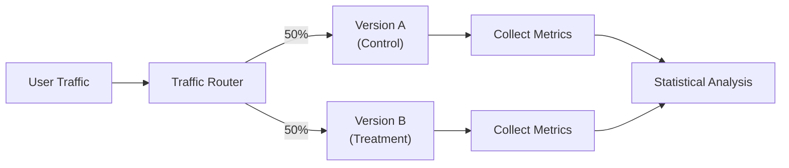

# DevOps - Chiến lược Triển khai (Deployment Strategies)

## 1. Tổng quan

Chiến lược triển khai xác định cách phần mềm được release lên môi trường production. Việc chọn chiến lược phù hợp phụ thuộc vào mức độ chịu downtime, rủi ro, độ phức tạp của hạ tầng, và yêu cầu kinh doanh.

| Chiến lược | Downtime | Độ phức tạp | Tốc độ Rollback | Rủi ro |
|------------|----------|-------------|-----------------|--------|
| **Recreate** | Bắt buộc | Thấp | Chậm | Cao |
| **Rolling Update** | Không | Thấp | Nhanh | Trung bình |
| **Blue-Green** | Không | Trung bình | Tức thì | Thấp |
| **Canary** | Không | Cao | Từ từ | Rất thấp |
| **Feature Flags** | Không | Trung bình | Tức thì | Rất thấp |

---

## 2. Recreate (Xóa và Tạo lại)

Chiến lược **Recreate** terminate tất cả các instances hiện tại và deploy phiên bản mới đồng thời.

```bash
# Ví dụ: Xóa phiên bản cũ, deploy phiên bản mới
kubectl delete deployment myapp
kubectl apply -f deployment-v2.yaml
```

### Ưu điểm
- Đơn giản để implement và hiểu
- Không tốn thêm hạ tầng (chỉ một phiên bản chạy tại một thời điểm)
- Trạng thái sạch — deployment mới mỗi lần

### Nhược điểm
- **Downtime bắt buộc** trong quá trình chuyển đổi
- Không phù hợp cho hệ thống production cần high availability
- Rủi ro mất dữ liệu nếu database schema thay đổi

### Khi nào nên dùng
- Môi trường development/staging
- Services không quan trọng, có thể chấp nhận downtime
- Khi cần tối thiểu chi phí hạ tầng

---

## 3. Rolling Update

Chiến lược deploy **mặc định** của Kubernetes. Các pods cũ được thay thế từ từ, từng cái một (hoặc theo batch được cấu hình), đảm bảo availability liên tục.

### 3.1. Các tham số quan trọng

```yaml
apiVersion: apps/v1
kind: Deployment
metadata:
  name: myapp
spec:
  replicas: 5
  strategy:
    type: RollingUpdate
    rollingUpdate:
      maxSurge: 1        # Số pods thêm vào trên desired count
      maxUnavailable: 0 # Số pods có thể không khả dụng trong quá trình update
  template:
    spec:
      containers:
        - name: myapp
          image: myapp:v2
```

| Tham số | Giá trị | Hành vi |
|---------|---------|---------|
| `maxSurge=1, maxUnavailable=0` | Bảo thủ | 1 pod thêm tại một thời điểm, không downtime |
| `maxSurge=2, maxUnavailable=0` | Nhanh hơn | 2 pods thêm đồng thời |
| `maxSurge=0, maxUnavailable=1` | Mạnh dạn | Thay thế 1 pod tại một thời điểm |
| `maxSurge=25%, maxUnavailable=25%` | Theo phần trăm | % của tổng replicas |

### 3.2. Rollback

```bash
# Kiểm tra trạng thái rollout
kubectl rollout status deployment/myapp

# Rollback về phiên bản trước
kubectl rollout undo deployment/myapp

# Rollback về revision cụ thể
kubectl rollout history deployment/myapp
kubectl rollout undo deployment/myapp --to-revision=2
```

### Ưu điểm
- **Không downtime** (với cấu hình phù hợp)
- Không cần hạ tầng thêm (trên cùng một cluster)
- Hỗ trợ sẵn trong Kubernetes
- Phơi nhiễm rủi ro từ từ

### Nhược điểm
- Chậm với clusters lớn (update từng pod)
- Hai phiên bản chạy song song trong quá trình chuyển đổi
- Database migrations cần schema versioning cẩn thận
- Không thể serve các API version khác nhau đồng thời

---

## 4. Blue-Green Deployment

Hai **môi trường giống hệt nhau** chạy song song. Traffic được chuyển tức thì từ blue (production hiện tại) sang green (phiên bản mới) qua load balancer.



### 4.1. Triển khai với Kubernetes

```yaml
# Blue Deployment (hiện tại)
apiVersion: apps/v1
kind: Deployment
metadata:
  name: myapp-blue
spec:
  replicas: 5
  selector:
    matchLabels:
      app: myapp
      version: blue
  template:
    metadata:
      labels:
        app: myapp
        version: blue
    spec:
      containers:
        - name: myapp
          image: myapp:v1

---
# Green Deployment (mới)
apiVersion: apps/v1
kind: Deployment
metadata:
  name: myapp-green
spec:
  replicas: 5
  selector:
    matchLabels:
      app: myapp
      version: green
  template:
    metadata:
      labels:
        app: myapp
        version: green
    spec:
      containers:
        - name: myapp
          image: myapp:v2

---
# Service chuyển đổi giữa blue và green
apiVersion: v1
kind: Service
metadata:
  name: myapp-service
spec:
  selector:
    app: myapp
    version: blue    # Đổi thành "green" để chuyển traffic
  ports:
    - port: 80
      targetPort: 8080
```

### 4.2. Chuyển đổi Traffic

```bash
# Chuyển từ blue sang green
kubectl patch service myapp-service -p '{"spec":{"selector":{"version":"green"}}}'

# Rollback tức thì
kubectl patch service myapp-service -p '{"spec":{"selector":{"version":"blue"}}}'
```

### Ưu điểm
- **Switch tức thì** — không downtime
- **Rollback tức thì** — chuyển về blue trong vài giây
- Dễ dàng test green environment hoàn toàn trước production traffic
- Test không rủi ro với môi trường giống production

### Nhược điểm
- **Chi phí hạ tầng gấp đôi** (hai môi trường luôn chạy)
- Database schema changes cần migration strategy cẩn thận
- Độ phức tạp về network/routing
- Thách thức đồng bộ dữ liệu lớn

---

## 5. Canary Deployment

Từ từ chuyển một **phần nhỏ traffic** sang phiên bản mới, theo dõi metrics, và tăng dần traffic nếu mọi thứ đều ổn định.



### 5.1. Kubernetes Canary với Multiple Deployments

```yaml
# Stable version (nhận phần lớn traffic)
apiVersion: apps/v1
kind: Deployment
metadata:
  name: myapp-stable
spec:
  replicas: 10
  selector:
    matchLabels:
      app: myapp
      track: stable
  template:
    metadata:
      labels:
        app: myapp
        track: stable
    spec:
      containers:
        - name: myapp
          image: myapp:v1

---
# Canary version (nhận một phần nhỏ)
apiVersion: apps/v1
kind: Deployment
metadata:
  name: myapp-canary
spec:
  replicas: 2    # 2 trên 12 tổng = ~16% traffic
  selector:
    matchLabels:
      app: myapp
      track: canary
  template:
    metadata:
      labels:
        app: myapp
        track: canary
    spec:
      containers:
        - name: myapp
          image: myapp:v2
```

### 5.2. Istio Traffic Management cho Canary

```yaml
apiVersion: networking.istio.io/v1alpha3
kind: VirtualService
metadata:
  name: myapp
spec:
  hosts:
    - myapp
  http:
    - route:
        - destination:
            host: myapp
            subset: v1
          weight: 90
        - destination:
            host: myapp
            subset: v2
          weight: 10   # Bắt đầu với 10%

---
apiVersion: networking.istio.io/v1alpha3
kind: DestinationRule
metadata:
  name: myapp
spec:
  host: myapp
  subsets:
    - name: v1
      labels:
        version: v1
    - name: v2
      labels:
        version: v2
```

```bash
# Tăng dần canary traffic
kubectl patch virtualservice myapp --type merge -p '
{
  "spec": {
    "http": [{
      "route": [
        {"destination": {"host": "myapp", "subset": "v1"}, "weight": 75},
        {"destination": {"host": "myapp", "subset": "v2"}, "weight": 25}
      ]
    }]
  }
}'
```

### 5.3. Promotion dựa trên Metrics

Theo dõi các metrics chính trong quá trình đánh giá canary:

```bash
# Prometheus queries để đánh giá canary
# So sánh error rate
rate(http_requests_total{version="canary",status=~"5.."}[5m])
  > rate(http_requests_total{version="stable",status=~"5.."}[5m]) * 1.5

# So sánh latency
histogram_quantile(0.99, rate(http_request_duration_seconds_bucket{version="canary"}[5m]))
  > histogram_quantile(0.99, rate(http_request_duration_seconds_bucket{version="stable"}[5m])) * 1.2
```

### Ưu điểm
- **Test với production traffic** thực tế
- **Kiểm soát rủi ro chi tiết** — chỉ ảnh hưởng % nhỏ ban đầu
- **Quyết định dựa trên dữ liệu** — promotion/rollback theo metrics
- Rollback dễ dàng mà không cần chuyển toàn bộ hạ tầng

### Nhược điểm
- Cài đặt routing và monitoring phức tạp
- Cần observability stack tinh vi
- Thách thức về session/state management trong quá trình chia traffic
- Vẫn chạy hai phiên bản đồng thời trong production

---

## 6. Feature Flags

**Feature flags** (toggles) tách rời deployment khỏi release. Code được deploy lên production, nhưng các features mới bị ẩn đằng sau một boolean flag có thể bật/tắt mà không cần redeploy.

```typescript
// Feature flag implementation
const featureFlags = {
  newCheckoutFlow: false,
  darkModeUI: true,
  aiRecommendations: false,
};

// Usage in code
if (featureFlags.newCheckoutFlow) {
  return renderNewCheckoutFlow();
} else {
  return renderLegacyCheckout();
}
```

### 6.1. Gradual Rollout với Feature Flags

```typescript
// Percentage-based rollout
const userId = getUserId();
const percentage = 10; // 10% of users

const isEnabled = (hashString(userId + 'newCheckoutFlow') % 100) < percentage;
```

### 6.2. Các công cụ Feature Flag phổ biến

| Tool | Loại | Ghi chú |
|------|------|---------|
| **LaunchDarkly** | SaaS | Enterprise-grade, toàn diện |
| **Unleash** | Open-source | Có tùy chọn self-hosted |
| **Flagsmith** | Open-source | Thiết kế API-first |
| **Split.io** | SaaS | Quyết định dựa trên dữ liệu |

### Ưu điểm
- **Bật/tắt tức thì** — không cần redeploy
- **Targeted rollouts** — bật cho users, regions, hoặc percentages cụ thể
- **Kill switch** — tắt feature bị lỗi ngay lập tức
- Tích hợp **A/B testing** sẵn có
- Giảm merge conflicts trong version control

### Nhược điểm
- Độ phức tạp code tăng lên (flag spaghetti)
- Cần kỷ luật để clean up flags cũ
- Cân nhắc về bảo mật (flags có thể expose features sớm)
- Technical debt nếu không quản lý đúng cách

---

## 7. A/B Testing

**A/B testing** chia traffic giữa các phiên bản để so sánh performance, hành vi user, hoặc conversion rates. Khác với canary (nhằm giảm rủi ro), A/B testing nhằm **tối ưu hóa**.



### 7.1. Triển khai A/B Testing

```yaml
# Service cho Version A
apiVersion: v1
kind: Service
metadata:
  name: myapp-a
spec:
  selector:
    app: myapp
    version: a
  ports:
    - port: 80
      targetPort: 8080

---
# Service cho Version B
apiVersion: v1
kind: Service
metadata:
  name: myapp-b
spec:
  selector:
    app: myapp
    version: b
  ports:
    - port: 80
      targetPort: 8080
```

```nginx
# Nginx load balancing với A/B split
upstream myapp {
    server myapp-a:8080 weight=50;
    server myapp-b:8080 weight=50;
}
```

### Các Metrics quan trọng cần theo dõi

| Loại Metric | Ví dụ | Mục đích |
|------------|--------|----------|
| **Business** | Conversion rate, Revenue, Sign-ups | Tác động kinh doanh trực tiếp |
| **Behavioral** | Click-through, Time on page, Bounce rate | User engagement |
| **Technical** | Latency, Error rate, Load time | Performance |
| **Health** | Crash rate, API errors | Stability |

### A/B Testing vs Canary

| Khía cạnh | A/B Testing | Canary Deployment |
|-----------|-------------|-------------------|
| **Mục tiêu** | So sánh các biến thể, tìm ra cái tốt nhất | Giảm rủi ro của bản release mới |
| **Thời gian** | Ngày đến tuần | Giờ đến ngày |
| **Traffic split** | Định sẵn, bằng nhau | Tăng dần |
| **Quyết định** | Phiên bản nào thắng | Phiên bản mới có an toàn không? |
| **Metrics** | Statistical significance | Error rates, latency |

---

## 8. Cấu hình Deployment Strategies trong Kubernetes

### 8.1. Recreate Strategy

```yaml
spec:
  strategy:
    type: Recreate
```

### 8.2. Rolling Update (Mặc định)

```yaml
spec:
  strategy:
    type: RollingUpdate
    rollingUpdate:
      maxSurge: 1
      maxUnavailable: 0
```

### 8.3. Custom Canary với HPA

```yaml
# Canary bắt đầu với 0 replicas, tăng dần
apiVersion: apps/v1
kind: Deployment
metadata:
  name: myapp-canary
spec:
  replicas: 0  # Bắt đầu từ 0, scale up thủ công
  strategy:
    type: RollingUpdate
    rollingUpdate:
      maxSurge: 1
      maxUnavailable: 0
```

```bash
# Chuyển traffic từ từ
kubectl scale deployment myapp-canary --replicas=1  # 5%
kubectl scale deployment myapp-canary --replicas=3  # 15%
kubectl scale deployment myapp-canary --replicas=5  # 25%
kubectl scale deployment myapp-canary --replicas=10  # 50%
# ... theo dõi metrics giữa mỗi bước
```

---

## 9. Chiến lược Rollback

### 9.1. Rolling Update Rollback

```bash
# Rollback tức thì về phiên bản trước
kubectl rollout undo deployment/myapp

# Rollback về revision cụ thể
kubectl rollout undo deployment/myapp --to-revision=3

# Theo dõi quá trình rollback
kubectl rollout status deployment/myapp
```

### 9.2. Blue-Green Rollback

```bash
# Tức thì — chỉ cần đổi selector
kubectl patch service myapp-service -p '{"spec":{"selector":{"version":"blue"}}}'
```

### 9.3. Canary Rollback

```bash
# Xóa canary bằng cách scale về 0
kubectl scale deployment myapp-canary --replicas=0

# Hoặc giảm traffic percentage
kubectl patch virtualservice myapp -p '{
  "spec":{"http":[{"route":[
    {"destination":{"host":"myapp","subset":"v1"},"weight":100},
    {"destination":{"host":"myapp","subset":"v2"},"weight":0}
  ]}]}
}'
```

### 9.4. Feature Flag Rollback

```typescript
// Đơn giản chỉ cần disable flag — không cần redeploy
featureFlags.newCheckoutFlow = false;  // Tức thì chuyển về legacy flow
```

---

## 10. Câu hỏi phỏng vấn

**Q: Sự khác biệt giữa blue-green và canary deployment?**

> **Blue-Green** duy trì hai môi trường hoàn chỉnh và chuyển 100% traffic cùng một lúc. Nó cung cấp rollback tức thì nhưng tăng gấp đôi chi phí hạ tầng. **Canary** từ từ chuyển một phần trăm traffic (ví dụ 5% -> 25% -> 100%), cho phép test thực tế với rủi ro tối thiểu trong khi sử dụng hạ tầng hiện có.

**Q: Khi nào nên dùng chiến lược Recreate?**

> Recreate phù hợp khi không thể chạy hai phiên bản đồng thời do database schema không tương thích, hoặc khi ứng dụng là stateless và downtime được chấp nhận. Nó cũng hữu ích cho môi trường development/staging nơi sự đơn giản được ưu tiên hơn availability.

**Q: Làm thế nào để xử lý database migrations với zero-downtime deployments?**

> Implement **backward-compatible database migrations**: (1) Thêm các columns/tables mới song song với cũ trước, (2) Deploy code mới hoạt động với cả schema cũ và mới, (3) Chạy migration để hoàn thành schema change, (4) Deploy code chỉ sử dụng schema mới. Cách này được gọi là **expand-contract pattern** hoặc **parallel change**.

**Q: Sự đánh đổi giữa maxSurge và maxUnavailable?**

> `maxSurge=1, maxUnavailable=0` là bảo thủ — đảm bảo không downtime nhưng mất thời gian hoàn thành lâu hơn. `maxSurge=0, maxUnavailable=1` là mạnh dạn — hoàn thành nhanh hơn nhưng giảm tạm thời tổng capacity. `maxSurge=2, maxUnavailable=0` cân bằng giữa tốc độ và availability. Chọn dựa trên cluster capacity và mức độ chịu được tạm thời resource overhead.
