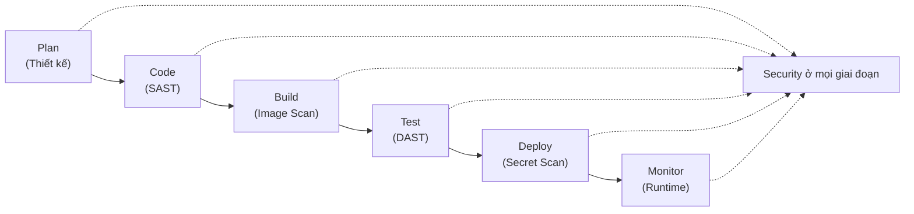
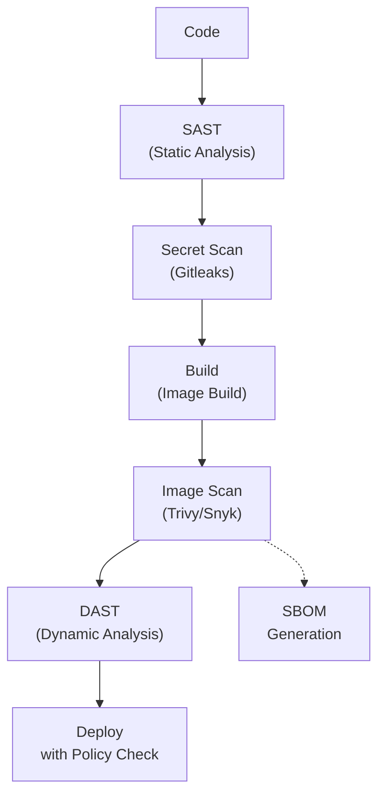

# DevOps - DevOps Security

## 1. Tổng quan: Shift-Left Security

**DevOps Security** tích hợp các security practices xuyên suốt vòng đời phát triển phần mềm (SDLC), không chỉ ở cuối. Cách tiếp cận "shift-left" này có nghĩa là bảo mật được xem xét từ giai đoạn thiết kế qua phát triển, CI/CD, và production.



---

## 2. Secret Management

Secrets bao gồm API keys, passwords, tokens, certificates, và bất kỳ dữ liệu nhạy cảm nào không nên hardcode.

### 2.1. Kubernetes Secrets

Kubernetes Secrets lưu trữ dữ liệu nhạy cảm dưới dạng base64-encoded strings. Chúng **KHÔNG** được mã hóa theo mặc định (chỉ được encode). Cho production, cần enable encryption at rest.

```yaml
# Basic Kubernetes Secret (base64 encoded)
apiVersion: v1
kind: Secret
metadata:
  name: app-secrets
type: Opaque
data:
  DB_PASSWORD: c3VwZXItc2VjcmV0  # echo -n 'super-secret' | base64
  API_KEY: YXBpLWtleS1oZXJl

---
# Tốt hơn: dùng stringData (auto-encoded khi tạo)
apiVersion: v1
kind: Secret
metadata:
  name: app-secrets
type: Opaque
stringData:
  DB_PASSWORD: super-secret
  API_KEY: api-key-here
```

### 2.2. Bật Encryption at Rest cho Kubernetes Secrets

```yaml
# encryption-config.yaml
apiVersion: apiserver.config.k8s.io/v1
kind: EncryptionConfiguration
resources:
  - resources:
      - secrets
    providers:
      - aescbc:
          keys:
            - name: key1
              secret: <base64-encoded-32-byte-key>
      - identity: {}  # Fallback cho existing unencrypted secrets
```

```bash
# Thêm vào kube-apiserver flags
--encryption-provider-config=/path/to/encryption-config.yaml

# Re-encrypt existing secrets
kubectl get secrets --all-namespaces -o json | \
  kubectl replace -f -
```

### 2.3. HashiCorp Vault

**Vault** là công cụ truy cập secrets một cách bảo mật. Nó cung cấp mã hóa, dynamic secrets, secret revocation, và audit logging.

```bash
# Start Vault in dev mode
vault server -dev

# Enable secrets engine
vault secrets enable -path=myapp kv-v2

# Write a secret
vault kv put myapp/prod DB_PASSWORD="db-secret-password"
vault kv put myapp/prod API_KEY="api-key-value"

# Read a secret
vault kv get myapp/prod

# Create policy
vault policy write myapp-policy - <<'EOF'
path "myapp/data/prod" {
  capabilities = ["read"]
}
EOF
```

```bash
# Kubernetes auth method
vault auth enable kubernetes

# Configure Kubernetes auth
vault write auth/kubernetes/config \
    kubernetes_host="https://$KUBERNETES_PORT_443_TCP_ADDR:443" \
    token_reviewer_jwt="$(cat /var/run/secrets/kubernetes.io/serviceaccount/token)" \
    kubernetes_ca_cert=@/var/run/secrets/kubernetes.io/serviceaccount/ca.crt
```

### 2.4. AWS Secrets Manager

```bash
# Store a secret
aws secretsmanager create-secret \
    --name myapp/prod/db-password \
    --secret-string '{"username":"admin","password":"secret123"}'

# Retrieve secret
aws secretsmanager get-secret-value \
    --secret-id myapp/prod/db-password

# Rotation with Lambda
aws secretsmanager put-secret-value \
    --secret-id myapp/prod/db-password \
    --secret-string '{"username":"admin","password":"new-secret"}'
```

```yaml
# Kubernetes pod using AWS Secrets Manager via IRSA
apiVersion: v1
kind: Pod
metadata:
  name: myapp
spec:
  serviceAccountName: myapp-sa
  containers:
    - name: app
      image: myapp:latest
      env:
        - name: DB_PASSWORD
          valueFrom:
            secretKeyRef:
              name: aws-secrets
              key: db-password
---
# IRSA (IAM Role for Service Accounts)
apiVersion: v1
kind: ServiceAccount
metadata:
  name: myapp-sa
  annotations:
    eks.amazonaws.com/role-arn: arn:aws:iam::123456789:role/myapp-role
```

### 2.5. Secret Scanning Tools

| Tool | Quét gì | Stage |
|------|---------|-------|
| **Gitleaks** | Git repositories cho secrets | Pre-commit, CI/CD |
| **TruffleHog** | Git history cho committed secrets | CI/CD |
| **GitGuardian** | Real-time scanning của all commits | CI/CD, PR |
| **Detect-Secrets** | Pre-commit, Python-based | Pre-commit |
| **Spectral** | CI/CD pipelines và code | CI/CD |

```bash
# Gitleaks
gitleaks protect -v --source=. --config=gitleaks.toml

# TruffleHog
trufflehog filesystem .

# Git pre-commit hook
# .pre-commit-config.yaml
repos:
  - repo: https://github.com/gitleaks/gitleaks
    rev: v8.18.0
    hooks:
      - id: gitleaks
```

---

## 3. RBAC trong Kubernetes

**RBAC** kiểm soát ai có thể truy cập Kubernetes resources và họ có thể làm gì với chúng.

### 3.1. Core RBAC Concepts

| Object | Scope | Mô tả |
|--------|-------|-------|
| **Role** | Namespace | Cấp quyền trong một namespace cụ thể |
| **ClusterRole** | Cluster-wide | Cấp quyền trên toàn cluster hoặc cluster-scoped resources |
| **RoleBinding** | Namespace | Bind một Role/ClusterRole tới users trong một namespace |
| **ClusterRoleBinding** | Cluster-wide | Bind một ClusterRole tới users trên toàn cluster |

### 3.2. Role và RoleBinding

```yaml
# Define permissions trong một Role
apiVersion: rbac.authorization.k8s.io/v1
kind: Role
metadata:
  namespace: production
  name: app-developer
rules:
  - apiGroups: [""]
    resources: ["pods", "services", "configmaps"]
    verbs: ["get", "list", "watch"]
  - apiGroups: ["apps"]
    resources: ["deployments"]
    verbs: ["get", "list", "watch", "update"]
  - apiGroups: [""]
    resources: ["pods/log"]
    verbs: ["get"]
  - apiGroups: [""]
    resources: ["pods/exec"]
    verbs: ["create"]
  - apiGroups: [""]
    resources: ["secrets"]
    verbs: ["get"]   # Read-only access to secrets

---
# Bind the Role tới user
apiVersion: rbac.authorization.k8s.io/v1
kind: RoleBinding
metadata:
  name: app-developer-binding
  namespace: production
subjects:
  - kind: User
    name: developer@example.com
    apiGroup: rbac.authorization.k8s.io
  - kind: Group
    name: developers
    apiGroup: rbac.authorization.k8s.io
roleRef:
  kind: Role
  name: app-developer
  apiGroup: rbac.authorization.k8s.io
```

### 3.3. ClusterRole và ClusterRoleBinding

```yaml
# ClusterRole cho monitoring tools (cần cluster-wide read access)
apiVersion: rbac.authorization.k8s.io/v1
kind: ClusterRole
metadata:
  name: monitoring-reader
rules:
  - apiGroups: [""]
    resources: ["nodes", "pods", "services", "namespaces", "events"]
    verbs: ["get", "list", "watch"]
  - apiGroups: ["metrics.k8s.io"]
    resources: ["pods", "nodes"]
    verbs: ["get", "list"]

---
apiVersion: rbac.authorization.k8s.io/v1
kind: ClusterRoleBinding
metadata:
  name: prometheus-monitoring
subjects:
  - kind: ServiceAccount
    name: prometheus
    namespace: monitoring
roleRef:
  kind: ClusterRole
  name: monitoring-reader
  apiGroup: rbac.authorization.k8s.io
```

### 3.4. Best Practices

```bash
# Principle of least privilege: chỉ grant cái cần thiết
# Sử dụng ServiceAccounts cho applications, không phải user accounts
# Audit RBAC với kubectl
kubectl auth can-i list pods --as=developer@example.com -n production
kubectl auth can-i get secrets --as=developer@example.com -n production

# Check what permissions a user has
kubectl auth whoami
```

---

## 4. Kubernetes Network Policies

**NetworkPolicy** hạn chế network traffic đến/đi từ pods. Mặc định, tất cả pods có thể giao tiếp với tất cả pods khác (Kubernetes permissive networking).

### 4.1. Default Deny All

```yaml
# Deny all ingress traffic trong một namespace
apiVersion: networking.k8s.io/v1
kind: NetworkPolicy
metadata:
  name: default-deny-ingress
  namespace: production
spec:
  podSelector: {}
  policyTypes:
    - Ingress

---
# Deny all egress traffic
apiVersion: networking.k8s.io/v1
kind: NetworkPolicy
metadata:
  name: default-deny-egress
  namespace: production
spec:
  podSelector: {}
  policyTypes:
    - Egress
```

### 4.2. Allow Specific Traffic

```yaml
# Allow traffic to frontend từ ingress only
apiVersion: networking.k8s.io/v1
kind: NetworkPolicy
metadata:
  name: frontend-policy
  namespace: production
spec:
  podSelector:
    matchLabels:
      app: frontend
  policyTypes:
    - Ingress
  ingress:
    - from:
        - namespaceSelector:
            matchLabels:
              name: ingress-nginx
      ports:
        - protocol: TCP
          port: 8080

---
# Allow backend truy cập database only
apiVersion: networking.k8s.io/v1
kind: NetworkPolicy
metadata:
  name: database-policy
  namespace: production
spec:
  podSelector:
    matchLabels:
      app: database
  policyTypes:
    - Ingress
  ingress:
    - from:
        - podSelector:
            matchLabels:
              app: backend
      ports:
        - protocol: TCP
          port: 5432

---
# Allow DNS egress
apiVersion: networking.k8s.io/v1
kind: NetworkPolicy
metadata:
  name: allow-dns
  namespace: production
spec:
  podSelector: {}
  policyTypes:
    - Egress
  egress:
    - to:
        - namespaceSelector:
            matchLabels:
              kubernetes.io/metadata.name: kube-system
      ports:
        - protocol: UDP
          port: 53
        - protocol: TCP
          port: 53
```

> **Quan trọng:** NetworkPolicy yêu cầu CNI plugin hỗ trợ nó (Calico, Cilium, Weave). Kubernetes mặc định KHÔNG enforce network policies.

---

## 5. Container Image Scanning

Image scanning phát hiện vulnerabilities trong container images trước khi deploy.

### 5.1. Trivy

```bash
# Scan a Docker image
trivy image myapp:latest

# Scan với severity filter
trivy image --severity HIGH,CRITICAL myapp:latest

# Scan a Dockerfile cho misconfigurations
trivy config ./dockerfile .

# Scan trong CI/CD (fail on HIGH/CRITICAL)
trivy image \
    --exit-code 1 \
    --severity HIGH,CRITICAL \
    --ignore-unfixed \
    myapp:$BUILD_NUMBER
```

### 5.2. Clair

```bash
# Run Clair with PostgreSQL
docker run -p 5432:5432 -d --name clair-db arminc/clair-db:2021-05-27
docker run -p 6060:6060 --link clair-db:postgres \
    -d --name clair arminc/clair-local-scan-service:latest

# Analyze an image
curl -X POST http://localhost:6060/clair/v1/layers \
    -H "Content-Type: application/json" \
    -d '{"Layer":{"LayerName":"sha256:abc123","Layer":{"Format":"Docker","Layer":{"Name":"sha256:abc123"}}}'
```

### 5.3. Snyk Container

```bash
# Authenticate
snyk auth

# Test container image
snyk container test myapp:latest

# Test and monitor cho new vulnerabilities
snyk container monitor myapp:latest
```

### So sánh các Image Scanners

| Tool | Loại | Database | CI/CD Integration | SAST |
|------|------|----------|-------------------|------|
| **Trivy** | Open-source | VulnDB, Security advisories | Native | Yes (IaC scanning) |
| **Clair** | Open-source | Security advisories | API-based | No |
| **Snyk** | SaaS | Proprietary | Native | Yes |
| **Anchore** | Open-source/SaaS | Security advisories | Native | Yes |
| ** Grype** | Open-source | SBOM-based | Native | Yes (IaC) |

---

## 6. Security Scanning trong CI/CD Pipeline

Một CI/CD security pipeline toàn diện nên bao gồm nhiều scanning stages.



### 6.1. Ví dụ Complete Security Pipeline

```groovy
// Jenkinsfile với security stages
pipeline {
    agent any

    stages {
        stage('SAST - Static Analysis') {
            steps {
                echo 'Running SAST with SonarQube...'
                withCredentials([string(credentialsId: 'sonarqube-token', variable: 'SONAR_TOKEN')]) {
                    sh '''
                        sonar-scanner \
                            -Dsonar.projectKey=myapp \
                            -Dsonar.host.url=http://sonarqube:9000 \
                            -Dsonar.token=$SONAR_TOKEN
                    '''
                }
            }
        }

        stage('Secret Scanning') {
            steps {
                echo 'Scanning for secrets...'
                sh 'gitleaks protect -v --source=. --config=gitleaks.toml || true'
            }
        }

        stage('Dependency Check') {
            steps {
                echo 'Checking for vulnerable dependencies...'
                sh 'npm audit --audit-level=high || true'
                sh 'trivy fs --severity HIGH,CRITICAL .'
            }
        }

        stage('Build & Scan Image') {
            steps {
                echo 'Building and scanning container image...'
                sh '''
                    docker build -t myapp:$BUILD_NUMBER .
                    trivy image \
                        --exit-code 1 \
                        --severity HIGH,CRITICAL \
                        --ignore-unfixed \
                        myapp:$BUILD_NUMBER
                '''
            }
        }

        stage('Push to Registry') {
            steps {
                echo 'Pushing to registry...'
                sh '''
                    docker push registry.example.com/myapp:$BUILD_NUMBER
                    docker push registry.example.com/myapp:latest
                '''
            }
        }

        stage('OPA Policy Check') {
            steps {
                echo 'Checking against OPA policies...'
                sh 'conftest verify --policy ./policies myapp:$BUILD_NUMBER'
            }
        }
    }
}
```

---

## 7. Container Security Best Practices

### 7.1. Dockerfile Security

```dockerfile
# Sử dụng specific version, không phải 'latest'
FROM node:20.11.0-alpine3.19

# Tạo non-root user
RUN addgroup -S appgroup && adduser -S appuser -G appgroup
USER appuser

# Không cache apt packages
RUN apt-get update && apt-get install -y --no-install-recommends \
    ca-certificates \
    && rm -rf /var/lib/apt/lists/*

# Chỉ copy những file cần thiết
COPY --chown=appuser:appgroup package*.json ./
RUN npm ci --only=production

# Sử dụng multi-stage build để giảm attack surface
FROM builder AS build
RUN npm ci && npm run build

FROM node:20-alpine AS runtime
COPY --from=build /app/dist ./dist
COPY --from=build /app/node_modules ./node_modules
USER nobody

# Không có secrets trong image
# Sử dụng environment variables hoặc mounted secrets tại runtime
CMD ["node", "dist/index.js"]
```

### 7.2. Container Security Checklist

| Practice | Mô tả |
|----------|-------|
| **Run as non-root** | Containers không nên chạy với UID 0 |
| **Read-only root filesystem** | Set `readOnly: true` trong security context |
| **Drop all capabilities** | Thêm `capDrop: ALL` và chỉ add cái cần thiết |
| **Use specific image tags** | Không bao giờ dùng `latest` trong production |
| **Scan images regularly** | Scheduled rescans cho new vulnerabilities |
| **Minimal base images** | Dùng `alpine` hoặc `distroless` images |
| **No embedded secrets** | Sử dụng secrets management tại runtime |
| **Limit resources** | Set CPU/memory limits để prevent DoS |
| **Use labels cho metadata** | `LABEL maintainer`, `LABEL version` |

```yaml
# Secure Pod spec
apiVersion: v1
kind: Pod
spec:
  securityContext:
    runAsNonRoot: true
    runAsUser: 1000
    fsGroup: 2000
  containers:
    - name: app
      image: myapp:prod
      securityContext:
        readOnlyRootFilesystem: true
        allowPrivilegeEscalation: false
        capabilities:
          drop:
            - ALL
          add:
            - NET_BIND_SERVICE
      resources:
        limits:
          cpu: "500m"
          memory: "256Mi"
```

---

## 8. OPA (Open Policy Agent)

**OPA** là một policy engine open-source enforce policies một cách unified trên cloud-native stacks.

### 8.1. Basic Rego Policy

```rego
# policy.rego
package main

# Deny images from untrusted registries
deny[msg] {
    input.kind == "Deployment"
    not startswith(input.spec.template.spec.containers[0].image, "registry.example.com/")
    msg := "Image must be from trusted registry (registry.example.com)"
}

# Deny running as root
deny[msg] {
    input.kind == "Deployment"
    input.spec.template.spec.securityContext.runAsRoot == true
    msg := "Container must not run as root"
}

# Deny privileged containers
deny[msg] {
    input.kind == "Deployment"
    input.spec.template.spec.containers[_].securityContext.privileged == true
    msg := "Container must not be privileged"
}

# Allow only specific capabilities
deny[msg] {
    input.kind == "Deployment"
    container := input.spec.template.spec.containers[_]
    not allowed_capability(container)
    msg := sprintf("Container %s has disallowed capabilities", [container.name])
}

allowed_capability(container) {
    count(container.securityContext.capabilities.add) == 0
}
```

### 8.2. OPA Gatekeeper trong Kubernetes

```yaml
# Install OPA Gatekeeper
apiVersion: constraints.template.gatekeeper.sh/v1beta1
kind: K8sRequiredLabels
metadata:
  name: require-app-label
spec:
  match:
    kinds:
      - apiGroups: [""]
        kinds: ["Namespace"]
  parameters:
    labels:
      - key: "environment"
      - key: "team"
---
# Constraint template
apiVersion: templates.gatekeeper.sh/v1beta1
kind: ConstraintTemplate
metadata:
  name: k8srequiredlabels
spec:
  crd:
    spec:
      names:
        kind: K8sRequiredLabels
      validation:
        openAPIV3Schema:
          properties:
            labels:
              type: array
              items:
                type: object
                properties:
                  key:
                    type: string
  targets:
    - target: admission.k8s.gatekeeper.sh
      rego: |
        package k8srequiredlabels

        violation[{"msg": msg, "details": {"missing_labels": missing}}] {
          provided := {label | input.review.object.metadata.labels[label]}
          required := {label | input.parameters.labels[_].key}
          missing := required - provided
          count(missing) > 0
          msg := sprintf("You must provide labels: %v", [missing])
        }
```

---

## 9. HTTPS/SSL/TLS Best Practices

### 9.1. TLS Configuration Best Practices

| Setting | Recommended | Lý do |
|---------|-----------|-------|
| **TLS Version** | TLS 1.2+ only | TLS 1.0/1.1 deprecated |
| **Cipher Suites** | Strong ciphers only | Disable weak ciphers (RC4, 3DES) |
| **Certificate** | Let's Encrypt or paid CA | Self-signed for internal only |
| **Key Size** | RSA 2048+ or ECDSA 256+ | Match security requirements |
| **HSTS** | Enabled with preload | Enforce HTTPS |

### 9.2. Nginx TLS Configuration

```nginx
# Strong TLS configuration
server {
    listen 443 ssl http2;
    server_name myapp.example.com;

    ssl_certificate /etc/ssl/certs/myapp.crt;
    ssl_certificate_key /etc/ssl/private/myapp.key;

    # TLS 1.2 and 1.3 only
    ssl_protocols TLSv1.2 TLSv1.3;

    # Strong cipher suites
    ssl_ciphers 'ECDHE-ECDSA-AES128-GCM-SHA256:ECDHE-RSA-AES128-GCM-SHA256:ECDHE-ECDSA-AES256-GCM-SHA384:ECDHE-RSA-AES256-GCM-SHA384';
    ssl_prefer_server_ciphers on;

    # Enable HSTS
    add_header Strict-Transport-Security "max-age=63072000; includeSubDomains; preload" always;

    # OCSP Stapling
    ssl_stapling on;
    ssl_stapling_verify on;
    resolver 8.8.8.8 8.8.4.4 valid=300s;
    resolver_timeout 5s;
}
```

### 9.3. Kubernetes TLS với cert-manager

```yaml
# Issuer cho Let's Encrypt
apiVersion: cert-manager.io/v1
kind: Issuer
metadata:
  name: letsencrypt-prod
spec:
  acme:
    server: https://acme-v02.api.letsencrypt.org/directory
    email: admin@example.com
    privateKeySecretRef:
      name: letsencrypt-prod
    solvers:
      - http01:
          ingress:
            class: nginx

---
# Certificate
apiVersion: cert-manager.io/v1
kind: Certificate
metadata:
  name: myapp-tls
spec:
  secretName: myapp-tls
  issuerRef:
    name: letsencrypt-prod
    kind: Issuer
  dnsNames:
    - myapp.example.com
    - www.myapp.example.com
```

---

## 10. Câu hỏi phỏng vấn

**Q: Sự khác biệt giữa Kubernetes Secrets và secrets manager như HashiCorp Vault?**

> Kubernetes Secrets được base64-encoded (không được mã hóa theo mặc định), scoped tới cluster, và phù hợp cho non-critical configuration. Chúng thiếu các tính năng nâng cao như secret rotation, dynamic secrets, và audit logging. **HashiCorp Vault** cung cấp encryption at rest và in transit, dynamic secrets (tạo credentials on-demand), automatic secret rotation, fine-grained access policies, và comprehensive audit logging. Cho production, nên dùng Vault hoặc cloud secret managers (AWS Secrets Manager, Azure Key Vault) tích hợp với Kubernetes.

**Q: Làm thế nào để implement zero-trust networking trong Kubernetes?**

> Zero-trust giả định không có implicit trust. Implement bằng cách: (1) áp dụng NetworkPolicies để isolate workloads, (2) sử dụng mTLS giữa các services (qua service mesh như Istio), (3) enforce RBAC với least privilege, (4) authenticate mọi API call, (5) mã hóa tất cả traffic với TLS, (6) implement identity-aware proxies cho access control, và (7) continuously monitoring và logging tất cả network activity.

**Q: Sự khác biệt giữa SAST và DAST?**

> **SAST** (Static Application Security Testing) phân tích source code mà không execute, chạy sớm trong development cycle, và có thể tìm issues trong code paths ít khi được execute. **DAST** (Dynamic Application Security Testing) test running application từ bên ngoài, simulate real attacks, và tìm runtime issues như injection flaws và authentication problems. Cả hai bổ sung cho nhau — SAST catch issues sớm, DAST validate runtime behavior.

**Q: Làm thế nào để đảm bảo container images bảo mật trong production?**

> Sử dụng minimal base images (distroless/alpine), không bao giờ chạy as root, scan images trong CI/CD trước deployment và continuously sau đó, enable read-only root filesystems, drop all Linux capabilities, implement image signing với Cosign hoặc Notary, lưu images trong private registries với access control, generate và analyze SBOMs (Software Bill of Materials), và enforce policies với OPA/Gatekeeper tại admission time.
